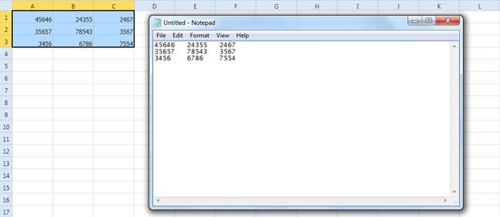

::: {style="DISPLAY: none"}
{#d2h_url_template}{#d2h_package_url style="WIDTH: 0px; DISPLAY: none; HEIGHT: 0px"}
:::

::: {.d2h_secondary_topic style="PADDING-BOTTOM: 10pt; MARGIN: 0pt; PADDING-LEFT: 0pt; PADDING-RIGHT: 0pt; PADDING-TOP: 0pt"}
##### Normal Copy and Paste {#normal-copy-and-paste style="TEXT-ALIGN: justify; tab-stops: 0pt"}

By default, the normal copy and paste option is enabled in the Spreadsheet control. When you copy the cells from Spreadsheet control, it will copy the cell text to the clipboard. Then you can paste the text in other applications. While copying the call text to clipboard spreadsheet will add the tab symbol ("/t") as a delimiter.

 

{border="0"}

Figure 31: Copying and Pasting from a Spreadhseet to Notepad

 

[]{#related-topics}
:::
