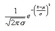
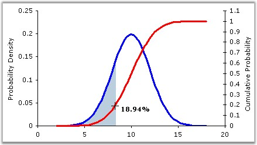

::: {style="DISPLAY: none"}
{#d2h_url_template}{#d2h_package_url style="WIDTH: 0px; DISPLAY: none; HEIGHT: 0px"}
:::

:::: {.d2h_secondary_topic style="PADDING-BOTTOM: 10pt; MARGIN: 0pt; PADDING-LEFT: 0pt; PADDING-RIGHT: 0pt; PADDING-TOP: 0pt"}
#### Normal Distribution {#normal-distribution style="tab-stops: 0pt"}

 

This formula yields the value of the standard normal cumulative distribution. Normal distributions are symmetric and have bell-shaped density curves with a single peak. Two factors, the mean (*[μ]{style="COLOR: black; FONT-SIZE: 8pt"}*) and the standard deviation ([σ]{style="COLOR: black; FONT-SIZE: 8pt"}), come into place when we speak of normal distribution. The mean indicates the peak of the density curve and the standard deviation indicates the spread of the bell curve.

 

The normal density function is given by,

 

{border="0"}

 

 

{border="0"}

Figure 345: Normal Density Function

 

 

Different values of *[μ]{style="COLOR: black; FONT-SIZE: 8pt"}[ ]{style="FONT-FAMILY: 'Verdana','sans-serif'; COLOR: black; FONT-SIZE: 8pt"}*and [σ]{style="COLOR: black; FONT-SIZE: 8pt"} yield different normal density curves and hence different normal distributions.  All normal density curves satisfy the following property which is often referred to as the*[ ]{style="FONT-FAMILY: 'Segoe UI','sans-serif'"}*Empirical Rule.

 

[·      ]{style="FONT-FAMILY: Symbol"}68% of the observations fall within 1 standard deviation of the mean, that is, between *[μ]{style="FONT-SIZE: 8pt"}* - [σ]{style="FONT-SIZE: 8pt"} and *[μ]{style="FONT-SIZE: 8pt"}* + [σ]{style="FONT-SIZE: 8pt"}.

[·      ]{style="FONT-FAMILY: Symbol"}95% of the observations fall within 2 standard deviations of the mean, that is, between *[μ]{style="FONT-SIZE: 8pt"}* - 2[σ]{style="FONT-SIZE: 8pt"} and *[μ]{style="FONT-SIZE: 8pt"}* + 2[σ]{style="FONT-SIZE: 8pt"}.

[·      ]{style="FONT-FAMILY: Symbol"}99.7% of the observations fall within 3 standard deviations of the mean, that is, between *[μ]{style="FONT-SIZE: 8pt"}* - 3[σ]{style="FONT-SIZE: 8pt"} and *[μ]{style="FONT-SIZE: 8pt"}* + 3[σ]{style="FONT-SIZE: 8pt"}.

 

Thus, for a normal distribution, almost all values lie within three standard deviations of the mean.

 

Using the Formula

 

NormalDistribution is calculated using the **Statistics.UtilityFunctions** class. The following table describes this formula\'s parameters and its values.

 

::: {align="center"}
  -------------------- ----------------------------------------------------------- -----------------------------------------------------------------------------
  Method Name          Parameters                                                  Return Value
  NormalDistribution   zValue: The value for which the distribution is required.   A double that represents the standard normal cumulative distribution value.
  -------------------- ----------------------------------------------------------- -----------------------------------------------------------------------------
:::

 

Example

 

Here is a code snippet that shows a sample usage.

 

+------------------------------------------------------------------------------------------------------------------------------------------------------------------------+
| **[\[C#\]]{style="FONT-FAMILY: 'Courier New'; COLOR: black"}**                                                                                                         |
|                                                                                                                                                                        |
| []{style="COLOR: black"}                                                                                                                                               |
|                                                                                                                                                                        |
| [using Syncfusion.Windows.Forms.Chart.Statistics;]{style="FONT-FAMILY: 'Courier New'; COLOR: black"}                                                                   |
|                                                                                                                                                                        |
| [double]{style="FONT-FAMILY: 'Courier New'; COLOR: blue"}[ x = Statistics.UtilityFunctions.NormalDistribution( p );]{style="FONT-FAMILY: 'Courier New'; COLOR: black"} |
+------------------------------------------------------------------------------------------------------------------------------------------------------------------------+

 

+-----------------------------------------------------------------------------------------------------------------------------------------------------------------------+
| **[\[VB.NET\]]{style="FONT-FAMILY: 'Courier New'; COLOR: black"}**                                                                                                    |
|                                                                                                                                                                       |
| []{style="COLOR: black"}                                                                                                                                              |
|                                                                                                                                                                       |
| [Imports Syncfusion.Windows.Forms.Chart.Statistics]{style="FONT-FAMILY: 'Courier New'; COLOR: black"}                                                                 |
|                                                                                                                                                                       |
| [double]{style="FONT-FAMILY: 'Courier New'; COLOR: blue"}[ x = Statistics.UtilityFunctions.NormalDistribution( p )]{style="FONT-FAMILY: 'Courier New'; COLOR: black"} |
+-----------------------------------------------------------------------------------------------------------------------------------------------------------------------+

[]{#p244} 

[]{#related-topics}
::::
