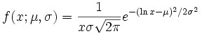
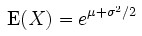
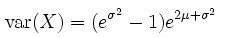
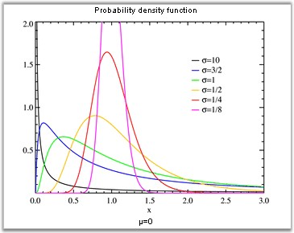

::: {style="DISPLAY: none"}
{#d2h_url_template}{#d2h_package_url style="WIDTH: 0px; DISPLAY: none; HEIGHT: 0px"}
:::

:::: {.d2h_secondary_topic style="PADDING-BOTTOM: 10pt; MARGIN: 0pt; PADDING-LEFT: 0pt; PADDING-RIGHT: 0pt; PADDING-TOP: 0pt"}
#### Normal Distribution Density {#normal-distribution-density style="tab-stops: 0pt"}

[]{style="FONT-FAMILY: 'Trebuchet MS','sans-serif'; FONT-SIZE: 9pt"} 

In probability and statistics, the log-normal distribution is the probability of distribution of any random variable whose logarithm is normally distributed (the base of the logarithmic function is immaterial in that loga x is normally distributed if and only if logb X is normally distributed). If x is a random variable with a normal distribution, then exp(X) will have a log-normal distribution.

 

\"Log-normal\" can also be written as \"log normal\", \"lognormal\" or \"logistic normal\".

 

A variable might be modeled as log-normal if it can be thought of as the multiplicative product of many small independent factors. A typical example of this is the long-term return rate on a stock investment: it can be considered as the product of the daily return rates.

 

The log-normal distribution has a probability density function (pdf):

[]{style="FONT-FAMILY: 'Trebuchet MS','sans-serif'; FONT-SIZE: 9pt"} 

[{border="0"}]{style="FONT-FAMILY: 'Trebuchet MS','sans-serif'; FONT-SIZE: 9pt"}[]{style="FONT-FAMILY: 'Trebuchet MS','sans-serif'; FONT-SIZE: 9pt"}

[]{style="FONT-FAMILY: 'Trebuchet MS','sans-serif'; FONT-SIZE: 9pt"} 

for x \> 0, where µ and s are the median and standard deviation of the variable\'s logarithm. The expected value is,

[]{style="FONT-FAMILY: 'Trebuchet MS','sans-serif'; FONT-SIZE: 9pt"} 

[{border="0"}]{style="FONT-FAMILY: 'Trebuchet MS','sans-serif'; FONT-SIZE: 9pt"}[]{style="FONT-FAMILY: 'Trebuchet MS','sans-serif'; FONT-SIZE: 9pt"}

[]{style="FONT-FAMILY: 'Trebuchet MS','sans-serif'; FONT-SIZE: 9pt"} 

and the variance is:

[]{style="FONT-FAMILY: 'Trebuchet MS','sans-serif'; FONT-SIZE: 9pt"} 

[{border="0"}]{style="FONT-FAMILY: 'Trebuchet MS','sans-serif'; FONT-SIZE: 9pt"}[]{style="FONT-FAMILY: 'Trebuchet MS','sans-serif'; FONT-SIZE: 9pt"}

[]{style="FONT-FAMILY: 'Trebuchet MS','sans-serif'; FONT-SIZE: 9pt"} 

{border="0"}

**[]{style="FONT-FAMILY: 'Trebuchet MS','sans-serif'; FONT-SIZE: 9pt"}** 

Figure 310: Normal Distribution Density

[]{style="FONT-FAMILY: 'Trebuchet MS','sans-serif'; FONT-SIZE: 9pt"} 

Using the formula

**[]{style="FONT-FAMILY: 'Trebuchet MS','sans-serif'"}** 

::: {align="center"}
+---------------------------+-------------------------------------------------------------------+--------------------------------------------------------------------------+
|                           |                                                                   |                                                                          |
|                           |                                                                   |                                                                          |
| Method Name               | Parameters                                                        | Return Value                                                             |
+---------------------------+-------------------------------------------------------------------+--------------------------------------------------------------------------+
| NormalDistributionDensity | 1.   x: the value at which the distribution density is evaluated. | A double that represents the Normal Distribution Density function value. |
|                           |                                                                   |                                                                          |
|                           | 2.   m: the expected value of distribution.                       |                                                                          |
|                           |                                                                   |                                                                          |
|                           | 3.   sigma: the variance of distribution.                         |                                                                          |
+---------------------------+-------------------------------------------------------------------+--------------------------------------------------------------------------+
:::

[]{style="FONT-FAMILY: 'Trebuchet MS','sans-serif'; FONT-SIZE: 9pt"} 

Example

[]{style="FONT-FAMILY: 'Trebuchet MS','sans-serif'; FONT-SIZE: 9pt"} 

Here is a code snippet that shows a sample usage.

[]{style="FONT-FAMILY: 'Trebuchet MS','sans-serif'; FONT-SIZE: 9pt"} 

+---------------------------------------------------------------------------------------------------------------------------------------------------------------------------------+
| **[\[C#\]]{style="FONT-FAMILY: 'Courier New'; COLOR: black"}**                                                                                                                  |
|                                                                                                                                                                                 |
| []{style="COLOR: black"}                                                                                                                                                        |
|                                                                                                                                                                                 |
| [using]{style="FONT-FAMILY: 'Courier New'; COLOR: blue"}[ Syncfusion.Windows.Forms.Chart.Statistics;]{style="FONT-FAMILY: 'Courier New'; COLOR: black"}                         |
|                                                                                                                                                                                 |
| [double]{style="FONT-FAMILY: 'Courier New'; COLOR: blue"}[ result = UtilityFunctions.NormalDistributionDensity(x, m ,sigma);]{style="FONT-FAMILY: 'Courier New'; COLOR: black"} |
+---------------------------------------------------------------------------------------------------------------------------------------------------------------------------------+

[]{style="FONT-FAMILY: 'Trebuchet MS','sans-serif'; FONT-SIZE: 9pt"} 

+---------------------------------------------------------------------------------------------------------------------------------------------------------------------------------------+
| **[\[VB.NET\]]{style="FONT-FAMILY: 'Courier New'; COLOR: black"}**                                                                                                                    |
|                                                                                                                                                                                       |
| []{style="COLOR: black"}                                                                                                                                                              |
|                                                                                                                                                                                       |
| [Imports]{style="FONT-FAMILY: 'Courier New'; COLOR: blue"}[ Syncfusion.Windows.Forms.Chart.Statistics]{style="FONT-FAMILY: 'Courier New'; COLOR: black"}                              |
|                                                                                                                                                                                       |
| [Dim double as]{style="FONT-FAMILY: 'Courier New'; COLOR: blue"}[ result = UtilityFunctions.NormalDistributionDensity(x, m ,sigma)]{style="FONT-FAMILY: 'Courier New'; COLOR: black"} |
+---------------------------------------------------------------------------------------------------------------------------------------------------------------------------------------+

[]{#p245} 

[]{#related-topics}
::::
