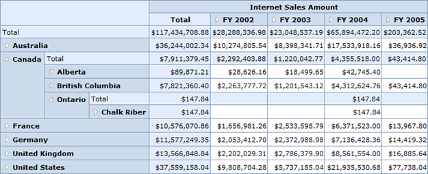

::: {style="DISPLAY: none"}
{#d2h_url_template}{#d2h_package_url style="WIDTH: 0px; DISPLAY: none; HEIGHT: 0px"}
:::

::: {.d2h_secondary_topic style="PADDING-BOTTOM: 10pt; MARGIN: 0pt; PADDING-LEFT: 0pt; PADDING-RIGHT: 0pt; PADDING-TOP: 0pt"}
#### Normal Top Summary Layout {#normal-top-summary-layout style="tab-stops: 0pt"}

In the **Normal Top Summary** layout, the summary cells are positioned at the top of each parent member and the child member appears next to its parent.

{border="0"}

Figure 13: OLAP Grid in Normal Top Summary Layout

 

+-----------------------------------------------------------------------------------------------------------------------------------------------------------------------------------------------------------------------------------------------+
| **[\[C#\]]{style="FONT-FAMILY: 'Courier New'"}**                                                                                                                                                                                              |
|                                                                                                                                                                                                                                               |
| [///]{style="FONT-FAMILY: 'Courier New'; COLOR: gray"}[ Grid Layout will be Normal with Top positioned summary.]{style="FONT-FAMILY: 'Courier New'; COLOR: green"}                                                                            |
|                                                                                                                                                                                                                                               |
| [this]{style="FONT-STYLE: normal; FONT-FAMILY: 'Courier New'; COLOR: blue"}[.OlapGrid1.Layout = [GridLayout]{style="COLOR: #2b91af"}.NormalTopSummary;]{style="FONT-STYLE: normal; FONT-FAMILY: 'Courier New'"}[]{style="FONT-STYLE: normal"} |
+-----------------------------------------------------------------------------------------------------------------------------------------------------------------------------------------------------------------------------------------------+

 

+----------------------------------------------------------------------------------------------------------------------------------------------------------------------+
| **[\[VB\]]{style="FONT-FAMILY: 'Courier New'"}**                                                                                                                     |
|                                                                                                                                                                      |
| [\' Grid Layout will be Normal with Top positioned summary.]{style="FONT-FAMILY: 'Courier New'; COLOR: green"}                                                       |
|                                                                                                                                                                      |
| [Me]{style="FONT-FAMILY: 'Courier New'; COLOR: blue"}[.OlapGrid1.Layout = [GridLayout]{style="COLOR: #2b91af"}.NormalTopSummary]{style="FONT-FAMILY: 'Courier New'"} |
+----------------------------------------------------------------------------------------------------------------------------------------------------------------------+

 

[]{#related-topics}
:::
