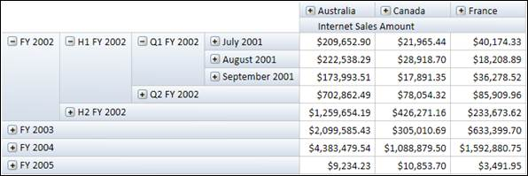

::: {style="DISPLAY: none"}
{#d2h_url_template} {#d2h_package_url style="WIDTH: 0px; DISPLAY: none; HEIGHT: 0px"}
:::

::::: {#nsbanner .d2h_main_nsbanner style="BORDER-BOTTOM: #999999 1px solid; POSITION: relative; PADDING-BOTTOM: 0px; BACKGROUND-COLOR: transparent; PADDING-LEFT: 0px; PADDING-RIGHT: 0px; DISPLAY: none; BORDER-TOP: #999999 1px solid; PADDING-TOP: 0px; LEFT: 0px"}
:::: {#TitleRow .d2h_main_titlerow style="PADDING-BOTTOM: 4px; BACKGROUND-COLOR: transparent; PADDING-LEFT: 22px; WIDTH: 100%; PADDING-RIGHT: 10px; DISPLAY: none; PADDING-TOP: 4px"}
::: {#ienav .d2h_main_ienav style="DISPLAY: none"}
{#D2HPrevious .D2HPreviousEnabled}  {#D2HNext .D2HNextEnabled}
:::
::::
:::::

:::: {#nstext .d2h_main_nstext style="PADDING-BOTTOM: 10px; BACKGROUND-COLOR: transparent; PADDING-LEFT: 22px; PADDING-RIGHT: 10px; HEIGHT: 100%; OVERFLOW: auto; PADDING-TOP: 5px" hasuserbackground="true" valign="bottom"}
::: {#d2h_breadcrumbs .d2h_breadcrumbs}
[Essential Studio User Guide Documentation](ms-xhelp:///?Id=12457748-09e3-4d74-a240-8e049cedf030){.d2h_breadcrumbsNormal} [ \> ]{.d2h_breadcrumbsLinkSeparator} [Business Intelligence Edition](ms-xhelp:///?Id=fdf33dd8-62b2-47b9-ad7b-fc50e590bca5){.d2h_breadcrumbsNormal} [ \> ]{.d2h_breadcrumbsLinkSeparator} [Essential BI WPF](ms-xhelp:///?Id=41e3d586-d922-4a01-8272-679fe4ae7343){.d2h_breadcrumbsNormal} [ \> ]{.d2h_breadcrumbsLinkSeparator} [Essential BI Grid]{.d2h_breadcrumbsContentsOnly} [ \> ]{.d2h_breadcrumbsLinkSeparator} [Concepts and Features](ms-xhelp:///?Id=ea758680-939d-4d65-8abe-8c3be198af29){.d2h_breadcrumbsNormal} [ \> ]{.d2h_breadcrumbsLinkSeparator} [Grid Layouts](ms-xhelp:///?Id=800d1402-5911-4002-ad2f-88f57bb560ee){.d2h_breadcrumbsNormal}
:::

### No Summaries Layout {#no-summaries-layout style="tab-stops: 0pt"}

In this kind of layout, the summary cells were made hidden and the child member appears adjacent to the parent member.

{border="0"}

Figure 25: OlapGrid in No Summaries Layout

[]{style="COLOR: #4f81bd"} 

+--------------------------------------------------------------------------------------------------+
| \[C#\]                                                                                           |
|                                                                                                  |
|                                                                                                  |
|                                                                                                  |
| [///]{style="COLOR: gray"} [ No Summaries Grid Layout]{style="COLOR: green"}                     |
|                                                                                                  |
| [this]{style="COLOR: blue"}.OlapGrid1.Layout = [GridLayout]{style="COLOR: #2b91af"}.NoSummaries; |
|                                                                                                  |
|                                                                                                  |
+--------------------------------------------------------------------------------------------------+

[]{style="FONT-SIZE: 11pt"} 

+-----------------------------------------------------------------------------------------------+
| \[VB\]                                                                                        |
|                                                                                               |
|                                                                                               |
|                                                                                               |
| [\' Grid Layout will be Normal]{style="COLOR: green"}                                         |
|                                                                                               |
| [Me]{style="COLOR: blue"}.OlapGrid1.Layout = [GridLayout]{style="COLOR: #2b91af"}.NoSummaries |
|                                                                                               |
|                                                                                               |
+-----------------------------------------------------------------------------------------------+

[]{style="FONT-SIZE: 11pt"} 

[]{style="FONT-SIZE: 11pt"} 

Sample Location

A sample demo is available at the following location:

**..\\Syncfusion\\EssentialStudio\\\<Versionnumber\>\\BI\\WPF\\OlapGrid.WPF\\Samples\\Product Showcase\\Grid Layout Demo**

[]{#related-topics}
::::
