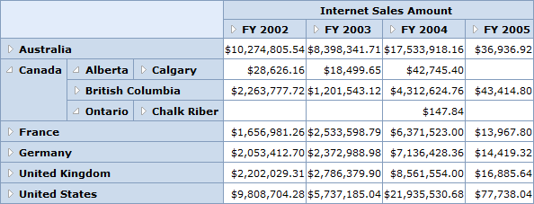

::: {style="DISPLAY: none"}
{#d2h_url_template}{#d2h_package_url style="WIDTH: 0px; DISPLAY: none; HEIGHT: 0px"}
:::

::: {.d2h_secondary_topic style="PADDING-BOTTOM: 10pt; MARGIN: 0pt; PADDING-LEFT: 0pt; PADDING-RIGHT: 0pt; PADDING-TOP: 0pt"}
#### No Summaries Layout {#no-summaries-layout style="tab-stops: 0pt"}

In the **No Summaries** layout, the summary cells are hidden and the child member appears next to the parent member.

 

{border="0"}

Figure 14: OLAP Grid in No Summaries Layout

 

+------------------------------------------------------------------------------------------------------------------------------------------------------------------------------------------------------------------------------------------+
| **[\[C#\]]{style="FONT-FAMILY: 'Courier New'"}**                                                                                                                                                                                         |
|                                                                                                                                                                                                                                          |
| [///]{style="FONT-FAMILY: 'Courier New'; COLOR: gray"}[ No Summaries Grid Layout]{style="FONT-FAMILY: 'Courier New'; COLOR: green"}                                                                                                      |
|                                                                                                                                                                                                                                          |
| [this]{style="FONT-STYLE: normal; FONT-FAMILY: 'Courier New'; COLOR: blue"}[.OlapGrid1.Layout = [GridLayout]{style="COLOR: #2b91af"}.NoSummaries;]{style="FONT-STYLE: normal; FONT-FAMILY: 'Courier New'"}[]{style="FONT-STYLE: normal"} |
+------------------------------------------------------------------------------------------------------------------------------------------------------------------------------------------------------------------------------------------+

 

+-----------------------------------------------------------------------------------------------------------------------------------------------------------------+
| **[\[VB\]]{style="FONT-FAMILY: 'Courier New'"}**                                                                                                                |
|                                                                                                                                                                 |
| [\' Grid Layout will be Normal]{style="FONT-FAMILY: 'Courier New'; COLOR: green"}                                                                               |
|                                                                                                                                                                 |
| [Me]{style="FONT-FAMILY: 'Courier New'; COLOR: blue"}[.OlapGrid1.Layout = [GridLayout]{style="COLOR: #2b91af"}.NoSummaries]{style="FONT-FAMILY: 'Courier New'"} |
+-----------------------------------------------------------------------------------------------------------------------------------------------------------------+

 

[]{#related-topics}
:::
