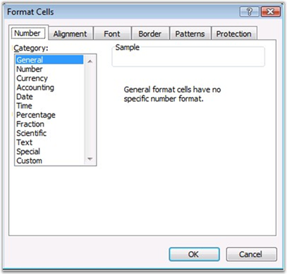
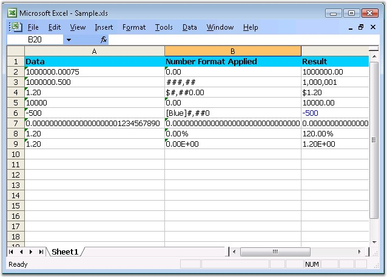

::: {style="DISPLAY: none"}
{#d2h_url_template}{#d2h_package_url style="WIDTH: 0px; DISPLAY: none; HEIGHT: 0px"}
:::

:::: {.d2h_secondary_topic style="PADDING-BOTTOM: 10pt; MARGIN: 0pt; PADDING-LEFT: 0pt; PADDING-RIGHT: 0pt; PADDING-TOP: 0pt"}
#### Number Formatting {#number-formatting style="tab-stops: 0pt"}

 

Number Formats are little code that help you control the appearance of numbers in the Excel. A number in a cell is displayed depending on the number format applied to it. The same number can be displayed in different formats also. For example, 1.5 might represent a half teaspoon in one spreadsheet, while the same 1.5 would represent somebody\'s age, another spreadsheet\'s percentage, or so on.

 

Microsoft Excel recognizes the numbers in various formats: Accounting, Scientific, Fractions, and Currency. MS Excel allows to set these number formats by using the Number tab in the **Format Cells** dialog box.

**[]{style="BACKGROUND: red; COLOR: white"}** 

{border="0"}

Figure 38: Number formatting in Excel**[]{style="FONT-FAMILY: 'Trebuchet MS','sans-serif'; BACKGROUND: red; COLOR: white"}**

 

A number format consists of up to 4 items, separated by semicolons. Each of the items is an individual number format. The first, by default, applies to positive numbers, the second to negative numbers, the third to zeros, and the forth to text. If you don\'t apply any special formatting to text, Excel uses the \'General\' number format, which basically means anything that will fit.

[]{style="FONT-FAMILY: 'Trebuchet MS','sans-serif'; COLOR: #15428b; FONT-SIZE: 9pt"} 

Long Numbers

 

You can make long numbers easier to read by inserting a thousands separator (a comma for US regional settings). The #, ##0 number format is used. This format does not allow Excel to use the shorter scientific format, so the longest numbers merely show #######, signifying that they don\'t fit in their cells. You can either **autofit** the column or specify the column width in order to avoid showing #######.

 

Hide Zeros

 

Excel allows to hide zero values from displaying, when the user is not interested to show the values if it is \"0\". This can be done by setting custom format as **General** or **0.00**.

[]{style="FONT-SIZE: 8pt"} 

Leading Zeros

[]{style="FONT-FAMILY: 'Trebuchet MS','sans-serif'; COLOR: #15428b; FONT-SIZE: 9pt"} 

Excel removes the zero(0) in the zip code. The reason is that zero is not required to display the value of the number. However, since number formats are not about the value, but they are about the appearance, you can use a special format to retain the leading zeros, **00000**.

[]{style="FONT-FAMILY: 'Trebuchet MS','sans-serif'; COLOR: #15428b; FONT-SIZE: 9pt"} 

Special Number Formats

[]{style="FONT-FAMILY: 'Trebuchet MS','sans-serif'; COLOR: #15428b; FONT-SIZE: 9pt"} 

In addition to the 00000 Zip Code number format, Excel also has 00000-0000 for Zip-Plus-Four, 000-00-0000 for Social Security numbers, and (000)000-0000 for telephone numbers. If you live in a location that needs different zip codes, you can either design your own custom number formats.

[]{style="FONT-SIZE: 8pt"} 

The following table shows various custom formatting codes.

[]{style="FONT-FAMILY: 'Trebuchet MS','sans-serif'; COLOR: #15428b; FONT-SIZE: 9pt"} 

::: {align="center"}
Number Code         
:::
::::

Description

General

General number format.

0 (zero)

Digit placeholder. This code pads the value with zeros to fill the format.

\#

Digit placeholder. This code does not display extra zeros.

?

Digit placeholder. This code leaves a space for insignificant zeros but does not display them.

. (period)

Decimal number.

\%

Percentage. Microsoft Excel multiplies by 100 and adds the % character.

, (comma)

Thousands separator. A comma followed by a placeholder scales the number by a thousand.

E+ E- e+ e-

Scientific notation.

Text Code

Description

\$ - + / ( ) : space

These characters are displayed in the number. To display any other character, enclose the character in quotation marks or precede it with a backslash.

\\character

This code displays the character you specify.\
\
Note Typing !, \^, &, \', \~, {, }, =, \<, or \> automatically places a backslash in front of the character.

\"text\"

This code displays the text.

\*

This code repeats the next character in the format to fill the column width.\
\
Note: Only one asterisk per section of a format is allowed.

\_ (underscore)

This code skips the width of the next character. This code is commonly used as \"\_)\" (without the quotation marks) to leave space for a closing parenthesis in a positive number format when the negative number format includes parentheses.

 

This allows the values to line up at the decimal point.

@

Text placeholder.

Date Code

Description

m

Month as a number without leading zeros (1-12).

mm

Month as a number with leading zeros (01-12).

mmm

Month as an abbreviation (Jan - Dec).

mmmm

Unabbreviated Month (January - December).

d

Day without leading zeros (1-31).

dd

Day with leading zeros (01-31).

ddd

Week day as an abbreviation (Sun - Sat).

dddd

Unabbreviated week day (Sunday - Saturday).

yy

Year as a two-digit number (for example, 96).

yyyy

Year as a four-digit number (for example, 1996).

Time Code

Description

h

Hours as a number without leading zeros (0-23).

hh

Hours as a number with leading zeros (00-23).

m

Minutes as a number without leading zeros (0-59).

mm

Minutes as a number with leading zeros (00-59).

s

Seconds as a number without leading zeros (0-59).

ss

Seconds as a number with leading zeros (00-59).

AM/PM am/pm

Time based on the twelve-hour clock.

Miscellaneous Code

Description

\[BLACK\], \[BLUE\], \[CYAN\], \[GREEN\], \[MAGENTA\], \[RED\], \[WHITE\], \[YELLOW\], \[COLOR n\]

These codes display the characters in the specified colors.\
\
Note: n is a value from 1 to 56 and refers to the nth color in the color palette.

\[Condition value\]

Condition may be \<, \>, =, \>=, \<=, \<\> and value may be any number.\
\
Note: A number format may contain up to two conditions.

 

Number Formatting in XlsIO

 

XlsIO provides API support for reading and writing the various built-in and custom number formats in a cell by using the **NumberFormat** property of **IRange**. To set the various number formats, use the appropriate typed properties \[Number, DateTime, TimeSpan\].

 

The following code example illustrates how to set the format for **Number**.

[]{style="FONT-FAMILY: 'Trebuchet MS','sans-serif'; COLOR: #15428b; FONT-SIZE: 9pt"} 

+----------------------------------------------------------------------------------------------------------------------------------------------------------------------+
| **[\[C#\]]{style="FONT-FAMILY: 'Courier New'"}**                                                                                                                     |
|                                                                                                                                                                      |
| []{style="FONT-FAMILY: 'Courier New'"}                                                                                                                               |
|                                                                                                                                                                      |
| [// Applying Number Format.]{style="FONT-FAMILY: 'Courier New'; COLOR: green"}                                                                                       |
|                                                                                                                                                                      |
| [sheet.Range\[[\"C2\"]{style="COLOR: #a31515"}\].Number = 1000000.00075;]{style="FONT-FAMILY: 'Courier New'"}                                                        |
|                                                                                                                                                                      |
| [sheet.Range\[[\"B2\"]{style="COLOR: #a31515"}\].Text = [\"0.00\"]{style="COLOR: #a31515"};]{style="FONT-FAMILY: 'Courier New'"}                                     |
|                                                                                                                                                                      |
| [sheet.Range\[[\"C2\"]{style="COLOR: #a31515"}\].NumberFormat = [\"0.00\"]{style="COLOR: #a31515"};]{style="FONT-FAMILY: 'Courier New'"}                             |
|                                                                                                                                                                      |
| []{style="FONT-FAMILY: 'Courier New'"}                                                                                                                               |
|                                                                                                                                                                      |
| [sheet.Range\[[\"C3\"]{style="COLOR: #a31515"}\].Number = 1000000.500;]{style="FONT-FAMILY: 'Courier New'"}                                                          |
|                                                                                                                                                                      |
| [sheet.Range\[[\"B3\"]{style="COLOR: #a31515"}\].Text = [\"###,##\"]{style="COLOR: #a31515"};]{style="FONT-FAMILY: 'Courier New'"}                                   |
|                                                                                                                                                                      |
| [sheet.Range\[[\"C3\"]{style="COLOR: #a31515"}\].NumberFormat = [\"###,##\"]{style="COLOR: #a31515"};]{style="FONT-FAMILY: 'Courier New'"}                           |
|                                                                                                                                                                      |
| []{style="FONT-FAMILY: 'Courier New'"}                                                                                                                               |
|                                                                                                                                                                      |
| [sheet.Range\[[\"C5\"]{style="COLOR: #a31515"}\].Number = 10000;]{style="FONT-FAMILY: 'Courier New'"}                                                                |
|                                                                                                                                                                      |
| [sheet.Range\[[\"B5\"]{style="COLOR: #a31515"}\].Text = [\"0.00\"]{style="COLOR: #a31515"};]{style="FONT-FAMILY: 'Courier New'"}                                     |
|                                                                                                                                                                      |
| [sheet.Range\[[\"C5\"]{style="COLOR: #a31515"}\].NumberFormat = [\"0.00\"]{style="COLOR: #a31515"};]{style="FONT-FAMILY: 'Courier New'"}                             |
|                                                                                                                                                                      |
| []{style="FONT-FAMILY: 'Courier New'"}                                                                                                                               |
|                                                                                                                                                                      |
| [sheet.Range\[[\"C6\"]{style="COLOR: #a31515"}\].Number = -500;]{style="FONT-FAMILY: 'Courier New'"}                                                                 |
|                                                                                                                                                                      |
| [sheet.Range\[[\"B6\"]{style="COLOR: #a31515"}\].Text = [\"\[Blue\]#,##0\"]{style="COLOR: #a31515"};]{style="FONT-FAMILY: 'Courier New'"}                            |
|                                                                                                                                                                      |
| [sheet.Range\[[\"C6\"]{style="COLOR: #a31515"}\].NumberFormat = [\"\[Blue\]#,##0\"]{style="COLOR: #a31515"};]{style="FONT-FAMILY: 'Courier New'"}                    |
|                                                                                                                                                                      |
| []{style="FONT-FAMILY: 'Courier New'"}                                                                                                                               |
|                                                                                                                                                                      |
| [sheet.Range\[[\"C7\"]{style="COLOR: #a31515"}\].Number = 0.000000000000000000001234567890;]{style="FONT-FAMILY: 'Courier New'"}                                     |
|                                                                                                                                                                      |
| [sheet.Range\[[\"B7\"]{style="COLOR: #a31515"}\].Text = [\"0.000000000000000000000000000000\"]{style="COLOR: #a31515"};]{style="FONT-FAMILY: 'Courier New'"}         |
|                                                                                                                                                                      |
| [sheet.Range\[[\"C7\"]{style="COLOR: #a31515"}\].NumberFormat = [\"0.000000000000000000000000000000\"]{style="COLOR: #a31515"};]{style="FONT-FAMILY: 'Courier New'"} |
|                                                                                                                                                                      |
| []{style="FONT-FAMILY: 'Courier New'"}                                                                                                                               |
|                                                                                                                                                                      |
| [sheet.Range\[[\"C9\"]{style="COLOR: #a31515"}\].Number = 1.20;]{style="FONT-FAMILY: 'Courier New'"}                                                                 |
|                                                                                                                                                                      |
| [sheet.Range\[[\"B9\"]{style="COLOR: #a31515"}\].Text = [\"0.00E+00\"]{style="COLOR: #a31515"};]{style="FONT-FAMILY: 'Courier New'"}                                 |
|                                                                                                                                                                      |
| [sheet.Range\[[\"C9\"]{style="COLOR: #a31515"}\].NumberFormat = [\"0.00E+00\"]{style="COLOR: #a31515"};]{style="FONT-FAMILY: 'Courier New'"}                         |
+----------------------------------------------------------------------------------------------------------------------------------------------------------------------+

[]{style="FONT-FAMILY: 'Trebuchet MS','sans-serif'; COLOR: #15428b; FONT-SIZE: 9pt"} 

+-----------------------------------------------------------------------------------------------------------------------------------------------------------------+
| **[\[VB.NET\]]{style="FONT-FAMILY: 'Courier New'"}**                                                                                                            |
|                                                                                                                                                                 |
| **[]{style="FONT-FAMILY: 'Courier New'"}**                                                                                                                      |
|                                                                                                                                                                 |
| [\' Applying Number Format.]{style="FONT-FAMILY: 'Courier New'; COLOR: green"}                                                                                  |
|                                                                                                                                                                 |
| [sheet.Range([\"C2\"]{style="COLOR: maroon"}).Number = 1000000.00075]{style="FONT-FAMILY: 'Courier New'"}                                                       |
|                                                                                                                                                                 |
| [sheet.Range([\"B2\"]{style="COLOR: maroon"}).Text = [\"0.00\"]{style="COLOR: maroon"}]{style="FONT-FAMILY: 'Courier New'"}                                     |
|                                                                                                                                                                 |
| [sheet.Range([\"C2\"]{style="COLOR: maroon"}).NumberFormat = [\"0.00\"]{style="COLOR: maroon"}]{style="FONT-FAMILY: 'Courier New'"}                             |
|                                                                                                                                                                 |
| []{style="FONT-FAMILY: 'Courier New'; COLOR: maroon"}                                                                                                           |
|                                                                                                                                                                 |
| [sheet.Range([\"C3\"]{style="COLOR: maroon"}).Number = 1000000.5]{style="FONT-FAMILY: 'Courier New'"}                                                           |
|                                                                                                                                                                 |
| [sheet.Range([\"B3\"]{style="COLOR: maroon"}).Text = [\"###,##\"]{style="COLOR: maroon"}]{style="FONT-FAMILY: 'Courier New'"}                                   |
|                                                                                                                                                                 |
| [sheet.Range([\"C3\"]{style="COLOR: maroon"}).NumberFormat = [\"###,##\"]{style="COLOR: maroon"}]{style="FONT-FAMILY: 'Courier New'"}                           |
|                                                                                                                                                                 |
| []{style="FONT-FAMILY: 'Courier New'; COLOR: maroon"}                                                                                                           |
|                                                                                                                                                                 |
| [sheet.Range([\"C5\"]{style="COLOR: maroon"}).Number = 10000]{style="FONT-FAMILY: 'Courier New'"}                                                               |
|                                                                                                                                                                 |
| [sheet.Range([\"B5\"]{style="COLOR: maroon"}).Text = [\"0.00\"]{style="COLOR: maroon"}]{style="FONT-FAMILY: 'Courier New'"}                                     |
|                                                                                                                                                                 |
| [sheet.Range([\"C5\"]{style="COLOR: maroon"}).NumberFormat = [\"0.00\"]{style="COLOR: maroon"}]{style="FONT-FAMILY: 'Courier New'"}                             |
|                                                                                                                                                                 |
| []{style="FONT-FAMILY: 'Courier New'; COLOR: maroon"}                                                                                                           |
|                                                                                                                                                                 |
| [sheet.Range([\"C6\"]{style="COLOR: maroon"}).Number = -500]{style="FONT-FAMILY: 'Courier New'"}                                                                |
|                                                                                                                                                                 |
| [sheet.Range([\"B6\"]{style="COLOR: maroon"}).Text = [\"\[Blue\]#,##0\"]{style="COLOR: maroon"}]{style="FONT-FAMILY: 'Courier New'"}                            |
|                                                                                                                                                                 |
| [sheet.Range([\"C6\"]{style="COLOR: maroon"}).NumberFormat = [\"\[Blue\]#,##0\"]{style="COLOR: maroon"}]{style="FONT-FAMILY: 'Courier New'"}                    |
|                                                                                                                                                                 |
| []{style="FONT-FAMILY: 'Courier New'; COLOR: maroon"}                                                                                                           |
|                                                                                                                                                                 |
| [sheet.Range([\"C7\"]{style="COLOR: maroon"}).Number = 1.23456789E-21]{style="FONT-FAMILY: 'Courier New'"}                                                      |
|                                                                                                                                                                 |
| [sheet.Range([\"B7\"]{style="COLOR: maroon"}).Text = [\"0.000000000000000000000000000000\"]{style="COLOR: maroon"}]{style="FONT-FAMILY: 'Courier New'"}         |
|                                                                                                                                                                 |
| [sheet.Range([\"C7\"]{style="COLOR: maroon"}).NumberFormat = [\"0.000000000000000000000000000000\"]{style="COLOR: maroon"}]{style="FONT-FAMILY: 'Courier New'"} |
|                                                                                                                                                                 |
| []{style="FONT-FAMILY: 'Courier New'; COLOR: maroon"}                                                                                                           |
|                                                                                                                                                                 |
| [sheet.Range([\"C9\"]{style="COLOR: maroon"}).Number = 1.2]{style="FONT-FAMILY: 'Courier New'"}                                                                 |
|                                                                                                                                                                 |
| [sheet.Range([\"B9\"]{style="COLOR: maroon"}).Text = [\"0.00E+00\"]{style="COLOR: maroon"}]{style="FONT-FAMILY: 'Courier New'"}                                 |
|                                                                                                                                                                 |
| [sheet.Range([\"C9\"]{style="COLOR: maroon"}).NumberFormat = [\"0.00E+00\"]{style="COLOR: maroon"}]{style="FONT-FAMILY: 'Courier New'"}                         |
+-----------------------------------------------------------------------------------------------------------------------------------------------------------------+

 

The following code example illustrates how to set the format for **Percentage**.

 

+--------------------------------------------------------------------------------------------------------------------------------------------+
| **[\[C#\]]{style="FONT-FAMILY: 'Courier New'"}**                                                                                           |
|                                                                                                                                            |
| []{style="FONT-FAMILY: 'Courier New'; COLOR: green"}                                                                                       |
|                                                                                                                                            |
| [// Applying Number Format.]{style="FONT-FAMILY: 'Courier New'; COLOR: green"}                                                             |
|                                                                                                                                            |
| [sheet.Range\[[\"C8\"]{style="COLOR: #a31515"}\].Number = 1.20;]{style="FONT-FAMILY: 'Courier New'"}                                       |
|                                                                                                                                            |
| [sheet.Range\[[\"B8\"]{style="COLOR: #a31515"}\].Text = [\"0.00%\"]{style="COLOR: #a31515"};]{style="FONT-FAMILY: 'Courier New'"}          |
|                                                                                                                                            |
| [sheet.Range\[[\"C8\"]{style="COLOR: #a31515"}\].Number Format = [\"0.00%\"]{style="COLOR: #a31515"};]{style="FONT-FAMILY: 'Courier New'"} |
+--------------------------------------------------------------------------------------------------------------------------------------------+

[]{style="FONT-FAMILY: 'Trebuchet MS','sans-serif'; COLOR: #15428b; FONT-SIZE: 9pt"} 

+---------------------------------------------------------------------------------------------------------------------------------------+
| **[\[VB.NET\]]{style="FONT-FAMILY: 'Courier New'"}**                                                                                  |
|                                                                                                                                       |
| **[]{style="FONT-FAMILY: 'Courier New'"}**                                                                                            |
|                                                                                                                                       |
| [\' Applying Number Format.]{style="FONT-FAMILY: 'Courier New'; COLOR: green"}                                                        |
|                                                                                                                                       |
| [sheet.Range([\"C8\"]{style="COLOR: maroon"}).Number = 1.2]{style="FONT-FAMILY: 'Courier New'"}                                       |
|                                                                                                                                       |
| [sheet.Range([\"B8\"]{style="COLOR: maroon"}).Text = [\"0.00%\"]{style="COLOR: maroon"}]{style="FONT-FAMILY: 'Courier New'"}          |
|                                                                                                                                       |
| [sheet.Range([\"C8\"]{style="COLOR: maroon"}).Number Format = [\"0.00%\"]{style="COLOR: maroon"}]{style="FONT-FAMILY: 'Courier New'"} |
+---------------------------------------------------------------------------------------------------------------------------------------+

 

The following code example illustrates how to set the format for **DateTime**.

 

+-------------------------------------------------------------------------------------------------------------------------------------------------------------------------------+
| **[\[C#\]]{style="FONT-FAMILY: 'Courier New'; COLOR: black"}**                                                                                                                |
|                                                                                                                                                                               |
| **[]{style="FONT-FAMILY: 'Courier New'; COLOR: black"}**                                                                                                                      |
|                                                                                                                                                                               |
| [sheet.Range\[[\"B2\"]{style="COLOR: #a31515"}\].Number Format = [\"m/d/yyyy\"]{style="COLOR: #a31515"};]{style="FONT-FAMILY: 'Courier New'"}                                 |
|                                                                                                                                                                               |
| [sheet.Range\[[\"B2\"]{style="COLOR: #a31515"}\].DateTime = [new]{style="COLOR: blue"} [DateTime]{style="COLOR: #2b91af"}(2005, 12, 25);]{style="FONT-FAMILY: 'Courier New'"} |
+-------------------------------------------------------------------------------------------------------------------------------------------------------------------------------+

[]{style="FONT-FAMILY: 'Trebuchet MS','sans-serif'; COLOR: #15428b; FONT-SIZE: 9pt"} 

+-----------------------------------------------------------------------------------------------------------------------------------------------+
| **[\[VB.NET\]]{style="FONT-FAMILY: 'Courier New'; COLOR: black"}**                                                                            |
|                                                                                                                                               |
| **[]{style="FONT-FAMILY: 'Courier New'; COLOR: black"}**                                                                                      |
|                                                                                                                                               |
| [sheet.Range([\"B2\"]{style="COLOR: maroon"}).Number Format = [\"m/d/yyyy\"]{style="COLOR: maroon"}]{style="FONT-FAMILY: 'Courier New'"}      |
|                                                                                                                                               |
| [sheet.Range([\"B2\"]{style="COLOR: maroon"}).DateTime = [New]{style="COLOR: blue"} DateTime(2005,12,25)]{style="FONT-FAMILY: 'Courier New'"} |
+-----------------------------------------------------------------------------------------------------------------------------------------------+

 

The following code example illustrates how to set the format for **Currency**.

 

+------------------------------------------------------------------------------------------------------------------------------------------------+
| **[\[C#\]]{style="FONT-FAMILY: 'Courier New'"}**                                                                                               |
|                                                                                                                                                |
| **[]{style="FONT-FAMILY: 'Courier New'"}**                                                                                                     |
|                                                                                                                                                |
| [// Applying Number Format.]{style="FONT-FAMILY: 'Courier New'; COLOR: green"}                                                                 |
|                                                                                                                                                |
| [sheet.Range\[[\"C4\"]{style="COLOR: #a31515"}\].Number = 1.20;]{style="FONT-FAMILY: 'Courier New'"}                                           |
|                                                                                                                                                |
| [sheet.Range\[[\"B4\"]{style="COLOR: #a31515"}\].Text = [\"\$#,##0.00\"]{style="COLOR: #a31515"};]{style="FONT-FAMILY: 'Courier New'"}         |
|                                                                                                                                                |
| [sheet.Range\[[\"C4\"]{style="COLOR: #a31515"}\].NumberFormat = [\"\$#,##0.00\"]{style="COLOR: #a31515"};]{style="FONT-FAMILY: 'Courier New'"} |
+------------------------------------------------------------------------------------------------------------------------------------------------+

[]{style="FONT-FAMILY: 'Trebuchet MS','sans-serif'; COLOR: #15428b; FONT-SIZE: 9pt"} 

+-------------------------------------------------------------------------------------------------------------------------------------------+
| **[\[VB.NET\]]{style="FONT-FAMILY: 'Courier New'"}**                                                                                      |
|                                                                                                                                           |
| []{style="FONT-FAMILY: 'Courier New'"}                                                                                                    |
|                                                                                                                                           |
| [\' Applying Number Format.]{style="FONT-FAMILY: 'Courier New'; COLOR: green"}                                                            |
|                                                                                                                                           |
| [sheet.Range([\"C4\"]{style="COLOR: maroon"}).Number = 1.2]{style="FONT-FAMILY: 'Courier New'"}                                           |
|                                                                                                                                           |
| [sheet.Range([\"B4\"]{style="COLOR: maroon"}).Text = [\"\$#,##0.00\"]{style="COLOR: maroon"}]{style="FONT-FAMILY: 'Courier New'"}         |
|                                                                                                                                           |
| [sheet.Range([\"C4\"]{style="COLOR: maroon"}).NumberFormat = [\"\$#,##0.00\"]{style="COLOR: maroon"}]{style="FONT-FAMILY: 'Courier New'"} |
+-------------------------------------------------------------------------------------------------------------------------------------------+

 

Note that you can also set the custom format and other formats such as Accounting, by using the **NumberFormat** property as illustrated in the preceding code example.

 

The following code example illustrates entering data in the **Text** format.

 

+----------------------------------------------------------------------------------------------------------------------------------+
| **[\[C#\]]{style="FONT-FAMILY: 'Courier New'"}**                                                                                 |
|                                                                                                                                  |
| **[]{style="FONT-FAMILY: 'Courier New'"}**                                                                                       |
|                                                                                                                                  |
| [sheet.Range\[[\"C4\"]{style="COLOR: #a31515"}\].Text = [\"1.20\"]{style="COLOR: #a31515"};]{style="FONT-FAMILY: 'Courier New'"} |
+----------------------------------------------------------------------------------------------------------------------------------+

[]{style="FONT-FAMILY: 'Trebuchet MS','sans-serif'; COLOR: #15428b; FONT-SIZE: 9pt"} 

+-----------------------------------------------------------------------------------------------------------------------------+
| **[\[VB.NET\]]{style="FONT-FAMILY: 'Courier New'"}**                                                                        |
|                                                                                                                             |
| **[]{style="FONT-FAMILY: 'Courier New'"}**                                                                                  |
|                                                                                                                             |
| [sheet.Range([\"C4\"]{style="COLOR: maroon"}).Text = [\"1.20\"]{style="COLOR: maroon"}]{style="FONT-FAMILY: 'Courier New'"} |
+-----------------------------------------------------------------------------------------------------------------------------+

[]{style="FONT-FAMILY: 'Trebuchet MS','sans-serif'; COLOR: #15428b; FONT-SIZE: 9pt"} 

XlsIO provides the following properties to get/set the data in the cells.

 

[·      ]{style="FONT-FAMILY: Symbol"}**DisplayText-**Gets the text that is displayed in the cell. This is a read-only property, which returns a cell value that is displayed after the number format application.

[]{style="FONT-FAMILY: 'Trebuchet MS','sans-serif'; COLOR: #15428b; FONT-SIZE: 9pt"} 

[·      ]{style="FONT-FAMILY: Symbol"}**Value-**Gets/sets the string from it. Since user can assign different data types, Value property parses that input string to determine which type was used, i.e., it sequentially checks whether it is an empty cell, formula, bool, error, number, or date time.

[]{style="FONT-FAMILY: 'Trebuchet MS','sans-serif'; COLOR: #15428b; FONT-SIZE: 9pt"} 

[·      ]{style="FONT-FAMILY: Symbol"}**Value2**-This object returns/sets the cell value. This property works in the following way. It first checks whether the specified object has the type known for it (DateTime, TimeSpan, Double, Int). If yes, then it uses the corresponding typed properties (DateTime, TimeSpan, Number). Otherwise, it calls Value property with String data type.

 

The only difference between the Value2 property and the Value property is that the Value2 property does not use the Currency and Date data types. Also, it does not support FormulaArray value.

 

**IsStringsPreserved** property of IWorksheet is used modify its behavior and return bool, double or datetime. Otherwise, it returns Value property.

 

+---------------------------------------------------------------------------------------------------------------+
| **[\[C#\]]{style="FONT-FAMILY: 'Courier New'"}**                                                              |
|                                                                                                               |
| []{style="FONT-FAMILY: 'Courier New'"}                                                                        |
|                                                                                                               |
| [sheet.IsStringsPreserved = [true]{style="COLOR: blue"};]{style="FONT-FAMILY: 'Courier New'"}                 |
|                                                                                                               |
| [sheet.Range\[1, 1\].Value = [\"1\"]{style="COLOR: #a31515"};]{style="FONT-FAMILY: 'Courier New'"}            |
|                                                                                                               |
| [sheet.Range\[1, 2\].Value = [\"Test\"]{style="COLOR: #a31515"};]{style="FONT-FAMILY: 'Courier New'"}         |
|                                                                                                               |
| [sheet.Range\[1, 3\].Value = [\"=SUM(F1:F10)\"]{style="COLOR: #a31515"};]{style="FONT-FAMILY: 'Courier New'"} |
+---------------------------------------------------------------------------------------------------------------+

 

You can use these properties in the following way.

 

[·      ]{style="FONT-FAMILY: Symbol"}If you have an object, and independent of its type, use Value2.

[·      ]{style="FONT-FAMILY: Symbol"}If you have a string that can have different data types and do not want to parse it, use Value property.

[·      ]{style="FONT-FAMILY: Symbol"}When you know the exact data (cell) type, use typed properties.

 

The following code example illustrates how to get the display text and value in the cell.

 

+-----------------------------------------------------------------------------------------------------------------------------------------------------------------------------------+
| **[\[C#\]]{style="FONT-FAMILY: 'Courier New'"}**                                                                                                                                  |
|                                                                                                                                                                                   |
| []{style="FONT-FAMILY: 'Courier New'"}                                                                                                                                            |
|                                                                                                                                                                                   |
| [sheet.Range\[[\"C4\"]{style="COLOR: #a31515"}\].Number = 1.20;]{style="FONT-FAMILY: 'Courier New'"}                                                                              |
|                                                                                                                                                                                   |
| [sheet.Range\[[\"B4\"]{style="COLOR: #a31515"}\].Text = [\"\$#,##0.00\"]{style="COLOR: #a31515"};]{style="FONT-FAMILY: 'Courier New'"}                                            |
|                                                                                                                                                                                   |
| []{style="FONT-FAMILY: 'Courier New'"}                                                                                                                                            |
|                                                                                                                                                                                   |
| [Console]{style="FONT-FAMILY: 'Courier New'; COLOR: #2b91af"}[.Writeline(sheet.Range\[[\"C4\"]{style="COLOR: #a31515"}\].DisplayText);]{style="FONT-FAMILY: 'Courier New'"}       |
|                                                                                                                                                                                   |
| [Console]{style="FONT-FAMILY: 'Courier New'; COLOR: #2b91af"}[.Writeline(sheet.Range\[[\"C4\"]{style="COLOR: #a31515"}\].Value2.ToString());]{style="FONT-FAMILY: 'Courier New'"} |
+-----------------------------------------------------------------------------------------------------------------------------------------------------------------------------------+

[]{style="FONT-FAMILY: 'Trebuchet MS','sans-serif'; COLOR: #15428b; FONT-SIZE: 9pt"} 

+-----------------------------------------------------------------------------------------------------------------------------------+
| **[\[VB.NET\]]{style="FONT-FAMILY: 'Courier New'"}**                                                                              |
|                                                                                                                                   |
| []{style="FONT-FAMILY: 'Courier New'"}                                                                                            |
|                                                                                                                                   |
| [sheet.Range([\"C4\"]{style="COLOR: maroon"}).Number = 1.20]{style="FONT-FAMILY: 'Courier New'"}                                  |
|                                                                                                                                   |
| [sheet.Range([\"B4\"]{style="COLOR: maroon"}).Text = [\"\$#,##0.00\"]{style="COLOR: maroon"}]{style="FONT-FAMILY: 'Courier New'"} |
|                                                                                                                                   |
| []{style="FONT-FAMILY: 'Courier New'; COLOR: maroon"}                                                                             |
|                                                                                                                                   |
| [Console.Writeline(sheet.Range([\"C4\"]{style="COLOR: maroon"}).DisplayText)]{style="FONT-FAMILY: 'Courier New'"}                 |
|                                                                                                                                   |
| [Console.Writeline(sheet.Range([\"C4\"]{style="COLOR: maroon"}).Value2.ToString())]{style="FONT-FAMILY: 'Courier New'"}           |
+-----------------------------------------------------------------------------------------------------------------------------------+

[]{style="FONT-FAMILY: 'Trebuchet MS','sans-serif'; COLOR: #15428b; FONT-SIZE: 9pt"} 

{border="0"}

Figure 39: XlsIO with Number Formatting[]{style="FONT-FAMILY: 'Trebuchet MS','sans-serif'; COLOR: #15428b"}

[]{#p41}**[]{style="FONT-FAMILY: 'Segoe UI','sans-serif'; COLOR: black"}** 

[]{#related-topics}
