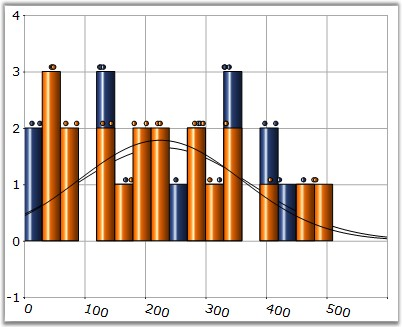

::: {style="DISPLAY: none"}
{#d2h_url_template}{#d2h_package_url style="WIDTH: 0px; DISPLAY: none; HEIGHT: 0px"}
:::

:::: {.d2h_secondary_topic style="PADDING-BOTTOM: 10pt; MARGIN: 0pt; PADDING-LEFT: 0pt; PADDING-RIGHT: 0pt; PADDING-TOP: 0pt"}
#### NumberOfHistogramIntervals {#numberofhistogramintervals style="tab-stops: 0pt"}

**[]{style="FONT-FAMILY: 'Trebuchet MS','sans-serif'; FONT-SIZE: 9pt"}** 

Gets or sets the number of Histogram intervals.

[]{style="FONT-FAMILY: 'Trebuchet MS','sans-serif'; FONT-SIZE: 9pt"} 

::: {align="center"}
+--------------------------+-------------------+
| Details                                      |
+--------------------------+-------------------+
| Possible Values          | Any numeric value |
+--------------------------+-------------------+
| Default Value            | 10                |
+--------------------------+-------------------+
| 2D / 3D Limitations      | No                |
+--------------------------+-------------------+
| Applies to Chart Element | All Series Points |
+--------------------------+-------------------+
| Applies to Chart Types   | HistoGram Chart   |
+--------------------------+-------------------+
:::

**[]{style="FONT-FAMILY: 'Trebuchet MS','sans-serif'; FONT-SIZE: 9pt"}** 

Here is a code sample.

[]{style="FONT-FAMILY: 'Trebuchet MS','sans-serif'; FONT-SIZE: 9pt"} 

+------------------------------------------------------------------------------------------------------------------------------+
| **[\[C#\]]{style="FONT-FAMILY: 'Courier New'; COLOR: black"}**                                                               |
|                                                                                                                              |
| **[]{style="FONT-FAMILY: 'Courier New'; COLOR: black"}**                                                                     |
|                                                                                                                              |
| [// Set the desired number of intervals required for the histogram chart.]{style="FONT-FAMILY: 'Courier New'; COLOR: green"} |
|                                                                                                                              |
| [series.NumberOfHistogramIntervals = 20;]{style="FONT-FAMILY: 'Courier New'; COLOR: black"}                                  |
+------------------------------------------------------------------------------------------------------------------------------+

[]{style="FONT-FAMILY: 'Trebuchet MS','sans-serif'; FONT-SIZE: 9pt"} 

+------------------------------------------------------------------------------------------------------------------------------+
| **[\[VB.NET\]]{style="FONT-FAMILY: 'Courier New'; COLOR: black"}**                                                           |
|                                                                                                                              |
| **[]{style="FONT-FAMILY: 'Courier New'; COLOR: black"}**                                                                     |
|                                                                                                                              |
| [\' Set the desired number of intervals required for the histogram chart.]{style="FONT-FAMILY: 'Courier New'; COLOR: green"} |
|                                                                                                                              |
| [series.NumberOfHistogramIntervals = 20]{style="FONT-FAMILY: 'Courier New'; COLOR: black"}                                   |
+------------------------------------------------------------------------------------------------------------------------------+

[]{style="FONT-FAMILY: 'Trebuchet MS','sans-serif'; FONT-SIZE: 9pt"} 

{border="0"}

**[]{style="FONT-FAMILY: 'Trebuchet MS','sans-serif'; FONT-SIZE: 9pt"}** 

Figure 158: Histogram Chart with Interval set to \"20\"

**[]{style="FONT-FAMILY: 'Courier New'; COLOR: black; FONT-SIZE: 9pt"}** 

See Also

**[]{style="FONT-FAMILY: 'Trebuchet MS','sans-serif'; FONT-SIZE: 9pt"}** 

[Histogram Chart]{.UGHyperlink}[]{.UGHyperlink}

[]{#p126} 

[]{#related-topics}
::::
