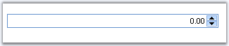

::: {style="DISPLAY: none"}
{#d2h_url_template}{#d2h_package_url style="WIDTH: 0px; DISPLAY: none; HEIGHT: 0px"}
:::

::: {.d2h_secondary_topic style="PADDING-BOTTOM: 10pt; MARGIN: 0pt; PADDING-LEFT: 0pt; PADDING-RIGHT: 0pt; PADDING-TOP: 0pt"}
#### NumericTextBox {#numerictextbox style="tab-stops: 0pt"}

 

 The NumericTextBox is a control that allows you to display numeric values within the textbox.

 

{border="0"}

Figure 62

 

Features

 

[·      ]{style="FONT-FAMILY: Symbol"}Supports client side validation of key strokes.

[·      ]{style="FONT-FAMILY: Symbol"}Supports to set minimum and maximum values.

[·      ]{style="FONT-FAMILY: Symbol"}Uses globalization features of .NET platform to provide locale-specific formatting.

[]{#p92} 

More:

[ ]{#related-topics}

[{border="0" align="absMiddle"}Creating NumericTextBox](ms-xhelp:///?Id=6917b983-bb20-483f-963f-b6997858a49c){style="TEXT-DECORATION: none"}

[{border="0" align="absMiddle"}Concepts and Features](ms-xhelp:///?Id=e60c5e63-988d-4e5e-8975-aaf68d834907){style="TEXT-DECORATION: none"}

[{border="0" align="absMiddle"}Events](ms-xhelp:///?Id=6923355f-c4ce-4d16-8771-f22c5d44e0fe){style="TEXT-DECORATION: none"}
:::
