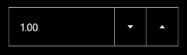

::: {style="DISPLAY: none"}
{#d2h_url_template}{#d2h_package_url style="WIDTH: 0px; DISPLAY: none; HEIGHT: 0px"}
:::

::::: {#nsbanner .d2h_main_nsbanner style="BORDER-BOTTOM: #999999 1px solid; POSITION: relative; PADDING-BOTTOM: 0px; BACKGROUND-COLOR: transparent; PADDING-LEFT: 0px; PADDING-RIGHT: 0px; DISPLAY: none; BORDER-TOP: #999999 1px solid; PADDING-TOP: 0px; LEFT: 0px"}
:::: {#TitleRow .d2h_main_titlerow style="PADDING-BOTTOM: 4px; BACKGROUND-COLOR: transparent; PADDING-LEFT: 22px; WIDTH: 100%; PADDING-RIGHT: 10px; DISPLAY: none; PADDING-TOP: 4px"}
::: {#ienav .d2h_main_ienav style="DISPLAY: none"}
{#D2HPrevious .D2HPreviousEnabled}  {#D2HNext .D2HNextEnabled}
:::
::::
:::::

:::: {#nstext .d2h_main_nstext style="PADDING-BOTTOM: 10px; BACKGROUND-COLOR: transparent; PADDING-LEFT: 22px; PADDING-RIGHT: 10px; HEIGHT: 100%; OVERFLOW: auto; PADDING-TOP: 5px" hasuserbackground="true" valign="bottom"}
::: {#d2h_breadcrumbs .d2h_breadcrumbs}
[Essential Studio User Guide Documentation](ms-xhelp:///?Id=12457748-09e3-4d74-a240-8e049cedf030){.d2h_breadcrumbsNormal}[ \> ]{.d2h_breadcrumbsLinkSeparator}[User Interface Edition](ms-xhelp:///?Id=c29296b7-531c-413b-a0ec-488ca1f7f669){.d2h_breadcrumbsNormal}[ \> ]{.d2h_breadcrumbsLinkSeparator}[Essential Windows Phone](ms-xhelp:///?Id=5ea1999c-4eff-4775-b84e-407dc825f555){.d2h_breadcrumbsNormal}[ \> ]{.d2h_breadcrumbsLinkSeparator}[Essential Tools]{.d2h_breadcrumbsContentsOnly}[ \> ]{.d2h_breadcrumbsLinkSeparator}[Tools Phone Controls](ms-xhelp:///?Id=785aeb70-aa68-45ce-9666-964f209e58fd){.d2h_breadcrumbsNormal}
:::

## NumericUpDown {#numericupdown style="tab-stops: 0pt"}

 

The NumericUpDown control is a text box with a pair of arrow buttons that increase / decrease the value given in a text box. It supports double values. The range of values can be specified.

 

{border="0"}

Figure 26: NumericUpDown Control

 

Feature Summary

 

[·      ]{style="FONT-FAMILY: Symbol"}**AllowEdit**- specifies whether the control is editable or not.

[·      ]{style="FONT-FAMILY: Symbol"}**Interval** - specifies the step value for the control when the up / down buttons are clicked.

[·      ]{style="FONT-FAMILY: Symbol"}**MaxValue and MinValue** - specifies the range of values for the control.

[·      ]{style="FONT-FAMILY: Symbol"}**TextAlignment** - specifies the alignment of the content.

[·      ]{style="FONT-FAMILY: Symbol"}**FlowDirection** - specifies the flow direction for the control.

[·      ]{style="FONT-FAMILY: Symbol"}**NegativeForeground** - specifies the foreground color for the input value when the value is less than zero.

More:

[ ]{#related-topics}

[{border="0" align="absMiddle"}Getting Started](ms-xhelp:///?Id=8168de02-8f8a-4dbc-9e53-afb45320971c){style="TEXT-DECORATION: none"}

[{border="0" align="absMiddle"}Concepts and Features](ms-xhelp:///?Id=4980cec2-2d07-46b3-9c55-707b0e94af53){style="TEXT-DECORATION: none"}
::::
