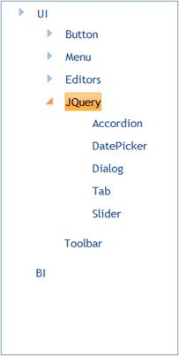

::: {style="DISPLAY: none"}
{#d2h_url_template}{#d2h_package_url style="WIDTH: 0px; DISPLAY: none; HEIGHT: 0px"}
:::

::::: {.d2h_secondary_topic style="PADDING-BOTTOM: 10pt; MARGIN: 0pt; PADDING-LEFT: 0pt; PADDING-RIGHT: 0pt; PADDING-TOP: 0pt"}
##### Object Data Binding {#object-data-binding style="tab-stops: 0pt"}

TreeView provides extensive data binding support to populate TreeView items so that the columns of a table can be mapped to the TreeView properties, namely Id, ParentId, Text, ImageUrl, SpriteCss, ImageAttributes, and HtmlAttributes.

 

Use Case Scenarios

The Data Binding feature helps users to plug-in data from a DataTable or DataSet to TreeView.

 

Adding Data Binding[ ]{style="COLOR: red"}to an Application

Data Binding in TreeView can be customized by using two ways, namely:

[·      ]{style="FONT-FAMILY: Symbol"}TreeViewBuilder

[·      ]{style="FONT-FAMILY: Symbol"}TreeViewModel

 

Using TreeViewBuilder

To customize Data Binding in TreeView by using TreeViewBuilder:

1.   In the **Controller**, pass the data to the **View** page.

 

+------------------------------------------------------------------------------------------------------------------------------------------------+
| **[\[Controller\]]{style="FONT-FAMILY: 'Courier New'"}**                                                                                       |
|                                                                                                                                                |
| [public]{style="FONT-FAMILY: 'Courier New'; COLOR: blue"}[ [ActionResult]{style="COLOR: #2b91af"} Index()]{style="FONT-FAMILY: 'Courier New'"} |
|                                                                                                                                                |
| [        {]{style="FONT-FAMILY: 'Courier New'"}                                                                                                |
|                                                                                                                                                |
| [            [Northwind]{style="COLOR: #2b91af"} data = SqlCE;]{style="FONT-FAMILY: 'Courier New'"}                                            |
|                                                                                                                                                |
| [            [// Passing the data to the View.]{style="COLOR: green"}]{style="FONT-FAMILY: 'Courier New'"}                                     |
|                                                                                                                                                |
| [            [return]{style="COLOR: blue"} View(data.TreeViewData);]{style="FONT-FAMILY: 'Courier New'"}                                       |
|                                                                                                                                                |
| [  }   ]{style="FONT-FAMILY: 'Courier New'"}                                                                                                   |
+------------------------------------------------------------------------------------------------------------------------------------------------+

**[]{style="FONT-FAMILY: 'Calibri','sans-serif'"}** 

2.   Create a Strongly Typed View.

3.   In the **View**, invoke the **TreeView** helper with the control ID.

4.   Set the **DataSource** and **BindTo** methods.

 

+-------------------------------------------------------------------------------------------------------------------------------------------------------------------------------------------------------------------------------------------------------------------------------------------------------------------------------------------------------------------------------------------------------------------------------------+
| **[View]{style="FONT-SIZE: 11pt"}[\[ASPX\]]{style="FONT-SIZE: 11pt"}**                                                                                                                                                                                                                                                                                                                                                              |
|                                                                                                                                                                                                                                                                                                                                                                                                                                     |
| **[]{style="FONT-FAMILY: 'Courier New'; FONT-SIZE: 11pt"}**                                                                                                                                                                                                                                                                                                                                                                         |
|                                                                                                                                                                                                                                                                                                                                                                                                                                     |
| [\<%]{style="FONT-FAMILY: 'Courier New'; BACKGROUND: yellow; FONT-SIZE: 11pt"}[=]{style="FONT-FAMILY: 'Courier New'; COLOR: blue; FONT-SIZE: 11pt"}[Html.Syncfusion().TreeView([\"myTreeView\"]{style="COLOR: #a31515"}]{style="FONT-FAMILY: 'Courier New'; FONT-SIZE: 11pt"}[,[\"Databind\"]{style="COLOR: #a31515"}]{style="FONT-FAMILY: 'Courier New'; FONT-SIZE: 11pt"}[)]{style="FONT-FAMILY: 'Courier New'; FONT-SIZE: 11pt"} |
|                                                                                                                                                                                                                                                                                                                                                                                                                                     |
| [.**DataSource(Model)**]{style="FONT-FAMILY: 'Courier New'; FONT-SIZE: 11pt"}                                                                                                                                                                                                                                                                                                                                                       |
|                                                                                                                                                                                                                                                                                                                                                                                                                                     |
| **[.BindTo(bind=\>]{style="FONT-FAMILY: 'Courier New'; FONT-SIZE: 11pt"}**                                                                                                                                                                                                                                                                                                                                                          |
|                                                                                                                                                                                                                                                                                                                                                                                                                                     |
| **[bind.Text([\"Title\"]{style="COLOR: #a31515"})]{style="FONT-FAMILY: 'Courier New'; FONT-SIZE: 11pt"}**                                                                                                                                                                                                                                                                                                                           |
|                                                                                                                                                                                                                                                                                                                                                                                                                                     |
| **[    .Id([\"TreeViewId\"]{style="COLOR: #a31515"})]{style="FONT-FAMILY: 'Courier New'; FONT-SIZE: 11pt"}**                                                                                                                                                                                                                                                                                                                        |
|                                                                                                                                                                                                                                                                                                                                                                                                                                     |
| **[    .ParentId([\"ParentId\"]{style="COLOR: #a31515"})]{style="FONT-FAMILY: 'Courier New'; FONT-SIZE: 11pt"}**                                                                                                                                                                                                                                                                                                                    |
|                                                                                                                                                                                                                                                                                                                                                                                                                                     |
| **[    .SpriteCss([\"SpriteClass\"]{style="COLOR: #a31515"})]{style="FONT-FAMILY: 'Courier New'; FONT-SIZE: 11pt"}**                                                                                                                                                                                                                                                                                                                |
|                                                                                                                                                                                                                                                                                                                                                                                                                                     |
| **[    .ImageUrl([\"ImagePath\"]{style="COLOR: #a31515"})]{style="FONT-FAMILY: 'Courier New'; FONT-SIZE: 11pt"}**                                                                                                                                                                                                                                                                                                                   |
|                                                                                                                                                                                                                                                                                                                                                                                                                                     |
| **[    .ImageAttributes([\"Imageattributes\"]{style="COLOR: #a31515"})]{style="FONT-FAMILY: 'Courier New'; FONT-SIZE: 11pt"}**[)[%\>]{style="BACKGROUND: yellow"}]{style="FONT-FAMILY: 'Courier New'; FONT-SIZE: 11pt"}[]{style="FONT-FAMILY: 'Courier New'; FONT-SIZE: 11pt"}                                                                                                                                                      |
+-------------------------------------------------------------------------------------------------------------------------------------------------------------------------------------------------------------------------------------------------------------------------------------------------------------------------------------------------------------------------------------------------------------------------------------+

 

 

+-----------------------------------------------------------------------------------------------------------------------------------------------------------------------------------------------------------------------------------------------------------------------------------------------------------------------------------------------------------------+
| **[View\[cshtml\]]{style="FONT-SIZE: 11pt"}**                                                                                                                                                                                                                                                                                                                   |
|                                                                                                                                                                                                                                                                                                                                                                 |
| **[]{style="FONT-FAMILY: 'Courier New'; FONT-SIZE: 11pt"}**                                                                                                                                                                                                                                                                                                     |
|                                                                                                                                                                                                                                                                                                                                                                 |
| [\@{]{style="FONT-FAMILY: 'Courier New'; BACKGROUND: yellow; FONT-SIZE: 11pt"}[ Html.Syncfusion().TreeView([\"myTreeView\"]{style="COLOR: #a31515"}]{style="FONT-FAMILY: 'Courier New'; FONT-SIZE: 11pt"}[,[\"Databind\"]{style="COLOR: #a31515"}]{style="FONT-FAMILY: 'Courier New'; FONT-SIZE: 11pt"}[)]{style="FONT-FAMILY: 'Courier New'; FONT-SIZE: 11pt"} |
|                                                                                                                                                                                                                                                                                                                                                                 |
| [.**DataSource(Model)**]{style="FONT-FAMILY: 'Courier New'; FONT-SIZE: 11pt"}                                                                                                                                                                                                                                                                                   |
|                                                                                                                                                                                                                                                                                                                                                                 |
| **[.BindTo(bind=\>]{style="FONT-FAMILY: 'Courier New'; FONT-SIZE: 11pt"}**                                                                                                                                                                                                                                                                                      |
|                                                                                                                                                                                                                                                                                                                                                                 |
| **[bind.Text([\"Title\"]{style="COLOR: #a31515"})]{style="FONT-FAMILY: 'Courier New'; FONT-SIZE: 11pt"}**                                                                                                                                                                                                                                                       |
|                                                                                                                                                                                                                                                                                                                                                                 |
| **[    .Id([\"TreeViewId\"]{style="COLOR: #a31515"})]{style="FONT-FAMILY: 'Courier New'; FONT-SIZE: 11pt"}**                                                                                                                                                                                                                                                    |
|                                                                                                                                                                                                                                                                                                                                                                 |
| **[    .ParentId([\"ParentId\"]{style="COLOR: #a31515"})]{style="FONT-FAMILY: 'Courier New'; FONT-SIZE: 11pt"}**                                                                                                                                                                                                                                                |
|                                                                                                                                                                                                                                                                                                                                                                 |
| **[    .SpriteCss([\"SpriteClass\"]{style="COLOR: #a31515"})]{style="FONT-FAMILY: 'Courier New'; FONT-SIZE: 11pt"}**                                                                                                                                                                                                                                            |
|                                                                                                                                                                                                                                                                                                                                                                 |
| **[    .ImageUrl([\"ImagePath\"]{style="COLOR: #a31515"})]{style="FONT-FAMILY: 'Courier New'; FONT-SIZE: 11pt"}**                                                                                                                                                                                                                                               |
|                                                                                                                                                                                                                                                                                                                                                                 |
| **[    .ImageAttributes([\"Imageattributes\"]{style="COLOR: #a31515"})]{style="FONT-FAMILY: 'Courier New'; FONT-SIZE: 11pt"}**[).Render();[}]{style="BACKGROUND: yellow"}]{style="FONT-FAMILY: 'Courier New'; FONT-SIZE: 11pt"}                                                                                                                                 |
|                                                                                                                                                                                                                                                                                                                                                                 |
| []{style="FONT-FAMILY: 'Courier New'; COLOR: #a31515; FONT-SIZE: 11pt"}                                                                                                                                                                                                                                                                                         |
|                                                                                                                                                                                                                                                                                                                                                                 |
| []{style="FONT-FAMILY: 'Courier New'; FONT-SIZE: 11pt"}                                                                                                                                                                                                                                                                                                         |
+-----------------------------------------------------------------------------------------------------------------------------------------------------------------------------------------------------------------------------------------------------------------------------------------------------------------------------------------------------------------+

 

5.   Build and run the application.

{border="0"}

Figure 326: TreeView - Data Binding Using TreeViewBuilder

 

Using TreeViewModel

To customize Data Binding in TreeView by using TreeViewModel:

1.   In the **Controller**, create an object for the **TreeViewModel** class.

2.   Set the **DataSource** and **BindTo** properties.

3.   Pass the **TreeViewModel** class to the **ViewData**.

 

::: {align="center"}
+-----------------------------------------------------------------------------------------------------------------------------------------------------------------------------------+
| [      **\[Controller\]**]{style="FONT-FAMILY: 'Courier New'"}                                                                                                                    |
|                                                                                                                                                                                   |
| [        [public]{style="COLOR: blue"} [ActionResult]{style="COLOR: #2b91af"} Index()]{style="FONT-FAMILY: 'Courier New'"}                                                        |
|                                                                                                                                                                                   |
| [        {]{style="FONT-FAMILY: 'Courier New'"}                                                                                                                                   |
|                                                                                                                                                                                   |
| [            [Northwind]{style="COLOR: #2b91af"} context = SqlCE;]{style="FONT-FAMILY: 'Courier New'"}                                                                            |
|                                                                                                                                                                                   |
| [            [TreeViewFields]{style="COLOR: #2b91af"} treeViewFields = [new]{style="COLOR: blue"} [TreeViewFields]{style="COLOR: #2b91af"}()]{style="FONT-FAMILY: 'Courier New'"} |
|                                                                                                                                                                                   |
| [            {]{style="FONT-FAMILY: 'Courier New'"}                                                                                                                               |
|                                                                                                                                                                                   |
| [                Id = [\"Id\"]{style="COLOR: #a31515"},]{style="FONT-FAMILY: 'Courier New'"}                                                                                      |
|                                                                                                                                                                                   |
| [                ParentId = [\"ParentId\"]{style="COLOR: #a31515"},]{style="FONT-FAMILY: 'Courier New'"}                                                                          |
|                                                                                                                                                                                   |
| [                Text = [\"Text\"]{style="COLOR: #a31515"},]{style="FONT-FAMILY: 'Courier New'"}                                                                                  |
|                                                                                                                                                                                   |
| [                ImageUrl = [\"ImageUrl\"]{style="COLOR: #a31515"},]{style="FONT-FAMILY: 'Courier New'"}                                                                          |
|                                                                                                                                                                                   |
| [                SpriteCSS = [\"SpriteCSS\"]{style="COLOR: #a31515"}]{style="FONT-FAMILY: 'Courier New'"}                                                                         |
|                                                                                                                                                                                   |
| [            };]{style="FONT-FAMILY: 'Courier New'"}                                                                                                                              |
|                                                                                                                                                                                   |
| [            [TreeViewModel]{style="COLOR: #2b91af"} treeviewModel = [new]{style="COLOR: blue"} [TreeViewModel]{style="COLOR: #2b91af"}()]{style="FONT-FAMILY: 'Courier New'"}    |
|                                                                                                                                                                                   |
| [            {]{style="FONT-FAMILY: 'Courier New'"}                                                                                                                               |
|                                                                                                                                                                                   |
| [                DataSource = context.TreeDatabinding.ToList(),]{style="FONT-FAMILY: 'Courier New'"}                                                                              |
|                                                                                                                                                                                   |
| [                BindTo = treeViewFields,]{style="FONT-FAMILY: 'Courier New'"}                                                                                                    |
|                                                                                                                                                                                   |
| [            };]{style="FONT-FAMILY: 'Courier New'"}                                                                                                                              |
|                                                                                                                                                                                   |
| [            ViewData\[[\"myTreeViewModel\"]{style="COLOR: #a31515"}\] = treeviewModel;]{style="FONT-FAMILY: 'Courier New'"}                                                      |
|                                                                                                                                                                                   |
| [            [return]{style="COLOR: blue"} View();]{style="FONT-FAMILY: 'Courier New'"}                                                                                           |
|                                                                                                                                                                                   |
| [        }]{style="FONT-FAMILY: 'Courier New'"}                                                                                                                                   |
|                                                                                                                                                                                   |
| []{style="FONT-FAMILY: 'Courier New'"}                                                                                                                                            |
+-----------------------------------------------------------------------------------------------------------------------------------------------------------------------------------+
:::

**[]{style="FONT-FAMILY: 'Calibri','sans-serif'"}** 

4.   Create a **View**.

5.   In the **View**, invoke the **TreeView** helper with the control ID.

6.   From the **ViewData**, assign the **TreeViewModel** class to the **TreeView** helper.

 

+-----------------------------------------------------------------------------------------------------------------------------------------------------------------------------------------------------------------------------------------------------------------------------------------------------------------------------------------------------------+
| **View\[ASPX\]**                                                                                                                                                                                                                                                                                                                                          |
|                                                                                                                                                                                                                                                                                                                                                           |
|                                                                                                                                                                                                                                                                                                                                                           |
|                                                                                                                                                                                                                                                                                                                                                           |
| [        [\<%]{style="BACKGROUND: yellow"}[=]{style="COLOR: blue"}Html.Syncfusion().TreeView([\"MyTreeView\"]{style="COLOR: #a31515"}, [\"Databind\"]{style="COLOR: #a31515"}, ([TreeViewModel]{style="COLOR: #2b91af"})ViewData\[[\"myTreeViewModel\"]{style="COLOR: #a31515"}\]) [%\>]{style="BACKGROUND: yellow"}]{style="FONT-FAMILY: 'Courier New'"} |
|                                                                                                                                                                                                                                                                                                                                                           |
| []{style="FONT-FAMILY: 'Courier New'; BACKGROUND: yellow"}                                                                                                                                                                                                                                                                                                |
+-----------------------------------------------------------------------------------------------------------------------------------------------------------------------------------------------------------------------------------------------------------------------------------------------------------------------------------------------------------+

 

+---------------------------------------------------------------------------------------------------------------------------------------------------------------------------------------------------------------------------------------------------------------------------------------------------------------------------------------------------------------------------------------------------------------------+
| **View\[cshtml\]**                                                                                                                                                                                                                                                                                                                                                                                                  |
|                                                                                                                                                                                                                                                                                                                                                                                                                     |
| **[]{style="FONT-FAMILY: 'Courier New'"}**                                                                                                                                                                                                                                                                                                                                                                          |
|                                                                                                                                                                                                                                                                                                                                                                                                                     |
| [     [@(]{style="BACKGROUND: yellow"}[new]{style="COLOR: blue"} [HtmlString]{style="COLOR: #2b91af"}(Html.Syncfusion().TreeView([\"MyTreeView\"]{style="COLOR: #a31515"}, [\"Databind\"]{style="COLOR: #a31515"}, ([TreeViewModel]{style="COLOR: #2b91af"})ViewData\[[\"myTreeViewModel\"]{style="COLOR: #a31515"}\]).ToString())[)]{style="BACKGROUND: yellow"}]{style="FONT-FAMILY: Consolas; FONT-SIZE: 9.5pt"} |
|                                                                                                                                                                                                                                                                                                                                                                                                                     |
| []{style="FONT-FAMILY: 'Courier New'; BACKGROUND: yellow"}                                                                                                                                                                                                                                                                                                                                                          |
+---------------------------------------------------------------------------------------------------------------------------------------------------------------------------------------------------------------------------------------------------------------------------------------------------------------------------------------------------------------------------------------------------------------------+

[]{style="FONT-FAMILY: Consolas; BACKGROUND: yellow; FONT-SIZE: 9.5pt"} 

7.   Build and run the application.

{border="0"}

Figure 327: TreeView - Data Binding Using TreeViewModel

 

Properties

The properties of the Data Binding feature in TreeView are described in the following tabulation:

 

::: {align="center"}
  ----------------------------------------- ------------------------------------------------------------------------------------------------------------------- ------------------------------------- ---------------------------------------- ----------------------------------------
  Name                                      Description                                                                                                         Type                                  Data Type                                Reference links
  [DataSource]{style="COLOR: black"}        Gets or sets the data source, which is used to populate TreeView with the TreeView items.[]{style="COLOR: black"}   [Server-side]{style="COLOR: black"}   [IEnumerable]{style="COLOR: black"}      [Not applicable]{style="COLOR: black"}
  [BindTo]{style="COLOR: black"}            Maps the TreeView fields to their respective columns from the data source.[]{style="COLOR: black"}                  [Server-side]{style="COLOR: black"}   [TreeViewFields]{style="COLOR: black"}   [Not applicable]{style="COLOR: black"}
  [Id]{style="COLOR: black"}                Gets or sets the ID column name.[]{style="COLOR: black"}                                                            [Server-side]{style="COLOR: black"}   [string]{style="COLOR: black"}           [Not applicable]{style="COLOR: black"}
  [ParentId]{style="COLOR: black"}          Gets or sets the parent ID column name.                                                                             [Server-side]{style="COLOR: black"}   [string]{style="COLOR: black"}           [Not applicable]{style="COLOR: black"}
  [Text]{style="COLOR: black"}              Gets or sets the text column name.[]{style="COLOR: black"}                                                          [Server-side]{style="COLOR: black"}   [string]{style="COLOR: black"}           [Not applicable]{style="COLOR: black"}
  [SpriteCss]{style="COLOR: black"}         Gets or sets the sprite column name.[]{style="COLOR: black"}                                                        [Server-side]{style="COLOR: black"}   [string]{style="COLOR: black"}           [Not applicable]{style="COLOR: black"}
  [ImageUrl]{style="COLOR: black"}          Gets or sets the image path column name.[]{style="COLOR: black"}                                                    [Server-side]{style="COLOR: black"}   [string]{style="COLOR: black"}           [Not applicable]{style="COLOR: black"}
  [HtmlAttributes]{style="COLOR: black"}    Gets or sets the HTML attributes column name.[]{style="COLOR: black"}                                               [Server-side]{style="COLOR: black"}   [string]{style="COLOR: black"}           [Not applicable]{style="COLOR: black"}
  [ImageAttributes]{style="COLOR: black"}   Gets or sets the image attributes column name.[]{style="COLOR: black"}                                              [Server-side]{style="COLOR: black"}   [string]{style="COLOR: black"}           [Not applicable]{style="COLOR: black"}
  ----------------------------------------- ------------------------------------------------------------------------------------------------------------------- ------------------------------------- ---------------------------------------- ----------------------------------------
:::

[]{style="FONT-FAMILY: 'Calibri','sans-serif'; COLOR: black"} 

Sample Link

To view a sample:

1.   Open the Tools Sample Browser from the dashboard. (Refer to the Samples and Location chapter.)

2.   Navigate to **Tools.Mvc** \> **TreeView** \> **Data Binding Demo**.

[]{style="COLOR: black"} 

[]{#related-topics}
:::::
