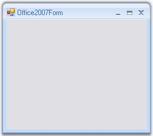

::: {style="DISPLAY: none"}
{#d2h_url_template}{#d2h_package_url style="WIDTH: 0px; DISPLAY: none; HEIGHT: 0px"}
:::

::: {.d2h_secondary_topic style="PADDING-BOTTOM: 10pt; MARGIN: 0pt; PADDING-LEFT: 0pt; PADDING-RIGHT: 0pt; PADDING-TOP: 0pt"}
#### Office2007 Form {#office2007-form style="tab-stops: 0pt"}

**[]{style="COLOR: #15428b"}** 

Office2007 Form which does not have any dependency in RibbonControlAdv is now available in Essential suite. It supports all three color schemes, help button, Right To left feature everything similar to the normal form with the Office2007 look and feel.

**[]{style="COLOR: #15428b"}** 

{border="0"}

[]{style="COLOR: #15428b"} 

***[]{style="COLOR: #15428b"}*** 

Figure 1291: Office2007 Form

**[]{style="COLOR: #15428b"}** 

[]{style="COLOR: black"} 

 

 

 

More:

[ ]{#related-topics}

[{border="0" align="absMiddle"}Creating Office2007Form](ms-xhelp:///?Id=fe779cc6-ee87-4a6b-826c-b2105ce61b43){style="TEXT-DECORATION: none"}

[{border="0" align="absMiddle"}Color Schemes](ms-xhelp:///?Id=3726be98-80d6-49bb-83cc-f06f4c06c2e8){style="TEXT-DECORATION: none"}

[{border="0" align="absMiddle"}Caption Settings](ms-xhelp:///?Id=e05c64db-15a7-443b-860c-0bb7bf8018bc){style="TEXT-DECORATION: none"}

[{border="0" align="absMiddle"}Caption Fore Color Settings](ms-xhelp:///?Id=66acfedc-b77e-4d22-b37c-0d58d8c62b57){style="TEXT-DECORATION: none"}
:::
