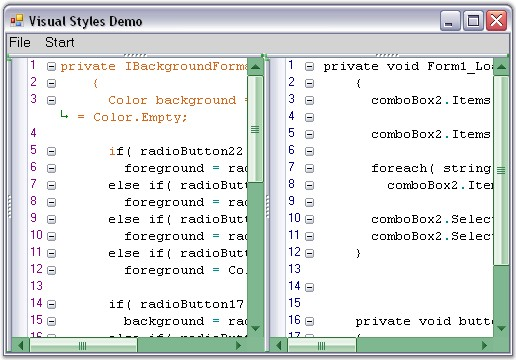

::: {style="DISPLAY: none"}
{#d2h_url_template}{#d2h_package_url style="WIDTH: 0px; DISPLAY: none; HEIGHT: 0px"}
:::

:::: {.d2h_secondary_topic style="PADDING-BOTTOM: 10pt; MARGIN: 0pt; PADDING-LEFT: 0pt; PADDING-RIGHT: 0pt; PADDING-TOP: 0pt"}
#### Office 2007 Visual Style {#office-2007-visual-style style="tab-stops: 0pt"}

 

Edit Control enables to provide Office 2007 appearance to scroll bars by setting the **ScrollVisualStyle** property to **Office2007**.

 

It supports all the three Office 2007 Color Schemes (Black, Blue and Silver), which can be set by using the **ScrollColorScheme** property. Also, custom colors can be applied to the scroll bars of the Edit Control. This can be done by setting the ScrollColorScheme property to **Managed**.

 

::: {align="center"}
+-----------------------------------+-------------------------------------------------------------------------------------------------------------------+
| Edit Control Property             | Description                                                                                                       |
+-----------------------------------+-------------------------------------------------------------------------------------------------------------------+
| ScrollVisualStyle                 | Specifies the visual style of the scroll bar.                                                                     |
+-----------------------------------+-------------------------------------------------------------------------------------------------------------------+
| ScrollColorScheme                 | Specifies the scroll bar color scheme when Office2007 or Office2007Generic Style is set. The options provided are |
|                                   |                                                                                                                   |
|                                   |                                                                                                                   |
|                                   |                                                                                                                   |
|                                   | [·      ]{style="FONT-FAMILY: Symbol"}Black                                                                       |
|                                   |                                                                                                                   |
|                                   | [·      ]{style="FONT-FAMILY: Symbol"}Blue                                                                        |
|                                   |                                                                                                                   |
|                                   | [·      ]{style="FONT-FAMILY: Symbol"}Silver                                                                      |
|                                   |                                                                                                                   |
|                                   | [·      ]{style="FONT-FAMILY: Symbol"}Managed                                                                     |
+-----------------------------------+-------------------------------------------------------------------------------------------------------------------+
:::

[]{style="FONT-FAMILY: 'Trebuchet MS','sans-serif'; COLOR: #15428b; FONT-SIZE: 9pt"} 

+---------------------------------------------------------------------------------------------------------------------------------------------------------------------------------------------+
| **[\[C#\]]{style="FONT-FAMILY: 'Courier New'; COLOR: black"}**                                                                                                                              |
|                                                                                                                                                                                             |
| []{style="FONT-FAMILY: 'Courier New'; COLOR: black"}                                                                                                                                        |
|                                                                                                                                                                                             |
| [this]{style="FONT-FAMILY: 'Courier New'; COLOR: blue"}[.editControl1.ScrollVisualStyle = [ScrollBarCustomDrawStyles]{style="COLOR: teal"}.Office2007;]{style="FONT-FAMILY: 'Courier New'"} |
|                                                                                                                                                                                             |
| [this]{style="FONT-FAMILY: 'Courier New'; COLOR: blue"}[.editControl1.ScrollColorScheme = [Office2007ColorScheme]{style="COLOR: teal"}.Blue;]{style="FONT-FAMILY: 'Courier New'"}           |
|                                                                                                                                                                                             |
| []{style="FONT-FAMILY: 'Courier New'"}                                                                                                                                                      |
|                                                                                                                                                                                             |
| [// Set custom color for the scroll bar.]{style="FONT-FAMILY: 'Courier New'; COLOR: green"}                                                                                                 |
|                                                                                                                                                                                             |
| [this]{style="FONT-FAMILY: 'Courier New'; COLOR: blue"}[.editControl1.ScrollColorScheme = [Office2007ColorScheme]{style="COLOR: teal"}.Managed;]{style="FONT-FAMILY: 'Courier New'"}        |
|                                                                                                                                                                                             |
| [Syncfusion.Windows.Forms.[Office2007Colors]{style="COLOR: teal"}.ApplyManagedColors([this]{style="COLOR: blue"}, [Color]{style="COLOR: teal"}.Green);]{style="FONT-FAMILY: 'Courier New'"} |
+---------------------------------------------------------------------------------------------------------------------------------------------------------------------------------------------+

[]{style="FONT-FAMILY: 'Trebuchet MS','sans-serif'; COLOR: #15428b; FONT-SIZE: 9pt"} 

+-------------------------------------------------------------------------------------------------------------------------------------------------------------------------------------------+
| **[\[VB.NET\]]{style="FONT-FAMILY: 'Courier New'; COLOR: black"}**                                                                                                                        |
|                                                                                                                                                                                           |
| []{style="FONT-FAMILY: 'Courier New'; COLOR: black"}                                                                                                                                      |
|                                                                                                                                                                                           |
| [Me]{style="FONT-FAMILY: 'Courier New'; COLOR: blue"}[.editControl1.ScrollVisualStyle = [ScrollBarCustomDrawStyles]{style="COLOR: black"}.Office2007]{style="FONT-FAMILY: 'Courier New'"} |
|                                                                                                                                                                                           |
| [Me]{style="FONT-FAMILY: 'Courier New'; COLOR: blue"}[.editControl1.ScrollColorScheme = [Office2007ColorScheme]{style="COLOR: black"}.Blue]{style="FONT-FAMILY: 'Courier New'"}           |
|                                                                                                                                                                                           |
| []{style="FONT-FAMILY: 'Courier New'"}                                                                                                                                                    |
|                                                                                                                                                                                           |
| [\' Set custom color for the scroll bar.]{style="FONT-FAMILY: 'Courier New'; COLOR: green"}                                                                                               |
|                                                                                                                                                                                           |
| [Me]{style="FONT-FAMILY: 'Courier New'; COLOR: blue"}[.editControl1.ScrollColorScheme = [Office2007ColorScheme]{style="COLOR: black"}.Managed]{style="FONT-FAMILY: 'Courier New'"}        |
|                                                                                                                                                                                           |
| [Syncfusion.Windows.Forms.Office2007Colors.ApplyManagedColors([Me]{style="COLOR: blue"}, Color.Green)]{style="FONT-FAMILY: 'Courier New'"}                                                |
+-------------------------------------------------------------------------------------------------------------------------------------------------------------------------------------------+

 

The following illustration shows the Edit Control with custom color (green) set for the scroll bars.

 

{border="0"}

Figure 52: Edit Control with ScrollColorScheme property = \"Managed\"

 

[]{#p71} 

More:

[ ]{#related-topics}

[{border="0" align="absMiddle"}ToolTip](ms-xhelp:///?Id=5e40d6f7-0e05-4fb2-80f7-9c55e56f348f){style="TEXT-DECORATION: none"}
::::
