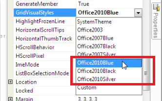
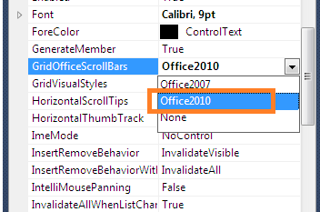
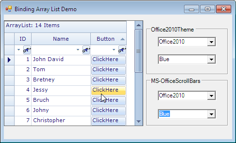
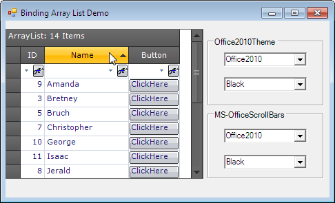
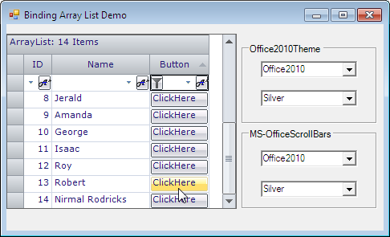

::: {style="DISPLAY: none"}
{#d2h_url_template}{#d2h_package_url style="WIDTH: 0px; DISPLAY: none; HEIGHT: 0px"}
:::

::::: {#nsbanner .d2h_main_nsbanner style="BORDER-BOTTOM: #999999 1px solid; POSITION: relative; PADDING-BOTTOM: 0px; BACKGROUND-COLOR: transparent; PADDING-LEFT: 0px; PADDING-RIGHT: 0px; DISPLAY: none; BORDER-TOP: #999999 1px solid; PADDING-TOP: 0px; LEFT: 0px"}
:::: {#TitleRow .d2h_main_titlerow style="PADDING-BOTTOM: 4px; BACKGROUND-COLOR: transparent; PADDING-LEFT: 22px; WIDTH: 100%; PADDING-RIGHT: 10px; DISPLAY: none; PADDING-TOP: 4px"}
::: {#ienav .d2h_main_ienav style="DISPLAY: none"}
{#D2HPrevious .D2HPreviousEnabled}  {#D2HNext .D2HNextEnabled}
:::
::::
:::::

::::: {#nstext .d2h_main_nstext style="PADDING-BOTTOM: 10px; BACKGROUND-COLOR: transparent; PADDING-LEFT: 22px; PADDING-RIGHT: 10px; HEIGHT: 100%; OVERFLOW: auto; PADDING-TOP: 5px" hasuserbackground="true" valign="bottom"}
::: {#d2h_breadcrumbs .d2h_breadcrumbs}
[Essential Studio User Guide Documentation](ms-xhelp:///?Id=12457748-09e3-4d74-a240-8e049cedf030){.d2h_breadcrumbsNormal}[ \> ]{.d2h_breadcrumbsLinkSeparator}[User Interface Edition](ms-xhelp:///?Id=c29296b7-531c-413b-a0ec-488ca1f7f669){.d2h_breadcrumbsNormal}[ \> ]{.d2h_breadcrumbsLinkSeparator}[Essential Windows](ms-xhelp:///?Id=e60759d8-47a4-4570-9d7a-16a68d63f2ea){.d2h_breadcrumbsNormal}[ \> ]{.d2h_breadcrumbsLinkSeparator}[Essential Grid]{.d2h_breadcrumbsContentsOnly}[ \> ]{.d2h_breadcrumbsLinkSeparator}[Grid Controls](ms-xhelp:///?Id=bf2d70d7-33dc-4c67-a55d-4fcf8d51dc2b){.d2h_breadcrumbsNormal}
:::

## Office2010 Theme in Windows Grids {#office2010-theme-in-windows-grids style="tab-stops: 0pt"}

This feature provides support to have MS Office 2010 themes namely Blue, Black, and Silver) for the Windows Grids: GridControl, GridGroupingControl, GridDataBoundGrid, GridListControl, GridRecordNavigationControl and associated scrollbars.

To enable this support in grid, the following need to be handled:

[·      ]{style="FONT-FAMILY: Symbol"}Apply Office 2010 Visual Style to Grid

[·      ]{style="FONT-FAMILY: Symbol"}Enable Office 2010 Scrollbars

 

Applying Office2010 Visual Style to Grid

To apply Office 2010 Visual Style to Grid:

1.   Create a grid enabled sample application.

2.   Set the **Office2010** theme to grid control using **GridVisualStyles**.

[]{style="FONT-FAMILY: 'Trebuchet MS','sans-serif'; COLOR: #15428b; FONT-SIZE: 9pt"} 

{border="0"}**[]{style="COLOR: #4e84c4; FONT-SIZE: 14pt"}**

*[Figure ]{style="FONT-SIZE: 9pt"}[483]{style="FONT-SIZE: 9pt"}[: Set GridVisualStyles property to enable this theme.]{style="FONT-SIZE: 9pt"}*

 

Enabling Office2010 Scrollbars

To enable Office 2010 Scrollbars:

1.   Set the GridOfficeScrollBars property to Office 2010.

2.   Set the Office2010ScrollBarColorScheme property to Blue, Black or Silver.

[]{style="FONT-FAMILY: 'Trebuchet MS','sans-serif'; COLOR: #15428b; FONT-SIZE: 9pt"} 

[{border="0"}]{style="FONT-FAMILY: 'Times New Roman','serif'; FONT-SIZE: 12pt"}[]{style="FONT-FAMILY: 'Times New Roman','serif'; FONT-SIZE: 12pt"}

*[Figure ]{style="FONT-SIZE: 9pt"}[484]{style="FONT-SIZE: 9pt"}[: Set GridOfficeScrollBars property to enable this theme.]{style="FONT-SIZE: 9pt"}*

Use Case Scenarios

Office2010Theme support for Windows Grids is useful for commercial applications in order to attract its users with inspiring UI look and feel.

[]{style="FONT-FAMILY: 'Trebuchet MS','sans-serif'; COLOR: #15428b; FONT-SIZE: 9pt"} 

{border="0"}

Figure 485: Office2010 Blue theme

 

{border="0"}

Figure 486: Office2010 Black theme

 

{border="0"}

Figure 487: Office2010 Silver theme

 

Tables for Properties and Events

Properties

*[Table ]{style="FONT-SIZE: 9pt"}[12]{style="FONT-SIZE: 9pt"}[: Properties Table]{style="FONT-SIZE: 9pt"}*

::: {align="center"}
+---------------------------------+---------------------------------------------------------------------------------------------------------------------------------------------+------------------------------------------------+
| Property                        | Description                                                                                                                                 | Data Type                                      |
+---------------------------------+---------------------------------------------------------------------------------------------------------------------------------------------+------------------------------------------------+
| GridVisualStyles                | [·      ]{style="FONT-FAMILY: Symbol"}This is an Enumeration type property.                                                                 | Syncfusion.Windows.Forms.GridVisualStyles      |
|                                 |                                                                                                                                             |                                                |
|                                 | [·      ]{style="FONT-FAMILY: Symbol"}This property is used to get or set the VisualStyles (skins) like Office2010, Office2007, Office2003. |                                                |
+---------------------------------+---------------------------------------------------------------------------------------------------------------------------------------------+------------------------------------------------+
| GridOfficeScrollbars            | [·      ]{style="FONT-FAMILY: Symbol"}This is an Enumeration type property.                                                                 | Syncfusion.Windows.Forms.OfficeScrollBars      |
|                                 |                                                                                                                                             |                                                |
|                                 | [·      ]{style="FONT-FAMILY: Symbol"}This property is used to get or set the Office like scrollbars.                                       |                                                |
+---------------------------------+---------------------------------------------------------------------------------------------------------------------------------------------+------------------------------------------------+
| Office2010ScrollBarsColorScheme | [·      ]{style="FONT-FAMILY: Symbol"}This is an Enumeration type property.                                                                 | Syncfusion.Windows.Forms.Office2010ColorScheme |
|                                 |                                                                                                                                             |                                                |
|                                 | [·      ]{style="FONT-FAMILY: Symbol"}This property is used to get or set the style of Office2010 scroll bars                               |                                                |
+---------------------------------+---------------------------------------------------------------------------------------------------------------------------------------------+------------------------------------------------+
:::

[]{style="FONT-FAMILY: 'Calibri','sans-serif'; COLOR: black"} 

Events

[·      ]{style="FONT-FAMILY: Symbol"}The following event is used when applying the Office2010 theme to Essential Windows Grids.

  -------------- ---------------------------- ----------------------------------------------------
  Event          Parameters                   Description
  ThemeChanged   Object sender, EventArgs e   Occurs when the ThemesEnabled property is changed.
  -------------- ---------------------------- ----------------------------------------------------

[]{style="FONT-FAMILY: 'Trebuchet MS','sans-serif'; COLOR: #15428b; FONT-SIZE: 9pt"} 

[·      ]{style="FONT-FAMILY: Symbol"}The following events occur when the GridOfficeScrollBars are applied to Essential Windows Grids.

  Event                                    Parameters                                                       Description
  ---------------------------------------- ---------------------------------------------------------------- -----------------------------------------------------------------------
  Office2010ScrollBarsColorSchemeChanged   Object sender, EventArgs e                                       Occurs when the Office2010ScrollBarsColorScheme property has changed.
  OfficeScrollBarsChanged                  object sender, GridGroupingControl.OfficeScrollBarsEventArgs e   Occurs when the GridOfficeScrollBars property has changed.

[]{style="FONT-FAMILY: 'Trebuchet MS','sans-serif'; COLOR: #15428b; FONT-SIZE: 9pt"} 

Adding Grid with Office2010 Theme to an Application

To add Grid with Office 2010 theme to an application:

1.   Create a **GridControl** enabled application.

2.   Set the **GridVisualStyles** property to apply **Office2010** theme in GridControl.

The following sample code sets an Office2010 Black skin theme to the Essential Grid Control. 

[]{style="FONT-FAMILY: 'Trebuchet MS','sans-serif'; COLOR: #15428b; FONT-SIZE: 9pt"} 

+-------------------------------------------------------------------------------------------------------------------------------------------------------------------------------------------------------------------------------------------------------------------------------+
| **[\[C#\]]{style="FONT-FAMILY: 'Courier New'"}**[ ]{style="FONT-FAMILY: 'Courier New'"}                                                                                                                                                                                       |
|                                                                                                                                                                                                                                                                               |
| [this]{style="FONT-FAMILY: 'Courier New'; COLOR: blue"}[.]{style="FONT-FAMILY: 'Courier New'"}[gridGroupingControl1]{style="FONT-FAMILY: 'Courier New'"}[.GridVisualStyles = [GridVisualStyles]{style="COLOR: #2b91af"}.Office2010Black;]{style="FONT-FAMILY: 'Courier New'"} |
+-------------------------------------------------------------------------------------------------------------------------------------------------------------------------------------------------------------------------------------------------------------------------------+

 

+----------------------------------------------------------------------------------------------------------------------------------------------------------------------------------------------------------------------------------------------------------------------------+
| **[\[VB\]]{style="FONT-FAMILY: 'Courier New'"}**[ ]{style="FONT-FAMILY: 'Courier New'"}                                                                                                                                                                                    |
|                                                                                                                                                                                                                                                                            |
| [Me]{style="FONT-FAMILY: 'Courier New'; COLOR: blue"}[.]{style="FONT-FAMILY: 'Courier New'"}[gridGroupingControl1]{style="FONT-FAMILY: 'Courier New'"}[.GridVisualStyles = [GridVisualStyles]{style="COLOR: #2b91af"}.Office2010Black]{style="FONT-FAMILY: 'Courier New'"} |
+----------------------------------------------------------------------------------------------------------------------------------------------------------------------------------------------------------------------------------------------------------------------------+

[]{style="COLOR: #c00000"} 

3.   Set the **GridOfficeScrollBars** property to **Office2010**, to apply Office2010 like scroll bars in Essential Windows Grids.

4.   Set the **Office2010ScrollBarsColorScheme**, to apply the color scheme of the scroll bars.

 

+-------------------------------------------------------------------------------------------------------------------------------------------------------------------------------------------------------------+
| **[\[C#\]]{style="FONT-FAMILY: 'Courier New'"}**[ ]{style="FONT-FAMILY: 'Courier New'"}                                                                                                                     |
|                                                                                                                                                                                                             |
| [this]{style="FONT-FAMILY: 'Courier New'; COLOR: blue"}[.gridGroupingControl1.GridOfficeScrollBars = [OfficeScrollBars]{style="COLOR: #2b91af"}.Office2010;]{style="FONT-FAMILY: 'Courier New'"}            |
|                                                                                                                                                                                                             |
| [this]{style="FONT-FAMILY: 'Courier New'; COLOR: blue"}[.gridGroupingControl1.Office2010ScrollBarsColorScheme = [Office2010ColorScheme]{style="COLOR: #2b91af"}.Black;]{style="FONT-FAMILY: 'Courier New'"} |
+-------------------------------------------------------------------------------------------------------------------------------------------------------------------------------------------------------------+

 

+------------------------------------------------------------------------------------------------------------------------------------------------------------------------------------------------------------------------------------------------+
| **[\[VB\]]{style="FONT-FAMILY: 'Courier New'"}**[ ]{style="FONT-FAMILY: 'Courier New'"}                                                                                                                                                        |
|                                                                                                                                                                                                                                                |
| [Me]{style="FONT-FAMILY: 'Courier New'; COLOR: blue"}[.]{style="FONT-FAMILY: 'Courier New'"}[gridGroupingControl1.GridOfficeScrollBars = [OfficeScrollBars]{style="COLOR: #2b91af"}.Office2010]{style="FONT-FAMILY: 'Courier New'"}            |
|                                                                                                                                                                                                                                                |
| [Me]{style="FONT-FAMILY: 'Courier New'; COLOR: blue"}[.]{style="FONT-FAMILY: 'Courier New'"}[gridGroupingControl1.Office2010ScrollBarsColorScheme = [Office2010ColorScheme]{style="COLOR: #2b91af"}.Black]{style="FONT-FAMILY: 'Courier New'"} |
+------------------------------------------------------------------------------------------------------------------------------------------------------------------------------------------------------------------------------------------------+

[]{style="FONT-FAMILY: 'Calibri','sans-serif'; COLOR: #c00000"} 

Sample Link

To get the Schedule samples from the dashboard:

[]{style="FONT-FAMILY: 'Trebuchet MS','sans-serif'; COLOR: #15428b; FONT-SIZE: 9pt"} 

1.   Open Essential Studio Dashboard by selecting Start -\> All Programs -\> Syncfusion -\> Essential Studio \<\<Version Number\>\> -\> Dashboard.

2.   Select "Run Locally Installed Samples" from the Windows Forms drop-down list on the User Interface pane.

3.   Expand "Grid samples" in the left panel of sample browser.

4.   Expand "Appearance" subsection and select "Grid Style Demo".

5.   Click the "Run Sample" button in the right panel.

To open sample project:

[]{style="FONT-FAMILY: 'Trebuchet MS','sans-serif'; COLOR: #15428b; FONT-SIZE: 9pt"} 

1.   Navigate to the following sample location in your system:

***"\<\<Sample Installation Location\>\>\\Syncfusion\\Essential Studio\\\<\<Version Number\>\>\\Windows\\Grid.Windows\\Samples\\2.0\\Appearance\\Grid Style Demo"***

2.   This location contains two sub folders CS and VB.  You can open the sample projects from the respective folders based on your application language.

[]{style="FONT-FAMILY: 'Trebuchet MS','sans-serif'; COLOR: #15428b; FONT-SIZE: 9pt"} 

[]{#related-topics}
:::::
