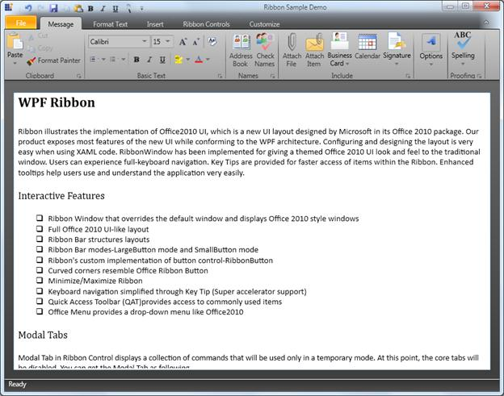

::: {style="DISPLAY: none"}
{#d2h_url_template}{#d2h_package_url style="WIDTH: 0px; DISPLAY: none; HEIGHT: 0px"}
:::

::: {.d2h_secondary_topic style="PADDING-BOTTOM: 10pt; MARGIN: 0pt; PADDING-LEFT: 0pt; PADDING-RIGHT: 0pt; PADDING-TOP: 0pt"}
#### Office 2010 User Interface (UI) {#office-2010-user-interface-ui style="tab-stops: 0pt"}

 

The Syncfusion Ribbon control supports the Office 2010 UI, which looks and functions like the Microsoft Office 2010 UI.

 

Use Case Scenarios

The Syncfusion Ribbon control with the Office 2010 UI helps users to create WPF applications, which look and function like the Microsoft Office 2010 UI.

 

{border="0"}

 

Figure 877: Office 2010 UI

 

Sample Link

To access a sample:

Navigate to Start -\> All Programs -\> Syncfusion -\> Essential Studio -\> Dashboard.

Click the WPF drop-down list, and then select Run Locally Installed Samples.

In the sample browser, expand the Ribbon treeview item, and then select Ribbon Sample.

[]{style="FONT-FAMILY: 'Trebuchet MS','sans-serif'; COLOR: #15428b; FONT-SIZE: 9pt"} 

More:

[ ]{#related-topics}

[{border="0" align="absMiddle"}Creating an Application with Office 2010 UI Appearance](ms-xhelp:///?Id=ae55598c-2a30-4801-aab5-60ec5ad7af15){style="TEXT-DECORATION: none"}

[{border="0" align="absMiddle"}Appearance](ms-xhelp:///?Id=10add490-e07b-4e32-90f2-57e80759dccb){style="TEXT-DECORATION: none"}
:::
