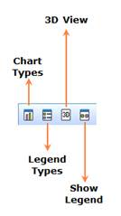

::: {style="DISPLAY: none"}
{#d2h_url_template}{#d2h_package_url style="WIDTH: 0px; DISPLAY: none; HEIGHT: 0px"}
:::

:::: {.d2h_secondary_topic style="PADDING-BOTTOM: 10pt; MARGIN: 0pt; PADDING-LEFT: 0pt; PADDING-RIGHT: 0pt; PADDING-TOP: 0pt"}
#### OLAP Chart Toolbar {#olap-chart-toolbar style="tab-stops: 0pt"}

{border="0"}

 

Figure 13: OLAP Chart Toolbar

 

Table 6: OLAP Chart Toolbar

 

::: {align="center"}
  ---------------- -----------------------------------------------------------------------------------
  Option           Description
  Chart Types      Provides option to visualize chart in a different manner by changing its type.
  Legend Types     Provides option to visualize legend in a different manner by changing its symbol.
  Enable 3D View   Provides three dimensional visualization of chart.
  Show Legend      The visibility of legend is set accordingly.
  ---------------- -----------------------------------------------------------------------------------
:::

 

[]{#related-topics}
::::
