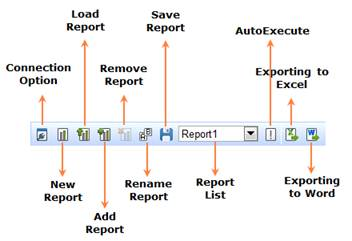

::: {style="DISPLAY: none"}
{#d2h_url_template}{#d2h_package_url style="WIDTH: 0px; DISPLAY: none; HEIGHT: 0px"}
:::

:::: {.d2h_secondary_topic style="PADDING-BOTTOM: 10pt; MARGIN: 0pt; PADDING-LEFT: 0pt; PADDING-RIGHT: 0pt; PADDING-TOP: 0pt"}
#### OLAP Client Toolbar {#olap-client-toolbar style="tab-stops: 0pt"}

 

{border="0"}

 

Figure 12: OLAP Client ToolBar

 

Table 5: OLAP Client ToolBar

 

::: {align="center"}
  Option                       Description
  ---------------------------- -------------------------------------------------------------------------------------------------------------------------------------------------------------------------------------------------------------------------------------------------------------------------------
  Connection Option            The connection would ask for the server name and database name, to establish the connection in order to retrieve the data from the database and from the cube for further manipulation.
  Create New Report            Creates a new report, clearing the existing report in order to provide the user a new platform to have new deployment based on the existing cube elements. See also [[API]{style="FONT-FAMILY: 'Arial','sans-serif'"}](ms-xhelp:///?Id=0e1ce6f6-d8fd-42fb-81e0-e174ea5516a7).
  Load Saved Report            The load report option picks the saved report from a location.
  Add a new report             Add a report to the existing list of report.
  Remove the selected report   Removes the current report from the report list. The button gets disabled if and only if the report list contains one report in it. See also [[API]{style="FONT-FAMILY: 'Arial','sans-serif'"}](ms-xhelp:///?Id=0e1ce6f6-d8fd-42fb-81e0-e174ea5516a7).
  Rename the selected report   The rename option changes the name of the current report as per the user's input.
  Save the current report      The **Save** option stores the current report/reports contained in the report list in a desired location. See also [[API]{style="FONT-FAMILY: 'Arial','sans-serif'"}](ms-xhelp:///?Id=0e1ce6f6-d8fd-42fb-81e0-e174ea5516a7).
  Exporting to Excel           This option is used to export the grid and chart data to excel format.
  Exporting to Word            This option is to export the grid and chart to word format.
:::

 

[]{#related-topics}
::::
