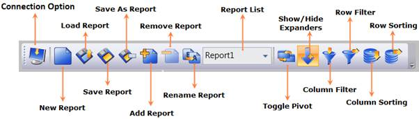
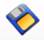
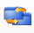
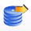

::: {style="DISPLAY: none"}
{#d2h_url_template} {#d2h_package_url style="WIDTH: 0px; DISPLAY: none; HEIGHT: 0px"}
:::

::::: {#nsbanner .d2h_main_nsbanner style="BORDER-BOTTOM: #999999 1px solid; POSITION: relative; PADDING-BOTTOM: 0px; BACKGROUND-COLOR: transparent; PADDING-LEFT: 0px; PADDING-RIGHT: 0px; DISPLAY: none; BORDER-TOP: #999999 1px solid; PADDING-TOP: 0px; LEFT: 0px"}
:::: {#TitleRow .d2h_main_titlerow style="PADDING-BOTTOM: 4px; BACKGROUND-COLOR: transparent; PADDING-LEFT: 22px; WIDTH: 100%; PADDING-RIGHT: 10px; DISPLAY: none; PADDING-TOP: 4px"}
::: {#ienav .d2h_main_ienav style="DISPLAY: none"}
{#D2HPrevious .D2HPreviousEnabled}  {#D2HNext .D2HNextEnabled}
:::
::::
:::::

::::: {#nstext .d2h_main_nstext style="PADDING-BOTTOM: 10px; BACKGROUND-COLOR: transparent; PADDING-LEFT: 22px; PADDING-RIGHT: 10px; HEIGHT: 100%; OVERFLOW: auto; PADDING-TOP: 5px" hasuserbackground="true" valign="bottom"}
::: {#d2h_breadcrumbs .d2h_breadcrumbs}
[Essential Studio User Guide Documentation](ms-xhelp:///?Id=12457748-09e3-4d74-a240-8e049cedf030){.d2h_breadcrumbsNormal} [ \> ]{.d2h_breadcrumbsLinkSeparator} [Business Intelligence Edition](ms-xhelp:///?Id=fdf33dd8-62b2-47b9-ad7b-fc50e590bca5){.d2h_breadcrumbsNormal} [ \> ]{.d2h_breadcrumbsLinkSeparator} [Essential BI WPF](ms-xhelp:///?Id=41e3d586-d922-4a01-8272-679fe4ae7343){.d2h_breadcrumbsNormal} [ \> ]{.d2h_breadcrumbsLinkSeparator} [Essential BI Client]{.d2h_breadcrumbsContentsOnly} [ \> ]{.d2h_breadcrumbsLinkSeparator} [Concepts and Features](ms-xhelp:///?Id=ac4d4da8-25e2-4317-98b8-e507a1eb5062){.d2h_breadcrumbsNormal} [ \> ]{.d2h_breadcrumbsLinkSeparator} [Tool Bar support](ms-xhelp:///?Id=c68ea354-0d16-4808-ba79-9f5cfccb8c5d){.d2h_breadcrumbsNormal}
:::

### OLAP Client Tool Bar {#olap-client-tool-bar style="tab-stops: 0pt"}

 

This toolbar contains menus to invoke the particular operation of OLAP Client.

{border="0"}

Figure 63: OLAP Client WPF Tool Bar

**[]{style="FONT-FAMILY: 'Calibri','sans-serif'; COLOR: #4f81bd; FONT-SIZE: 9pt"}**  

::: {align="center"}
+-------------------------------------------------------------------------------------------------------------------------------------------------------------------------------------------------------------------------------------------------------------+---------------------+----------------------------------------------------------------------------------------+----------------------------------------------------+
| Icon                                                                                                                                                                                                                                                        | Name                | Description                                                                            | Reference Link                                     |
+=============================================================================================================================================================================================================================================================+=====================+========================================================================================+====================================================+
| ::: {style="BORDER-BOTTOM: windowtext 1pt solid; BORDER-LEFT: medium none; PADDING-BOTTOM: 1pt; MARGIN-TOP: 9pt; PADDING-LEFT: 0pt; PADDING-RIGHT: 0pt; MARGIN-BOTTOM: 9pt; BORDER-TOP: windowtext 1pt solid; BORDER-RIGHT: medium none; PADDING-TOP: 1pt"} | Connection option   | Displays the Connection option dialog to connect to the server or Offline cube         | [Connection option]{.UGHyperlink} []{.UGHyperlink} |
| {border="0"}                                                                                                                                                                                                                   |                     |                                                                                        |                                                    |
| :::                                                                                                                                                                                                                                                         |                     |                                                                                        |                                                    |
+-------------------------------------------------------------------------------------------------------------------------------------------------------------------------------------------------------------------------------------------------------------+---------------------+----------------------------------------------------------------------------------------+----------------------------------------------------+
| ::: {style="BORDER-BOTTOM: windowtext 1pt solid; BORDER-LEFT: medium none; PADDING-BOTTOM: 1pt; MARGIN-TOP: 9pt; PADDING-LEFT: 0pt; PADDING-RIGHT: 0pt; MARGIN-BOTTOM: 9pt; BORDER-TOP: windowtext 1pt solid; BORDER-RIGHT: medium none; PADDING-TOP: 1pt"} | New Report          | Create a new session to create the report                                              | [New Report]{.UGHyperlink} []{.UGHyperlink}        |
| {border="0"}                                                                                                                                                                                                                   |                     |                                                                                        |                                                    |
| :::                                                                                                                                                                                                                                                         |                     |                                                                                        |                                                    |
+-------------------------------------------------------------------------------------------------------------------------------------------------------------------------------------------------------------------------------------------------------------+---------------------+----------------------------------------------------------------------------------------+----------------------------------------------------+
| ::: {style="BORDER-BOTTOM: windowtext 1pt solid; BORDER-LEFT: medium none; PADDING-BOTTOM: 1pt; MARGIN-TOP: 9pt; PADDING-LEFT: 0pt; PADDING-RIGHT: 0pt; MARGIN-BOTTOM: 9pt; BORDER-TOP: windowtext 1pt solid; BORDER-RIGHT: medium none; PADDING-TOP: 1pt"} | Load Report         | Load the reports from the saved XML file                                               | [Load Report]{.UGHyperlink} []{.UGHyperlink}       |
| {border="0"}                                                                                                                                                                                                                   |                     |                                                                                        |                                                    |
| :::                                                                                                                                                                                                                                                         |                     |                                                                                        |                                                    |
+-------------------------------------------------------------------------------------------------------------------------------------------------------------------------------------------------------------------------------------------------------------+---------------------+----------------------------------------------------------------------------------------+----------------------------------------------------+
| ::: {style="BORDER-BOTTOM: windowtext 1pt solid; BORDER-LEFT: medium none; PADDING-BOTTOM: 1pt; MARGIN-TOP: 9pt; PADDING-LEFT: 0pt; PADDING-RIGHT: 0pt; MARGIN-BOTTOM: 9pt; BORDER-TOP: windowtext 1pt solid; BORDER-RIGHT: medium none; PADDING-TOP: 1pt"} | Save Report         | Save the current session as an XML file                                                | [Save Report]{.UGHyperlink} []{.UGHyperlink}       |
| {border="0"}                                                                                                                                                                                                                   |                     |                                                                                        |                                                    |
| :::                                                                                                                                                                                                                                                         |                     |                                                                                        |                                                    |
+-------------------------------------------------------------------------------------------------------------------------------------------------------------------------------------------------------------------------------------------------------------+---------------------+----------------------------------------------------------------------------------------+----------------------------------------------------+
| ::: {style="BORDER-BOTTOM: windowtext 1pt solid; BORDER-LEFT: medium none; PADDING-BOTTOM: 1pt; MARGIN-TOP: 9pt; PADDING-LEFT: 0pt; PADDING-RIGHT: 0pt; MARGIN-BOTTOM: 9pt; BORDER-TOP: windowtext 1pt solid; BORDER-RIGHT: medium none; PADDING-TOP: 1pt"} | Save As Report      | Save a copy of the current session as an XML file                                      | [Save As Report]{.UGHyperlink} []{.UGHyperlink}    |
| {border="0"}                                                                                                                                                                                                                   |                     |                                                                                        |                                                    |
| :::                                                                                                                                                                                                                                                         |                     |                                                                                        |                                                    |
+-------------------------------------------------------------------------------------------------------------------------------------------------------------------------------------------------------------------------------------------------------------+---------------------+----------------------------------------------------------------------------------------+----------------------------------------------------+
| ::: {style="BORDER-BOTTOM: windowtext 1pt solid; BORDER-LEFT: medium none; PADDING-BOTTOM: 1pt; MARGIN-TOP: 9pt; PADDING-LEFT: 0pt; PADDING-RIGHT: 0pt; MARGIN-BOTTOM: 9pt; BORDER-TOP: windowtext 1pt solid; BORDER-RIGHT: medium none; PADDING-TOP: 1pt"} | Add Report          | Add a new report to the current report set                                             | [Add Report]{.UGHyperlink} []{.UGHyperlink}        |
| {border="0"}                                                                                                                                                                                                                   |                     |                                                                                        |                                                    |
| :::                                                                                                                                                                                                                                                         |                     |                                                                                        |                                                    |
+-------------------------------------------------------------------------------------------------------------------------------------------------------------------------------------------------------------------------------------------------------------+---------------------+----------------------------------------------------------------------------------------+----------------------------------------------------+
| ::: {style="BORDER-BOTTOM: windowtext 1pt solid; BORDER-LEFT: medium none; PADDING-BOTTOM: 1pt; MARGIN-TOP: 9pt; PADDING-LEFT: 0pt; PADDING-RIGHT: 0pt; MARGIN-BOTTOM: 9pt; BORDER-TOP: windowtext 1pt solid; BORDER-RIGHT: medium none; PADDING-TOP: 1pt"} | Remove Report       | Remove the selected report from the current report set                                 | [Remove Report]{.UGHyperlink} []{.UGHyperlink}     |
| {border="0"}                                                                                                                                                                                                                   |                     |                                                                                        |                                                    |
| :::                                                                                                                                                                                                                                                         |                     |                                                                                        |                                                    |
+-------------------------------------------------------------------------------------------------------------------------------------------------------------------------------------------------------------------------------------------------------------+---------------------+----------------------------------------------------------------------------------------+----------------------------------------------------+
| ::: {style="BORDER-BOTTOM: windowtext 1pt solid; BORDER-LEFT: medium none; PADDING-BOTTOM: 1pt; MARGIN-TOP: 9pt; PADDING-LEFT: 0pt; PADDING-RIGHT: 0pt; MARGIN-BOTTOM: 9pt; BORDER-TOP: windowtext 1pt solid; BORDER-RIGHT: medium none; PADDING-TOP: 1pt"} | Rename Report       | Rename the selected report in the current report set                                   | [Rename Report]{.UGHyperlink} []{.UGHyperlink}     |
| {border="0"}                                                                                                                                                                                                                   |                     |                                                                                        |                                                    |
| :::                                                                                                                                                                                                                                                         |                     |                                                                                        |                                                    |
+-------------------------------------------------------------------------------------------------------------------------------------------------------------------------------------------------------------------------------------------------------------+---------------------+----------------------------------------------------------------------------------------+----------------------------------------------------+
| ::: {style="BORDER-BOTTOM: windowtext 1pt solid; BORDER-LEFT: medium none; PADDING-BOTTOM: 1pt; MARGIN-TOP: 9pt; PADDING-LEFT: 0pt; PADDING-RIGHT: 0pt; MARGIN-BOTTOM: 9pt; BORDER-TOP: windowtext 1pt solid; BORDER-RIGHT: medium none; PADDING-TOP: 1pt"} | Report list         | Displays the reports in the current report set                                         | [Report list]{.UGHyperlink} []{.UGHyperlink}       |
| {border="0"}                                                                                                                                                                                                                   |                     |                                                                                        |                                                    |
| :::                                                                                                                                                                                                                                                         |                     |                                                                                        |                                                    |
+-------------------------------------------------------------------------------------------------------------------------------------------------------------------------------------------------------------------------------------------------------------+---------------------+----------------------------------------------------------------------------------------+----------------------------------------------------+
| ::: {style="BORDER-BOTTOM: windowtext 1pt solid; BORDER-LEFT: medium none; PADDING-BOTTOM: 1pt; MARGIN-TOP: 9pt; PADDING-LEFT: 0pt; PADDING-RIGHT: 0pt; MARGIN-BOTTOM: 9pt; BORDER-TOP: windowtext 1pt solid; BORDER-RIGHT: medium none; PADDING-TOP: 1pt"} | Toggle Pivot        | Toggle the axis of the selected report                                                 | [-]{style="FONT-FAMILY: 'Calibri','sans-serif'"}   |
| {border="0"}                                                                                                                                                                                                                   |                     |                                                                                        |                                                    |
| :::                                                                                                                                                                                                                                                         |                     |                                                                                        |                                                    |
+-------------------------------------------------------------------------------------------------------------------------------------------------------------------------------------------------------------------------------------------------------------+---------------------+----------------------------------------------------------------------------------------+----------------------------------------------------+
| ::: {style="BORDER-BOTTOM: windowtext 1pt solid; BORDER-LEFT: medium none; PADDING-BOTTOM: 1pt; MARGIN-TOP: 9pt; PADDING-LEFT: 0pt; PADDING-RIGHT: 0pt; MARGIN-BOTTOM: 9pt; BORDER-TOP: windowtext 1pt solid; BORDER-RIGHT: medium none; PADDING-TOP: 1pt"} | Show/Hide expanders | Show/Hide the expanders of the Chart and Grid control of the selected report           | [-]{style="FONT-FAMILY: 'Calibri','sans-serif'"}   |
| {border="0"}                                                                                                                                                                                                                   |                     |                                                                                        |                                                    |
| :::                                                                                                                                                                                                                                                         |                     |                                                                                        |                                                    |
+-------------------------------------------------------------------------------------------------------------------------------------------------------------------------------------------------------------------------------------------------------------+---------------------+----------------------------------------------------------------------------------------+----------------------------------------------------+
| ::: {style="BORDER-BOTTOM: windowtext 1pt solid; BORDER-LEFT: medium none; PADDING-BOTTOM: 1pt; MARGIN-TOP: 9pt; PADDING-LEFT: 0pt; PADDING-RIGHT: 0pt; MARGIN-BOTTOM: 9pt; BORDER-TOP: windowtext 1pt solid; BORDER-RIGHT: medium none; PADDING-TOP: 1pt"} | Column Filter       | Displays the Filter dialog window to filter the Column Elements in the selected report | [Column Filter]{.UGHyperlink} []{.UGHyperlink}     |
| {border="0"}                                                                                                                                                                                                                   |                     |                                                                                        |                                                    |
| :::                                                                                                                                                                                                                                                         |                     |                                                                                        |                                                    |
+-------------------------------------------------------------------------------------------------------------------------------------------------------------------------------------------------------------------------------------------------------------+---------------------+----------------------------------------------------------------------------------------+----------------------------------------------------+
| ::: {style="BORDER-BOTTOM: windowtext 1pt solid; BORDER-LEFT: medium none; PADDING-BOTTOM: 1pt; MARGIN-TOP: 9pt; PADDING-LEFT: 0pt; PADDING-RIGHT: 0pt; MARGIN-BOTTOM: 9pt; BORDER-TOP: windowtext 1pt solid; BORDER-RIGHT: medium none; PADDING-TOP: 1pt"} | Row Filter          | Displays the Filer dialog window to filter the Row Elements in the selected report     | [Row Filter]{.UGHyperlink} []{.UGHyperlink}        |
| {border="0"}                                                                                                                                                                                                                   |                     |                                                                                        |                                                    |
| :::                                                                                                                                                                                                                                                         |                     |                                                                                        |                                                    |
+-------------------------------------------------------------------------------------------------------------------------------------------------------------------------------------------------------------------------------------------------------------+---------------------+----------------------------------------------------------------------------------------+----------------------------------------------------+
| ::: {style="BORDER-BOTTOM: windowtext 1pt solid; BORDER-LEFT: medium none; PADDING-BOTTOM: 1pt; MARGIN-TOP: 9pt; PADDING-LEFT: 0pt; PADDING-RIGHT: 0pt; MARGIN-BOTTOM: 9pt; BORDER-TOP: windowtext 1pt solid; BORDER-RIGHT: medium none; PADDING-TOP: 1pt"} | Sorting Column      | Displays the Sorting dialog window to sort the Column Elements in the selected report  | [Sorting Column]{.UGHyperlink} []{.UGHyperlink}    |
| {border="0"}                                                                                                                                                                                                                   |                     |                                                                                        |                                                    |
| :::                                                                                                                                                                                                                                                         |                     |                                                                                        |                                                    |
+-------------------------------------------------------------------------------------------------------------------------------------------------------------------------------------------------------------------------------------------------------------+---------------------+----------------------------------------------------------------------------------------+----------------------------------------------------+
| ::: {style="BORDER-BOTTOM: windowtext 1pt solid; BORDER-LEFT: medium none; PADDING-BOTTOM: 1pt; MARGIN-TOP: 9pt; PADDING-LEFT: 0pt; PADDING-RIGHT: 0pt; MARGIN-BOTTOM: 9pt; BORDER-TOP: windowtext 1pt solid; BORDER-RIGHT: medium none; PADDING-TOP: 1pt"} | Sorting Row         | Displays the Sorting dialog window to sort the Row Elements in the selected report     | [Sorting Row]{.UGHyperlink} []{.UGHyperlink}       |
| {border="0"}                                                                                                                                                                                                                   |                     |                                                                                        |                                                    |
| :::                                                                                                                                                                                                                                                         |                     |                                                                                        |                                                    |
+-------------------------------------------------------------------------------------------------------------------------------------------------------------------------------------------------------------------------------------------------------------+---------------------+----------------------------------------------------------------------------------------+----------------------------------------------------+
:::

[]{style="FONT-FAMILY: 'Calibri','sans-serif'"} 

[]{#related-topics}
:::::
