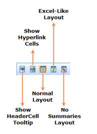

::: {style="DISPLAY: none"}
{#d2h_url_template}{#d2h_package_url style="WIDTH: 0px; DISPLAY: none; HEIGHT: 0px"}
:::

:::: {.d2h_secondary_topic style="PADDING-BOTTOM: 10pt; MARGIN: 0pt; PADDING-LEFT: 0pt; PADDING-RIGHT: 0pt; PADDING-TOP: 0pt"}
#### OLAP Grid Toolbar {#olap-grid-toolbar style="tab-stops: 0pt"}

{border="0"}

 

Figure 14: OLAP Grid Toolbar

 

Table 7:  Toolbar Options

 

::: {align="center"}
  Option                    Description
  ------------------------- -------------------------------------------------------------------------------
  Show HeaderCell Tooltip   Shows the tooltip on mouse hover in the header cell.
  Show Hyperlink Cells      The grid's hyperlink option is set accordingly on selection.
  Normal Layout             Provides the normal layout of grid by placing the total below.
  Excel-Like Layout         Provides the Excel like layout of grid by placing the grand total at the end.
  No Summaries Layout       No total would be displayed at the bottom of the grid.
:::

 

[]{#related-topics}
::::
