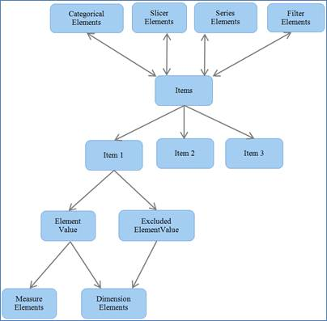

::: {style="DISPLAY: none"}
{#d2h_url_template}{#d2h_package_url style="WIDTH: 0px; DISPLAY: none; HEIGHT: 0px"}
:::

::::: {#nsbanner .d2h_main_nsbanner style="BORDER-BOTTOM: #999999 1px solid; POSITION: relative; PADDING-BOTTOM: 0px; BACKGROUND-COLOR: transparent; PADDING-LEFT: 0px; PADDING-RIGHT: 0px; DISPLAY: none; BORDER-TOP: #999999 1px solid; PADDING-TOP: 0px; LEFT: 0px"}
:::: {#TitleRow .d2h_main_titlerow style="PADDING-BOTTOM: 4px; BACKGROUND-COLOR: transparent; PADDING-LEFT: 22px; WIDTH: 100%; PADDING-RIGHT: 10px; DISPLAY: none; PADDING-TOP: 4px"}
::: {#ienav .d2h_main_ienav style="DISPLAY: none"}
{#D2HPrevious .D2HPreviousEnabled}  {#D2HNext .D2HNextEnabled}
:::
::::
:::::

:::: {#nstext .d2h_main_nstext style="PADDING-BOTTOM: 10px; BACKGROUND-COLOR: transparent; PADDING-LEFT: 22px; PADDING-RIGHT: 10px; HEIGHT: 100%; OVERFLOW: auto; PADDING-TOP: 5px" hasuserbackground="true" valign="bottom"}
::: {#d2h_breadcrumbs .d2h_breadcrumbs}
[Essential Studio User Guide Documentation](ms-xhelp:///?Id=12457748-09e3-4d74-a240-8e049cedf030){.d2h_breadcrumbsNormal}[ \> ]{.d2h_breadcrumbsLinkSeparator}[Business Intelligence Edition](ms-xhelp:///?Id=fdf33dd8-62b2-47b9-ad7b-fc50e590bca5){.d2h_breadcrumbsNormal}[ \> ]{.d2h_breadcrumbsLinkSeparator}[Essential BI Common](ms-xhelp:///?Id=51cb28d1-f201-4ea8-9963-a8afa451f64c){.d2h_breadcrumbsNormal}[ \> ]{.d2h_breadcrumbsLinkSeparator}[Concepts](ms-xhelp:///?Id=c4af561c-5904-4dc4-8eaf-ec1e14451e92){.d2h_breadcrumbsNormal}
:::

## OlapReport {#olapreport style="tab-stops: 0pt"}

**OlapReport** is an object that contains information about the cube element that has to be included for processing along its axis position and filter and sorting constraints. **OlapReport** has categorized the elements based on their characteristics as below:

[·      ]{style="FONT-FAMILY: Symbol"}Dimension Element

[o  ]{style="FONT-FAMILY: 'Courier New'"}Hierarchy Element

[o  ]{style="FONT-FAMILY: 'Courier New'"}Level Element

[o  ]{style="FONT-FAMILY: 'Courier New'"}Member Elements

[·      ]{style="FONT-FAMILY: Symbol"}Measure Element

[·      ]{style="FONT-FAMILY: Symbol"}KPI Element

[·      ]{style="FONT-FAMILY: Symbol"}NamedSet Element

[·      ]{style="FONT-FAMILY: Symbol"}Sort Element

[·      ]{style="FONT-FAMILY: Symbol"}Calculated Member

[·      ]{style="FONT-FAMILY: Symbol"}Subset Element

[·      ]{style="FONT-FAMILY: Symbol"}Summary Element

These elements are to get the cube element information from the user. You can create an instance of this element and add the required information about the element to pick that specific element from the data base for processing.

These elements come under the following four elements group, which are based on the axis position and filtering constraints.

[·      ]{style="FONT-FAMILY: Symbol"}Categorical Elements -- contains the elements that has to come under categorical axis

[·      ]{style="FONT-FAMILY: Symbol"}Series Elements -- contains elements that has to come under series axis

[·      ]{style="FONT-FAMILY: Symbol"}Slicer Elements -- contains elements that have to come under slicer elements.

[·      ]{style="FONT-FAMILY: Symbol"}Filter Elements -- contains elements that are subjected to filter.

All the elements are internally maintained as Item.

{border="0"}.

 

Figure 4: Architecture of Items

More:

[ ]{#related-topics}

[{border="0" align="absMiddle"}Properties and Methods](ms-xhelp:///?Id=ff64edc0-a2ff-47b8-9d42-3bcd867ed243){style="TEXT-DECORATION: none"}

[{border="0" align="absMiddle"}Dimension Element](ms-xhelp:///?Id=22c73736-7ec3-403a-b587-260be29465b4){style="TEXT-DECORATION: none"}

[{border="0" align="absMiddle"}Measure Element](ms-xhelp:///?Id=38ddc27c-e76a-47c6-a9a8-c73920b082b1){style="TEXT-DECORATION: none"}

[{border="0" align="absMiddle"}Key Performance Indicator (KPI) Element](ms-xhelp:///?Id=405451a1-8b47-41c8-96ba-7abe947a323f){style="TEXT-DECORATION: none"}

[{border="0" align="absMiddle"}NamedSet Element](ms-xhelp:///?Id=1a15ccf7-d241-47a4-bb20-13139c8b7b6a){style="TEXT-DECORATION: none"}

[{border="0" align="absMiddle"}Sort Element](ms-xhelp:///?Id=7d45808e-ab80-494b-a440-e3cafdd5d9c2){style="TEXT-DECORATION: none"}

[{border="0" align="absMiddle"}Calculated Member](ms-xhelp:///?Id=4f2ae716-5e72-4dac-8e82-3d7e65215ad2){style="TEXT-DECORATION: none"}

[{border="0" align="absMiddle"}Subset Element](ms-xhelp:///?Id=80188f84-ce64-423e-8eb7-e5e64bf8a505){style="TEXT-DECORATION: none"}

[{border="0" align="absMiddle"}Summary Elements](ms-xhelp:///?Id=562b7f78-163e-443e-b9a1-1368d57cf97a){style="TEXT-DECORATION: none"}

[{border="0" align="absMiddle"}Filtering slicer elements by range](ms-xhelp:///?Id=7ab099de-b0db-4586-8b53-bb3490f1c625){style="TEXT-DECORATION: none"}

[{border="0" align="absMiddle"}Creating the OlapReport](ms-xhelp:///?Id=7c6cc8da-f196-421b-b4ea-bfa6b3035490){style="TEXT-DECORATION: none"}

[{border="0" align="absMiddle"}Binding the OlapReport to OlapDataManager](ms-xhelp:///?Id=8b30f45b-688b-4466-913b-6cbc53caab21){style="TEXT-DECORATION: none"}

[{border="0" align="absMiddle"}Paging](ms-xhelp:///?Id=316f1e65-6ea4-4ecd-a13d-e44f92e2a4aa){style="TEXT-DECORATION: none"}

[{border="0" align="absMiddle"}Drill Position](ms-xhelp:///?Id=da28afc6-9583-4f76-b5c7-4f29d3061263){style="TEXT-DECORATION: none"}

[{border="0" align="absMiddle"}Drill Replace](ms-xhelp:///?Id=de753209-4899-4ba4-8f77-b081c9a636f0){style="TEXT-DECORATION: none"}
::::
