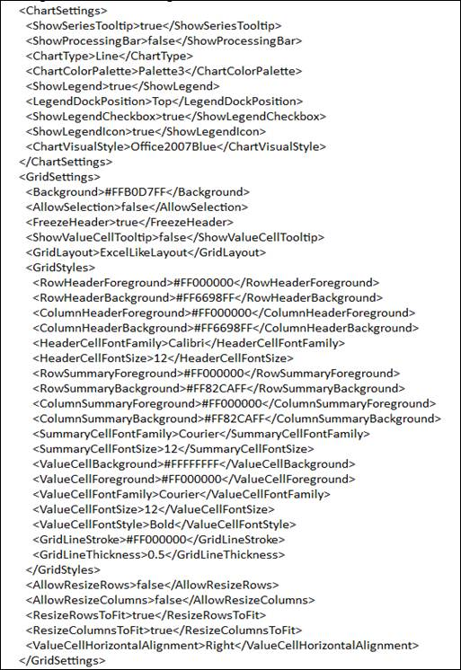

::: {style="DISPLAY: none"}
{#d2h_url_template}{#d2h_package_url style="WIDTH: 0px; DISPLAY: none; HEIGHT: 0px"}
:::

::::: {#nsbanner .d2h_main_nsbanner style="BORDER-BOTTOM: #999999 1px solid; POSITION: relative; PADDING-BOTTOM: 0px; BACKGROUND-COLOR: transparent; PADDING-LEFT: 0px; PADDING-RIGHT: 0px; DISPLAY: none; BORDER-TOP: #999999 1px solid; PADDING-TOP: 0px; LEFT: 0px"}
:::: {#TitleRow .d2h_main_titlerow style="PADDING-BOTTOM: 4px; BACKGROUND-COLOR: transparent; PADDING-LEFT: 22px; WIDTH: 100%; PADDING-RIGHT: 10px; DISPLAY: none; PADDING-TOP: 4px"}
::: {#ienav .d2h_main_ienav style="DISPLAY: none"}
{#D2HPrevious .D2HPreviousEnabled}  {#D2HNext .D2HNextEnabled}
:::
::::
:::::

::::: {#nstext .d2h_main_nstext style="PADDING-BOTTOM: 10px; BACKGROUND-COLOR: transparent; PADDING-LEFT: 22px; PADDING-RIGHT: 10px; HEIGHT: 100%; OVERFLOW: auto; PADDING-TOP: 5px" hasuserbackground="true" valign="bottom"}
::: {#d2h_breadcrumbs .d2h_breadcrumbs}
[Essential Studio User Guide Documentation](ms-xhelp:///?Id=12457748-09e3-4d74-a240-8e049cedf030){.d2h_breadcrumbsNormal}[ \> ]{.d2h_breadcrumbsLinkSeparator}[Business Intelligence Edition](ms-xhelp:///?Id=fdf33dd8-62b2-47b9-ad7b-fc50e590bca5){.d2h_breadcrumbsNormal}[ \> ]{.d2h_breadcrumbsLinkSeparator}[Essential BI Silverlight](ms-xhelp:///?Id=c006b39c-6aa2-4637-b7de-3e7b6cb3f9f9){.d2h_breadcrumbsNormal}[ \> ]{.d2h_breadcrumbsLinkSeparator}[Essential BI Client]{.d2h_breadcrumbsContentsOnly}[ \> ]{.d2h_breadcrumbsLinkSeparator}[Features](ms-xhelp:///?Id=4ae10797-e3a8-4270-b8ba-34441d2e1a3d){.d2h_breadcrumbsNormal}
:::

## OlapReport Serialization {#olapreport-serialization style="tab-stops: 0pt"}

This feature enables the user to save additional settings along the OLAP information in an OlapReport and load them whenever required.

The following are the appearance settings that a user can save and load during the runtime in an OlapChart and OlapGrid.

OlapChart:

[·      ]{style="FONT-FAMILY: Symbol"}Appearance

[·      ]{style="FONT-FAMILY: Symbol"}Legend position

[·      ]{style="FONT-FAMILY: Symbol"}Series color types

[·      ]{style="FONT-FAMILY: Symbol"}Skin for chart

OlapGrid:

[·      ]{style="FONT-FAMILY: Symbol"}Freeze headers

[·      ]{style="FONT-FAMILY: Symbol"}Show Tooltip

[·      ]{style="FONT-FAMILY: Symbol"}Header and Value cell settings

[·      ]{style="FONT-FAMILY: Symbol"}Appearance

 

Use Case Scenarios

The user can maintain the Chart and/or the Grid appearance settings with its OLAP data through an OlapReport.

The following image shows a serialized Chart and Grid appearance settings in an XML format:

{border="0"}

Figure 20 Serialized XML File

 

Properties

Table 4: Properties Table

::: {align="center"}
  ---------------- --------------------------------------------- ------ ------------------------ -----------------
  Property         Description                                   Type   Data Type                Reference links
   ChartSettings   Gets or  sets the chart appearance settings   CLR    ChartApperanceSettings   \-
  GridSettings     Gets or sets the Grid appearance settings     CLR    GridAppearanceSettings   \-
  ---------------- --------------------------------------------- ------ ------------------------ -----------------
:::

[]{style="COLOR: #c00000"} 

Sample Link

The user can find samples in the following locations:

*For OlapChart*

**SystemDrive\\Users\\\<user_name\>\\AppData\\Local\\Syncfusion\\EssentialStudio\\\<Version_number\>\\BI\\Silverlight\\OlapChart.SL\\Serialization**

*For OlapGrid*

**SystemDrive\\Users\\\<user_name\>\\AppData\\Local\\Syncfusion\\EssentialStudio\\\<Version_number\>\\BI\\Silverlight\\OlapGrid.SL\\Serialization**

More:

[ ]{#related-topics}

[{border="0" align="absMiddle"}Load and Save report](ms-xhelp:///?Id=4f8a638a-e09c-4d41-93dd-cd4dbd6dcf91){style="TEXT-DECORATION: none"}
:::::
