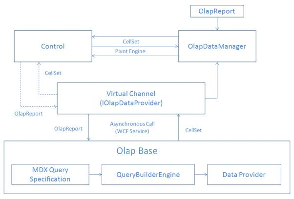

::: {style="DISPLAY: none"}
{#d2h_url_template}{#d2h_package_url style="WIDTH: 0px; DISPLAY: none; HEIGHT: 0px"}
:::

::::: {#nsbanner .d2h_main_nsbanner style="BORDER-BOTTOM: #999999 1px solid; POSITION: relative; PADDING-BOTTOM: 0px; BACKGROUND-COLOR: transparent; PADDING-LEFT: 0px; PADDING-RIGHT: 0px; DISPLAY: none; BORDER-TOP: #999999 1px solid; PADDING-TOP: 0px; LEFT: 0px"}
:::: {#TitleRow .d2h_main_titlerow style="PADDING-BOTTOM: 4px; BACKGROUND-COLOR: transparent; PADDING-LEFT: 22px; WIDTH: 100%; PADDING-RIGHT: 10px; DISPLAY: none; PADDING-TOP: 4px"}
::: {#ienav .d2h_main_ienav style="DISPLAY: none"}
{#D2HPrevious .D2HPreviousEnabled}  {#D2HNext .D2HNextEnabled}
:::
::::
:::::

::::: {#nstext .d2h_main_nstext style="PADDING-BOTTOM: 10px; BACKGROUND-COLOR: transparent; PADDING-LEFT: 22px; PADDING-RIGHT: 10px; HEIGHT: 100%; OVERFLOW: auto; PADDING-TOP: 5px" hasuserbackground="true" valign="bottom"}
::: {#d2h_breadcrumbs .d2h_breadcrumbs}
[Essential Studio User Guide Documentation](ms-xhelp:///?Id=12457748-09e3-4d74-a240-8e049cedf030){.d2h_breadcrumbsNormal}[ \> ]{.d2h_breadcrumbsLinkSeparator}[Business Intelligence Edition](ms-xhelp:///?Id=fdf33dd8-62b2-47b9-ad7b-fc50e590bca5){.d2h_breadcrumbsNormal}[ \> ]{.d2h_breadcrumbsLinkSeparator}[Essential BI Common](ms-xhelp:///?Id=51cb28d1-f201-4ea8-9963-a8afa451f64c){.d2h_breadcrumbsNormal}[ \> ]{.d2h_breadcrumbsLinkSeparator}[Syncfusion OLAP Architecture](ms-xhelp:///?Id=07d55e3d-ac73-4f5c-ae15-80ed9100d2ef){.d2h_breadcrumbsNormal}
:::

## OLAP Silverlight Base Wrapper {#olap-silverlight-base-wrapper style="tab-stops: 0pt"}

The OLAP Silverlight Base Wrapper is a class library, which contains several namespaces and classes. This library helps to perform data conversion between OLAP Silverlight Base and OLAP Base. Data Conversion process is used to achieve the following features:

1.   **Establishing the connection, retrieving data** by converting the OLAP Silverlight Base information to OLAP Base information.

2.   **Send retrieved data to OLAP Silverlight Base** by converting the OLAP Base data to OLAP Silverlight Base data.

 

 

{border="0"}

 

Figure 3: Dataflow in Silverlight

 

::: {style="BORDER-BOTTOM: windowtext 1pt solid; BORDER-LEFT: medium none; PADDING-BOTTOM: 1pt; MARGIN-TOP: 9pt; PADDING-LEFT: 0pt; PADDING-RIGHT: 0pt; MARGIN-BOTTOM: 9pt; BORDER-TOP: windowtext 1pt solid; BORDER-RIGHT: medium none; PADDING-TOP: 1pt"}
Note: This class library was organized under Syncfusion.OlapSilverlight.BaseWrapper assembly.
:::

More:

[ ]{#related-topics}

[{border="0" align="absMiddle"}WCF Service](ms-xhelp:///?Id=440d750b-b8e2-469c-914a-a568b09e5f2f){style="TEXT-DECORATION: none"}
:::::
