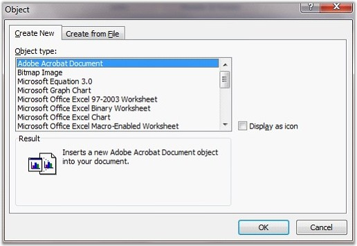

::: {style="DISPLAY: none"}
{#d2h_url_template}{#d2h_package_url style="WIDTH: 0px; DISPLAY: none; HEIGHT: 0px"}
:::

:::::::: {.d2h_secondary_topic style="PADDING-BOTTOM: 10pt; MARGIN: 0pt; PADDING-LEFT: 0pt; PADDING-RIGHT: 0pt; PADDING-TOP: 0pt"}
#### OLE Object {#ole-object style="tab-stops: 0pt"}

[]{#p64} 

OLE object is used to make the content that is created in one program available in another program. To know what types of content you can insert, click **Insert** tab and select **Object** in the **Text** group.

::: {style="BORDER-BOTTOM: windowtext 1pt solid; BORDER-LEFT: medium none; PADDING-BOTTOM: 1pt; MARGIN-TOP: 9pt; PADDING-LEFT: 0pt; PADDING-RIGHT: 0pt; MARGIN-BOTTOM: 9pt; BORDER-TOP: windowtext 1pt solid; BORDER-RIGHT: medium none; PADDING-TOP: 1pt"}
 

{border="0"}Note: Only installed programs that support OLE objects appear in the Object dialog box.
:::

 

Essential DocIO supports insertion and extraction of these OLE objects with small piece of code in both .doc and doc formats. **WOleObject** class is responsible for manipulating OLE objects.

[]{style="COLOR: black"} 

Class Hierarchy

 

ParagraphItem

                \|

            WOleObject

 

Object Types

 

Objects can be either linked to the program or embedded in the program. **Linked Objects** remain as separate files and any changes made to them will be reflected immediately. On the other hand, **Embedded Objects** will be stored in the document that they are inserted and hence changes will not be reflected in them.

 

If you copy information as an embedded object, the destination file requires more disk space than if you link the information. When the file is opened on another computer, the embedded object can be viewed without having access to the original data. **OleLinkType** property of **WOleObject** is used to set the object type as Embed or Link.

 

{border="0"}

Figure 70: Setting the OLE Object Type in the Object Dialog Box

 

**** 

Inserting Objects

 

DocIO provides various overloads for the **AppendOleObject** method to enable insertion of objects as bytes or streams by using a single line of code. The following overloads of the AppendOleObject can be used to insert an OLE object.

 

[·      ]{style="FONT-FAMILY: Symbol"}AppendOleObject(byte\[\] oleBytes, WPicture olePicture, OleObjectType type)

[·      ]{style="FONT-FAMILY: Symbol"}AppendOleObject(byte\[\] oleBytes, WPicture olePicture, string fileExtension)

[·      ]{style="FONT-FAMILY: Symbol"}AppendOleObject(Stream oleStream, WPicture olePicture, OleObjectType type)

[·      ]{style="FONT-FAMILY: Symbol"}AppendOleObject(Stream oleStream, WPicture olePicture, string fileExtension)

 

The following code examples illustrate insertion of an OLE object by using this method.

 

+------------------------------------------------------------------------------------------------------------------------------------------------+
| **[\[C#\]]{style="FONT-FAMILY: 'Courier New'; COLOR: black"}**                                                                                 |
|                                                                                                                                                |
|                                                                                                                                                |
|                                                                                                                                                |
| [paragraph.AppendOleObject(buffer, pic, [OleObjectType]{style="COLOR: #2b91af"}.AdobeAcrobatDocument);]{style="FONT-FAMILY: 'Courier New'"}    |
|                                                                                                                                                |
| [paragraph.AppendOleObject(buffer, pic, [\"pdf\"]{style="COLOR: #a31515"});]{style="FONT-FAMILY: 'Courier New'"}                               |
|                                                                                                                                                |
| [paragraph.AppendOleObject(stream, pic, [OleObjectType]{style="COLOR: #2b91af"}.Excel_97_2003_Worksheet);]{style="FONT-FAMILY: 'Courier New'"} |
|                                                                                                                                                |
| [paragraph.AppendOleObject(stream, pic, [\"pdf\"]{style="COLOR: #a31515"});]{style="FONT-FAMILY: 'Courier New'"}                               |
+------------------------------------------------------------------------------------------------------------------------------------------------+

 

+---------------------------------------------------------------------------------------------------------------------+
| **[\[VB\]]{style="FONT-FAMILY: 'Courier New'; COLOR: black"}**                                                      |
|                                                                                                                     |
| []{style="FONT-FAMILY: 'Courier New'; COLOR: blue"}                                                                 |
|                                                                                                                     |
| [paragraph.AppendOleObject(Buffer, pic, OleObjectType.AdobeAcrobatDocument)]{style="FONT-FAMILY: 'Courier New'"}    |
|                                                                                                                     |
| [paragraph.AppendOleObject(Buffer, pic, [\"pdf\"]{style="COLOR: #a31515"})]{style="FONT-FAMILY: 'Courier New'"}     |
|                                                                                                                     |
| [paragraph.AppendOleObject(stream, pic, OleObjectType.Excel_97_2003_Worksheet)]{style="FONT-FAMILY: 'Courier New'"} |
|                                                                                                                     |
| [paragraph.AppendOleObject(stream, pic, [\"pdf\"]{style="COLOR: #a31515"})]{style="FONT-FAMILY: 'Courier New'"}     |
+---------------------------------------------------------------------------------------------------------------------+

 

DocIO not only allows inserting objects through container, but also allows inserting objects from disk through file path by using the following overload:

 

[·      ]{style="FONT-FAMILY: Symbol"}AppendOleObject(string pathToFile, WPicture olePicture, OleObjectType oleObjectFileType)

 

DisplayAsIcon

Essential DocIO provides support for embedding OLE objects in a Word document to display them as icons or content using the **DisplayAsIcon** property.

[·      ]{style="FONT-FAMILY: Symbol"}If the **DisplayAsIcon** property is set to true, the OLE object in the Word document is displayed as an icon.

[·      ]{style="FONT-FAMILY: Symbol"}If the **DisplayAsIcon** property is set to false, the OLE object in the Word document is displayed as content. This enables the Word document to dynamically update images based on the content present within the OLE object.

::: {style="BORDER-BOTTOM: windowtext 1pt solid; BORDER-LEFT: medium none; PADDING-BOTTOM: 1pt; MARGIN-TOP: 9pt; PADDING-LEFT: 0pt; PADDING-RIGHT: 0pt; MARGIN-BOTTOM: 9pt; BORDER-TOP: windowtext 1pt solid; BORDER-RIGHT: medium none; PADDING-TOP: 1pt"}
{border="0"}Note: Initially DocIO generated documents display the icon (given image) in place of the embedded OLE object. By setting the DisplayAsIcon property to true, the icon will not be updated after opening or editing the OLE object using MS Word. However, setting the DisplayAsIcon property to false will enable the Word document to update the icons dynamically with the content after opening or editing the OLE object.
:::

 

Following are the API details of this feature:

 

Public Constructor

 

::: {align="center"}
  --------------------------------------- ------------------------------
  Name                                    Description
  WOleObject.WOleObject (IWordDocument)   Gets the type of the entity.
  --------------------------------------- ------------------------------
:::

 

Public Properties

 

::: {align="center"}
  ----------------- ----------------------------------------------------------------------------------------------
  Name              Description
  OleLinkType       Gets the OLE link type (Embed or Link).  
  OlePicture        Gets the OLE picture.
  EntityType        Gets the type of the entity.
  Container         Gets the OLE container.
  OleStorageName    Gets or sets the name of the OLE Object storage.
  LinkPath          Gets or sets the link path.
  LinkType          Gets the type of the OLE object.
  NativeData        Gets the native data of embedded OLE object.
  PackageFileName   Gets the name of file embedded in the package (only if OleType is \"Package\").
  ObjectType        Gets or sets the type of the OLE object.
  DisplayAsIcon     Gets or sets the value indicating whether the OLE object is displayed as an icon or content.
  ----------------- ----------------------------------------------------------------------------------------------
:::

 

The following code example illustrates how to insert an OLE object in disk to a Word document.

 

+------------------------------------------------------------------------------------------------------------------------------------------------------------------------------------------+
| **[\[C#\]]{style="FONT-FAMILY: 'Courier New'; COLOR: black"}**                                                                                                                           |
|                                                                                                                                                                                          |
|                                                                                                                                                                                          |
|                                                                                                                                                                                          |
| [WordDocument]{style="FONT-FAMILY: 'Courier New'; COLOR: #2b91af"}[ document = [new]{style="COLOR: blue"} [WordDocument]{style="COLOR: #2b91af"}();]{style="FONT-FAMILY: 'Courier New'"} |
|                                                                                                                                                                                          |
| [document.EnsureMinimal();]{style="FONT-FAMILY: 'Courier New'"}                                                                                                                          |
|                                                                                                                                                                                          |
| []{style="FONT-FAMILY: 'Courier New'"}                                                                                                                                                   |
|                                                                                                                                                                                          |
| [// Loads the OlePicture from the file.]{style="FONT-FAMILY: 'Courier New'; COLOR: green"}                                                                                               |
|                                                                                                                                                                                          |
| [WPicture]{style="FONT-FAMILY: 'Courier New'; COLOR: #2b91af"}[ pic = [new]{style="COLOR: blue"} [WPicture]{style="COLOR: #2b91af"}(document);]{style="FONT-FAMILY: 'Courier New'"}      |
|                                                                                                                                                                                          |
| [pic.LoadImage(Image.FromFile([@\"logo.jpg\"]{style="COLOR: #a31515"}));]{style="FONT-FAMILY: 'Courier New'"}                                                                            |
|                                                                                                                                                                                          |
| [pic.Width = 100f;]{style="FONT-FAMILY: 'Courier New'"}                                                                                                                                  |
|                                                                                                                                                                                          |
| [pic.Height = 100f;]{style="FONT-FAMILY: 'Courier New'"}                                                                                                                                 |
|                                                                                                                                                                                          |
| []{style="FONT-FAMILY: 'Courier New'"}                                                                                                                                                   |
|                                                                                                                                                                                          |
| [// Adding new OLE Object.]{style="FONT-FAMILY: 'Courier New'; COLOR: green"}                                                                                                            |
|                                                                                                                                                                                          |
| [document.LastParagraph.AppendOleObject([@\"Startup.wav\"]{style="COLOR: #a31515"}, pic, [OleObjectType]{style="COLOR: #2b91af"}.Package);]{style="FONT-FAMILY: 'Courier New'"}          |
+------------------------------------------------------------------------------------------------------------------------------------------------------------------------------------------+

                         

+------------------------------------------------------------------------------------------------------------------------------------------------------------------------------------------+
| **[\[VB.NET\]]{style="FONT-FAMILY: 'Courier New'; COLOR: black"}**                                                                                                                       |
|                                                                                                                                                                                          |
| []{style="COLOR: black"}                                                                                                                                                                 |
|                                                                                                                                                                                          |
| [Dim]{style="FONT-FAMILY: 'Courier New'; COLOR: blue"}[ document [As]{style="COLOR: blue"} WordDocument = [New]{style="COLOR: blue"} WordDocument()]{style="FONT-FAMILY: 'Courier New'"} |
|                                                                                                                                                                                          |
| [document.EnsureMinimal()]{style="FONT-FAMILY: 'Courier New'"}                                                                                                                           |
|                                                                                                                                                                                          |
| []{style="FONT-FAMILY: 'Courier New'"}                                                                                                                                                   |
|                                                                                                                                                                                          |
| [\' Loads the OlePicture from the file.]{style="FONT-FAMILY: 'Courier New'; COLOR: green"}                                                                                               |
|                                                                                                                                                                                          |
| [Dim]{style="FONT-FAMILY: 'Courier New'; COLOR: blue"}[ pic [As]{style="COLOR: blue"} WPicture = [New]{style="COLOR: blue"} WPicture(document)]{style="FONT-FAMILY: 'Courier New'"}      |
|                                                                                                                                                                                          |
| [pic.LoadImage(Image.FromFile(@[\"logo.jpg\"]{style="COLOR: #a31515"}))]{style="FONT-FAMILY: 'Courier New'"}                                                                             |
|                                                                                                                                                                                          |
| [pic.Width = 100.0F]{style="FONT-FAMILY: 'Courier New'"}                                                                                                                                 |
|                                                                                                                                                                                          |
| [pic.Height = 100.0F]{style="FONT-FAMILY: 'Courier New'"}                                                                                                                                |
|                                                                                                                                                                                          |
| []{style="FONT-FAMILY: 'Courier New'"}                                                                                                                                                   |
|                                                                                                                                                                                          |
| [\' Adding new OLE Object.]{style="FONT-FAMILY: 'Courier New'; COLOR: green"}                                                                                                            |
|                                                                                                                                                                                          |
| [document.LastParagraph.AppendOleObject(@[\"startup.wav\"]{style="COLOR: #a31515"}, pic, OleObjectType.Package)]{style="FONT-FAMILY: 'Courier New'"}                                     |
+------------------------------------------------------------------------------------------------------------------------------------------------------------------------------------------+

 

The following code example illustrates how to extract an OLE object from an existing document and insert it into a new document.

 

+----------------------------------------------------------------------------------------------------------------------------------------------------------------------------------------------------------------------------------------+
| **[\[C#\]]{style="FONT-FAMILY: 'Courier New'; COLOR: black"}**                                                                                                                                                                         |
|                                                                                                                                                                                                                                        |
|                                                                                                                                                                                                                                        |
|                                                                                                                                                                                                                                        |
| [WordDocument]{style="FONT-FAMILY: 'Courier New'; COLOR: #2b91af"}[ oleSource = [new]{style="COLOR: blue"} [WordDocument]{style="COLOR: #2b91af"}([\"OleTemplate.doc\"]{style="COLOR: #a31515"});]{style="FONT-FAMILY: 'Courier New'"} |
|                                                                                                                                                                                                                                        |
| [WordDocument]{style="FONT-FAMILY: 'Courier New'; COLOR: #2b91af"}[ dest = [new]{style="COLOR: blue"} [WordDocument]{style="COLOR: #2b91af"}();]{style="FONT-FAMILY: 'Courier New'"}                                                   |
|                                                                                                                                                                                                                                        |
| [dest.EnsureMinimal();]{style="FONT-FAMILY: 'Courier New'"}                                                                                                                                                                            |
|                                                                                                                                                                                                                                        |
| []{style="FONT-FAMILY: 'Courier New'"}                                                                                                                                                                                                 |
|                                                                                                                                                                                                                                        |
| [// Gets OLE object from source document.]{style="FONT-FAMILY: 'Courier New'; COLOR: green"}                                                                                                                                           |
|                                                                                                                                                                                                                                        |
| [WOleObject]{style="FONT-FAMILY: 'Courier New'; COLOR: #2b91af"}[ oleObject = oleSource.LastParagraph.Items\[0\] [as]{style="COLOR: blue"} [WOleObject]{style="COLOR: #2b91af"};]{style="FONT-FAMILY: 'Courier New'"}                  |
|                                                                                                                                                                                                                                        |
| [WPicture]{style="FONT-FAMILY: 'Courier New'; COLOR: #2b91af"}[ pic = oleObject.OlePicture.Clone() [as]{style="COLOR: blue"} [WPicture]{style="COLOR: #2b91af"};]{style="FONT-FAMILY: 'Courier New'"}                                  |
|                                                                                                                                                                                                                                        |
| []{style="FONT-FAMILY: 'Courier New'"}                                                                                                                                                                                                 |
|                                                                                                                                                                                                                                        |
| [// Inserts the OLE object into the destination document.]{style="FONT-FAMILY: 'Courier New'; COLOR: green"}                                                                                                                           |
|                                                                                                                                                                                                                                        |
| [dest.LastParagraph.AppendOleObject(oleObject.Container, pic, [OleLinkType]{style="COLOR: #2b91af"}.Embed);]{style="FONT-FAMILY: 'Courier New'"}                                                                                       |
+----------------------------------------------------------------------------------------------------------------------------------------------------------------------------------------------------------------------------------------+

 

+----------------------------------------------------------------------------------------------------------------------------------------------------------------------------------------------------------------------------------------+
| **[\[VB.NET\]]{style="FONT-FAMILY: 'Courier New'; COLOR: black"}**                                                                                                                                                                     |
|                                                                                                                                                                                                                                        |
| []{style="FONT-FAMILY: 'Courier New'; COLOR: black"}                                                                                                                                                                                   |
|                                                                                                                                                                                                                                        |
| [Dim]{style="FONT-FAMILY: 'Courier New'; COLOR: blue"}[ oleSource [As]{style="COLOR: blue"} WordDocument = [New]{style="COLOR: blue"} WordDocument([\"OleTemplate.doc\"]{style="COLOR: #a31515"})]{style="FONT-FAMILY: 'Courier New'"} |
|                                                                                                                                                                                                                                        |
| [Dim]{style="FONT-FAMILY: 'Courier New'; COLOR: blue"}[ dest [As]{style="COLOR: blue"} WordDocument = [New]{style="COLOR: blue"} WordDocument()]{style="FONT-FAMILY: 'Courier New'"}                                                   |
|                                                                                                                                                                                                                                        |
| [dest.EnsureMinimal()]{style="FONT-FAMILY: 'Courier New'"}                                                                                                                                                                             |
|                                                                                                                                                                                                                                        |
| []{style="FONT-FAMILY: 'Courier New'"}                                                                                                                                                                                                 |
|                                                                                                                                                                                                                                        |
| [\' Gets OLE object from source document.]{style="FONT-FAMILY: 'Courier New'; COLOR: green"}                                                                                                                                           |
|                                                                                                                                                                                                                                        |
| [Dim]{style="FONT-FAMILY: 'Courier New'; COLOR: blue"}[ oleObject [As]{style="COLOR: blue"} WOleObject = [TryCast]{style="COLOR: blue"}(oleSource.LastParagraph.Items(0), WOleObject)]{style="FONT-FAMILY: 'Courier New'"}             |
|                                                                                                                                                                                                                                        |
| [Dim]{style="FONT-FAMILY: 'Courier New'; COLOR: blue"}[ pic [As]{style="COLOR: blue"} WPicture = [TryCast]{style="COLOR: blue"}(oleObject.OlePicture.Clone(), WPicture)]{style="FONT-FAMILY: 'Courier New'"}                           |
|                                                                                                                                                                                                                                        |
| []{style="FONT-FAMILY: 'Courier New'"}                                                                                                                                                                                                 |
|                                                                                                                                                                                                                                        |
| [\' Inserts the OLE object into the destination document.]{style="FONT-FAMILY: 'Courier New'; COLOR: green"}                                                                                                                           |
|                                                                                                                                                                                                                                        |
| [dest.LastParagraph.AppendOleObject(oleObject.Container, pic, OleLinkType.Embed)]{style="FONT-FAMILY: 'Courier New'"}                                                                                                                  |
+----------------------------------------------------------------------------------------------------------------------------------------------------------------------------------------------------------------------------------------+

[]{#p65}[]{#_Styles_and_Formatting} 

::: {style="BORDER-BOTTOM: windowtext 1pt solid; BORDER-LEFT: medium none; PADDING-BOTTOM: 1pt; MARGIN-TOP: 9pt; PADDING-LEFT: 0pt; PADDING-RIGHT: 0pt; MARGIN-BOTTOM: 9pt; BORDER-TOP: windowtext 1pt solid; BORDER-RIGHT: medium none; PADDING-TOP: 1pt"}
{border="0"}Notes: Currently OLE Object support is not available in Silverlight application.
:::

 

[]{#related-topics}
::::::::
