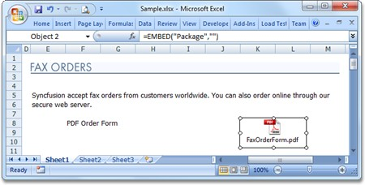
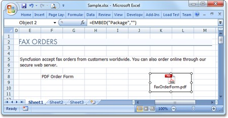
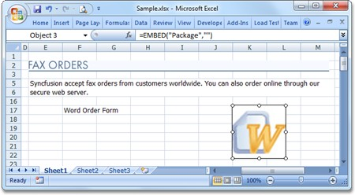
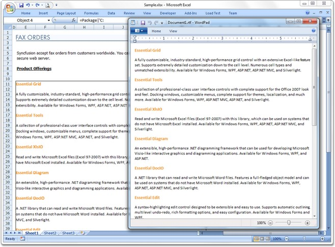
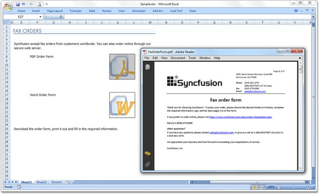

::: {style="DISPLAY: none"}
{#d2h_url_template}{#d2h_package_url style="WIDTH: 0px; DISPLAY: none; HEIGHT: 0px"}
:::

::::: {#nsbanner .d2h_main_nsbanner style="BORDER-BOTTOM: #999999 1px solid; POSITION: relative; PADDING-BOTTOM: 0px; BACKGROUND-COLOR: transparent; PADDING-LEFT: 0px; PADDING-RIGHT: 0px; DISPLAY: none; BORDER-TOP: #999999 1px solid; PADDING-TOP: 0px; LEFT: 0px"}
:::: {#TitleRow .d2h_main_titlerow style="PADDING-BOTTOM: 4px; BACKGROUND-COLOR: transparent; PADDING-LEFT: 22px; WIDTH: 100%; PADDING-RIGHT: 10px; DISPLAY: none; PADDING-TOP: 4px"}
::: {#ienav .d2h_main_ienav style="DISPLAY: none"}
{#D2HPrevious .D2HPreviousEnabled}  {#D2HNext .D2HNextEnabled}
:::
::::
:::::

:::::: {#nstext .d2h_main_nstext style="PADDING-BOTTOM: 10px; BACKGROUND-COLOR: transparent; PADDING-LEFT: 22px; PADDING-RIGHT: 10px; HEIGHT: 100%; OVERFLOW: auto; PADDING-TOP: 5px" hasuserbackground="true" valign="bottom"}
::: {#d2h_breadcrumbs .d2h_breadcrumbs}
[Essential Studio User Guide Documentation](ms-xhelp:///?Id=12457748-09e3-4d74-a240-8e049cedf030){.d2h_breadcrumbsNormal}[ \> ]{.d2h_breadcrumbsLinkSeparator}[Reporting Edition](ms-xhelp:///?Id=027aa5b6-6676-4f93-ad23-c20e8c45792e){.d2h_breadcrumbsNormal}[ \> ]{.d2h_breadcrumbsLinkSeparator}[Essential XlsIO](ms-xhelp:///?Id=b01a1b50-1d7d-40c0-bc83-af67e57c9005){.d2h_breadcrumbsNormal}[ \> ]{.d2h_breadcrumbsLinkSeparator}[Concepts and Features](ms-xhelp:///?Id=21b26556-5905-4ad9-90b4-40320db25faf){.d2h_breadcrumbsNormal}[ \> ]{.d2h_breadcrumbsLinkSeparator}[Insert](ms-xhelp:///?Id=3b5c8a38-7946-47f2-a4af-0711da3daaa8){.d2h_breadcrumbsNormal}
:::

### OLE Objects {#ole-objects style="tab-stops: 0pt"}

**[]{style="FONT-FAMILY: 'Segoe UI','sans-serif'; COLOR: black"}** 

Object Linking and Embedding (OLE) is one of the best known ways of inserting data into Microsoft Office documents. Though embedding or linking objects increase the size of the original document, they help improve the document readability by providing offline reading of documents (where the existing online links can be replaced). In order to read the content of the object, you may need the associated software to be installed in the machine. For example, a PDF file linked or embedded to an Excel file needs Adobe Reader in order to launch and read the PDF file.

[]{style="FONT-FAMILY: 'Trebuchet MS','sans-serif'; COLOR: #15428b; FONT-SIZE: 9pt"} 

Essential XlsIO supports read and write of OLE Objects in XLSX file format. Objects can either be linked or embedded in the Excel documents using **IOleObject** interface.

[]{style="FONT-FAMILY: 'Trebuchet MS','sans-serif'; COLOR: #15428b; FONT-SIZE: 9pt"} 

::: {style="BORDER-BOTTOM: windowtext 1pt solid; BORDER-LEFT: medium none; PADDING-BOTTOM: 1pt; MARGIN-TOP: 9pt; PADDING-LEFT: 0pt; PADDING-RIGHT: 0pt; MARGIN-BOTTOM: 9pt; BORDER-TOP: windowtext 1pt solid; BORDER-RIGHT: medium none; PADDING-TOP: 1pt"}
{border="0"}Note: Currently read and write functions for OLE Objects are supported in Windows, ASP.NET and WPF platforms only[.]{style="FONT-FAMILY: 'Calibri','sans-serif'"}
:::

 

This section lists the following topics:

 

List of Properties

 

The following table lists the properties available.

 

::: {align="center"}
  Name of the Property   Type     Value Accepted        Description
  ---------------------- -------- --------------------- -----------------------------------------------------------------------------------------------------------------
  DisplayAsIcon          Normal   Boolean               Gets or sets value indicating whether to display the OLE object as icon.
  Location               Normal   IRange                Gets or sets the location of the OLE object in the sheet.
  Picture                Normal   Image                 Gets or sets the picture to display to represent the OLE object.
  Shape                  Normal   IPictureShape         Gets or sets picture shape object that defines look and position of the OLE Object inside the parent worksheet.
  Size                   Normal   System.Drawing.Size   Gets of sets the size of the OLE object.
  OleObjectType          Normal   OleObjectType         Gets or sets the value indicating the type of OLE object.
:::

 

Displaying an Object as Icon

 

The following set of code snippet illustrates the condition when the property is set to True.

[]{style="FONT-FAMILY: 'Trebuchet MS','sans-serif'; COLOR: #15428b; FONT-SIZE: 9pt"} 

+---------------------------------------------------------------------------------------------------------------+
| **[\[C#\]]{style="FONT-FAMILY: 'Courier New'; FONT-SIZE: 9pt"}**                                              |
|                                                                                                               |
| **[]{style="FONT-FAMILY: 'Courier New'; FONT-SIZE: 9pt"}**                                                    |
|                                                                                                               |
| [oleObject1.DisplayAsIcon = [true]{style="COLOR: blue"};]{style="FONT-FAMILY: 'Courier New'; FONT-SIZE: 9pt"} |
+---------------------------------------------------------------------------------------------------------------+

[]{style="FONT-FAMILY: 'Trebuchet MS','sans-serif'; COLOR: #15428b; FONT-SIZE: 9pt"} 

+--------------------------------------------------------------------------------------------------------------+
| **[\[VB.NET\]]{style="FONT-FAMILY: 'Courier New'; FONT-SIZE: 9pt"}**                                         |
|                                                                                                              |
| **[]{style="FONT-FAMILY: 'Courier New'; FONT-SIZE: 9pt"}**                                                   |
|                                                                                                              |
| [oleObject1.DisplayAsIcon = [True]{style="COLOR: blue"}]{style="FONT-FAMILY: 'Courier New'; FONT-SIZE: 9pt"} |
+--------------------------------------------------------------------------------------------------------------+

 

Run the code. The following output is generated.

 

{border="0"}

Figure 100: Displayed as Icon[]{style="FONT-FAMILY: 'Trebuchet MS','sans-serif'; COLOR: #15428b"}

***[]{style="FONT-FAMILY: 'Trebuchet MS','sans-serif'; COLOR: #15428b; FONT-SIZE: 9pt"}*** 

Setting the Location of an Object

***[]{style="FONT-FAMILY: 'Trebuchet MS','sans-serif'; COLOR: #15428b; FONT-SIZE: 9pt"}*** 

The following set of code snippet illustrates the condition when the location is set to K column, 8th cell.

[]{style="FONT-FAMILY: 'Trebuchet MS','sans-serif'; COLOR: #15428b; FONT-SIZE: 9pt"} 

+--------------------------------------------------------------------------------------------+
| **[\[C#\]]{style="FONT-FAMILY: 'Courier New'; FONT-SIZE: 9pt"}**                           |
|                                                                                            |
| **[]{style="FONT-FAMILY: 'Courier New'; FONT-SIZE: 9pt"}**                                 |
|                                                                                            |
| [oleObject1.Location = sheet\["K8"\];]{style="FONT-FAMILY: 'Courier New'; FONT-SIZE: 9pt"} |
+--------------------------------------------------------------------------------------------+

[]{style="FONT-FAMILY: 'Trebuchet MS','sans-serif'; COLOR: #15428b; FONT-SIZE: 9pt"} 

+-----------------------------------------------------------------------------------------+
| **[\[VB.NET\]]{style="FONT-FAMILY: 'Courier New'; FONT-SIZE: 9pt"}**                    |
|                                                                                         |
| **[]{style="FONT-FAMILY: 'Courier New'; FONT-SIZE: 9pt"}**                              |
|                                                                                         |
| [oleObject1.Location = sheet("K8")]{style="FONT-FAMILY: 'Courier New'; FONT-SIZE: 9pt"} |
+-----------------------------------------------------------------------------------------+

[]{style="FONT-FAMILY: 'Trebuchet MS','sans-serif'; COLOR: #15428b; FONT-SIZE: 9pt"} 

Run the code. The following output is generated.

[]{style="FONT-FAMILY: 'Trebuchet MS','sans-serif'; COLOR: #15428b; FONT-SIZE: 9pt"} 

{border="0"}

Figure 101: Location[]{style="FONT-FAMILY: 'Trebuchet MS','sans-serif'; COLOR: #15428b"}

 

Setting an Image an Object

[]{style="FONT-FAMILY: 'Trebuchet MS','sans-serif'; COLOR: #15428b; FONT-SIZE: 9pt"} 

The following set of code snippet illustrates the condition when the property is set to any .png file image.

 

+-------------------------------------------------------------------------------------------------------------------------------------+
| **[\[C#\]]{style="FONT-FAMILY: 'Courier New'; FONT-SIZE: 9pt"}**                                                                    |
|                                                                                                                                     |
| **[]{style="FONT-FAMILY: 'Courier New'; FONT-SIZE: 9pt"}**                                                                          |
|                                                                                                                                     |
| [oleObject1.Picture = [Image]{style="COLOR: #2b91af"}.FromFile(@"image.png\");]{style="FONT-FAMILY: 'Courier New'; FONT-SIZE: 9pt"} |
+-------------------------------------------------------------------------------------------------------------------------------------+

[]{style="FONT-FAMILY: 'Trebuchet MS','sans-serif'; COLOR: #15428b; FONT-SIZE: 9pt"} 

+-----------------------------------------------------------------------------------------------------------------------------------------------------------------------------------------------------------------------------------------+
| **[\[VB.NET\]]{style="FONT-FAMILY: 'Courier New'; FONT-SIZE: 9pt"}**                                                                                                                                                                    |
|                                                                                                                                                                                                                                         |
| **[]{style="FONT-FAMILY: 'Courier New'; FONT-SIZE: 9pt"}**                                                                                                                                                                              |
|                                                                                                                                                                                                                                         |
| [oleObject1.Picture = [Image]{style="COLOR: #2b91af"}.FromFile("image.png\")]{style="FONT-FAMILY: 'Courier New'; FONT-SIZE: 9pt"}[.Picture = Image.FromFile("image.png\")]{style="FONT-FAMILY: 'Calibri','sans-serif'; FONT-SIZE: 9pt"} |
+-----------------------------------------------------------------------------------------------------------------------------------------------------------------------------------------------------------------------------------------+

 

Run the code. The following output is generated.

 

{border="0"}

Figure 102: Word Icon Image[]{style="FONT-FAMILY: 'Trebuchet MS','sans-serif'; COLOR: #15428b"}

***[]{style="FONT-FAMILY: 'Trebuchet MS','sans-serif'; COLOR: #15428b; FONT-SIZE: 9pt"}*** 

Setting Required Shape as an Object

***[]{style="FONT-FAMILY: 'Trebuchet MS','sans-serif'; COLOR: #15428b; FONT-SIZE: 9pt"}*** 

 

The following set of code snippet illustrates the condition when the property is set to any .png file image.

 

+-----------------------------------------------------------------------------------------------+
| **[\[C#\]]{style="FONT-FAMILY: 'Courier New'; FONT-SIZE: 9pt"}**                              |
|                                                                                               |
| **[]{style="FONT-FAMILY: 'Courier New'; FONT-SIZE: 9pt"}**                                    |
|                                                                                               |
| [oleObject1.Shape = sheet.Pictures\[0\];]{style="FONT-FAMILY: 'Courier New'; FONT-SIZE: 9pt"} |
+-----------------------------------------------------------------------------------------------+

[]{style="FONT-FAMILY: 'Trebuchet MS','sans-serif'; COLOR: #15428b; FONT-SIZE: 9pt"} 

+--------------------------------------------------------------------------------------------+
| **[\[VB.NET\]]{style="FONT-FAMILY: 'Courier New'; FONT-SIZE: 9pt"}**                       |
|                                                                                            |
| **[]{style="FONT-FAMILY: 'Courier New'; FONT-SIZE: 9pt"}**                                 |
|                                                                                            |
| [oleObject1.Shape = sheet.Pictures(0)]{style="FONT-FAMILY: 'Courier New'; FONT-SIZE: 9pt"} |
+--------------------------------------------------------------------------------------------+

 

Run the code. The following output is generated.

 

{border="0"}

Figure 103: Word Icon Shape

 

Setting the Size of the Object

 

The following set of code snippet illustrates the condition when the property is set to (30,30).

 

+--------------------------------------------------------------------------------------------------------------------------------------------+
| **[\[C#\]]{style="FONT-FAMILY: 'Courier New'; FONT-SIZE: 9pt"}**                                                                           |
|                                                                                                                                            |
| **[]{style="FONT-FAMILY: 'Courier New'; FONT-SIZE: 9pt"}**                                                                                 |
|                                                                                                                                            |
| [oleObject1.Size = [new]{style="COLOR: blue"}[ Size]{style="COLOR: #2b91af"}(30, 30);]{style="FONT-FAMILY: 'Courier New'; FONT-SIZE: 9pt"} |
+--------------------------------------------------------------------------------------------------------------------------------------------+

[]{style="FONT-FAMILY: 'Trebuchet MS','sans-serif'; COLOR: #15428b; FONT-SIZE: 9pt"} 

+-------------------------------------------------------------------------------------------------------------------------------------------+
| **[\[VB.NET\]]{style="FONT-FAMILY: 'Courier New'; FONT-SIZE: 9pt"}**                                                                      |
|                                                                                                                                           |
| **[]{style="FONT-FAMILY: 'Courier New'; FONT-SIZE: 9pt"}**                                                                                |
|                                                                                                                                           |
| [oleObject1.Size = [New]{style="COLOR: blue"}[ Size]{style="COLOR: #2b91af"}(30, 30)]{style="FONT-FAMILY: 'Courier New'; FONT-SIZE: 9pt"} |
+-------------------------------------------------------------------------------------------------------------------------------------------+

 

Run the code. The following output is generated.

 

{border="0"}

Figure 104: Size-Displayed Icon[]{style="FONT-FAMILY: 'Trebuchet MS','sans-serif'; COLOR: #15428b"}

***[]{style="FONT-FAMILY: 'Trebuchet MS','sans-serif'; COLOR: #15428b; FONT-SIZE: 9pt"}*** 

OLE Objects and Linking Types

 

XlsIO supports two types of association of objects:

[·      ]{style="FONT-FAMILY: Symbol"}Objects can be linked to the program

[·      ]{style="FONT-FAMILY: Symbol"}Objects can be embedded in the program

[]{style="FONT-FAMILY: 'Trebuchet MS','sans-serif'; COLOR: #15428b; FONT-SIZE: 9pt"} 

1\. Linked Objects

**[]{style="FONT-FAMILY: 'Trebuchet MS','sans-serif'; COLOR: #15428b; FONT-SIZE: 9pt"}** 

Linked objects remain as separate files. The linked object would expect the object to be in the same location as created, when the file is opened in another machine.

[]{style="FONT-FAMILY: 'Trebuchet MS','sans-serif'; COLOR: #15428b; FONT-SIZE: 9pt"} 

Linking an OLE Object to an Excel document

**[]{style="FONT-FAMILY: 'Trebuchet MS','sans-serif'; COLOR: #15428b; FONT-SIZE: 9pt"}** 

The following sample code illustrates how to linking an OLE Object to an Excel document.

[]{style="FONT-FAMILY: 'Trebuchet MS','sans-serif'; COLOR: #15428b; FONT-SIZE: 9pt"} 

+----------------------------------------------------------------------------------------------------------------------------------------------------------------------------------------------------------------------------------------------+
| **[\[C#\]]{style="FONT-FAMILY: 'Courier New'"}**                                                                                                                                                                                             |
|                                                                                                                                                                                                                                              |
| **[]{style="FONT-FAMILY: 'Courier New'"}**                                                                                                                                                                                                   |
|                                                                                                                                                                                                                                              |
| [Image]{style="FONT-FAMILY: 'Courier New'; COLOR: #2b91af"}[ image = [Image]{style="COLOR: #2b91af"}.FromFile([@\"..\\..\\image.png\"]{style="COLOR: #a31515"});]{style="FONT-FAMILY: 'Courier New'"}                                        |
|                                                                                                                                                                                                                                              |
| []{style="FONT-FAMILY: 'Courier New'; COLOR: green"}                                                                                                                                                                                         |
|                                                                                                                                                                                                                                              |
| [// Select the object to insert, image for the display icon and the type of the OLEObject field.]{style="FONT-FAMILY: 'Courier New'; COLOR: green"}                                                                                          |
|                                                                                                                                                                                                                                              |
| [IOleObject]{style="FONT-FAMILY: 'Courier New'; COLOR: #2b91af"}[ ole2 = sheet.OleObjects.Add([@\"..\\..\\Document.docx\"]{style="COLOR: #a31515"}, image, [OleLinkType]{style="COLOR: #2b91af"}.Link);]{style="FONT-FAMILY: 'Courier New'"} |
|                                                                                                                                                                                                                                              |
| []{style="FONT-FAMILY: 'Courier New'"}                                                                                                                                                                                                       |
|                                                                                                                                                                                                                                              |
| [// Set the location]{style="FONT-FAMILY: 'Courier New'; COLOR: green"}                                                                                                                                                                      |
|                                                                                                                                                                                                                                              |
| [ole2.Location = sheet\[5, 12\];]{style="FONT-FAMILY: 'Courier New'"}                                                                                                                                                                        |
|                                                                                                                                                                                                                                              |
| []{style="FONT-FAMILY: 'Courier New'"}                                                                                                                                                                                                       |
|                                                                                                                                                                                                                                              |
| [// Set the size]{style="FONT-FAMILY: 'Courier New'; COLOR: green"}                                                                                                                                                                          |
|                                                                                                                                                                                                                                              |
| [ole2.Size = [new]{style="COLOR: blue"} [Size]{style="COLOR: #2b91af"}(30, 30);]{style="FONT-FAMILY: 'Courier New'"}                                                                                                                         |
+----------------------------------------------------------------------------------------------------------------------------------------------------------------------------------------------------------------------------------------------+

[]{style="FONT-FAMILY: 'Trebuchet MS','sans-serif'; COLOR: #15428b; FONT-SIZE: 9pt"} 

+-----------------------------------------------------------------------------------------------------------------------------------------------------------------------------------------------------------------------------------------------------------------------+
| **[\[VB.NET\]]{style="FONT-FAMILY: 'Courier New'"}**                                                                                                                                                                                                                  |
|                                                                                                                                                                                                                                                                       |
| **[]{style="FONT-FAMILY: 'Courier New'"}**                                                                                                                                                                                                                            |
|                                                                                                                                                                                                                                                                       |
| [Dim]{style="FONT-FAMILY: 'Courier New'; COLOR: blue"}[ image [As]{style="COLOR: blue"} Image = [Image]{style="COLOR: #2b91af"}.FromFile([\"..\\..\\image.png\"]{style="COLOR: darkred"})]{style="FONT-FAMILY: 'Courier New'"}                                        |
|                                                                                                                                                                                                                                                                       |
| []{style="FONT-FAMILY: 'Courier New'"}                                                                                                                                                                                                                                |
|                                                                                                                                                                                                                                                                       |
| [\' Select the object to insert, image for the display icon and the type of the OLEObject field.]{style="FONT-FAMILY: 'Courier New'; COLOR: green"}                                                                                                                   |
|                                                                                                                                                                                                                                                                       |
| [Dim]{style="FONT-FAMILY: 'Courier New'; COLOR: blue"}[ ole2 [As]{style="COLOR: blue"} IOleObject = sheet.OleObjects.Add([\"..\\..\\Document.docx\"]{style="COLOR: darkred"}, image, [OleLinkType]{style="COLOR: #2b91af"}.Link)]{style="FONT-FAMILY: 'Courier New'"} |
|                                                                                                                                                                                                                                                                       |
| []{style="FONT-FAMILY: 'Courier New'"}                                                                                                                                                                                                                                |
|                                                                                                                                                                                                                                                                       |
| [\' Set the location]{style="FONT-FAMILY: 'Courier New'; COLOR: green"}                                                                                                                                                                                               |
|                                                                                                                                                                                                                                                                       |
| [ole2.Location = sheet(5, 12)]{style="FONT-FAMILY: 'Courier New'"}                                                                                                                                                                                                    |
|                                                                                                                                                                                                                                                                       |
| []{style="FONT-FAMILY: 'Courier New'"}                                                                                                                                                                                                                                |
|                                                                                                                                                                                                                                                                       |
| [\' Set the size]{style="FONT-FAMILY: 'Courier New'; COLOR: green"}                                                                                                                                                                                                   |
|                                                                                                                                                                                                                                                                       |
| [ole2.Size = [New]{style="COLOR: blue"} Size(30, 30)]{style="FONT-FAMILY: 'Courier New'"}                                                                                                                                                                             |
+-----------------------------------------------------------------------------------------------------------------------------------------------------------------------------------------------------------------------------------------------------------------------+

[]{style="FONT-FAMILY: 'Trebuchet MS','sans-serif'; COLOR: #15428b; FONT-SIZE: 9pt"} 

Run the code. The following output is generated.

[]{style="FONT-FAMILY: 'Trebuchet MS','sans-serif'; COLOR: #15428b; FONT-SIZE: 9pt"} 

{border="0"}

Figure 105: Linked Object[]{style="FONT-FAMILY: 'Trebuchet MS','sans-serif'; COLOR: #15428b"}

[]{style="FONT-FAMILY: 'Trebuchet MS','sans-serif'; COLOR: #15428b; FONT-SIZE: 9pt"} 

1\. Embedded Objects 

**[]{style="FONT-FAMILY: 'Trebuchet MS','sans-serif'; COLOR: #15428b; FONT-SIZE: 9pt"}** 

Embedded objects are stored in the document. When the file is opened in another machine, the embedded object can be viewed without having access to the original data.

 

Embedding an OLE Object in an Excel document

 

The following sample code illustrates how to embed an OLE Object to an Excel document.

 

+-------------------------------------------------------------------------------------------------------------------------------------------------------------------------------------------------------------------------------------------+
| **[\[C#\]]{style="FONT-FAMILY: 'Courier New'"}**                                                                                                                                                                                          |
|                                                                                                                                                                                                                                           |
| **[]{style="FONT-FAMILY: 'Courier New'"}**                                                                                                                                                                                                |
|                                                                                                                                                                                                                                           |
| [Image]{style="FONT-FAMILY: 'Courier New'; COLOR: #2b91af"}[ image = [Image]{style="COLOR: #2b91af"}.FromFile([@\"..\\..\\image.png\"]{style="COLOR: #a31515"});]{style="FONT-FAMILY: 'Courier New'"}                                     |
|                                                                                                                                                                                                                                           |
| []{style="FONT-FAMILY: 'Courier New'; COLOR: green"}                                                                                                                                                                                      |
|                                                                                                                                                                                                                                           |
| [// Select the object to insert, image for the display icon and the type of the OLEObject field.]{style="FONT-FAMILY: 'Courier New'; COLOR: green"}                                                                                       |
|                                                                                                                                                                                                                                           |
| [IOleObject]{style="FONT-FAMILY: 'Courier New'; COLOR: #2b91af"}[ ole1 = sheet.OleObjects.Add([@\"..\\..\\Test.pptx\"]{style="COLOR: #a31515"}, image, [OleLinkType]{style="COLOR: #2b91af"}.Embed);]{style="FONT-FAMILY: 'Courier New'"} |
|                                                                                                                                                                                                                                           |
| []{style="FONT-FAMILY: 'Courier New'"}                                                                                                                                                                                                    |
|                                                                                                                                                                                                                                           |
| [// Set the location]{style="FONT-FAMILY: 'Courier New'; COLOR: green"}                                                                                                                                                                   |
|                                                                                                                                                                                                                                           |
| [ole1.Location = sheet\[5, 2\];]{style="FONT-FAMILY: 'Courier New'"}                                                                                                                                                                      |
|                                                                                                                                                                                                                                           |
| []{style="FONT-FAMILY: 'Courier New'"}                                                                                                                                                                                                    |
|                                                                                                                                                                                                                                           |
| [// Set the size]{style="FONT-FAMILY: 'Courier New'; COLOR: green"}                                                                                                                                                                       |
|                                                                                                                                                                                                                                           |
| [ole1.Size = [new]{style="COLOR: blue"} [Size]{style="COLOR: #2b91af"}(30, 30);]{style="FONT-FAMILY: 'Courier New'"}                                                                                                                      |
+-------------------------------------------------------------------------------------------------------------------------------------------------------------------------------------------------------------------------------------------+

[]{style="FONT-FAMILY: 'Trebuchet MS','sans-serif'; COLOR: #15428b; FONT-SIZE: 9pt"} 

+--------------------------------------------------------------------------------------------------------------------------------------------------------------------------------------------------------------------------------------------------------------------+
| **[\[VB.NET\]]{style="FONT-FAMILY: 'Courier New'"}**                                                                                                                                                                                                               |
|                                                                                                                                                                                                                                                                    |
| **[]{style="FONT-FAMILY: 'Courier New'"}**                                                                                                                                                                                                                         |
|                                                                                                                                                                                                                                                                    |
| [Dim]{style="FONT-FAMILY: 'Courier New'; COLOR: blue"}[ image [As]{style="COLOR: blue"} Image = [Image]{style="COLOR: #2b91af"}.FromFile([\"..\\..\\image.png\"]{style="COLOR: darkred"})]{style="FONT-FAMILY: 'Courier New'"}                                     |
|                                                                                                                                                                                                                                                                    |
| []{style="FONT-FAMILY: 'Courier New'"}                                                                                                                                                                                                                             |
|                                                                                                                                                                                                                                                                    |
| [\' Select the object to insert, image for the display icon and the type of the OLEObject field.]{style="FONT-FAMILY: 'Courier New'; COLOR: green"}                                                                                                                |
|                                                                                                                                                                                                                                                                    |
| [Dim]{style="FONT-FAMILY: 'Courier New'; COLOR: blue"}[ ole1 [As]{style="COLOR: blue"} IOleObject = sheet.OleObjects.Add([\"..\\..\\Test.pptx\"]{style="COLOR: darkred"}, image, [OleLinkType]{style="COLOR: #2b91af"}.Embed)]{style="FONT-FAMILY: 'Courier New'"} |
|                                                                                                                                                                                                                                                                    |
| []{style="FONT-FAMILY: 'Courier New'"}                                                                                                                                                                                                                             |
|                                                                                                                                                                                                                                                                    |
| [\' Set the location]{style="FONT-FAMILY: 'Courier New'; COLOR: green"}                                                                                                                                                                                            |
|                                                                                                                                                                                                                                                                    |
| [ole1.Location = sheet(5, 2)]{style="FONT-FAMILY: 'Courier New'"}                                                                                                                                                                                                  |
|                                                                                                                                                                                                                                                                    |
| []{style="FONT-FAMILY: 'Courier New'"}                                                                                                                                                                                                                             |
|                                                                                                                                                                                                                                                                    |
| [\' Set the size]{style="FONT-FAMILY: 'Courier New'; COLOR: green"}                                                                                                                                                                                                |
|                                                                                                                                                                                                                                                                    |
| [ole1.Size = [New]{style="COLOR: blue"} Size(30, 30)]{style="FONT-FAMILY: 'Courier New'"}                                                                                                                                                                          |
+--------------------------------------------------------------------------------------------------------------------------------------------------------------------------------------------------------------------------------------------------------------------+

 

Run the code. The following output is generated.

 

{border="0"}

Figure 106: Embedded Object[]{style="FONT-FAMILY: 'Trebuchet MS','sans-serif'; COLOR: #15428b"}

[]{style="FONT-FAMILY: 'Trebuchet MS','sans-serif'; COLOR: #15428b; FONT-SIZE: 9pt"} 

Setting the Type of the OLE Object

The following code snippets illustrate the condition when the property is set to AdobeAcrobatDocument.

 

+-------------------------------------------------------------------------------------------------------------------------------------------------------------------------------------------------------------------------------------------------------------------------------+
| **[\[C#\]]{style="FONT-FAMILY: 'Courier New'; FONT-SIZE: 9pt"}**                                                                                                                                                                                                              |
|                                                                                                                                                                                                                                                                               |
| [ole]{style="FONT-FAMILY: 'Courier New'; BACKGROUND: #0a246a; COLOR: white; FONT-SIZE: 9pt"}[Object1.]{style="FONT-FAMILY: 'Courier New'; FONT-SIZE: 9pt"}[OleObjectType = [OleObjectType]{style="COLOR: #2b91af"}.AdobeAcrobatDocument;]{style="FONT-FAMILY: 'Courier New'"} |
+-------------------------------------------------------------------------------------------------------------------------------------------------------------------------------------------------------------------------------------------------------------------------------+

 

+-------------------------------------------------------------------------------------------------------------------------------------------------------------------------------------------------------------------------------------------------------------------------------+
| **[\[VB.NET\]]{style="FONT-FAMILY: 'Courier New'; FONT-SIZE: 9pt"}**                                                                                                                                                                                                          |
|                                                                                                                                                                                                                                                                               |
| [ole]{style="FONT-FAMILY: 'Courier New'; BACKGROUND: #0a246a; COLOR: white; FONT-SIZE: 9pt"}[Object1.]{style="FONT-FAMILY: 'Courier New'; FONT-SIZE: 9pt"}[ OleObjectType = [OleObjectType]{style="COLOR: #2b91af"}.AdobeAcrobatDocument]{style="FONT-FAMILY: 'Courier New'"} |
+-------------------------------------------------------------------------------------------------------------------------------------------------------------------------------------------------------------------------------------------------------------------------------+

[]{style="FONT-FAMILY: 'Trebuchet MS','sans-serif'; COLOR: #15428b; FONT-SIZE: 9pt"} 

[]{#related-topics}
::::::
