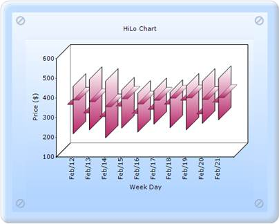
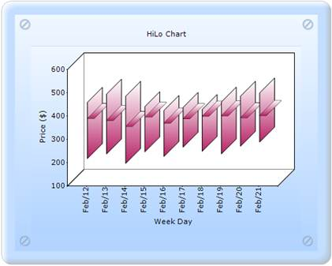
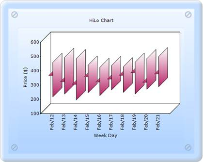

::: {style="DISPLAY: none"}
{#d2h_url_template}{#d2h_package_url style="WIDTH: 0px; DISPLAY: none; HEIGHT: 0px"}
:::

:::: {.d2h_secondary_topic style="PADDING-BOTTOM: 10pt; MARGIN: 0pt; PADDING-LEFT: 0pt; PADDING-RIGHT: 0pt; PADDING-TOP: 0pt"}
#### OpenCloseDrawMode {#openclosedrawmode style="tab-stops: 0pt"}

It is used to set the OpenCloseDraw mode for the HiLoOpenClose chart.

 

::: {align="center"}
+-------------------------------------+---------------------------------------------------------------------------+
| Details                                                                                                         |
+-------------------------------------+---------------------------------------------------------------------------+
| Possible values                     | **Open** - Points out the opening value of that period.                   |
|                                     |                                                                           |
|                                     | **Close** - Points out the closing value of that period.                  |
|                                     |                                                                           |
|                                     | **Both** - Points out both the opening and closing values of that period. |
+-------------------------------------+---------------------------------------------------------------------------+
| Default value                       | Both                                                                      |
+-------------------------------------+---------------------------------------------------------------------------+
| 2D/3D limitations                   | No                                                                        |
+-------------------------------------+---------------------------------------------------------------------------+
| Application to chart element        | Any series points.                                                        |
+-------------------------------------+---------------------------------------------------------------------------+
| Application to chart types          | HiLoOpenClose chart                                                       |
+-------------------------------------+---------------------------------------------------------------------------+
:::

[]{style="FONT-FAMILY: 'Calibri','sans-serif'"} 

{border="0"}

Figure 246: HiLoOpenClose chart with OpenCloseDrawMode as Both

{border="0"}

Figure 247: HiLoOpenClose chart with OpenCloseDrawMode as Close

[]{style="FONT-FAMILY: 'Calibri','sans-serif'"} 

{border="0"}

Figure 248: HiLoOpenClose chart with OpenCloseDrawMode as Open

[]{style="FONT-FAMILY: 'Calibri','sans-serif'"} 

HiLoOpenClose chart with OpenCloseDrawMode can be created through two ways:

[·      ]{style="FONT-FAMILY: Symbol"}Builder

[·      ]{style="FONT-FAMILY: Symbol"}ChartModel

More:

[ ]{#related-topics}

[{border="0" align="absMiddle"}Builder](ms-xhelp:///?Id=96b90c84-03f3-45d0-824c-137bfd453152){style="TEXT-DECORATION: none"}

[{border="0" align="absMiddle"}ChartModel](ms-xhelp:///?Id=1f704861-7f36-4d3b-bbab-dfbafa22224e){style="TEXT-DECORATION: none"}
::::
