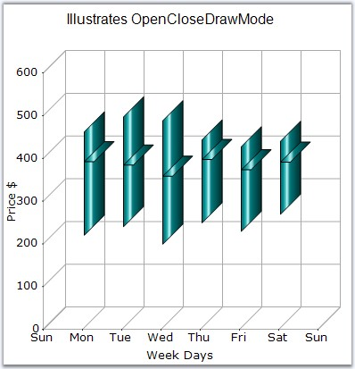

::: {style="DISPLAY: none"}
{#d2h_url_template}{#d2h_package_url style="WIDTH: 0px; DISPLAY: none; HEIGHT: 0px"}
:::

:::: {.d2h_secondary_topic style="PADDING-BOTTOM: 10pt; MARGIN: 0pt; PADDING-LEFT: 0pt; PADDING-RIGHT: 0pt; PADDING-TOP: 0pt"}
#### OpenCloseDrawMode {#openclosedrawmode style="tab-stops: 0pt"}

 

Gets or sets the open, close draw mode to the HiloOpenClose chart.

 

::: {align="center"}
+-------------------------------------+------------------------------------------------------------------------------------------------------------------+
|                                                                                                                                                        |
|                                                                                                                                                        |
| Details                                                                                                                                                |
+-------------------------------------+------------------------------------------------------------------------------------------------------------------+
| **Possible Values**                 | [·      ]{style="FONT-FAMILY: Symbol"}Open - Points only the opening value of that period.                       |
|                                     |                                                                                                                  |
|                                     | [·      ]{style="FONT-FAMILY: Symbol"}Close - Points out the closing value of that period.                       |
|                                     |                                                                                                                  |
|                                     | [·      ]{style="FONT-FAMILY: Symbol"}Both - Points out both the opening and the closing values  of that period. |
+-------------------------------------+------------------------------------------------------------------------------------------------------------------+
| **Default Value    **               | **Both**                                                                                                         |
+-------------------------------------+------------------------------------------------------------------------------------------------------------------+
| **2D / 3D Limitations**             | No                                                                                                               |
+-------------------------------------+------------------------------------------------------------------------------------------------------------------+
| **Applies to Chart Element**        | Any Series points                                                                                                |
+-------------------------------------+------------------------------------------------------------------------------------------------------------------+
| **Applies to Chart Types**          | HiLoOpenClose Chart                                                                                              |
+-------------------------------------+------------------------------------------------------------------------------------------------------------------+
:::

 

Here is the code snippet using OpenCloseDrawMode.

 

+----------------------------------------------------------------------------------------------------------------------------------------------------------------------------------------------------------------------------------------------------------------------+
| **[\[C#\]]{style="FONT-FAMILY: 'Courier New'; COLOR: black"}**                                                                                                                                                                                                       |
|                                                                                                                                                                                                                                                                      |
| **[]{style="FONT-FAMILY: 'Courier New'; COLOR: black"}**                                                                                                                                                                                                             |
|                                                                                                                                                                                                                                                                      |
| [ChartSeries]{style="FONT-FAMILY: 'Courier New'; COLOR: teal"}[ CS1 = [this]{style="COLOR: blue"}.chartControl1.Model.NewSeries([\"Series Name\"]{style="COLOR: maroon"},[ChartSeriesType]{style="COLOR: teal"}.HiLoOpenClose);]{style="FONT-FAMILY: 'Courier New'"} |
|                                                                                                                                                                                                                                                                      |
| [CS1.Points.Add(date,456,214,364,386);]{style="FONT-FAMILY: 'Courier New'"}                                                                                                                                                                                          |
|                                                                                                                                                                                                                                                                      |
| [CS1.Points.Add(date.AddDays(1),491, 234, 321, 378 );]{style="FONT-FAMILY: 'Courier New'"}                                                                                                                                                                           |
|                                                                                                                                                                                                                                                                      |
| [CS1.Points.Add(date.AddDays(2),482,193,302,352);]{style="FONT-FAMILY: 'Courier New'"}                                                                                                                                                                               |
|                                                                                                                                                                                                                                                                      |
| [CS1.Points.Add(date.AddDays(3),437,243,354,391);]{style="FONT-FAMILY: 'Courier New'"}                                                                                                                                                                               |
|                                                                                                                                                                                                                                                                      |
| [CS1.Points.Add(date.AddDays(4),421,223,317,367);]{style="FONT-FAMILY: 'Courier New'"}                                                                                                                                                                               |
|                                                                                                                                                                                                                                                                      |
| [CS1.Points.Add(date.AddDays(5),434,263,339,385);]{style="FONT-FAMILY: 'Courier New'"}                                                                                                                                                                               |
|                                                                                                                                                                                                                                                                      |
| [this]{style="FONT-FAMILY: 'Courier New'; COLOR: blue"}[.chartControl1.Series.Add(CS1);]{style="FONT-FAMILY: 'Courier New'"}                                                                                                                                         |
|                                                                                                                                                                                                                                                                      |
| [this]{style="FONT-FAMILY: 'Courier New'; COLOR: blue"}[.chartControl1.Series\[0\].OpenCloseDrawMode = [ChartOpenCloseDrawMode.]{style="COLOR: teal"}[Open]{style="COLOR: black"};  ]{style="FONT-FAMILY: 'Courier New'"}                                            |
+----------------------------------------------------------------------------------------------------------------------------------------------------------------------------------------------------------------------------------------------------------------------+

 

+-----------------------------------------------------------------------------------------------------------------------------------------------------------------------------------------------------------------------------------------------------------------------------------------------------------------------------------------------------------------------------------------------------------------------------------------------------------------------------------------------------------------------------------------------------------------------------------------------------------------------------------------------+
| **[\[VB.NET\]]{style="FONT-FAMILY: 'Courier New'; COLOR: black"}**                                                                                                                                                                                                                                                                                                                                                                                                                                                                                                                                                                            |
|                                                                                                                                                                                                                                                                                                                                                                                                                                                                                                                                                                                                                                               |
| **[]{style="FONT-FAMILY: 'Courier New'; COLOR: black"}**                                                                                                                                                                                                                                                                                                                                                                                                                                                                                                                                                                                      |
|                                                                                                                                                                                                                                                                                                                                                                                                                                                                                                                                                                                                                                               |
| [Dim]{style="FONT-FAMILY: 'Courier New'; COLOR: blue"}[ CS1 ]{style="FONT-FAMILY: 'Courier New'; COLOR: black"}[As]{style="FONT-FAMILY: 'Courier New'; COLOR: blue"}[ ChartSeries = ]{style="FONT-FAMILY: 'Courier New'; COLOR: black"}[Me]{style="FONT-FAMILY: 'Courier New'; COLOR: blue"}[.chartControl1.Model.NewSeries(\"]{style="FONT-FAMILY: 'Courier New'; COLOR: black"}[Series Name]{style="FONT-FAMILY: 'Courier New'; COLOR: maroon"}[\",]{style="FONT-FAMILY: 'Courier New'; COLOR: black"}[ChartSeriesType]{style="FONT-FAMILY: 'Courier New'; COLOR: teal"}[.HiLoOpenClose)]{style="FONT-FAMILY: 'Courier New'; COLOR: black"} |
|                                                                                                                                                                                                                                                                                                                                                                                                                                                                                                                                                                                                                                               |
| [CS1.Points.Add(date,456,214,364,386)]{style="FONT-FAMILY: 'Courier New'"}                                                                                                                                                                                                                                                                                                                                                                                                                                                                                                                                                                    |
|                                                                                                                                                                                                                                                                                                                                                                                                                                                                                                                                                                                                                                               |
| [CS1.Points.Add(date.AddDays(1),491, 234, 321, 378 )]{style="FONT-FAMILY: 'Courier New'"}                                                                                                                                                                                                                                                                                                                                                                                                                                                                                                                                                     |
|                                                                                                                                                                                                                                                                                                                                                                                                                                                                                                                                                                                                                                               |
| [CS1.Points.Add(date.AddDays(2),482,193,302,352)]{style="FONT-FAMILY: 'Courier New'"}                                                                                                                                                                                                                                                                                                                                                                                                                                                                                                                                                         |
|                                                                                                                                                                                                                                                                                                                                                                                                                                                                                                                                                                                                                                               |
| [CS1.Points.Add(date.AddDays(3),437,243,354,391)]{style="FONT-FAMILY: 'Courier New'"}                                                                                                                                                                                                                                                                                                                                                                                                                                                                                                                                                         |
|                                                                                                                                                                                                                                                                                                                                                                                                                                                                                                                                                                                                                                               |
| [CS1.Points.Add(date.AddDays(4),421,223,317,367)]{style="FONT-FAMILY: 'Courier New'"}                                                                                                                                                                                                                                                                                                                                                                                                                                                                                                                                                         |
|                                                                                                                                                                                                                                                                                                                                                                                                                                                                                                                                                                                                                                               |
| [CS1.Points.Add(date.AddDays(5),434,263,339,385)]{style="FONT-FAMILY: 'Courier New'"}                                                                                                                                                                                                                                                                                                                                                                                                                                                                                                                                                         |
|                                                                                                                                                                                                                                                                                                                                                                                                                                                                                                                                                                                                                                               |
| [Me]{style="FONT-FAMILY: 'Courier New'; COLOR: blue"}[.chartControl1.Series.Add(CS1)]{style="FONT-FAMILY: 'Courier New'; COLOR: black"}                                                                                                                                                                                                                                                                                                                                                                                                                                                                                                       |
|                                                                                                                                                                                                                                                                                                                                                                                                                                                                                                                                                                                                                                               |
| [Me]{style="FONT-FAMILY: 'Courier New'; COLOR: blue"}[.chartControl1.Series(0).OpenCloseDrawMode = ]{style="FONT-FAMILY: 'Courier New'; COLOR: black"}[ChartOpenCloseDrawMode.]{style="FONT-FAMILY: 'Courier New'; COLOR: teal"}[Open]{style="FONT-FAMILY: 'Courier New'; COLOR: black"}                                                                                                                                                                                                                                                                                                                                                      |
+-----------------------------------------------------------------------------------------------------------------------------------------------------------------------------------------------------------------------------------------------------------------------------------------------------------------------------------------------------------------------------------------------------------------------------------------------------------------------------------------------------------------------------------------------------------------------------------------------------------------------------------------------+

 

{border="0"}

 

Figure 164: Chart with \"Open\" Mode

 

{border="0"}

 

Figure 165: Chart with \"Close\" Mode

 

{border="0"}

\
Figure 166: Chart with \"Both\" Mode

 

 

See Also

[]{style="COLOR: black"}

[[Hi Lo Open Close Chart]{style="COLOR: blue"}]{.UGHyperlink}[]{style="COLOR: black"}

 

[]{#p126} 

[]{#related-topics}
::::
