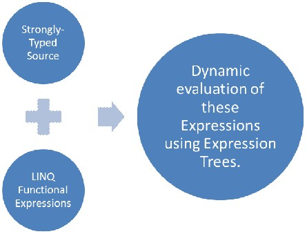
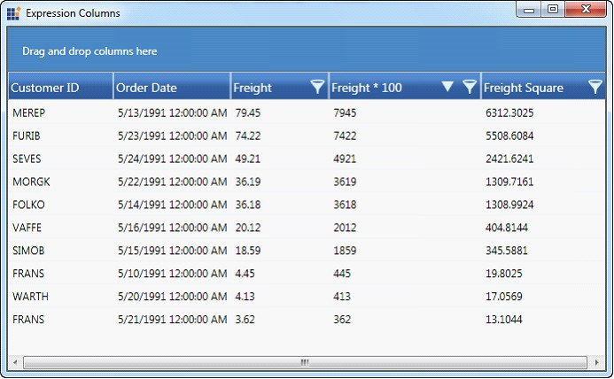
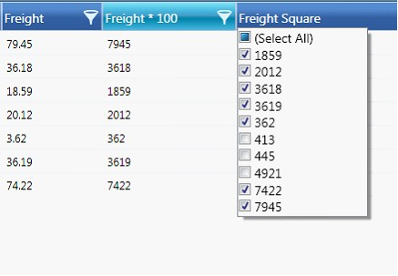
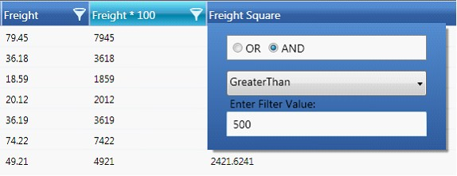
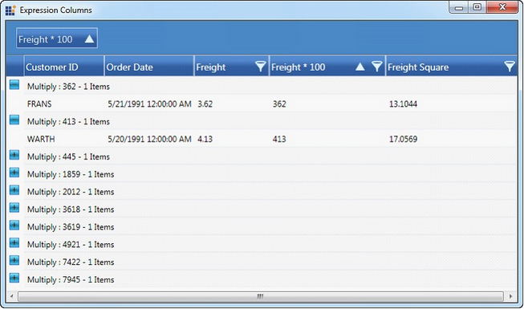
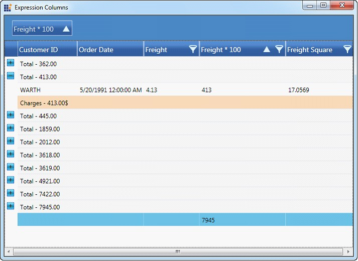

::: {style="DISPLAY: none"}
{#d2h_url_template}{#d2h_package_url style="WIDTH: 0px; DISPLAY: none; HEIGHT: 0px"}
:::

::: {.d2h_secondary_topic style="PADDING-BOTTOM: 10pt; MARGIN: 0pt; PADDING-LEFT: 0pt; PADDING-RIGHT: 0pt; PADDING-TOP: 0pt"}
#### Operations on Unbound Columns {#operations-on-unbound-columns style="tab-stops: 0pt"}

[]{style="FONT-FAMILY: 'Trebuchet MS','sans-serif'; COLOR: #15428b; FONT-SIZE: 9pt"} 

Unbound columns allow association of related values that is bound from an **Expression** in the unbound column or through handling the **QueryUnboundColumnValue** event. Operations like **Sorting,** **Filtering**, **Grouping**, **Summaries** and **ConditionalFormatting** can now be applied on these dynamic values bound to the underlying source. It uses **LINQ Functional Expressions** to be dynamically evaluated at runtime, and thus only Strongly-Typed source can be used with this feature.

[]{style="FONT-FAMILY: 'Trebuchet MS','sans-serif'; COLOR: #15428b; FONT-SIZE: 9pt"} 

{border="0"}

Figure 109: Operations on Unbound Columns

**[]{style="FONT-FAMILY: 'Trebuchet MS','sans-serif'; COLOR: #15428b; FONT-SIZE: 9pt"}** 

**[]{style="FONT-FAMILY: 'Trebuchet MS','sans-serif'; COLOR: #15428b; FONT-SIZE: 9pt"}** 

Sorting on Unbound Columns

**[]{style="FONT-FAMILY: 'Trebuchet MS','sans-serif'; COLOR: #15428b; FONT-SIZE: 9pt"}** 

Sorting can be done interactively either click on the header, or by declare in **XAML,** by using the following code.

[]{style="FONT-FAMILY: 'Trebuchet MS','sans-serif'; COLOR: #15428b; FONT-SIZE: 9pt"} 

+------------------------------------------------------------------------------------------------------------------------------------------------------------------------------------------------------------------------------------------------+
| **[\[XAML\]]{style="FONT-FAMILY: 'Courier New'"}**[  ]{style="FONT-FAMILY: 'Courier New'"}                                                                                                                                                     |
|                                                                                                                                                                                                                                                |
| [      ]{style="FONT-FAMILY: 'Courier New'"}                                                                                                                                                                                                   |
|                                                                                                                                                                                                                                                |
| [\<syncfusion:GridDataControl.SortColumns\>]{style="FONT-FAMILY: 'Courier New'"}                                                                                                                                                               |
|                                                                                                                                                                                                                                                |
| [            \<syncfusion:GridDataSortColumn ColumnName=\"Multiply\" SortDirection=\"Descending\" /\>]{style="FONT-FAMILY: 'Courier New'"}                                                                                                     |
|                                                                                                                                                                                                                                                |
| [        \</syncfusion:GridDataControl.SortColumns\>]{style="FONT-FAMILY: 'Courier New'"}                                                                                                                                                      |
|                                                                                                                                                                                                                                                |
| [        \<syncfusion:GridDataControl.VisibleColumns\>]{style="FONT-FAMILY: 'Courier New'"}                                                                                                                                                    |
|                                                                                                                                                                                                                                                |
| [            \<syncfusion:GridDataVisibleColumn MappingName=\"CustomerID\" HeaderText=\"Customer ID\" /\>]{style="FONT-FAMILY: 'Courier New'"}                                                                                                 |
|                                                                                                                                                                                                                                                |
| [            \<syncfusion:GridDataVisibleColumn MappingName=\"OrderDate\" HeaderText=\"Order Date\" /\>]{style="FONT-FAMILY: 'Courier New'"}                                                                                                   |
|                                                                                                                                                                                                                                                |
| [            \<syncfusion:GridDataVisibleColumn MappingName=\"Freight\" HeaderText=\"Freight\" AllowFilter=\"True\"\>]{style="FONT-FAMILY: 'Courier New'"}                                                                                     |
|                                                                                                                                                                                                                                                |
| [                \<syncfusion:GridDataVisibleColumn.FilterPane\>]{style="FONT-FAMILY: 'Courier New'"}                                                                                                                                          |
|                                                                                                                                                                                                                                                |
| [                    \<syncfusion:GridDataTextFilteringPane IsThemed=\"False\" Foreground=\"Black\" PredicateType=\"And\" /\>]{style="FONT-FAMILY: 'Courier New'"}                                                                             |
|                                                                                                                                                                                                                                                |
| [                \</syncfusion:GridDataVisibleColumn.FilterPane\>]{style="FONT-FAMILY: 'Courier New'"}                                                                                                                                         |
|                                                                                                                                                                                                                                                |
| [            \</syncfusion:GridDataVisibleColumn\>]{style="FONT-FAMILY: 'Courier New'"}                                                                                                                                                        |
|                                                                                                                                                                                                                                                |
| [            \<syncfusion:GridDataUnboundVisibleColumn MappingName=\"Multiply\" HeaderText=\"Freight \* 100\" Expression=\"Freight \* 100\" AllowFilter=\"True\" AllowDrag=\"True\" AllowGroup=\"True\"\>]{style="FONT-FAMILY: 'Courier New'"} |
|                                                                                                                                                                                                                                                |
| [            \</syncfusion:GridDataUnboundVisibleColumn\>]{style="FONT-FAMILY: 'Courier New'"}                                                                                                                                                 |
|                                                                                                                                                                                                                                                |
| [            \<syncfusion:GridDataUnboundVisibleColumn MappingName=\"FreightSqr\" HeaderText=\"Freight Square\" Expression=\"Freight \^ 2\" AllowFilter=\"True\"\>]{style="FONT-FAMILY: 'Courier New'"}                                        |
|                                                                                                                                                                                                                                                |
| [            \</syncfusion:GridDataUnboundVisibleColumn\>]{style="FONT-FAMILY: 'Courier New'"}                                                                                                                                                 |
|                                                                                                                                                                                                                                                |
| [        \</syncfusion:GridDataControl.VisibleColumns\>]{style="FONT-FAMILY: 'Courier New'"}                                                                                                                                                   |
+------------------------------------------------------------------------------------------------------------------------------------------------------------------------------------------------------------------------------------------------+

[]{style="FONT-FAMILY: 'Calibri','sans-serif'; COLOR: black"} 

[]{style="FONT-FAMILY: 'Calibri','sans-serif'"} 

{border="0"}

Figure 110: Sorting

***[]{style="FONT-FAMILY: 'Trebuchet MS','sans-serif'; COLOR: #15428b; FONT-SIZE: 9pt"}*** 

**[]{style="FONT-FAMILY: 'Trebuchet MS','sans-serif'; COLOR: #15428b; FONT-SIZE: 9pt"}** 

Filtering on Unbound Columns

**[]{style="FONT-FAMILY: 'Trebuchet MS','sans-serif'; COLOR: #15428b; FONT-SIZE: 9pt"}** 

Unbound columns support two modes of filtering in the WPF **GridDataControl:**

**[]{style="FONT-FAMILY: 'Trebuchet MS','sans-serif'; COLOR: #15428b; FONT-SIZE: 9pt"}** 

[·      ]{style="FONT-FAMILY: Symbol"}Excel-like Filtering

[·      ]{style="FONT-FAMILY: Symbol"}Advanced Filtering

**[]{style="FONT-FAMILY: 'Trebuchet MS','sans-serif'; COLOR: #15428b; FONT-SIZE: 9pt"}** 

**[]{style="FONT-FAMILY: 'Trebuchet MS','sans-serif'; COLOR: #15428b; FONT-SIZE: 9pt"}** 

Excel-like Filtering mode

**[]{style="FONT-FAMILY: 'Trebuchet MS','sans-serif'; COLOR: #15428b; FONT-SIZE: 9pt"}** 

Set **AllowFilter** property to **true** to enable **Excel-like Filtering** in Unbound Column.

The following code illustrates this.

[]{style="FONT-FAMILY: 'Trebuchet MS','sans-serif'; COLOR: #15428b; FONT-SIZE: 9pt"} 

+----------------------------------------------------------------------------------------------------------------------------------------------------------------------------------------------------------------------------------------------+
| **[\[XAML\]]{style="FONT-FAMILY: 'Calibri','sans-serif'"}**                                                                                                                                                                                  |
|                                                                                                                                                                                                                                              |
| **[]{style="FONT-FAMILY: 'Calibri','sans-serif'"}**                                                                                                                                                                                          |
|                                                                                                                                                                                                                                              |
| [ \<syncfusion:GridDataUnboundVisibleColumn MappingName=\"Multiply\" HeaderText=\"Freight \* 100\" Expression=\"Freight \* 100\" AllowFilter=\"True\" AllowDrag=\"True\" AllowGroup=\"True\"\>]{style="FONT-FAMILY: 'Calibri','sans-serif'"} |
|                                                                                                                                                                                                                                              |
| [            \</syncfusion:GridDataUnboundVisibleColumn\>]{style="FONT-FAMILY: 'Calibri','sans-serif'"}                                                                                                                                      |
+----------------------------------------------------------------------------------------------------------------------------------------------------------------------------------------------------------------------------------------------+

[]{style="FONT-FAMILY: 'Calibri','sans-serif'; COLOR: black"} 

[]{style="FONT-FAMILY: 'Calibri','sans-serif'"} 

{border="0"}

Figure 111: Excel Filtering

***[]{style="FONT-FAMILY: 'Trebuchet MS','sans-serif'; COLOR: #15428b; FONT-SIZE: 9pt"}*** 

***[]{style="FONT-FAMILY: 'Trebuchet MS','sans-serif'; COLOR: #15428b; FONT-SIZE: 9pt"}*** 

**[]{style="FONT-FAMILY: 'Trebuchet MS','sans-serif'; COLOR: #15428b; FONT-SIZE: 9pt"}** 

Advanced Filtering Mode

**[]{style="FONT-FAMILY: 'Trebuchet MS','sans-serif'; COLOR: #15428b; FONT-SIZE: 9pt"}** 

Add Advanced Filtering in Unbound Column, by using the following code.

[]{style="FONT-FAMILY: 'Trebuchet MS','sans-serif'; COLOR: #15428b; FONT-SIZE: 9pt"} 

+----------------------------------------------------------------------------------------------------------------------------------------------------------------------------------------------------------------------------------------+
| **[\[XAML\]]{style="FONT-FAMILY: 'Courier New'"}**                                                                                                                                                                                     |
|                                                                                                                                                                                                                                        |
| **[]{style="FONT-FAMILY: 'Courier New'"}**                                                                                                                                                                                             |
|                                                                                                                                                                                                                                        |
| [    \<syncfusion:GridDataUnboundVisibleColumn MappingName=\"Multiply\" HeaderText=\"Freight \* 100\" Expression=\"Freight \* 100\" AllowFilter=\"True\" AllowDrag=\"True\" AllowGroup=\"True\"\>]{style="FONT-FAMILY: 'Courier New'"} |
|                                                                                                                                                                                                                                        |
| [                \<syncfusion:GridDataVisibleColumn.FilterPane\>]{style="FONT-FAMILY: 'Courier New'"}                                                                                                                                  |
|                                                                                                                                                                                                                                        |
| [                    \<syncfusion:GridDataTextFilteringPane IsThemed=\"False\" Foreground=\"Black\" PredicateType=\"And\" /\>]{style="FONT-FAMILY: 'Courier New'"}                                                                     |
|                                                                                                                                                                                                                                        |
| [                \</syncfusion:GridDataVisibleColumn.FilterPane\>]{style="FONT-FAMILY: 'Courier New'"}                                                                                                                                 |
|                                                                                                                                                                                                                                        |
| [            \</syncfusion:GridDataUnboundVisibleColumn\>]{style="FONT-FAMILY: 'Courier New'"}                                                                                                                                         |
+----------------------------------------------------------------------------------------------------------------------------------------------------------------------------------------------------------------------------------------+

[]{style="FONT-FAMILY: 'Calibri','sans-serif'; COLOR: black"} 

[]{style="FONT-FAMILY: 'Calibri','sans-serif'"} 

[]{style="FONT-FAMILY: 'Calibri','sans-serif'"} 

{border="0"}

Figure 112: Advanced Filtering

***[]{style="FONT-FAMILY: 'Trebuchet MS','sans-serif'; COLOR: #15428b; FONT-SIZE: 9pt"}*** 

***[]{style="FONT-FAMILY: 'Trebuchet MS','sans-serif'; COLOR: #15428b; FONT-SIZE: 9pt"}*** 

**[]{style="FONT-FAMILY: 'Trebuchet MS','sans-serif'; COLOR: #15428b; FONT-SIZE: 9pt"}** 

Grouping on Unbound Columns

**[]{style="FONT-FAMILY: 'Trebuchet MS','sans-serif'; COLOR: #15428b; FONT-SIZE: 9pt"}** 

Grouping can be done interactively / declaratively through **XAML** over the Unbound Columns.

[]{style="FONT-FAMILY: 'Trebuchet MS','sans-serif'; COLOR: #15428b; FONT-SIZE: 9pt"} 

+----------------------------------------------------------------------------------------------------------------+
| **[\[XAML\]]{style="FONT-FAMILY: 'Courier New'"}**                                                             |
|                                                                                                                |
| **[]{style="FONT-FAMILY: 'Courier New'"}**                                                                     |
|                                                                                                                |
| [    \<syncfusion:GridDataControl.GroupedColumns\>]{style="FONT-FAMILY: 'Courier New'"}                        |
|                                                                                                                |
| [            \<syncfusion:GridDataGroupColumn ColumnName=\"Multiply\" /\>]{style="FONT-FAMILY: 'Courier New'"} |
|                                                                                                                |
| [        \</syncfusion:GridDataControl.GroupedColumns\>]{style="FONT-FAMILY: 'Courier New'"}                   |
+----------------------------------------------------------------------------------------------------------------+

[]{style="FONT-FAMILY: 'Calibri','sans-serif'; COLOR: black"} 

[]{style="FONT-FAMILY: 'Calibri','sans-serif'"} 

{border="0"}

Figure 113: Grouping

**[]{style="FONT-FAMILY: 'Trebuchet MS','sans-serif'; COLOR: #15428b; FONT-SIZE: 9pt"}** 

Summaries on Unbound Columns

**[]{style="FONT-FAMILY: 'Trebuchet MS','sans-serif'; COLOR: #15428b; FONT-SIZE: 9pt"}** 

The Default summaries work the same way as with bound columns.

Below is the list of different types of Summary declaration in **XAML**.

[]{style="FONT-FAMILY: 'Trebuchet MS','sans-serif'; COLOR: #15428b; FONT-SIZE: 9pt"} 

Table Summaries

**[]{style="FONT-FAMILY: 'Trebuchet MS','sans-serif'; COLOR: #15428b; FONT-SIZE: 9pt"}** 

+-----------------------------------------------------------------------------------------------------------------------------------------------------------------------------------------------------------------+
| **[\[XAML\]]{style="FONT-FAMILY: 'Courier New'"}**                                                                                                                                                              |
|                                                                                                                                                                                                                 |
| **[]{style="FONT-FAMILY: 'Courier New'"}**                                                                                                                                                                      |
|                                                                                                                                                                                                                 |
| [ \<syncfusion:GridDataControl.TableSummaryRows\>]{style="FONT-FAMILY: 'Courier New'"}                                                                                                                          |
|                                                                                                                                                                                                                 |
| [            \<syncfusion:GridDataSummaryRow ShowSummaryInRow=\"False\" Title=\"Total : {FreightMultiplySummary}\" TitleColumnCount=\"3\"\>]{style="FONT-FAMILY: 'Courier New'"}                                |
|                                                                                                                                                                                                                 |
| [                \<syncfusion:GridDataSummaryRow.SummaryColumns\>]{style="FONT-FAMILY: 'Courier New'"}                                                                                                          |
|                                                                                                                                                                                                                 |
| [                    \<syncfusion:GridDataSummaryColumn Name=\"FreightMultiplySummary\" MappingName=\"Multiply\" SummaryType=\"Int32Aggregate\" Format=\"\'{Max:d}\'\" /\>]{style="FONT-FAMILY: 'Courier New'"} |
|                                                                                                                                                                                                                 |
| [                \</syncfusion:GridDataSummaryRow.SummaryColumns\>]{style="FONT-FAMILY: 'Courier New'"}                                                                                                         |
|                                                                                                                                                                                                                 |
| [            \</syncfusion:GridDataSummaryRow\>]{style="FONT-FAMILY: 'Courier New'"}                                                                                                                            |
|                                                                                                                                                                                                                 |
| [        \</syncfusion:GridDataControl.TableSummaryRows\>]{style="FONT-FAMILY: 'Courier New'"}                                                                                                                  |
+-----------------------------------------------------------------------------------------------------------------------------------------------------------------------------------------------------------------+

[]{style="FONT-FAMILY: 'Calibri','sans-serif'; COLOR: black"} 

**[]{style="FONT-FAMILY: 'Trebuchet MS','sans-serif'; COLOR: #15428b; FONT-SIZE: 9pt"}** 

Caption Summary

[]{style="FONT-FAMILY: 'Trebuchet MS','sans-serif'; COLOR: #15428b; FONT-SIZE: 9pt"} 

+------------------------------------------------------------------------------------------------------------------------------------------------------------------------------------------------------------------------------+
| [ \<syncfusion:GridDataControl.CaptionSummaryRow\>]{style="FONT-FAMILY: 'Calibri','sans-serif'"}                                                                                                                             |
|                                                                                                                                                                                                                              |
| [            \<syncfusion:GridDataSummaryRow ShowSummaryInRow=\"False\" Title=\"\'{CountSummary}\'\" TitleColumnCount=\"4\"\>]{style="FONT-FAMILY: 'Calibri','sans-serif'"}                                                  |
|                                                                                                                                                                                                                              |
| [                \<syncfusion:GridDataSummaryRow.SummaryColumns\>]{style="FONT-FAMILY: 'Calibri','sans-serif'"}                                                                                                              |
|                                                                                                                                                                                                                              |
| [                    \<syncfusion:GridDataSummaryColumn Name=\"CountSummary\"  MappingName=\"Multiply\" SummaryType=\"DoubleAggregate\" Format=\"Total - \'{Sum:###.00}\'\" \>]{style="FONT-FAMILY: 'Calibri','sans-serif'"} |
|                                                                                                                                                                                                                              |
| [                    \</syncfusion:GridDataSummaryColumn\>]{style="FONT-FAMILY: 'Calibri','sans-serif'"}                                                                                                                     |
|                                                                                                                                                                                                                              |
| [                \</syncfusion:GridDataSummaryRow.SummaryColumns\>]{style="FONT-FAMILY: 'Calibri','sans-serif'"}                                                                                                             |
|                                                                                                                                                                                                                              |
| [            \</syncfusion:GridDataSummaryRow\>]{style="FONT-FAMILY: 'Calibri','sans-serif'"}                                                                                                                                |
|                                                                                                                                                                                                                              |
| [        \</syncfusion:GridDataControl.CaptionSummaryRow\>]{style="FONT-FAMILY: 'Calibri','sans-serif'"}                                                                                                                     |
+------------------------------------------------------------------------------------------------------------------------------------------------------------------------------------------------------------------------------+

**[]{style="FONT-FAMILY: 'Trebuchet MS','sans-serif'; COLOR: #15428b; FONT-SIZE: 9pt"}** 

**[]{style="FONT-FAMILY: 'Trebuchet MS','sans-serif'; COLOR: #15428b; FONT-SIZE: 9pt"}** 

Group Summary

[]{style="FONT-FAMILY: 'Trebuchet MS','sans-serif'; COLOR: #15428b; FONT-SIZE: 9pt"} 

+---------------------------------------------------------------------------------------------------------------------------------------------------------------------------------------------------------------------+
| [  \<syncfusion:GridDataControl.CaptionSummaryRow\>]{style="FONT-FAMILY: 'Courier New'"}                                                                                                                            |
|                                                                                                                                                                                                                     |
| [            \<syncfusion:GridDataSummaryRow ShowSummaryInRow=\"False\" Title=\"\'{CountSummary}\'\" TitleColumnCount=\"4\"\>]{style="FONT-FAMILY: 'Courier New'"}                                                  |
|                                                                                                                                                                                                                     |
| [                \<syncfusion:GridDataSummaryRow.SummaryColumns\>]{style="FONT-FAMILY: 'Courier New'"}                                                                                                              |
|                                                                                                                                                                                                                     |
| [                    \<syncfusion:GridDataSummaryColumn Name=\"CountSummary\"  MappingName=\"Multiply\" SummaryType=\"DoubleAggregate\" Format=\"Total - \'{Sum:###.00}\'\" \>]{style="FONT-FAMILY: 'Courier New'"} |
|                                                                                                                                                                                                                     |
| [                    \</syncfusion:GridDataSummaryColumn\>]{style="FONT-FAMILY: 'Courier New'"}                                                                                                                     |
|                                                                                                                                                                                                                     |
| [                \</syncfusion:GridDataSummaryRow.SummaryColumns\>]{style="FONT-FAMILY: 'Courier New'"}                                                                                                             |
|                                                                                                                                                                                                                     |
| [            \</syncfusion:GridDataSummaryRow\>]{style="FONT-FAMILY: 'Courier New'"}                                                                                                                                |
|                                                                                                                                                                                                                     |
| [        \</syncfusion:GridDataControl.CaptionSummaryRow\>]{style="FONT-FAMILY: 'Courier New'"}                                                                                                                     |
+---------------------------------------------------------------------------------------------------------------------------------------------------------------------------------------------------------------------+

[]{style="FONT-FAMILY: 'Calibri','sans-serif'; COLOR: black"} 

**[]{style="FONT-FAMILY: 'Trebuchet MS','sans-serif'; COLOR: #15428b; FONT-SIZE: 9pt"}** 

[]{style="FONT-FAMILY: 'Calibri','sans-serif'"} 

{border="0"}

Figure 114: Summaries

**[]{style="FONT-FAMILY: 'Trebuchet MS','sans-serif'; COLOR: #15428b; FONT-SIZE: 9pt"}** 

**[]{style="FONT-FAMILY: 'Trebuchet MS','sans-serif'; COLOR: #15428b; FONT-SIZE: 9pt"}** 

Custom Summaries on Unbound Columns

**[]{style="FONT-FAMILY: 'Trebuchet MS','sans-serif'; COLOR: #15428b; FONT-SIZE: 9pt"}** 

Custom Summary calculation differs for Unbound Columns. It has additional parameter to supply a **dynamic lambda** delegate for invoking the unbound values at runtime.

[]{style="FONT-FAMILY: 'Trebuchet MS','sans-serif'; COLOR: #15428b; FONT-SIZE: 9pt"} 

+-----------------------------------------------------------------------------------------------------------------------------------------------------------------------------------+
| [   public interface ISummaryExpressionAggregate : ISummaryAggregate]{style="FONT-FAMILY: 'Courier New'"}                                                                         |
|                                                                                                                                                                                   |
| [    {]{style="FONT-FAMILY: 'Courier New'"}                                                                                                                                       |
|                                                                                                                                                                                   |
| [        Action\<IEnumerable, string, Expression\<Func\<string, object, object\>\>, PropertyDescriptor\> CalculateAggregateExpressionFunc();]{style="FONT-FAMILY: 'Courier New'"} |
|                                                                                                                                                                                   |
| [    }]{style="FONT-FAMILY: 'Courier New'"}                                                                                                                                       |
+-----------------------------------------------------------------------------------------------------------------------------------------------------------------------------------+

[]{style="FONT-FAMILY: 'Calibri','sans-serif'; COLOR: black"} 

All the default Summary Aggregate now implements **ISummaryExpressionAggregate** interface. This typically informs the **ICollectionViewAdv** to expect an Expression to evaluate at runtime.

**[]{style="FONT-FAMILY: 'Trebuchet MS','sans-serif'; COLOR: #15428b; FONT-SIZE: 9pt"}** 

**[]{style="FONT-FAMILY: 'Trebuchet MS','sans-serif'; COLOR: #15428b; FONT-SIZE: 9pt"}** 

Expression Trees evaluation for Aggregate methods

**[]{style="FONT-FAMILY: 'Trebuchet MS','sans-serif'; COLOR: #15428b; FONT-SIZE: 9pt"}** 

A return value is required for any **LINQ Aggregate** method to be implemented.  In order to make the unbound column get invoked through the **lambda delegate**, we have an **internal wrapper lambda** that is generic.

[]{style="FONT-FAMILY: 'Trebuchet MS','sans-serif'; COLOR: #15428b; FONT-SIZE: 9pt"} 

+------------------------------------------------------------------------------------------------------------------------------------------------------------------------------------------------------------------------------+
| [ private static Expression GetInvokeExpressionAggregateFunc\<TResult\>(ParameterExpression paramExp, string propertyName, Expression\<Func\<string, object, object\>\> expressionFunc)]{style="FONT-FAMILY: 'Courier New'"} |
|                                                                                                                                                                                                                              |
| [        {]{style="FONT-FAMILY: 'Courier New'"}                                                                                                                                                                              |
|                                                                                                                                                                                                                              |
| [            // constructing a wrapper Func that would return a generic value]{style="FONT-FAMILY: 'Courier New'"}                                                                                                           |
|                                                                                                                                                                                                                              |
| [            Func\<Expression\<Func\<string, object, object\>\>, string, object, TResult\> fun = (func, prop, rec) =\>]{style="FONT-FAMILY: 'Courier New'"}                                                                  |
|                                                                                                                                                                                                                              |
| [            {]{style="FONT-FAMILY: 'Courier New'"}                                                                                                                                                                          |
|                                                                                                                                                                                                                              |
| [                var lambda = func.Compile();]{style="FONT-FAMILY: 'Courier New'"}                                                                                                                                           |
|                                                                                                                                                                                                                              |
| [                TResult val = (TResult)lambda.DynamicInvoke(new object\[\] { prop, rec });]{style="FONT-FAMILY: 'Courier New'"}                                                                                             |
|                                                                                                                                                                                                                              |
| [                return val;]{style="FONT-FAMILY: 'Courier New'"}                                                                                                                                                            |
|                                                                                                                                                                                                                              |
| [            };]{style="FONT-FAMILY: 'Courier New'"}                                                                                                                                                                         |
|                                                                                                                                                                                                                              |
| []{style="FONT-FAMILY: 'Courier New'"}                                                                                                                                                                                       |
|                                                                                                                                                                                                                              |
| [            Expression\<Func\<Expression\<Func\<string, object, object\>\>, string, object, TResult\>\> eIFunc = (func, prop, rec) =\> fun(func, prop, rec);]{style="FONT-FAMILY: 'Courier New'"}                           |
|                                                                                                                                                                                                                              |
| [            var invokeExp = Expression.Invoke(Expression.Constant(fun), new Expression\[\] { Expression.Constant(expressionFunc), Expression.Constant(propertyName), paramExp });]{style="FONT-FAMILY: 'Courier New'"}      |
|                                                                                                                                                                                                                              |
| [            return invokeExp;]{style="FONT-FAMILY: 'Courier New'"}                                                                                                                                                          |
|                                                                                                                                                                                                                              |
| [        }]{style="FONT-FAMILY: 'Courier New'"}                                                                                                                                                                              |
+------------------------------------------------------------------------------------------------------------------------------------------------------------------------------------------------------------------------------+

[]{style="FONT-FAMILY: 'Calibri','sans-serif'; COLOR: black"} 

The above method simply wraps the Unbound Column's **lambda** expression into an Expression that would return typed value, thus enabling direct calls **to Sum\<TResult\>(Expression\<Func\<T,TResult\>\>** where **TResult** can be any numeric data type.

[]{#p238} 

[]{#related-topics}
:::
