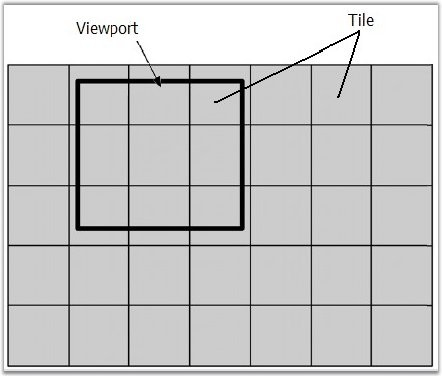
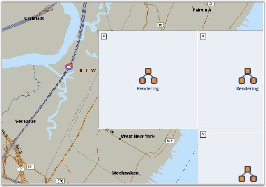

::: {style="DISPLAY: none"}
{#d2h_url_template}{#d2h_package_url style="WIDTH: 0px; DISPLAY: none; HEIGHT: 0px"}
:::

::::: {#nsbanner .d2h_main_nsbanner style="BORDER-BOTTOM: #999999 1px solid; POSITION: relative; PADDING-BOTTOM: 0px; BACKGROUND-COLOR: transparent; PADDING-LEFT: 0px; PADDING-RIGHT: 0px; DISPLAY: none; BORDER-TOP: #999999 1px solid; PADDING-TOP: 0px; LEFT: 0px"}
:::: {#TitleRow .d2h_main_titlerow style="PADDING-BOTTOM: 4px; BACKGROUND-COLOR: transparent; PADDING-LEFT: 22px; WIDTH: 100%; PADDING-RIGHT: 10px; DISPLAY: none; PADDING-TOP: 4px"}
::: {#ienav .d2h_main_ienav style="DISPLAY: none"}
{#D2HPrevious .D2HPreviousEnabled}  {#D2HNext .D2HNextEnabled}
:::
::::
:::::

::::: {#nstext .d2h_main_nstext style="PADDING-BOTTOM: 10px; BACKGROUND-COLOR: transparent; PADDING-LEFT: 22px; PADDING-RIGHT: 10px; HEIGHT: 100%; OVERFLOW: auto; PADDING-TOP: 5px" hasuserbackground="true" valign="bottom"}
::: {#d2h_breadcrumbs .d2h_breadcrumbs}
[Essential Studio User Guide Documentation](ms-xhelp:///?Id=12457748-09e3-4d74-a240-8e049cedf030){.d2h_breadcrumbsNormal}[ \> ]{.d2h_breadcrumbsLinkSeparator}[User Interface Edition](ms-xhelp:///?Id=c29296b7-531c-413b-a0ec-488ca1f7f669){.d2h_breadcrumbsNormal}[ \> ]{.d2h_breadcrumbsLinkSeparator}[Essential ASP.NET](ms-xhelp:///?Id=25c35330-c127-4dad-9a92-ed79dc7261a6){.d2h_breadcrumbsNormal}[ \> ]{.d2h_breadcrumbsLinkSeparator}[Essential Diagram]{.d2h_breadcrumbsContentsOnly}[ \> ]{.d2h_breadcrumbsLinkSeparator}[Concepts and Features](ms-xhelp:///?Id=f9aa55fb-f8cf-43da-a8be-de231dc0d949){.d2h_breadcrumbsNormal}[ \> ]{.d2h_breadcrumbsLinkSeparator}[Optimization](ms-xhelp:///?Id=b87d4bc7-af66-4e6f-81ff-c63c4bc639b4){.d2h_breadcrumbsNormal}
:::

### Optimized Background Rendering Mode[]{style="FONT-SIZE: 10pt"} {#optimized-background-rendering-mode style="tab-stops: 0pt"}

[]{style="FONT-FAMILY: 'Trebuchet MS','sans-serif'; COLOR: #15428b; FONT-SIZE: 9pt"} 

OptimizedBackgroundRendering mode is the mode which affects only the diagram document. When **OptimizedBackgroundRendering** is **True**, the background of the diagram is cut to separate square images, with TileSize width and height. Only needed parts (images) are loaded to the client browser. Amount of images depend on the view-port size (Pic. 1 and Pic. 2). This mode is very similar to Googletm Maps (http://maps.google.com/).

 

You can scroll and pan diagram. The images that are not needed are removed and new portion of images are created.

 

This is a very useful optimization when you have a diagram document with a complicated and large background (for example: maps). The main advantage is that the data transfer from server to client machine is reduced, and also the time interval for loading first images is reduced. You do not have to load all the large images, but only a part of them.

 

But in this mode, web server will work more (CPU and RAM usage will be increased); all the cut square images must be prepared and cached before the ASPX page is rendered.

 

***Warning***: Some interactive functionality will work slower: scrolling and panning.\
\

{border="0"}

[]{style="FONT-FAMILY: 'Trebuchet MS','sans-serif'; COLOR: #15428b; FONT-SIZE: 9pt"} 

Figure 36: View-Port and Background Tiles

**[]{style="FONT-FAMILY: 'Trebuchet MS','sans-serif'; COLOR: #15428b; FONT-SIZE: 9pt"}** 

{border="0"}

[]{style="FONT-FAMILY: 'Trebuchet MS','sans-serif'; COLOR: #15428b; FONT-SIZE: 9pt"} 

Figure 37: Loading Process

[]{style="FONT-FAMILY: 'Trebuchet MS','sans-serif'; COLOR: #15428b; FONT-SIZE: 9pt"} 

You can turn on or off the OptimizedBackgroundRendering mode by uisng the **OptimizedBackgroundRendering** public property. The following code example illustrates how to set this property.

[]{style="FONT-FAMILY: 'Trebuchet MS','sans-serif'; COLOR: #15428b; FONT-SIZE: 9pt"} 

+----------------------------------------------------------------------------------------------------------------------+
| **[\[C#\]]{style="FONT-FAMILY: 'Courier New'"}**                                                                     |
|                                                                                                                      |
| **[]{style="FONT-FAMILY: 'Courier New'"}**                                                                           |
|                                                                                                                      |
| [// Turn on]{style="FONT-FAMILY: 'Courier New'; COLOR: green"}                                                       |
|                                                                                                                      |
| [DiagramWebControl1.OptimizedBackgroundRendering = [true]{style="COLOR: blue"};]{style="FONT-FAMILY: 'Courier New'"} |
+----------------------------------------------------------------------------------------------------------------------+

[]{style="FONT-FAMILY: 'Trebuchet MS','sans-serif'; COLOR: #15428b; FONT-SIZE: 9pt"} 

[]{style="FONT-FAMILY: 'Trebuchet MS','sans-serif'; COLOR: #15428b; FONT-SIZE: 9pt"} 

::: {align="center"}
  -------------------------------------------- ------------------------------------------------------------------------------
                                               Optimized Background Rendering Mode
  **Server Memory Usage**                      Increases only when CachingMode is set to Memory.
  **Client Memory Usage**                      Decreases in most of cases.
  **Server HDD Space**                         Increases only when CachingMode is Disk.
  **Server CPU Usage**                         While the background is cutting, CPU usage is very high. Later it is normal.
  **Client CPU Usage**                         Increases while scrolling and panning.
  **Interactive Ability**                      All interactions are allowed.
  **Interactive Speed**                        Scrolling and panning will work slower.
  **Initial Loading Time on Client Browser**   Decreases when document background is large.
  **Data Size from Server to Client**          Decreases in most of cases.
  -------------------------------------------- ------------------------------------------------------------------------------
:::

[]{style="FONT-FAMILY: 'Trebuchet MS','sans-serif'; COLOR: #15428b; FONT-SIZE: 9pt"} 

See Also

[]{style="FONT-FAMILY: 'Trebuchet MS','sans-serif'; COLOR: #15428b; FONT-SIZE: 9pt"} 

[Optimization]{.UGHyperlink}[, ]{.UGHyperlink}[Properties and Events for Optimization]{.UGHyperlink}[, ]{.UGHyperlink}[Optimized Content Rendering Mode]{.UGHyperlink}[, ]{.UGHyperlink}[Flattened Mode]{.UGHyperlink}[, ]{.UGHyperlink}[Diagram Optimization via HTML Elements]{.UGHyperlink}[, ]{.UGHyperlink}[Diagram Caching Modes]{.UGHyperlink}[, ]{.UGHyperlink}[Virtual Caching Type and Image Grid Cell Updating Event]{.UGHyperlink}[, ]{.UGHyperlink}[Optimization Customization]{.UGHyperlink}[]{.UGHyperlink}

[]{#related-topics}
:::::
