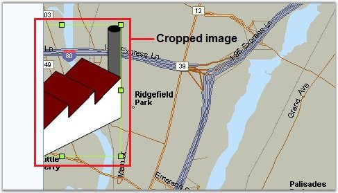

::: {style="DISPLAY: none"}
{#d2h_url_template}{#d2h_package_url style="WIDTH: 0px; DISPLAY: none; HEIGHT: 0px"}
:::

::::: {#nsbanner .d2h_main_nsbanner style="BORDER-BOTTOM: #999999 1px solid; POSITION: relative; PADDING-BOTTOM: 0px; BACKGROUND-COLOR: transparent; PADDING-LEFT: 0px; PADDING-RIGHT: 0px; DISPLAY: none; BORDER-TOP: #999999 1px solid; PADDING-TOP: 0px; LEFT: 0px"}
:::: {#TitleRow .d2h_main_titlerow style="PADDING-BOTTOM: 4px; BACKGROUND-COLOR: transparent; PADDING-LEFT: 22px; WIDTH: 100%; PADDING-RIGHT: 10px; DISPLAY: none; PADDING-TOP: 4px"}
::: {#ienav .d2h_main_ienav style="DISPLAY: none"}
{#D2HPrevious .D2HPreviousEnabled}  {#D2HNext .D2HNextEnabled}
:::
::::
:::::

:::::: {#nstext .d2h_main_nstext style="PADDING-BOTTOM: 10px; BACKGROUND-COLOR: transparent; PADDING-LEFT: 22px; PADDING-RIGHT: 10px; HEIGHT: 100%; OVERFLOW: auto; PADDING-TOP: 5px" hasuserbackground="true" valign="bottom"}
::: {#d2h_breadcrumbs .d2h_breadcrumbs}
[Essential Studio User Guide Documentation](ms-xhelp:///?Id=12457748-09e3-4d74-a240-8e049cedf030){.d2h_breadcrumbsNormal}[ \> ]{.d2h_breadcrumbsLinkSeparator}[User Interface Edition](ms-xhelp:///?Id=c29296b7-531c-413b-a0ec-488ca1f7f669){.d2h_breadcrumbsNormal}[ \> ]{.d2h_breadcrumbsLinkSeparator}[Essential ASP.NET](ms-xhelp:///?Id=25c35330-c127-4dad-9a92-ed79dc7261a6){.d2h_breadcrumbsNormal}[ \> ]{.d2h_breadcrumbsLinkSeparator}[Essential Diagram]{.d2h_breadcrumbsContentsOnly}[ \> ]{.d2h_breadcrumbsLinkSeparator}[Concepts and Features](ms-xhelp:///?Id=f9aa55fb-f8cf-43da-a8be-de231dc0d949){.d2h_breadcrumbsNormal}[ \> ]{.d2h_breadcrumbsLinkSeparator}[Optimization](ms-xhelp:///?Id=b87d4bc7-af66-4e6f-81ff-c63c4bc639b4){.d2h_breadcrumbsNormal}
:::

### Optimized Content Rendering Mode[]{style="FONT-SIZE: 10pt"} {#optimized-content-rendering-mode style="tab-stops: 0pt"}

[]{#p39}[]{style="FONT-FAMILY: 'Trebuchet MS','sans-serif'; COLOR: #15428b; FONT-SIZE: 9pt"} 

The **OptimizedContentRendering** mode affects only the diagram content.

 

It is useful to use this mode when the diagram document has many nodes, and it is not necessary to load all of them to the client. In this mode, only the required nodes will be rendered (depending on the view port size and diagram\'s magnification).

 

The nodes which are partly in view-port will be cropped (below image). If such node (nodes) is (are) dragged, it (they) will be rendered again, to show the new image (this operation is a bit slow).

[]{style="FONT-FAMILY: 'Trebuchet MS','sans-serif'; COLOR: #15428b; FONT-SIZE: 9pt"} 

{border="0"}

[]{style="FONT-FAMILY: 'Trebuchet MS','sans-serif'; COLOR: #15428b; FONT-SIZE: 9pt"} 

Figure 38: Cropped Node

[]{style="FONT-FAMILY: 'Trebuchet MS','sans-serif'; COLOR: #15428b; FONT-SIZE: 9pt"} 

When the magnification changes or the content scrolls (panning), the content will be reformed: nodes that are not necessary are deleted and new necessary nodes are created.

 

This mode is very useful when the diagram document has many nodes, and not all of them are in view-port at the same time. It is also useful when controls have to render large nodes (if sizes are equal to view-port or larger). The main advantage is that data transfer from the server to client machine is reduced, and also the memory usage on client is reduced.

[]{style="FONT-FAMILY: 'Trebuchet MS','sans-serif'; COLOR: #15428b; FONT-SIZE: 9pt"} 

::: {style="BORDER-BOTTOM: windowtext 1pt solid; BORDER-LEFT: medium none; PADDING-BOTTOM: 1pt; MARGIN-TOP: 9pt; PADDING-LEFT: 0pt; PADDING-RIGHT: 0pt; MARGIN-BOTTOM: 9pt; BORDER-TOP: windowtext 1pt solid; BORDER-RIGHT: medium none; PADDING-TOP: 1pt"}
{border="0"}[Note]{style="BACKGROUND: white"}[: ]{style="BACKGROUND: white"}It is useless to use this mode, when all nodes are in the view-port. It will only decrease loading time and interaction speed.
:::

[]{style="FONT-FAMILY: 'Trebuchet MS','sans-serif'; COLOR: #15428b; FONT-SIZE: 9pt"} 

***Warning***: Some interactive functionality will work slower: scrolling and panning of diagram. Dragging of the nodes will work slower too.

 

You can turn on or off the OptimizedContentRendering mode by using the **OptimizedContentRendering** public property. The following code example illustrates how to set this property.

[]{style="FONT-FAMILY: 'Trebuchet MS','sans-serif'; COLOR: #15428b; FONT-SIZE: 9pt"} 

+--------------------------------------------------------------------------------------------------------------------+
| **[\[C#\]]{style="FONT-FAMILY: 'Courier New'"}**                                                                   |
|                                                                                                                    |
| **[]{style="FONT-FAMILY: 'Courier New'"}**                                                                         |
|                                                                                                                    |
| [// Turn on]{style="FONT-FAMILY: 'Courier New'; COLOR: green"}                                                     |
|                                                                                                                    |
| [DiagramWebControl1.OptimizedContentRendering = [true]{style="COLOR: blue"}; ]{style="FONT-FAMILY: 'Courier New'"} |
+--------------------------------------------------------------------------------------------------------------------+

[]{style="FONT-FAMILY: 'Trebuchet MS','sans-serif'; COLOR: #15428b; FONT-SIZE: 9pt"} 

::: {align="center"}
+--------------------------------------------+--------------------------------------------------------------------------------------------------+
|                                            |                                                                                                  |
|                                            |                                                                                                  |
|                                            | Optimized Content Rendering Mode                                                                 |
+--------------------------------------------+--------------------------------------------------------------------------------------------------+
| **Server Memory Usage**                    | Default.                                                                                         |
+--------------------------------------------+--------------------------------------------------------------------------------------------------+
| **Client Memory Usage**                    | Decrease in most of cases.                                                                       |
+--------------------------------------------+--------------------------------------------------------------------------------------------------+
| **Server HDD Space**                       | Default.                                                                                         |
+--------------------------------------------+--------------------------------------------------------------------------------------------------+
| **Sever CPU Usage**                        | Default.                                                                                         |
+--------------------------------------------+--------------------------------------------------------------------------------------------------+
| **Client CPU Usage**                       | Increases when scrolling, panning and dragging nodes.                                            |
+--------------------------------------------+--------------------------------------------------------------------------------------------------+
| **Interactive Ability**                    | All interactions are allowed.                                                                    |
+--------------------------------------------+--------------------------------------------------------------------------------------------------+
| **Interactive Speed**                      | Scrolling and panning will work slower, node dragging too.                                       |
+--------------------------------------------+--------------------------------------------------------------------------------------------------+
| **Initial Loading Time on Client Browser** | Decrease when document has many nodes and not all of them are in the view-port at the same time. |
+--------------------------------------------+--------------------------------------------------------------------------------------------------+
| **Data Size from Server to Client**        | Decrease in most of the cases.                                                                   |
+--------------------------------------------+--------------------------------------------------------------------------------------------------+
:::

[]{style="FONT-FAMILY: 'Trebuchet MS','sans-serif'; COLOR: #15428b; FONT-SIZE: 9pt"} 

See Also

[]{style="FONT-FAMILY: 'Trebuchet MS','sans-serif'; COLOR: #15428b; FONT-SIZE: 9pt"} 

[Optimization]{.UGHyperlink}[, ]{.UGHyperlink}[Properties and Events for Optimization]{.UGHyperlink}[, ]{.UGHyperlink}[Optimized Background Rendering Mode]{.UGHyperlink}[, ]{.UGHyperlink}[Flattened Mode]{.UGHyperlink}[, ]{.UGHyperlink}[Diagram Optimization via HTML Elements]{.UGHyperlink}[, ]{.UGHyperlink}[Diagram Caching Modes]{.UGHyperlink}[, ]{.UGHyperlink}[Virtual Caching Type and Image Grid Cell Updating Event]{.UGHyperlink}[, ]{.UGHyperlink}[Optimization Customization]{.UGHyperlink}[]{.UGHyperlink}

[]{#related-topics}
::::::
