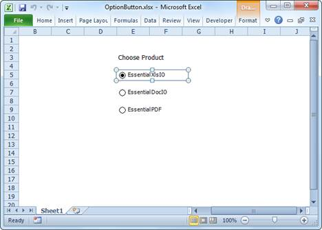

::: {style="DISPLAY: none"}
{#d2h_url_template}{#d2h_package_url style="WIDTH: 0px; DISPLAY: none; HEIGHT: 0px"}
:::

::: {.d2h_secondary_topic style="PADDING-BOTTOM: 10pt; MARGIN: 0pt; PADDING-LEFT: 0pt; PADDING-RIGHT: 0pt; PADDING-TOP: 0pt"}
#### Option Button {#option-button style="tab-stops: 0pt"}

**[]{style="FONT-FAMILY: 'Segoe UI','sans-serif'; COLOR: black"}** 

[]{style="FONT-FAMILY: 'Trebuchet MS','sans-serif'; COLOR: #15428b; FONT-SIZE: 9pt"} 

Essential XlsIO now provides support to read/write of Option Button control for **XLSX** format. This can be achieved by using the **IOptionButtonShape** interface which is used to add an option button inside a worksheet. The **IFill** interface is used to customize its appearance. **IShapeLineFormat** interface is used to modify the border. Various other text alignment properties are also supported.

[]{style="FONT-FAMILY: 'Trebuchet MS','sans-serif'; COLOR: #15428b; FONT-SIZE: 9pt"} 

The following code example illustrates how to read/write an option button control.

[]{style="FONT-FAMILY: 'Trebuchet MS','sans-serif'; COLOR: #15428b; FONT-SIZE: 9pt"} 

+-------------------------------------------------------------------------------------------------------------------------------------------------------------------------------------------+
| **[\[C#\]]{style="FONT-FAMILY: 'Courier New'"}**                                                                                                                                          |
|                                                                                                                                                                                           |
| **[]{style="FONT-FAMILY: 'Courier New'"}**                                                                                                                                                |
|                                                                                                                                                                                           |
| [ExcelEngine]{style="FONT-FAMILY: 'Courier New'; COLOR: #2b91af"}[ excelEngine = [new]{style="COLOR: blue"} [ExcelEngine]{style="COLOR: #2b91af"}();]{style="FONT-FAMILY: 'Courier New'"} |
|                                                                                                                                                                                           |
| [IApplication]{style="FONT-FAMILY: 'Courier New'; COLOR: #2b91af"}[ application = excelEngine.Excel;]{style="FONT-FAMILY: 'Courier New'"}                                                 |
|                                                                                                                                                                                           |
| [application.DefaultVersion = [ExcelVersion]{style="COLOR: #2b91af"}.Excel2007;]{style="FONT-FAMILY: 'Courier New'"}                                                                      |
|                                                                                                                                                                                           |
| [IWorkbook]{style="FONT-FAMILY: 'Courier New'; COLOR: #2b91af"}[ workbook = application.Workbooks.Create(1);]{style="FONT-FAMILY: 'Courier New'"}                                         |
|                                                                                                                                                                                           |
| [IWorksheet]{style="FONT-FAMILY: 'Courier New'; COLOR: #2b91af"}[ sheet = workbook.Worksheets\[0\];]{style="FONT-FAMILY: 'Courier New'"}                                                  |
|                                                                                                                                                                                           |
| []{style="FONT-FAMILY: 'Courier New'"}                                                                                                                                                    |
|                                                                                                                                                                                           |
| [// Create an Option Button.]{style="FONT-FAMILY: 'Courier New'; COLOR: green"}                                                                                                           |
|                                                                                                                                                                                           |
| [IOptionButtonShape]{style="FONT-FAMILY: 'Courier New'; COLOR: #2b91af"}[ optionButton1 = sheet.OptionButtons.AddOptionButton(27, 5);]{style="FONT-FAMILY: 'Courier New'"}                |
|                                                                                                                                                                                           |
| []{style="FONT-FAMILY: 'Courier New'"}                                                                                                                                                    |
|                                                                                                                                                                                           |
| [// Assign a value to the Option Button.]{style="FONT-FAMILY: 'Courier New'; COLOR: green"}                                                                                               |
|                                                                                                                                                                                           |
| [optionButton1.Text = [\"American Express\"]{style="COLOR: #a31515"};]{style="FONT-FAMILY: 'Courier New'"}                                                                                |
|                                                                                                                                                                                           |
| []{style="FONT-FAMILY: 'Courier New'"}                                                                                                                                                    |
|                                                                                                                                                                                           |
| [// Format the control.]{style="FONT-FAMILY: 'Courier New'; COLOR: green"}                                                                                                                |
|                                                                                                                                                                                           |
| [optionButton1.Fill.FillType = [ExcelFillType]{style="COLOR: #2b91af"}.SolidColor;]{style="FONT-FAMILY: 'Courier New'"}                                                                   |
|                                                                                                                                                                                           |
| [optionButton1.Fill.ForeColor = [Color]{style="COLOR: #2b91af"}.Yellow;]{style="FONT-FAMILY: 'Courier New'"}                                                                              |
|                                                                                                                                                                                           |
| []{style="FONT-FAMILY: 'Courier New'"}                                                                                                                                                    |
|                                                                                                                                                                                           |
| [// Change the check state.]{style="FONT-FAMILY: 'Courier New'; COLOR: green"}                                                                                                            |
|                                                                                                                                                                                           |
| [optionButton1.CheckState = [ExcelCheckState]{style="COLOR: #2b91af"}.Checked;]{style="FONT-FAMILY: 'Courier New'"}                                                                       |
|                                                                                                                                                                                           |
| []{style="FONT-FAMILY: 'Courier New'"}                                                                                                                                                    |
|                                                                                                                                                                                           |
| [// Save and close.]{style="FONT-FAMILY: 'Courier New'; COLOR: green"}                                                                                                                    |
|                                                                                                                                                                                           |
| [workbook.SaveAs([\"Sample.xlsx\"]{style="COLOR: #a31515"});]{style="FONT-FAMILY: 'Courier New'"}                                                                                         |
|                                                                                                                                                                                           |
| [workbook.Close();]{style="FONT-FAMILY: 'Courier New'"}                                                                                                                                   |
|                                                                                                                                                                                           |
| [excelEngine.Dispose();]{style="FONT-FAMILY: 'Courier New'"}                                                                                                                              |
|                                                                                                                                                                                           |
| []{style="FONT-FAMILY: 'Courier New'"}                                                                                                                                                    |
|                                                                                                                                                                                           |
| [// Load the existing file.]{style="FONT-FAMILY: 'Courier New'; COLOR: green"}                                                                                                            |
|                                                                                                                                                                                           |
| [excelEngine = [new]{style="COLOR: blue"} [ExcelEngine]{style="COLOR: #2b91af"}();]{style="FONT-FAMILY: 'Courier New'"}                                                                   |
|                                                                                                                                                                                           |
| [application = excelEngine.Excel;]{style="FONT-FAMILY: 'Courier New'"}                                                                                                                    |
|                                                                                                                                                                                           |
| [workbook = application.Workbooks.Open([\"Sample.xlsx\"]{style="COLOR: #a31515"}, [ExcelOpenType]{style="COLOR: #2b91af"}.Automatic);]{style="FONT-FAMILY: 'Courier New'"}                |
|                                                                                                                                                                                           |
| [sheet = workbook.Worksheets\[0\];]{style="FONT-FAMILY: 'Courier New'"}                                                                                                                   |
|                                                                                                                                                                                           |
| []{style="FONT-FAMILY: 'Courier New'"}                                                                                                                                                    |
|                                                                                                                                                                                           |
| [// Read an Option Button.]{style="FONT-FAMILY: 'Courier New'; COLOR: green"}                                                                                                             |
|                                                                                                                                                                                           |
| [IOptionButtonShape]{style="FONT-FAMILY: 'Courier New'; COLOR: #2b91af"}[ optionButton2 = sheet.OptionButtons\[0\];]{style="FONT-FAMILY: 'Courier New'"}                                  |
|                                                                                                                                                                                           |
| [optionButton2.CheckState = [ExcelCheckState]{style="COLOR: #2b91af"}.Unchecked;]{style="FONT-FAMILY: 'Courier New'"}                                                                     |
|                                                                                                                                                                                           |
| []{style="FONT-FAMILY: 'Courier New'"}                                                                                                                                                    |
|                                                                                                                                                                                           |
| [workbook.SaveAs([\"Unchecked.xlsx\"]{style="COLOR: #a31515"});]{style="FONT-FAMILY: 'Courier New'"}                                                                                      |
|                                                                                                                                                                                           |
| [workbook.Close();]{style="FONT-FAMILY: 'Courier New'"}                                                                                                                                   |
|                                                                                                                                                                                           |
| [excelEngine.Dispose();]{style="FONT-FAMILY: 'Courier New'"}[]{style="FONT-FAMILY: 'Courier New'"}                                                                                        |
+-------------------------------------------------------------------------------------------------------------------------------------------------------------------------------------------+

[]{style="FONT-FAMILY: 'Trebuchet MS','sans-serif'; COLOR: #15428b; FONT-SIZE: 9pt"} 

+------------------------------------------------------------------------------------------------------------------------------------------------------------------------------------------------------+
| **[\[VB.NET\]]{style="FONT-FAMILY: 'Courier New'"}**                                                                                                                                                 |
|                                                                                                                                                                                                      |
| []{style="FONT-FAMILY: 'Courier New'; COLOR: green"}                                                                                                                                                 |
|                                                                                                                                                                                                      |
| [Dim]{style="FONT-FAMILY: 'Courier New'; COLOR: blue"}[ excelEngine [As]{style="COLOR: blue"} [New]{style="COLOR: blue"} ExcelEngine()]{style="FONT-FAMILY: 'Courier New'"}                          |
|                                                                                                                                                                                                      |
| [Dim]{style="FONT-FAMILY: 'Courier New'; COLOR: blue"}[ application [As]{style="COLOR: blue"} IApplication = excelEngine.Excel]{style="FONT-FAMILY: 'Courier New'"}                                  |
|                                                                                                                                                                                                      |
| [application.DefaultVersion = ExcelVersion.Excel2007]{style="FONT-FAMILY: 'Courier New'"}                                                                                                            |
|                                                                                                                                                                                                      |
| [Dim]{style="FONT-FAMILY: 'Courier New'; COLOR: blue"}[ workbook [As]{style="COLOR: blue"} IWorkbook = application.Workbooks.Create(1)]{style="FONT-FAMILY: 'Courier New'"}                          |
|                                                                                                                                                                                                      |
| [Dim]{style="FONT-FAMILY: 'Courier New'; COLOR: blue"}[ sheet [As]{style="COLOR: blue"} IWorksheet = workbook.Worksheets(0)]{style="FONT-FAMILY: 'Courier New'"}                                     |
|                                                                                                                                                                                                      |
| []{style="FONT-FAMILY: 'Courier New'"}                                                                                                                                                               |
|                                                                                                                                                                                                      |
| [\' Create an Option Button.]{style="FONT-FAMILY: 'Courier New'; COLOR: green"}                                                                                                                      |
|                                                                                                                                                                                                      |
| [Dim]{style="FONT-FAMILY: 'Courier New'; COLOR: blue"}[ optionButton1 [As]{style="COLOR: blue"} IOptionButtonShape = sheet.OptionButtons.AddOptionButton(27, 5)]{style="FONT-FAMILY: 'Courier New'"} |
|                                                                                                                                                                                                      |
| []{style="FONT-FAMILY: 'Courier New'"}                                                                                                                                                               |
|                                                                                                                                                                                                      |
| [\' Assign a value to the Option Button.]{style="FONT-FAMILY: 'Courier New'; COLOR: green"}                                                                                                          |
|                                                                                                                                                                                                      |
| [optionButton1.Text = [\"American Express\"]{style="COLOR: #a31515"}]{style="FONT-FAMILY: 'Courier New'"}                                                                                            |
|                                                                                                                                                                                                      |
| []{style="FONT-FAMILY: 'Courier New'; COLOR: #a31515"}                                                                                                                                               |
|                                                                                                                                                                                                      |
| [\' Format the control.]{style="FONT-FAMILY: 'Courier New'; COLOR: green"}                                                                                                                           |
|                                                                                                                                                                                                      |
| [optionButton1.Fill.FillType = ExcelFillType.SolidColor]{style="FONT-FAMILY: 'Courier New'"}                                                                                                         |
|                                                                                                                                                                                                      |
| [optionButton1.Fill.ForeColor = Color.Yellow]{style="FONT-FAMILY: 'Courier New'"}                                                                                                                    |
|                                                                                                                                                                                                      |
| []{style="FONT-FAMILY: 'Courier New'"}                                                                                                                                                               |
|                                                                                                                                                                                                      |
| [\' Change the check state.]{style="FONT-FAMILY: 'Courier New'; COLOR: green"}                                                                                                                       |
|                                                                                                                                                                                                      |
| [optionButton1.CheckState = ExcelCheckState.Checked]{style="FONT-FAMILY: 'Courier New'"}                                                                                                             |
|                                                                                                                                                                                                      |
| []{style="FONT-FAMILY: 'Courier New'"}                                                                                                                                                               |
|                                                                                                                                                                                                      |
| [\' Save and close.]{style="FONT-FAMILY: 'Courier New'; COLOR: green"}                                                                                                                               |
|                                                                                                                                                                                                      |
| [workbook.SaveAs([\"Sample.xlsx\"]{style="COLOR: #a31515"})]{style="FONT-FAMILY: 'Courier New'"}                                                                                                     |
|                                                                                                                                                                                                      |
| [workbook.Close()]{style="FONT-FAMILY: 'Courier New'"}                                                                                                                                               |
|                                                                                                                                                                                                      |
| [excelEngine.Dispose()]{style="FONT-FAMILY: 'Courier New'"}                                                                                                                                          |
|                                                                                                                                                                                                      |
| []{style="FONT-FAMILY: 'Courier New'"}                                                                                                                                                               |
|                                                                                                                                                                                                      |
| [\' Load the existing file.]{style="FONT-FAMILY: 'Courier New'; COLOR: green"}                                                                                                                       |
|                                                                                                                                                                                                      |
| [excelEngine = [New]{style="COLOR: blue"} ExcelEngine()]{style="FONT-FAMILY: 'Courier New'"}                                                                                                         |
|                                                                                                                                                                                                      |
| [application = excelEngine.Excel]{style="FONT-FAMILY: 'Courier New'"}                                                                                                                                |
|                                                                                                                                                                                                      |
| [workbook = application.Workbooks.Open([\"Sample.xlsx\"]{style="COLOR: #a31515"}, ExcelOpenType.Automatic)]{style="FONT-FAMILY: 'Courier New'"}                                                      |
|                                                                                                                                                                                                      |
| [sheet = workbook.Worksheets(0)]{style="FONT-FAMILY: 'Courier New'"}                                                                                                                                 |
|                                                                                                                                                                                                      |
| []{style="FONT-FAMILY: 'Courier New'"}                                                                                                                                                               |
|                                                                                                                                                                                                      |
| [\' Read an Option Button.]{style="FONT-FAMILY: 'Courier New'; COLOR: green"}                                                                                                                        |
|                                                                                                                                                                                                      |
| [Dim]{style="FONT-FAMILY: 'Courier New'; COLOR: blue"}[ optionButton2 [As]{style="COLOR: blue"} IOptionButtonShape = sheet.OptionButtons(0)]{style="FONT-FAMILY: 'Courier New'"}                     |
|                                                                                                                                                                                                      |
| [optionButton2.CheckState = ExcelCheckState.Unchecked]{style="FONT-FAMILY: 'Courier New'"}                                                                                                           |
|                                                                                                                                                                                                      |
| []{style="FONT-FAMILY: 'Courier New'"}                                                                                                                                                               |
|                                                                                                                                                                                                      |
| [workbook.SaveAs([\"Unchecked.xlsx\"]{style="COLOR: #a31515"})]{style="FONT-FAMILY: 'Courier New'"}                                                                                                  |
|                                                                                                                                                                                                      |
| [workbook.Close()]{style="FONT-FAMILY: 'Courier New'"}                                                                                                                                               |
|                                                                                                                                                                                                      |
| [excelEngine.Dispose()]{style="FONT-FAMILY: 'Courier New'"}[]{style="FONT-FAMILY: 'Courier New'"}                                                                                                    |
+------------------------------------------------------------------------------------------------------------------------------------------------------------------------------------------------------+

[]{style="FONT-FAMILY: 'Trebuchet MS','sans-serif'; COLOR: #15428b; FONT-SIZE: 9pt"} 

{border="0"}

Figure 99: Option Button control added to the Spreadsheet by using Essential XlsIO

***[]{style="FONT-FAMILY: 'Trebuchet MS','sans-serif'; COLOR: #15428b; FONT-SIZE: 9pt"}*** 

 

[]{#related-topics}
:::
