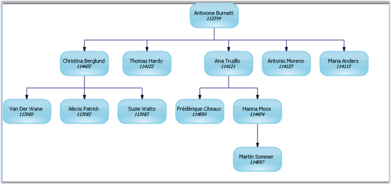
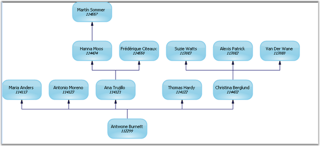

::: {style="DISPLAY: none"}
{#d2h_url_template}{#d2h_package_url style="WIDTH: 0px; DISPLAY: none; HEIGHT: 0px"}
:::

:::: {.d2h_secondary_topic style="PADDING-BOTTOM: 10pt; MARGIN: 0pt; PADDING-LEFT: 0pt; PADDING-RIGHT: 0pt; PADDING-TOP: 0pt"}
#### OrgChart Layout Manager  {#orgchart-layout-manager style="tab-stops: 0pt"}

[]{style="FONT-FAMILY: 'Trebuchet MS','sans-serif'; COLOR: #15428b; FONT-SIZE: 9pt"} 

Event arranges all the nodes in parent-child relationship with the new OrgLineConnector that connects the nodes to get the OrgLayout appearance. The OrgLineConnector is specially designed for connecting the nodes in OrgChartLayoutManager.

[]{style="FONT-FAMILY: 'Trebuchet MS','sans-serif'; COLOR: #15428b; FONT-SIZE: 9pt"} 

::: {align="center"}
+-----------------------------------+-------------------------------------------------------------------------------------------+
| Property                          | Description                                                                               |
+-----------------------------------+-------------------------------------------------------------------------------------------+
| Model                             | Represents the model of the diagram, which is displayed as an OrgLayout.                  |
+-----------------------------------+-------------------------------------------------------------------------------------------+
| RotationDirection                 | Gets / sets the layout directions. There are four major directions, which are as follows: |
|                                   |                                                                                           |
|                                   | []{style="FONT-FAMILY: 'Trebuchet MS','sans-serif'; COLOR: #15428b; FONT-SIZE: 9pt"}      |
|                                   |                                                                                           |
|                                   | [·      ]{style="FONT-FAMILY: Symbol"}BottomToTop                                         |
|                                   |                                                                                           |
|                                   | [·      ]{style="FONT-FAMILY: Symbol"}LeftToRight                                         |
|                                   |                                                                                           |
|                                   | [·      ]{style="FONT-FAMILY: Symbol"}RightToLeft                                         |
|                                   |                                                                                           |
|                                   | [·      ]{style="FONT-FAMILY: Symbol"}TopToBottom                                         |
+-----------------------------------+-------------------------------------------------------------------------------------------+
| HorizontalSpacing                 | Holds the value for the horizontal offset between adjacent nodes (float value).           |
+-----------------------------------+-------------------------------------------------------------------------------------------+
| VerticalSpacing                   | Holds the value for the vertical offset between adjacent nodes (float value).             |
+-----------------------------------+-------------------------------------------------------------------------------------------+
:::

[]{style="FONT-FAMILY: 'Trebuchet MS','sans-serif'; COLOR: #15428b; FONT-SIZE: 9pt"} 

Programmatically, the organization layout manager instance should be created with the respective arguments, assigned to the Layout Manager and updated as follows.

[]{style="FONT-FAMILY: 'Trebuchet MS','sans-serif'; COLOR: #15428b; FONT-SIZE: 9pt"} 

+--------------------------------------------------------------------------------------------------------------------------------------------------------------------------------------------------------+
| **[\[C#\]]{style="FONT-FAMILY: 'Courier New'; COLOR: black"}**                                                                                                                                         |
|                                                                                                                                                                                                        |
| []{style="FONT-FAMILY: 'Courier New'"}                                                                                                                                                                 |
|                                                                                                                                                                                                        |
| [OrgChartLayoutManager manager = [new]{style="COLOR: blue"} OrgChartLayoutManager([this]{style="COLOR: blue"}.diagram.Model,RotateDirection.TopToBottom, 20, 50);]{style="FONT-FAMILY: 'Courier New'"} |
|                                                                                                                                                                                                        |
| [this]{style="FONT-FAMILY: 'Courier New'; COLOR: blue"}[.diagram1.LayoutManager = manager;]{style="FONT-FAMILY: 'Courier New'"}                                                                        |
|                                                                                                                                                                                                        |
| [this]{style="FONT-FAMILY: 'Courier New'; COLOR: blue"}[.diagram1.LayoutManager.UpdateLayout([null]{style="COLOR: blue"});]{style="FONT-FAMILY: 'Courier New'"}                                        |
+--------------------------------------------------------------------------------------------------------------------------------------------------------------------------------------------------------+

[]{style="FONT-FAMILY: 'Courier New'"} 

+---------------------------------------------------------------------------------------------------------------------------------------------------------------------------------------------------------------------------------------------------------------+
| **[\[VB\]]{style="FONT-FAMILY: 'Courier New'; COLOR: black"}**                                                                                                                                                                                                |
|                                                                                                                                                                                                                                                               |
| []{style="FONT-FAMILY: 'Courier New'; COLOR: blue"}                                                                                                                                                                                                           |
|                                                                                                                                                                                                                                                               |
| [Dim]{style="FONT-FAMILY: 'Courier New'; COLOR: blue"}[ manager [As]{style="COLOR: blue"} [New]{style="COLOR: blue"} OrgChartLayoutManager([Me]{style="COLOR: blue"}.diagram.Model, RotateDirection.TopToBottom, 20, 50)]{style="FONT-FAMILY: 'Courier New'"} |
|                                                                                                                                                                                                                                                               |
| [Me]{style="FONT-FAMILY: 'Courier New'; COLOR: blue"}[.diagram1.LayoutManager = manager]{style="FONT-FAMILY: 'Courier New'"}                                                                                                                                  |
|                                                                                                                                                                                                                                                               |
| [Me]{style="FONT-FAMILY: 'Courier New'; COLOR: blue"}[.diagram1.LayoutManager.UpdateLayout([Nothing]{style="COLOR: blue"})]{style="FONT-FAMILY: 'Courier New'"}                                                                                               |
+---------------------------------------------------------------------------------------------------------------------------------------------------------------------------------------------------------------------------------------------------------------+

[]{style="FONT-FAMILY: 'Trebuchet MS','sans-serif'; COLOR: #15428b; FONT-SIZE: 9pt"} 

Sample diagram is as follows.

**[]{style="FONT-FAMILY: 'Trebuchet MS','sans-serif'; COLOR: #15428b; FONT-SIZE: 9pt"}** 

{border="0"}

**[]{style="FONT-FAMILY: 'Trebuchet MS','sans-serif'; COLOR: #15428b; FONT-SIZE: 9pt"}** 

Figure 62: Top-to-Bottom Direction Organizational Chart Layout

**[]{style="FONT-FAMILY: 'Trebuchet MS','sans-serif'; COLOR: #15428b; FONT-SIZE: 9pt"}** 

{border="0"}

**[]{style="FONT-FAMILY: 'Trebuchet MS','sans-serif'; COLOR: #15428b; FONT-SIZE: 9pt"}** 

Figure 63: Bottom-to-Top Direction Organizational Chart Layout

**[]{style="FONT-FAMILY: 'Trebuchet MS','sans-serif'; COLOR: #15428b; FONT-SIZE: 9pt"}** 

OrgChart Alignment

**[]{style="FONT-FAMILY: 'Trebuchet MS','sans-serif'; COLOR: #15428b; FONT-SIZE: 9pt"}** 

As the OrgChartLayout follows a Waterfall model, whenever there is only one child node, the layout will be widened. To overcome this, Essential diagram enables you to align the single child node parallel to the parent node, which will reduce the layout structure.

[]{style="FONT-FAMILY: 'Trebuchet MS','sans-serif'; COLOR: #15428b; FONT-SIZE: 9pt"} 

+-----------------------------------------------------------------------------------------------------------------------------------------------------------------------------------------------------------------------------------------------------------------------------------------------------------------------------------------------------------------------------------------------------------------------------------------------------------------------------------------------------------------------------------------------------------------------------------------------------------------------------------------------------------------------------------------------------------------------------------------------------------------------------------------------------------------------------------------------------------------------------------------------------+
| **[\[C#\]]{style="FONT-FAMILY: 'Courier New'; COLOR: black"}**                                                                                                                                                                                                                                                                                                                                                                                                                                                                                                                                                                                                                                                                                                                                                                                                                                      |
|                                                                                                                                                                                                                                                                                                                                                                                                                                                                                                                                                                                                                                                                                                                                                                                                                                                                                                     |
| []{style="FONT-FAMILY: 'Courier New'; COLOR: black"}                                                                                                                                                                                                                                                                                                                                                                                                                                                                                                                                                                                                                                                                                                                                                                                                                                                |
|                                                                                                                                                                                                                                                                                                                                                                                                                                                                                                                                                                                                                                                                                                                                                                                                                                                                                                     |
| [OrgChartLayoutManager]{style="FONT-FAMILY: 'Courier New'; COLOR: teal"}[ manager = ]{style="FONT-FAMILY: 'Courier New'; COLOR: black"}[new]{style="FONT-FAMILY: 'Courier New'; COLOR: blue"}[ ]{style="FONT-FAMILY: 'Courier New'; COLOR: black"}[OrgChartLayoutManager]{style="FONT-FAMILY: 'Courier New'; COLOR: teal"}[(]{style="FONT-FAMILY: 'Courier New'; COLOR: black"}[this]{style="FONT-FAMILY: 'Courier New'; COLOR: blue"}[.diagram.Model, ]{style="FONT-FAMILY: 'Courier New'; COLOR: black"}[RotateDirection]{style="FONT-FAMILY: 'Courier New'; COLOR: teal"}[.TopToBottom, 20, 50, ]{style="FONT-FAMILY: 'Courier New'; COLOR: black"}[LayoutType]{style="FONT-FAMILY: 'Courier New'; COLOR: teal"}[.Waterfall, 1, ]{style="FONT-FAMILY: 'Courier New'; COLOR: black"}[true]{style="FONT-FAMILY: 'Courier New'; COLOR: blue"}[);]{style="FONT-FAMILY: 'Courier New'; COLOR: black"} |
+-----------------------------------------------------------------------------------------------------------------------------------------------------------------------------------------------------------------------------------------------------------------------------------------------------------------------------------------------------------------------------------------------------------------------------------------------------------------------------------------------------------------------------------------------------------------------------------------------------------------------------------------------------------------------------------------------------------------------------------------------------------------------------------------------------------------------------------------------------------------------------------------------------+

[]{style="FONT-FAMILY: 'Courier New'"} 

+----------------------------------------------------------------------------------------------------------------------------------------------------------------------------------------------------------------------------------------------------------------------------------------------------------------------------------------------------------------------------------------------------------------------------------------------------------------------------------------------------------------------------------------------------------+
| **[\[VB\]]{style="FONT-FAMILY: 'Courier New'; COLOR: black"}**                                                                                                                                                                                                                                                                                                                                                                                                                                                                                           |
|                                                                                                                                                                                                                                                                                                                                                                                                                                                                                                                                                          |
| []{style="FONT-FAMILY: 'Courier New'; COLOR: blue"}                                                                                                                                                                                                                                                                                                                                                                                                                                                                                                      |
|                                                                                                                                                                                                                                                                                                                                                                                                                                                                                                                                                          |
| [Dim]{style="FONT-FAMILY: 'Courier New'; COLOR: blue"}[ manager ]{style="FONT-FAMILY: 'Courier New'; COLOR: black"}[as New]{style="FONT-FAMILY: 'Courier New'; COLOR: blue"}[ OrgChartLayoutManager(]{style="FONT-FAMILY: 'Courier New'; COLOR: black"}[Me]{style="FONT-FAMILY: 'Courier New'; COLOR: blue"}[.diagram.Model,RotateDirection.TopToBottom, 20, 50,LayoutType.Waterfall, 1, ]{style="FONT-FAMILY: 'Courier New'; COLOR: black"}[True]{style="FONT-FAMILY: 'Courier New'; COLOR: blue"}[)]{style="FONT-FAMILY: 'Courier New'; COLOR: black"} |
+----------------------------------------------------------------------------------------------------------------------------------------------------------------------------------------------------------------------------------------------------------------------------------------------------------------------------------------------------------------------------------------------------------------------------------------------------------------------------------------------------------------------------------------------------------+

 

[]{#p40} 

 

[]{#related-topics}
::::
