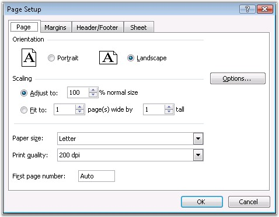
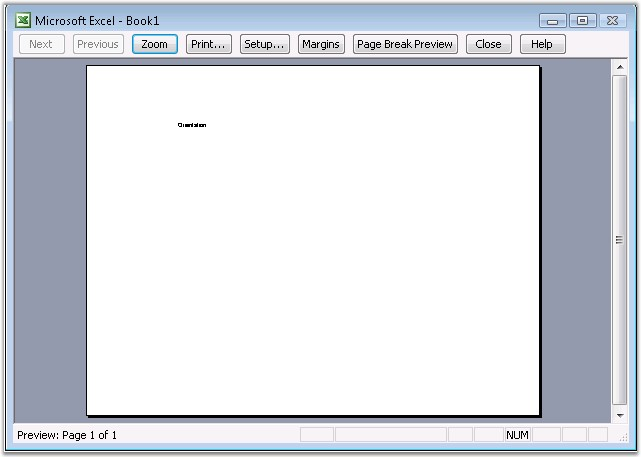

::: {style="DISPLAY: none"}
{#d2h_url_template}{#d2h_package_url style="WIDTH: 0px; DISPLAY: none; HEIGHT: 0px"}
:::

::: {.d2h_secondary_topic style="PADDING-BOTTOM: 10pt; MARGIN: 0pt; PADDING-LEFT: 0pt; PADDING-RIGHT: 0pt; PADDING-TOP: 0pt"}
#### Orientation {#orientation style="tab-stops: 0pt"}

 

While creating small worksheets, it is not necessary to change the direction/orientation of the pages, but some worksheets and charts require the width of the pages to be greater than its length.

 

Similar to the landscape painting, whose width is greater than the length, Landscape page orientation enables you to fit wider items on a page. A page, whose width is greater than the length, is called a Portrait orientation, like portraits of people.

 

Excel allows to change the orientation of the page, through the Page Setup dialog box. It allows to change the orientation to Landscape or Portrait.

 

{border="0"}

Figure 109: Page Setup - Page Orientation[]{style="FONT-FAMILY: 'Trebuchet MS','sans-serif'; COLOR: #15428b"}

 

XlsIO defines the orientation through the **Orientation** property of **IPageSetup**. Following code example illustrates how to set the page orientation.

 

+---------------------------------------------------------------------------------------------------------------------------------------------------------------------------+
| **[\[C#\]]{style="FONT-FAMILY: 'Courier New'"}**                                                                                                                          |
|                                                                                                                                                                           |
| **[]{style="FONT-FAMILY: 'Courier New'"}**                                                                                                                                |
|                                                                                                                                                                           |
| [// Setting the Page Orientation as Portrait or Landscape.      ]{style="FONT-FAMILY: 'Courier New'; COLOR: green"}[  ]{style="FONT-FAMILY: 'Courier New'; COLOR: black"} |
|                                                                                                                                                                           |
| [sheet.PageSetup.Orientation = ExcelPageOrientation.Landscape;]{style="FONT-FAMILY: 'Courier New'; COLOR: black"}                                                         |
+---------------------------------------------------------------------------------------------------------------------------------------------------------------------------+

[]{style="FONT-FAMILY: 'Trebuchet MS','sans-serif'; COLOR: #15428b; FONT-SIZE: 9pt"} 

+---------------------------------------------------------------------------------------------------------------------------------------------------------------------------+
| **[\[VB.NET\]]{style="FONT-FAMILY: 'Courier New'"}**                                                                                                                      |
|                                                                                                                                                                           |
| **[]{style="FONT-FAMILY: 'Courier New'"}**                                                                                                                                |
|                                                                                                                                                                           |
| [\' Setting the Page Orientation as Portrait or Landscape.    ]{style="FONT-FAMILY: 'Courier New'; COLOR: green"}[    ]{style="FONT-FAMILY: 'Courier New'; COLOR: black"} |
|                                                                                                                                                                           |
| [sheet.PageSetup.Orientation = ExcelPageOrientation.Landscape]{style="FONT-FAMILY: 'Courier New'; COLOR: black"}                                                          |
+---------------------------------------------------------------------------------------------------------------------------------------------------------------------------+

[]{style="FONT-FAMILY: 'Trebuchet MS','sans-serif'; COLOR: #15428b; FONT-SIZE: 9pt"} 

{border="0"}

Figure 110: XlsIO with Page Orientation Set[]{style="FONT-FAMILY: 'Trebuchet MS','sans-serif'; COLOR: #15428b"}

[]{style="FONT-FAMILY: 'Trebuchet MS','sans-serif'; COLOR: #15428b; FONT-SIZE: 9pt"} 

 

[]{#related-topics}
:::
