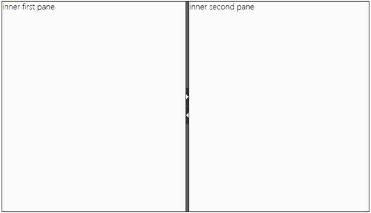
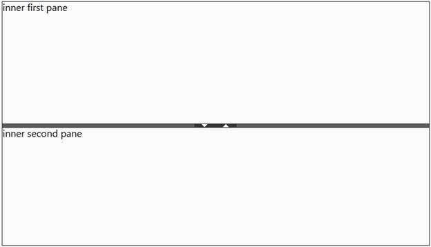

::: {style="DISPLAY: none"}
{#d2h_url_template}{#d2h_package_url style="WIDTH: 0px; DISPLAY: none; HEIGHT: 0px"}
:::

::: {.d2h_secondary_topic style="PADDING-BOTTOM: 10pt; MARGIN: 0pt; PADDING-LEFT: 0pt; PADDING-RIGHT: 0pt; PADDING-TOP: 0pt"}
#### Orientation {#orientation style="LINE-HEIGHT: 12pt; TEXT-INDENT: -43.2pt; MARGIN: 10pt 0pt 0pt 43.2pt; tab-stops: 43.2pt"}

The Splitter control supports both horizontal and vertical orientations.

 

**Properties**

+-------------+--------------------------------------------------------------------+------------------+-----------------------------+-------------+
| Name        | Description                                                        | Type of Property | Value it Accepts            | Dependency  |
+-------------+--------------------------------------------------------------------+------------------+-----------------------------+-------------+
| Orientation | Specifies the orientation of the splitter: vertical or horizontal. | Enum             | Horizontal                  | NA          |
|             |                                                                    |                  |                             |             |
|             | Orientation.Horizontal                                             |                  | Vertical                    |             |
|             |                                                                    |                  |                             |             |
|             | Orientation.Vertical                                               |                  | Default value is Horizontal |             |
+-------------+--------------------------------------------------------------------+------------------+-----------------------------+-------------+

 

You can orient the Splitter control in two different ways:

**[Using Builder]{style="COLOR: black"}**

The following steps guide you in configuring the orientation through Builder.

1.   In the **view**, invoke the **Splitter** helper with the splitter ID as the first argument, and enable the **Orientation** method with the desired option as its argument.

[]{style="FONT-FAMILY: 'Times New Roman','serif'; COLOR: black; FONT-SIZE: 12pt"} 

+--------------------------------------------------------------------------------------------------------------------------------------------------------------------------------------------------------------------------------------------------------------------------------------------------------+
| **[\[ASPX\]]{style="FONT-FAMILY: 'Courier New'"}**[]{style="FONT-FAMILY: 'Courier New'"}                                                                                                                                                                                                               |
|                                                                                                                                                                                                                                                                                                        |
| []{style="FONT-FAMILY: 'Courier New'"}                                                                                                                                                                                                                                                                 |
|                                                                                                                                                                                                                                                                                                        |
| [\<%]{style="FONT-FAMILY: 'Courier New'; BACKGROUND: yellow"}[=]{style="FONT-FAMILY: 'Courier New'; COLOR: blue"}[Html.Syncfusion().Splitter([\"splitter\"]{style="COLOR: #a31515"})]{style="FONT-FAMILY: 'Courier New'"}[.SplitterPanes(panes1=\>{ ]{style="FONT-FAMILY: Consolas; FONT-SIZE: 9.5pt"} |
|                                                                                                                                                                                                                                                                                                        |
| []{style="FONT-FAMILY: Consolas; FONT-SIZE: 9.5pt"}                                                                                                                                                                                                                                                    |
|                                                                                                                                                                                                                                                                                                        |
| [panes1.Add().PaneSize([Unit]{style="COLOR: #2b91af"}.Percentage(50)).ContentTemplate(()=\>{[%\>]{style="BACKGROUND: yellow"}]{style="FONT-FAMILY: Consolas; FONT-SIZE: 9.5pt"}                                                                                                                        |
|                                                                                                                                                                                                                                                                                                        |
| []{style="FONT-FAMILY: Consolas; FONT-SIZE: 9.5pt"}                                                                                                                                                                                                                                                    |
|                                                                                                                                                                                                                                                                                                        |
| [             [\<]{style="COLOR: blue"}[p]{style="COLOR: maroon"}[\>]{style="COLOR: blue"}inner first pane[\</]{style="COLOR: blue"}[p]{style="COLOR: maroon"}[\>]{style="COLOR: blue"}]{style="FONT-FAMILY: Consolas; FONT-SIZE: 9.5pt"}                                                              |
|                                                                                                                                                                                                                                                                                                        |
| []{style="FONT-FAMILY: Consolas; FONT-SIZE: 9.5pt"}                                                                                                                                                                                                                                                    |
|                                                                                                                                                                                                                                                                                                        |
| [\<%]{style="FONT-FAMILY: Consolas; BACKGROUND: yellow; FONT-SIZE: 9.5pt"}[}).SplitterBar(b=\>b.AllowSplitterBar([true]{style="COLOR: blue"})); ]{style="FONT-FAMILY: Consolas; FONT-SIZE: 9.5pt"}                                                                                                     |
|                                                                                                                                                                                                                                                                                                        |
| []{style="FONT-FAMILY: Consolas; FONT-SIZE: 9.5pt"}                                                                                                                                                                                                                                                    |
|                                                                                                                                                                                                                                                                                                        |
| [panes1.Add().PaneSize([Unit]{style="COLOR: #2b91af"}.Percentage(30)).ContentTemplate(()=\>{[%\>]{style="BACKGROUND: yellow"}]{style="FONT-FAMILY: Consolas; FONT-SIZE: 9.5pt"}                                                                                                                        |
|                                                                                                                                                                                                                                                                                                        |
| []{style="FONT-FAMILY: Consolas; FONT-SIZE: 9.5pt"}                                                                                                                                                                                                                                                    |
|                                                                                                                                                                                                                                                                                                        |
| [             [\<]{style="COLOR: blue"}[p]{style="COLOR: maroon"}[\>]{style="COLOR: blue"}inner second pane[\</]{style="COLOR: blue"}[p]{style="COLOR: maroon"}[\>]{style="COLOR: blue"}]{style="FONT-FAMILY: Consolas; FONT-SIZE: 9.5pt"}                                                             |
|                                                                                                                                                                                                                                                                                                        |
| []{style="FONT-FAMILY: Consolas; FONT-SIZE: 9.5pt"}                                                                                                                                                                                                                                                    |
|                                                                                                                                                                                                                                                                                                        |
| [   [\<%]{style="BACKGROUND: yellow"}});]{style="FONT-FAMILY: Consolas; FONT-SIZE: 9.5pt"}                                                                                                                                                                                                             |
|                                                                                                                                                                                                                                                                                                        |
| [})]{style="FONT-FAMILY: Consolas; FONT-SIZE: 9.5pt"}                                                                                                                                                                                                                                                  |
|                                                                                                                                                                                                                                                                                                        |
| [.**Orientation([SplitterOrientation]{style="COLOR: #2b91af"}.Horizontal)** [%\>]{style="BACKGROUND: yellow"}]{style="FONT-FAMILY: 'Courier New'"}                                                                                                                                                     |
|                                                                                                                                                                                                                                                                                                        |
| []{style="FONT-FAMILY: 'Courier New'"}                                                                                                                                                                                                                                                                 |
|                                                                                                                                                                                                                                                                                                        |
| [   ]{style="FONT-FAMILY: 'Courier New'"}                                                                                                                                                                                                                                                              |
+--------------------------------------------------------------------------------------------------------------------------------------------------------------------------------------------------------------------------------------------------------------------------------------------------------+

[]{style="FONT-FAMILY: 'Times New Roman','serif'; COLOR: black; FONT-SIZE: 12pt"} 

+---------------------------------------------------------------------------------------------------------------------------------------------------------------------------------------------------------------------------------------------------------------------------------------------------------------------------------------------------------------------------------------------------------------------------------+
| **[\[Razor\]]{style="FONT-FAMILY: 'Courier New'"}**[]{style="FONT-FAMILY: 'Courier New'"}                                                                                                                                                                                                                                                                                                                                       |
|                                                                                                                                                                                                                                                                                                                                                                                                                                 |
| []{style="FONT-FAMILY: 'Courier New'"}                                                                                                                                                                                                                                                                                                                                                                                          |
|                                                                                                                                                                                                                                                                                                                                                                                                                                 |
| [\@{]{style="FONT-FAMILY: 'Courier New'; BACKGROUND: yellow"}[Html.Syncfusion().Splitter([\"splitter\"]{style="COLOR: #a31515"})]{style="FONT-FAMILY: 'Courier New'"}[.SplitterPanes(panes1=\>{ ]{style="FONT-FAMILY: Consolas; FONT-SIZE: 9.5pt"}                                                                                                                                                                              |
|                                                                                                                                                                                                                                                                                                                                                                                                                                 |
| []{style="FONT-FAMILY: Consolas; FONT-SIZE: 9.5pt"}                                                                                                                                                                                                                                                                                                                                                                             |
|                                                                                                                                                                                                                                                                                                                                                                                                                                 |
| [panes1.Add().PaneSize([Unit]{style="COLOR: #2b91af"}.Percentage(50)).ContentTemplate(]{style="FONT-FAMILY: Consolas; FONT-SIZE: 9.5pt"}                                                                                                                                                                                                                                                                                        |
|                                                                                                                                                                                                                                                                                                                                                                                                                                 |
| []{style="FONT-FAMILY: Consolas; FONT-SIZE: 9.5pt"}                                                                                                                                                                                                                                                                                                                                                                             |
|                                                                                                                                                                                                                                                                                                                                                                                                                                 |
| [@]{style="FONT-FAMILY: Consolas; BACKGROUND: yellow; FONT-SIZE: 9.5pt"}[\<]{style="FONT-FAMILY: Consolas; COLOR: blue; FONT-SIZE: 9.5pt"}[p]{style="FONT-FAMILY: Consolas; COLOR: maroon; FONT-SIZE: 9.5pt"}[\>]{style="FONT-FAMILY: Consolas; COLOR: blue; FONT-SIZE: 9.5pt"}[inner first pane[\</]{style="COLOR: blue"}[p]{style="COLOR: maroon"}[\>]{style="COLOR: blue"}]{style="FONT-FAMILY: Consolas; FONT-SIZE: 9.5pt"} |
|                                                                                                                                                                                                                                                                                                                                                                                                                                 |
| []{style="FONT-FAMILY: Consolas; FONT-SIZE: 9.5pt"}                                                                                                                                                                                                                                                                                                                                                                             |
|                                                                                                                                                                                                                                                                                                                                                                                                                                 |
| [).SplitterBar(b=\>b.AllowSplitterBar([true]{style="COLOR: blue"})); ]{style="FONT-FAMILY: Consolas; FONT-SIZE: 9.5pt"}                                                                                                                                                                                                                                                                                                         |
|                                                                                                                                                                                                                                                                                                                                                                                                                                 |
| []{style="FONT-FAMILY: Consolas; FONT-SIZE: 9.5pt"}                                                                                                                                                                                                                                                                                                                                                                             |
|                                                                                                                                                                                                                                                                                                                                                                                                                                 |
| [panes1.Add().PaneSize([Unit]{style="COLOR: #2b91af"}.Percentage(30)).ContentTemplate(]{style="FONT-FAMILY: Consolas; FONT-SIZE: 9.5pt"}                                                                                                                                                                                                                                                                                        |
|                                                                                                                                                                                                                                                                                                                                                                                                                                 |
| [         [@]{style="BACKGROUND: yellow"}[\<]{style="COLOR: blue"}[p]{style="COLOR: maroon"}[\>]{style="COLOR: blue"}inner second pane[\</]{style="COLOR: blue"}[p]{style="COLOR: maroon"}[\>]{style="COLOR: blue"}]{style="FONT-FAMILY: Consolas; FONT-SIZE: 9.5pt"}                                                                                                                                                           |
|                                                                                                                                                                                                                                                                                                                                                                                                                                 |
| [  );]{style="FONT-FAMILY: Consolas; FONT-SIZE: 9.5pt"}                                                                                                                                                                                                                                                                                                                                                                         |
|                                                                                                                                                                                                                                                                                                                                                                                                                                 |
| [})]{style="FONT-FAMILY: Consolas; FONT-SIZE: 9.5pt"}                                                                                                                                                                                                                                                                                                                                                                           |
|                                                                                                                                                                                                                                                                                                                                                                                                                                 |
| [.**Orientation([SplitterOrientation]{style="COLOR: #2b91af"}.Horizontal)**.Render() [}]{style="BACKGROUND: yellow"}]{style="FONT-FAMILY: 'Courier New'"}                                                                                                                                                                                                                                                                       |
|                                                                                                                                                                                                                                                                                                                                                                                                                                 |
| []{style="FONT-FAMILY: 'Courier New'"}                                                                                                                                                                                                                                                                                                                                                                                          |
|                                                                                                                                                                                                                                                                                                                                                                                                                                 |
| [   ]{style="FONT-FAMILY: 'Courier New'"}                                                                                                                                                                                                                                                                                                                                                                                       |
+---------------------------------------------------------------------------------------------------------------------------------------------------------------------------------------------------------------------------------------------------------------------------------------------------------------------------------------------------------------------------------------------------------------------------------+

[]{style="COLOR: black"} 

2.   Run the application.

 

The following figures show the output.

**[]{style="COLOR: black"}** 

{border="0"}[]{style="FONT-FAMILY: 'Calibri','sans-serif'; FONT-SIZE: 11pt"}

Figure 257: Horizontal Splitter Control

 

{border="0"}

Figure 258: Vertical Splitter Control

 

[]{#related-topics}
:::
