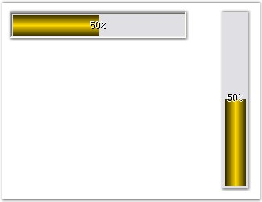

::: {style="DISPLAY: none"}
{#d2h_url_template}{#d2h_package_url style="WIDTH: 0px; DISPLAY: none; HEIGHT: 0px"}
:::

:::: {.d2h_secondary_topic style="PADDING-BOTTOM: 10pt; MARGIN: 0pt; PADDING-LEFT: 0pt; PADDING-RIGHT: 0pt; PADDING-TOP: 0pt"}
##### Orientation Settings {#orientation-settings style="MARGIN-LEFT: 18pt; tab-stops: 18.0pt"}

[]{style="COLOR: #4a5c8c; FONT-SIZE: 8pt"} 

The direction of display of the ProgressBarAdv control can be changed using the property given below.

[]{style="FONT-SIZE: 8pt"} 

::: {align="center"}
  ------------------------- ------------------------------------------------------------------
  ProgressBarAdv Property   Description
  ProgressOrientation       Determines the horizontal or vertical style of the progress bar.
  ------------------------- ------------------------------------------------------------------
:::

[]{style="COLOR: #15428b"} 

+---------------------------------------------------------------------------------------------------------------------------------------------------------------------------------------------------------+
| **[\[C#\]]{style="FONT-FAMILY: 'Courier New'; COLOR: black"}**                                                                                                                                          |
|                                                                                                                                                                                                         |
| []{style="FONT-FAMILY: 'Courier New'; COLOR: black"}                                                                                                                                                    |
|                                                                                                                                                                                                         |
| [this]{style="FONT-FAMILY: 'Courier New'; COLOR: blue"}[.progressBarAdv1.ProgressOrientation = System.Windows.Forms.[Orientation]{style="COLOR: teal"}.Horizontal;]{style="FONT-FAMILY: 'Courier New'"} |
|                                                                                                                                                                                                         |
| [this]{style="FONT-FAMILY: 'Courier New'; COLOR: blue"}[.progressBarAdv1.ProgressOrientation = System.Windows.Forms.[Orientation]{style="COLOR: teal"}.Vertical;]{style="FONT-FAMILY: 'Courier New'"}   |
+---------------------------------------------------------------------------------------------------------------------------------------------------------------------------------------------------------+

[]{style="COLOR: #15428b"} 

+-------------------------------------------------------------------------------------------------------------------------------------------------------------------------------+
| **[\[VB.NET\]]{style="FONT-FAMILY: 'Courier New'; COLOR: black"}**                                                                                                            |
|                                                                                                                                                                               |
| []{style="FONT-FAMILY: 'Courier New'; COLOR: black"}                                                                                                                          |
|                                                                                                                                                                               |
| [Me]{style="FONT-FAMILY: 'Courier New'; COLOR: blue"}[.progressBarAdv1.ProgressOrientation = System.Windows.Forms.Orientation.Horizontal]{style="FONT-FAMILY: 'Courier New'"} |
|                                                                                                                                                                               |
| [Me]{style="FONT-FAMILY: 'Courier New'; COLOR: blue"}[.progressBarAdv1.ProgressOrientation = System.Windows.Forms.Orientation.Vertical]{style="FONT-FAMILY: 'Courier New'"}   |
+-------------------------------------------------------------------------------------------------------------------------------------------------------------------------------+

[]{style="FONT-SIZE: 8pt"} 

{border="0"}

[]{style="COLOR: #15428b"} 

Figure 972: Horizontal and Vertical Orientation of ProgressBarAdv

 

 

 

[]{#p716} 

[]{#related-topics}
::::
