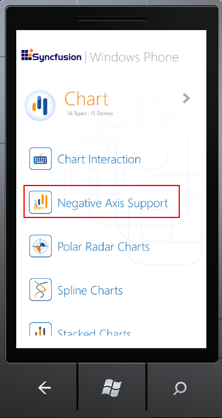
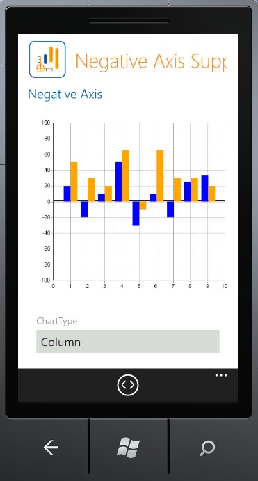

::: {style="DISPLAY: none"}
{#d2h_url_template}{#d2h_package_url style="WIDTH: 0px; DISPLAY: none; HEIGHT: 0px"}
:::

::: {.d2h_secondary_topic style="PADDING-BOTTOM: 10pt; MARGIN: 0pt; PADDING-LEFT: 0pt; PADDING-RIGHT: 0pt; PADDING-TOP: 0pt"}
#### Origin Axis Support {#origin-axis-support style="TEXT-ALIGN: justify; TEXT-INDENT: -54pt; MARGIN-LEFT: 54pt; tab-stops: 54.0pt"}

Essential Chart for Windows Phone ships with support for an origin axis. Users can customize the appearance of the axis which includes the thickness and stroke color. The values in the series are plotted in accordance with the origin line. Thus the negative values for the series will be plotted along the negative axis.

 

Use Case Scenarios

1.  Users can plot negative values by positioning the origin value at zero.

2.  Users can also reposition the origin line dynamically by changing the origin value of the axis.

Properties

+----------------------------------+------------------------------------------------+-----------------------------------------------+----------------------------------+--------------------------------------+
| **Property**                     | **Description**                                | **Type**                                      | **Data Type**                    | **Reference links**                  |
+----------------------------------+------------------------------------------------+-----------------------------------------------+----------------------------------+--------------------------------------+
| Origin[]{style="COLOR: #c00000"} | To place the origin for the axis               | Dependency Property[]{style="COLOR: #c00000"} | Double[]{style="COLOR: #c00000"} | Ref. Link[]{style="COLOR: #c00000"}  |
+----------------------------------+------------------------------------------------+-----------------------------------------------+----------------------------------+--------------------------------------+
| OriginLineStroke                 | Determines the stroke color of the origin line | Dependency property                           | Brush                            | Ref. Link[ ]{style="COLOR: #c00000"} |
|                                  |                                                |                                               |                                  |                                      |
|                                  |                                                |                                               |                                  |                                      |
|                                  |                                                |                                               |                                  |                                      |
|                                  |                                                |                                               |                                  |                                      |
+----------------------------------+------------------------------------------------+-----------------------------------------------+----------------------------------+--------------------------------------+
| OriginLineStrokeThickness        | Determines the thickness of the origin line    | Dependency Property                           | Double                           | Ref. Link[]{style="COLOR: #c00000"}  |
|                                  |                                                |                                               |                                  |                                      |
|                                  |                                                |                                               |                                  |                                      |
+----------------------------------+------------------------------------------------+-----------------------------------------------+----------------------------------+--------------------------------------+
| ShowOriginLine                   | Enables or disables display of the origin line | Dependency Property                           | Boolean                          | Ref. Link[]{style="COLOR: #c00000"}  |
+----------------------------------+------------------------------------------------+-----------------------------------------------+----------------------------------+--------------------------------------+

[]{style="FONT-FAMILY: 'Calibri','sans-serif'; COLOR: black"} 

Sample Link

1.  Open the Windows Phone sample browser.

2.  Navigate to **Chart** \> **Negative Axis Support**.

 

{border="0"}

Figure 108: WP7 Sample Browser: Negative Axis Support Sample

{border="0"}

Figure 109: WP7 Sample Browser: Negative Axis Sample Demo

 

[]{#related-topics}
:::
