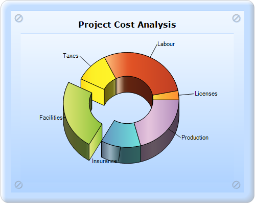
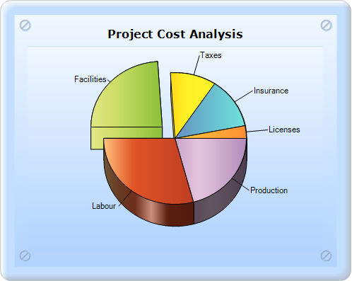
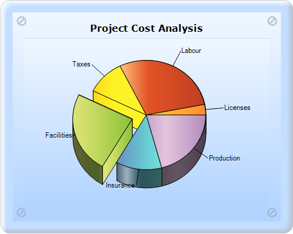
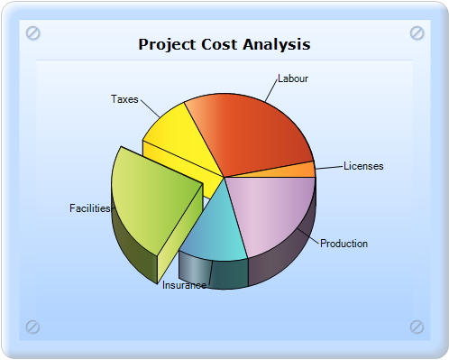
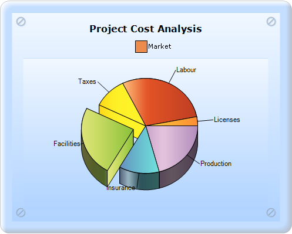
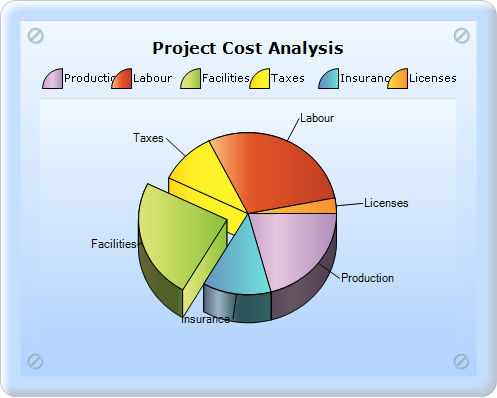
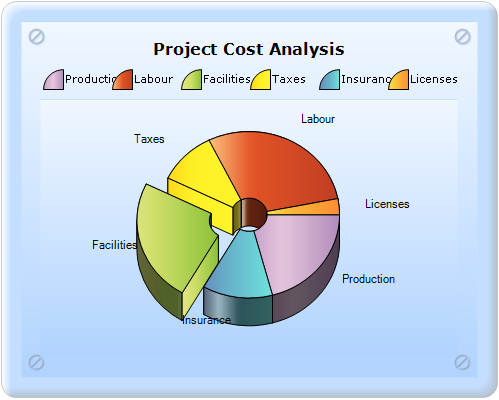

::: {style="DISPLAY: none"}
{#d2h_url_template}{#d2h_package_url style="WIDTH: 0px; DISPLAY: none; HEIGHT: 0px"}
:::

:::::::::::::: {.d2h_secondary_topic style="PADDING-BOTTOM: 10pt; MARGIN: 0pt; PADDING-LEFT: 0pt; PADDING-RIGHT: 0pt; PADDING-TOP: 0pt"}
##### Other Pie Related Properties {#other-pie-related-properties style="tab-stops: 0pt"}

[]{#_Insideradius}The properties that come under the other Pie related properties are the following:

[·      ]{style="FONT-FAMILY: Symbol"}InsideRadius

[·      ]{style="FONT-FAMILY: Symbol"}OptimizePiePointPositions

[·      ]{style="FONT-FAMILY: Symbol"}PieWithSameRadius

[·      ]{style="FONT-FAMILY: Symbol"}ShowTicks

[·      ]{style="FONT-FAMILY: Symbol"}VisibleAllPies

###### []{#_Insideradius_1}5.2.1.2.9.1 Insideradius {#insideradius style="tab-stops: 0pt"}

Insideradius gets or sets the radius of the doughnut hole of the Pie chart as a fraction of the radius of the pie.

::: {align="center"}
+------------------------------+---------------------------+
| Details                                                  |
+------------------------------+---------------------------+
| Possible values              | Ranges from 0.0f to 1.0f. |
+------------------------------+---------------------------+
| Default value                | None                      |
+------------------------------+---------------------------+
| 2D/3D limitations            | No                        |
+------------------------------+---------------------------+
| Application to chart element | All series                |
+------------------------------+---------------------------+
| Application to chart types   | Pie chart                 |
+------------------------------+---------------------------+
:::

[                ]{style="FONT-FAMILY: 'Calibri','sans-serif'"}

[                                ]{style="FONT-FAMILY: 'Calibri','sans-serif'"}

{border="0"}

Figure 180: Pie chart with Insideradius 0.5f

###### []{#_OptimizePiePointPositions}5.2.1.2.9.2 OptimizePiePointPositions {#optimizepiepointpositions style="tab-stops: 0pt"}

OptimizePiePointPositions specifies if the data points with smaller values are grouped together and ordered. By default, they are ordered in the order in which the points are added to the series.

::: {align="center"}
+-------------------------------------+-------------------------------------+
| Details                                                                   |
+-------------------------------------+-------------------------------------+
| Possible values                     | True - Enables optimization.        |
|                                     |                                     |
|                                     | False - Disables optimization.      |
+-------------------------------------+-------------------------------------+
| Default value                       | True                                |
+-------------------------------------+-------------------------------------+
| 2D/3D limitations                   | No                                  |
+-------------------------------------+-------------------------------------+
| Application to chart element        | Any series                          |
+-------------------------------------+-------------------------------------+
| Application to chart types          | Pie chart                           |
+-------------------------------------+-------------------------------------+
:::

[                ]{style="FONT-FAMILY: 'Calibri','sans-serif'"}

{border="0"}

Figure 181: OptimizePiePointsPosition as false in the Pie chart

[]{style="FONT-FAMILY: 'Calibri','sans-serif'"} 

###### []{#_PieWithSameradius}5.2.1.2.9.3 PieWithSameradius {#piewithsameradius style="tab-stops: 0pt"}

PieWithSameradius gets or sets whether the Pie chart is rendered in the same radius when the LabelStyle is set to Outside or OutsideInColumn.

 

::: {align="center"}
+------------------------------+-------------------------------+
| Details                                                      |
+------------------------------+-------------------------------+
| Possible values              | True or False                 |
+------------------------------+-------------------------------+
| Default value                | False                         |
+------------------------------+-------------------------------+
| 2D/3D limitations            | No                            |
+------------------------------+-------------------------------+
| Application to chart element | Any Pie series.               |
+------------------------------+-------------------------------+
| Application to chart types   | Pie chart and Doughnut chart. |
+------------------------------+-------------------------------+
:::

[]{style="FONT-FAMILY: 'Calibri','sans-serif'"} 

[]{#_ShowTicks}Setting this property to true will allow you to display the Pie chart with the same size in the **divided area**.

[]{style="FONT-FAMILY: 'Calibri','sans-serif'"} 

{border="0"}

Figure 182: OptimizePiePointPositions as true in the Pie chart

[]{style="FONT-FAMILY: 'Calibri','sans-serif'"} 

###### []{#_ShowTicks_1}5.2.1.2.9.4 ShowTicks {#showticks style="tab-stops: 0pt"}

ShowTicks indicates whether ticks should be shown or not.

::: {align="center"}
+-------------------------------------+-------------------------------------+
| Details                                                                   |
+-------------------------------------+-------------------------------------+
| Possible values                     | True - Displays ticks.              |
|                                     |                                     |
|                                     | False - Hides ticks.                |
+-------------------------------------+-------------------------------------+
| Default value                       | True                                |
+-------------------------------------+-------------------------------------+
| 2D/3D limitations                   | No                                  |
+-------------------------------------+-------------------------------------+
| Application to chart element        | Any series                          |
+-------------------------------------+-------------------------------------+
| Application to chart types          | Pie chart                           |
+-------------------------------------+-------------------------------------+
:::

[]{style="FONT-FAMILY: 'Times New Roman','serif'; FONT-SIZE: 12pt"} 

{border="0"}

Figure 183: Pie chart with ShowTicks as False

[]{style="FONT-FAMILY: 'Times New Roman','serif'; FONT-SIZE: 12pt"} 

{border="0"}

Figure 184: Pie chart with ShowTicks

###### []{#_VisibleAllPies}5.2.1.2.9.5 VisibleAllPies {#visibleallpies style="tab-stops: 0pt"}

VisibleAllPies specifies whether the legend is to be displayed with one legend item for each slice in the pie.

 

::: {align="center"}
+-------------------------------------+----------------------------------------------------------------------+
| Details                                                                                                    |
+-------------------------------------+----------------------------------------------------------------------+
| Possible values                     | True - Indicates only one legend item for all the slices in the pie. |
|                                     |                                                                      |
|                                     | False - Indicates one legend item for each slice in the pie.         |
+-------------------------------------+----------------------------------------------------------------------+
| Default value                       | False                                                                |
+-------------------------------------+----------------------------------------------------------------------+
| 2D/3D limitations                   | No                                                                   |
+-------------------------------------+----------------------------------------------------------------------+
| Application to chart element        | Any series                                                           |
+-------------------------------------+----------------------------------------------------------------------+
| Application to chart types          | Pie chart                                                            |
+-------------------------------------+----------------------------------------------------------------------+
:::

[]{style="FONT-FAMILY: 'Calibri','sans-serif'"} 

{border="0"}

Figure 185: Pie chart with VisibleAllPies property

 

{border="0"}

Figure 186: Pie chart with VisibleAllPies as false

[]{style="FONT-FAMILY: 'Calibri','sans-serif'"} 

###### 5.2.1.2.9.6 Creation of Pie Chart with the Other Pie Related Properties {#creation-of-pie-chart-with-the-other-pie-related-properties style="tab-stops: 0pt"}

[]{style="FONT-FAMILY: 'Calibri','sans-serif'"} 

Pie chart with the other Pie related properties can be created in two ways:

[·      ]{style="FONT-FAMILY: Symbol"}Builder

[·    ]{style="FONT-FAMILY: Symbol; FONT-SIZE: 12pt"}ChartModel[]{style="FONT-FAMILY: 'Times New Roman','serif'; FONT-SIZE: 12pt"}

[]{style="FONT-FAMILY: 'Times New Roman','serif'; FONT-SIZE: 12pt"} 

5.2.1.2.9.6.1      Builder

To create a Pie chart and set its other Pie related properties through Builder:

1.   In Controller, return view to the corresponding View page.

2.   In the View page, invoke the ChartBuilder by using the control ID as the first argument.

3.   Add the **Series** to the ChartModel and [set the Chart Type to **Pie**]{style="COLOR: black"}, and add the **Points** to the series and set the style.

4.   Set the ChartModel and ChartArea properties.

5.   Set the Pie related properties, as specified in the code snippets displayed below.

[]{style="FONT-FAMILY: 'Calibri','sans-serif'"} 

::: {style="BORDER-BOTTOM: #c8c8c8 1pt solid; BORDER-LEFT: #c8c8c8 1pt solid; PADDING-BOTTOM: 1pt; MARGIN-TOP: 0pt; PADDING-LEFT: 4pt; PADDING-RIGHT: 4pt; MARGIN-BOTTOM: 0pt; BACKGROUND: #f0f0f0; BORDER-TOP: #c8c8c8 1pt solid; BORDER-RIGHT: #c8c8c8 1pt solid; PADDING-TOP: 1pt"}
\[C#\]

[        [public]{style="COLOR: blue"} [ActionResult]{style="COLOR: #2b91af"} SimpleChart()]{style="FONT-FAMILY: 'Courier New'"}

[        {            ]{style="FONT-FAMILY: 'Courier New'"}

[            [return]{style="COLOR: blue"} View();]{style="FONT-FAMILY: 'Courier New'"}

[        }]{style="FONT-FAMILY: 'Courier New'"}
:::

[]{style="FONT-FAMILY: 'Calibri','sans-serif'"} 

::: {style="BORDER-BOTTOM: #c8c8c8 1pt solid; BORDER-LEFT: #c8c8c8 1pt solid; PADDING-BOTTOM: 1pt; MARGIN-TOP: 0pt; PADDING-LEFT: 4pt; PADDING-RIGHT: 4pt; MARGIN-BOTTOM: 0pt; BACKGROUND: #f0f0f0; BORDER-TOP: #c8c8c8 1pt solid; BORDER-RIGHT: #c8c8c8 1pt solid; PADDING-TOP: 1pt"}
View \[ASPX\]

[    ]{style="FONT-FAMILY: Consolas; FONT-SIZE: 9.5pt"}[\<%]{style="FONT-FAMILY: 'Courier New'; BACKGROUND: yellow"}[=]{style="FONT-FAMILY: 'Courier New'; COLOR: blue"}[Html.Chart([\"chart_Model\"]{style="COLOR: #a31515"}).Text([\"Project Cost Analysis\"]{style="COLOR: #a31515"}).Series(series =\>]{style="FONT-FAMILY: 'Courier New'"}

[        {]{style="FONT-FAMILY: 'Courier New'"}

[            series.Add()]{style="FONT-FAMILY: 'Courier New'"}

[                  .Name([\"Market\"]{style="COLOR: #a31515"})]{style="FONT-FAMILY: 'Courier New'"}

[                  .Type(Syncfusion.Windows.Forms.Chart.[ChartSeriesType]{style="COLOR: #2b91af"}.Pie)]{style="FONT-FAMILY: 'Courier New'"}

[            [//\-\-\-\-\-\-\-\-\-\-\-\-\-- Add the remaining points to the series and set some stylings you want, to the series \-\-\-\-\-\-\-\-\-\-\-\-\-\-\-\-\--]{style="COLOR: green"}]{style="FONT-FAMILY: 'Courier New'"}

**[                 .ExplodedIndex(2)]{style="FONT-FAMILY: 'Courier New'"}**

**[                  .InSideRadius(0.2f)]{style="FONT-FAMILY: 'Courier New'"}**

**[                  .OptimizePiePointPositions([true]{style="COLOR: blue"})]{style="FONT-FAMILY: 'Courier New'"}**

**[                  .ShowTicks([false]{style="COLOR: blue"})                  ]{style="FONT-FAMILY: 'Courier New'"}**

**[                  .ConfigItems(configItems =\> {]{style="FONT-FAMILY: 'Courier New'"}**

**[                      configItems.PieItem(item =\> {]{style="FONT-FAMILY: 'Courier New'"}**

**[                          item.PieWithSameRadius([true]{style="COLOR: blue"});                     ]{style="FONT-FAMILY: 'Courier New'"}**

**[                      });]{style="FONT-FAMILY: 'Courier New'"}**

**[                  });]{style="FONT-FAMILY: 'Courier New'"}**

[        ]{style="FONT-FAMILY: 'Courier New'"}

[        })]{style="FONT-FAMILY: 'Courier New'"}

[ **             .ChartArea(area =\>{**]{style="FONT-FAMILY: 'Courier New'"}

**[                  area.VisibleAllPies([false]{style="COLOR: blue"});]{style="FONT-FAMILY: 'Courier New'"}**

**[              })]{style="FONT-FAMILY: 'Courier New'"}**

[    //\-\-\-\-\-\-\-\-\-\-\-\-- Set the required properties to chartmodel to set skin, size, legend visibility and so on  \-\-\-\-\-\-\-\-\-\-\-\-\-\-\-\-\-\-\-\-\-\-\--]{style="FONT-FAMILY: 'Courier New'; COLOR: green"}[    ]{style="FONT-FAMILY: 'Courier New'"}

[    [%\>]{style="BACKGROUND: yellow"}]{style="FONT-FAMILY: 'Courier New'"}

[]{style="FONT-FAMILY: 'Courier New'; BACKGROUND: yellow"} 
:::

[]{style="FONT-FAMILY: Consolas; BACKGROUND: yellow; FONT-SIZE: 9.5pt"} 

[]{style="FONT-FAMILY: 'Calibri','sans-serif'"} 

::: {style="BORDER-BOTTOM: #c8c8c8 1pt solid; BORDER-LEFT: #c8c8c8 1pt solid; PADDING-BOTTOM: 1pt; MARGIN-TOP: 0pt; PADDING-LEFT: 4pt; PADDING-RIGHT: 4pt; MARGIN-BOTTOM: 0pt; BACKGROUND: #f0f0f0; BORDER-TOP: #c8c8c8 1pt solid; BORDER-RIGHT: #c8c8c8 1pt solid; PADDING-TOP: 1pt"}
View \[cshtml\]

[    ]{style="FONT-FAMILY: Consolas; FONT-SIZE: 9.5pt"}[\@{]{style="FONT-FAMILY: 'Courier New'; BACKGROUND: yellow"}[ Html.Chart([\"chart_Model\"]{style="COLOR: #a31515"}).Text([\"Project Cost Analysis\"]{style="COLOR: #a31515"}).Series(series =\>]{style="FONT-FAMILY: 'Courier New'"}

[        {]{style="FONT-FAMILY: 'Courier New'"}

[            series.Add()]{style="FONT-FAMILY: 'Courier New'"}

[                  .Name([\"Market\"]{style="COLOR: #a31515"})]{style="FONT-FAMILY: 'Courier New'"}

[                  .Type(Syncfusion.Windows.Forms.Chart.[ChartSeriesType]{style="COLOR: #2b91af"}.Pie)]{style="FONT-FAMILY: 'Courier New'"}

[            [//\-\-\-\-\-\-\-\-\-\-\-\-\-- Add the remaining points to the series and set some stylings you want, to the series \-\-\-\-\-\-\-\-\-\-\-\-\-\-\-\-\--]{style="COLOR: green"}]{style="FONT-FAMILY: 'Courier New'"}

**[                 .ExplodedIndex(2)]{style="FONT-FAMILY: 'Courier New'"}**

**[                  .InSideRadius(0.2f)]{style="FONT-FAMILY: 'Courier New'"}**

**[                  .OptimizePiePointPositions([true]{style="COLOR: blue"})]{style="FONT-FAMILY: 'Courier New'"}**

**[                  .ShowTicks([false]{style="COLOR: blue"})                  ]{style="FONT-FAMILY: 'Courier New'"}**

**[                  .ConfigItems(configItems =\> {]{style="FONT-FAMILY: 'Courier New'"}**

**[                      configItems.PieItem(item =\> {]{style="FONT-FAMILY: 'Courier New'"}**

**[                          item.PieWithSameRadius([true]{style="COLOR: blue"});                     ]{style="FONT-FAMILY: 'Courier New'"}**

**[                      });]{style="FONT-FAMILY: 'Courier New'"}**

**[                  });]{style="FONT-FAMILY: 'Courier New'"}**

[        ]{style="FONT-FAMILY: 'Courier New'"}

[        })]{style="FONT-FAMILY: 'Courier New'"}

[ **             .ChartArea(area =\>{**]{style="FONT-FAMILY: 'Courier New'"}

**[                  area.VisibleAllPies([false]{style="COLOR: blue"});]{style="FONT-FAMILY: 'Courier New'"}**

**[              })]{style="FONT-FAMILY: 'Courier New'"}**

[    //\-\-\-\-\-\-\-\-\-\-\-\-- Set the required properties to chartmodel to set skin, size, legend visibility and so on  \-\-\-\-\-\-\-\-\-\-\-\-\-\-\-\-\-\-\-\-\-\-\--]{style="FONT-FAMILY: 'Courier New'; COLOR: green"}[    ]{style="FONT-FAMILY: 'Courier New'"}

[    [}]{style="BACKGROUND: yellow"}]{style="FONT-FAMILY: 'Courier New'"}

[]{style="FONT-FAMILY: 'Courier New'; BACKGROUND: yellow"} 
:::

[]{style="FONT-FAMILY: Consolas; BACKGROUND: yellow; FONT-SIZE: 9.5pt"} 

[]{style="FONT-FAMILY: Consolas; BACKGROUND: yellow; FONT-SIZE: 9.5pt"} 

[6.   ]{style="COLOR: black"}Run the code, to get the following output:[]{style="FONT-FAMILY: Consolas; COLOR: black; FONT-SIZE: 9.5pt"}

[]{style="FONT-FAMILY: Consolas; COLOR: black; FONT-SIZE: 9.5pt"} 

{border="0"}

Figure 187: Pie chart with VisibleAllPies = false, ShowTicks = False, PieWithSameRadius = true, InSideRadius = 0.2f, and OptimizePiePointPositions = true

[]{style="FONT-FAMILY: Consolas; BACKGROUND: yellow; FONT-SIZE: 9.5pt"} 

5.2.1.2.9.6.2      ChartModel

 

To create a Pie chart and set its other Pie related properties through ChartModel:

 

1.   In Controller, create an instance of **MVCChartModel**.

2.   Create an instance of **ChartSeries**, and set the Chart Type to **Pie**.

3.   Set the ChartSeries, ChartArea, and ChartModel properties.

4.   Set the Pie related properties, as specified in the code displayed below.

[]{style="FONT-FAMILY: 'Calibri','sans-serif'; COLOR: black"} 

::: {style="BORDER-BOTTOM: #c8c8c8 1pt solid; BORDER-LEFT: #c8c8c8 1pt solid; PADDING-BOTTOM: 1pt; MARGIN-TOP: 0pt; PADDING-LEFT: 4pt; PADDING-RIGHT: 4pt; MARGIN-BOTTOM: 0pt; BACKGROUND: #f0f0f0; BORDER-TOP: #c8c8c8 1pt solid; BORDER-RIGHT: #c8c8c8 1pt solid; PADDING-TOP: 1pt"}
[            series1.Style.DisplayText = [true]{style="COLOR: blue"};]{style="FONT-FAMILY: 'Courier New'"}

[]{style="FONT-FAMILY: 'Courier New'"} 

[            series1.ConfigItems.PieItem.PieWithSameRadius = [true]{style="COLOR: blue"};]{style="FONT-FAMILY: 'Courier New'"}

[            series1.OptimizePiePointPositions = [true]{style="COLOR: blue"};]{style="FONT-FAMILY: 'Courier New'"}

[            series1.ShowTicks = [false]{style="COLOR: blue"};]{style="FONT-FAMILY: 'Courier New'"}

[            series1.InSideRadius = 0.2f;]{style="FONT-FAMILY: 'Courier New'"}

[]{style="FONT-FAMILY: 'Courier New'"} 

[            ]{style="FONT-FAMILY: 'Courier New'"}

[            chartModel.Series.Add(series1);]{style="FONT-FAMILY: 'Courier New'"}

[           chartModel.ChartArea.VisibleAllPies = [false]{style="COLOR: blue"};]{style="FONT-FAMILY: 'Courier New'"}

[]{style="FONT-FAMILY: Consolas; FONT-SIZE: 9.5pt"} 
:::

**[]{style="FONT-FAMILY: Consolas"}** 

5.   Return view to the corresponding View page after setting the ChartModel to the ViewData.

6.   Refer to the following code snippets.

 

+---------------------------------------------------------------------------------------------------------------------------------------------------------------------------------------------------------------------------------------------------------------------------+
| \[C#\]                                                                                                                                                                                                                                                                    |
|                                                                                                                                                                                                                                                                           |
| [        [public]{style="COLOR: blue"} [ActionResult]{style="COLOR: #2b91af"} SimpleChart()]{style="FONT-FAMILY: 'Courier New'"}                                                                                                                                          |
|                                                                                                                                                                                                                                                                           |
| [        {            ]{style="FONT-FAMILY: 'Courier New'"}                                                                                                                                                                                                               |
|                                                                                                                                                                                                                                                                           |
| [           [MVCChartModel]{style="COLOR: #2b91af"} chartModel = [new]{style="COLOR: blue"} [MVCChartModel]{style="COLOR: #2b91af"}();]{style="FONT-FAMILY: 'Courier New'"}                                                                                               |
|                                                                                                                                                                                                                                                                           |
| []{style="FONT-FAMILY: 'Courier New'"}                                                                                                                                                                                                                                    |
|                                                                                                                                                                                                                                                                           |
| [            [// Create chart series and add data points to it.]{style="COLOR: green"}]{style="FONT-FAMILY: 'Courier New'"}                                                                                                                                               |
|                                                                                                                                                                                                                                                                           |
| [            [ChartSeries]{style="COLOR: #2b91af"} series1 = [new]{style="COLOR: blue"} [ChartSeries]{style="COLOR: #2b91af"}([\"Market\"]{style="COLOR: #a31515"});]{style="FONT-FAMILY: 'Courier New'"}                                                                 |
|                                                                                                                                                                                                                                                                           |
| [            series1.Type = [ChartSeriesType]{style="COLOR: #2b91af"}.Pie;]{style="FONT-FAMILY: 'Courier New'"}                                                                                                                                                           |
|                                                                                                                                                                                                                                                                           |
| [            series1.Points.Add(0, 20);        ]{style="FONT-FAMILY: 'Courier New'"}                                                                                                                                                                                      |
|                                                                                                                                                                                                                                                                           |
| [    //\-\-\-\-\-\-\-\-\-\-\-\-\-- Add the remaining points to the series and set some stylings you want to the series \-\-\-\-\-\-\-\-\-\-\-\-\-\-\-\-\--]{style="FONT-FAMILY: 'Courier New'; COLOR: green"}                                                             |
|                                                                                                                                                                                                                                                                           |
| **[            series1.Style.DisplayText = [true]{style="COLOR: blue"};]{style="FONT-FAMILY: 'Courier New'"}**                                                                                                                                                            |
|                                                                                                                                                                                                                                                                           |
| **[]{style="FONT-FAMILY: 'Courier New'"}**                                                                                                                                                                                                                                |
|                                                                                                                                                                                                                                                                           |
| **[            series1.ConfigItems.PieItem.PieWithSameRadius = [true]{style="COLOR: blue"};]{style="FONT-FAMILY: 'Courier New'"}**                                                                                                                                        |
|                                                                                                                                                                                                                                                                           |
| **[            series1.OptimizePiePointPositions = [true]{style="COLOR: blue"};]{style="FONT-FAMILY: 'Courier New'"}**                                                                                                                                                    |
|                                                                                                                                                                                                                                                                           |
| **[            series1.ShowTicks = [false]{style="COLOR: blue"};]{style="FONT-FAMILY: 'Courier New'"}**                                                                                                                                                                   |
|                                                                                                                                                                                                                                                                           |
| **[            series1.InSideRadius = 0.2f;]{style="FONT-FAMILY: 'Courier New'"}**                                                                                                                                                                                        |
|                                                                                                                                                                                                                                                                           |
| **[]{style="FONT-FAMILY: 'Courier New'"}**                                                                                                                                                                                                                                |
|                                                                                                                                                                                                                                                                           |
| **[            ]{style="FONT-FAMILY: 'Courier New'"}**                                                                                                                                                                                                                    |
|                                                                                                                                                                                                                                                                           |
| **[            chartModel.Series.Add(series1);]{style="FONT-FAMILY: 'Courier New'"}**                                                                                                                                                                                     |
|                                                                                                                                                                                                                                                                           |
| **[           chartModel.ChartArea.VisibleAllPies = [false]{style="COLOR: blue"};]{style="FONT-FAMILY: 'Courier New'"}**                                                                                                                                                  |
|                                                                                                                                                                                                                                                                           |
| []{style="FONT-FAMILY: 'Courier New'"}                                                                                                                                                                                                                                    |
|                                                                                                                                                                                                                                                                           |
| [           []{style="COLOR: green"}]{style="FONT-FAMILY: 'Courier New'"}                                                                                                                                                                                                 |
|                                                                                                                                                                                                                                                                           |
| [          //\-\-\-\-\-\-\-\-\-\-\-\-- Set the required properties to chartmodel to set skin, size, legend visibility and so on  \-\-\-\-\-\-\-\-\-\-\-\-\-\-\-\-\-\-\-\-\-\-\--]{style="FONT-FAMILY: 'Courier New'; COLOR: green"}[]{style="FONT-FAMILY: 'Courier New'"} |
|                                                                                                                                                                                                                                                                           |
| [            ]{style="FONT-FAMILY: 'Courier New'"}                                                                                                                                                                                                                        |
|                                                                                                                                                                                                                                                                           |
| [            ViewData.Model = chartModel;]{style="FONT-FAMILY: 'Courier New'"}                                                                                                                                                                                            |
|                                                                                                                                                                                                                                                                           |
| []{style="FONT-FAMILY: 'Courier New'"}                                                                                                                                                                                                                                    |
|                                                                                                                                                                                                                                                                           |
| [            [return]{style="COLOR: blue"} View();]{style="FONT-FAMILY: 'Courier New'"}                                                                                                                                                                                   |
|                                                                                                                                                                                                                                                                           |
| [}]{style="FONT-FAMILY: 'Courier New'"}                                                                                                                                                                                                                                   |
|                                                                                                                                                                                                                                                                           |
| []{style="FONT-FAMILY: 'Calibri','sans-serif'"}                                                                                                                                                                                                                           |
+---------------------------------------------------------------------------------------------------------------------------------------------------------------------------------------------------------------------------------------------------------------------------+

[]{style="FONT-FAMILY: Consolas; FONT-SIZE: 9.5pt"} 

7.   In the View page, invoke the ChartBuilder by using the control ID as the first argument, and convert the ViewData to **MVCChartModel** and set it as the second argument.

[]{style="FONT-FAMILY: Consolas; FONT-SIZE: 9.5pt"} 

 

::: {style="BORDER-BOTTOM: #c8c8c8 1pt solid; BORDER-LEFT: #c8c8c8 1pt solid; PADDING-BOTTOM: 1pt; MARGIN-TOP: 0pt; PADDING-LEFT: 4pt; PADDING-RIGHT: 4pt; MARGIN-BOTTOM: 0pt; BACKGROUND: #f0f0f0; BORDER-TOP: #c8c8c8 1pt solid; BORDER-RIGHT: #c8c8c8 1pt solid; PADDING-TOP: 1pt"}
View \[ASPX\]

 

[\<%]{style="FONT-FAMILY: 'Courier New'; BACKGROUND: yellow"}[=]{style="FONT-FAMILY: 'Courier New'; COLOR: blue"}[ Html.Chart([\"SimpleChart\"]{style="COLOR: #a31515"},([MVCChartModel]{style="COLOR: #2b91af"})ViewData.Model) [%\>]{style="BACKGROUND: yellow"}]{style="FONT-FAMILY: 'Courier New'"}
:::

[]{style="FONT-FAMILY: 'Calibri','sans-serif'"} 

 

::: {style="BORDER-BOTTOM: #c8c8c8 1pt solid; BORDER-LEFT: #c8c8c8 1pt solid; PADDING-BOTTOM: 1pt; MARGIN-TOP: 0pt; PADDING-LEFT: 4pt; PADDING-RIGHT: 4pt; MARGIN-BOTTOM: 0pt; BACKGROUND: #f0f0f0; BORDER-TOP: #c8c8c8 1pt solid; BORDER-RIGHT: #c8c8c8 1pt solid; PADDING-TOP: 1pt"}
View \[cshtml\]

 

[@(]{style="FONT-FAMILY: 'Courier New'; BACKGROUND: yellow"}[ ]{style="FONT-FAMILY: 'Courier New'"}[new]{style="FONT-FAMILY: Consolas; COLOR: blue; FONT-SIZE: 9.5pt"}[ [HtmlString]{style="COLOR: #2b91af"}]{style="FONT-FAMILY: Consolas; FONT-SIZE: 9.5pt"}[(]{style="FONT-FAMILY: 'Courier New'"}[Html.Chart([\"SimpleChart\"]{style="COLOR: #a31515"},([MVCChartModel]{style="COLOR: #2b91af"})ViewData.Model)]{style="FONT-FAMILY: Consolas; FONT-SIZE: 9.5pt"}[.ToString())]{style="FONT-FAMILY: 'Courier New'"}[)]{style="FONT-FAMILY: Consolas; BACKGROUND: yellow; FONT-SIZE: 9.5pt"}[]{style="FONT-FAMILY: Consolas; FONT-SIZE: 9.5pt"}

[]{style="FONT-FAMILY: Consolas; FONT-SIZE: 9.5pt"} 
:::

[8.   ]{style="COLOR: black"}Run the code, to get the following output:[]{style="FONT-FAMILY: Consolas; COLOR: black; FONT-SIZE: 9.5pt"}

[]{style="FONT-FAMILY: Consolas; COLOR: black; FONT-SIZE: 9.5pt"} 

{border="0"}

Figure 188: Pie chart with VisibleAllPies = false, ShowTicks = False, PieWithSameRadius = true, InSideRadius = 0.2f, and OptimizePiePointPositions = true

 

See Also

[PieChart]{style="COLOR: windowtext; TEXT-DECORATION: none; text-underline: none"}

[]{style="FONT-FAMILY: Consolas; COLOR: black; FONT-SIZE: 9.5pt"} 

[]{#related-topics}
::::::::::::::
