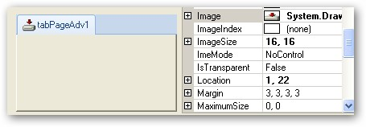

::: {style="DISPLAY: none"}
{#d2h_url_template}{#d2h_package_url style="WIDTH: 0px; DISPLAY: none; HEIGHT: 0px"}
:::

::::: {.d2h_secondary_topic style="PADDING-BOTTOM: 10pt; MARGIN: 0pt; PADDING-LEFT: 0pt; PADDING-RIGHT: 0pt; PADDING-TOP: 0pt"}
##### Other Settings {#other-settings style="MARGIN-LEFT: 18pt; tab-stops: 18.0pt"}

[]{style="COLOR: #15428b"} 

TabControlAdv now supports animation on tab pages. Animated image in GIF can be inserted in a tab page. The format supports up to 8 bits per pixel with a palette of up to 256 distinct colors chosen from the 24-bit RGB color space. Both 3D and 2D formats are supported.

                  Users can insert graphics or logos with solid areas of color, small animations, low-resolution film clips etc. to make the tab page more interactive and lively. The size of the image can also be adjusted.

[]{style="COLOR: #15428b"} 

There are two major properties which come into picture:

[·      ]{style="FONT-FAMILY: Symbol"}Image

[·      ]{style="FONT-FAMILY: Symbol"}Image size

[]{style="COLOR: #15428b"} 

{border="0"}

Figure 1045: Image Settings

[]{style="COLOR: #15428b"} 

The following table lists the properties of the GIF image:

[]{style="COLOR: #15428b"} 

::: {align="center"}
  ----------- ------------------------------------------------------------------------------------------- ------------------
   Property   Description                                                                                 Type of Property
  Image       Allows the user to insert the required image using the location where the image is saved.   Image
  ImageSize   Allows the users to modify the size of the image.                                           Size
  ----------- ------------------------------------------------------------------------------------------- ------------------
:::

[                       ]{style="COLOR: #15428b"}

[]{style="COLOR: #15428b"} 

[]{style="COLOR: #15428b"} 

Inserting GIF Image

**[]{style="COLOR: #15428b"}** 

The code should be in the following format:

+--------------------------------------------------------------------------------------------------------------------------------------------------------------------------------------------------------------+
| **[\[C#\]]{style="FONT-FAMILY: 'Courier New'; COLOR: black"}**                                                                                                                                               |
|                                                                                                                                                                                                              |
| **[]{style="FONT-FAMILY: 'Courier New'; COLOR: black"}**                                                                                                                                                     |
|                                                                                                                                                                                                              |
| [this]{style="FONT-FAMILY: 'Courier New'; COLOR: blue"}[.tabPageAdv.Image = [Image.FromFile(imagepath)]{style="COLOR: blue"};]{style="FONT-FAMILY: 'Courier New'"}                                           |
|                                                                                                                                                                                                              |
| [this]{style="FONT-FAMILY: 'Courier New'; COLOR: blue"}[.tabPageAdv.ImageSize = [new]{style="COLOR: blue"} System.Drawing.[Size]{style="COLOR: #2b91af"}(height,width);]{style="FONT-FAMILY: 'Courier New'"} |
+--------------------------------------------------------------------------------------------------------------------------------------------------------------------------------------------------------------+

[]{style="COLOR: #15428b"} 

**[]{style="COLOR: #15428b"}** 

The following code illustrates insertion of the required GIF image.

[]{style="COLOR: #15428b"} 

+-------------------------------------------------------------------------------------------------------------------------------------------------------------------------------------------------------+
| **[\[C#\]]{style="FONT-FAMILY: 'Courier New'; COLOR: black"}**                                                                                                                                        |
|                                                                                                                                                                                                       |
| **[]{style="FONT-FAMILY: 'Courier New'; COLOR: black"}**                                                                                                                                              |
|                                                                                                                                                                                                       |
| [this]{style="FONT-FAMILY: 'Courier New'; COLOR: blue"}[.tabPageAdv.Image = [Image.FromFile("sample.gif")]{style="COLOR: blue"};]{style="FONT-FAMILY: 'Courier New'"}                                 |
|                                                                                                                                                                                                       |
| [this]{style="FONT-FAMILY: 'Courier New'; COLOR: blue"}[.tabPageAdv.ImageSize = [new]{style="COLOR: blue"} System.Drawing.[Size]{style="COLOR: #2b91af"}(16,16);]{style="FONT-FAMILY: 'Courier New'"} |
+-------------------------------------------------------------------------------------------------------------------------------------------------------------------------------------------------------+

[]{style="COLOR: #15428b"} 

[]{style="COLOR: #15428b"} 

::: {style="BORDER-BOTTOM: windowtext 1pt solid; BORDER-LEFT: medium none; PADDING-BOTTOM: 1pt; MARGIN: 9pt 0pt 9pt 18pt; PADDING-LEFT: 0pt; PADDING-RIGHT: 0pt; BORDER-TOP: windowtext 1pt solid; BORDER-RIGHT: medium none; PADDING-TOP: 1pt"}
{border="0"}Note: Only when the ImageIndex property is -1, Image from the Image property will be displayed or else Image from ImageList will be displayed.
:::

[]{style="COLOR: #15428b"} 

Run the code. The required image is displayed.

 

 

 

[]{#related-topics}
:::::
