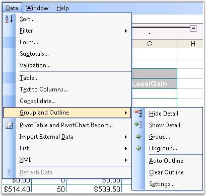
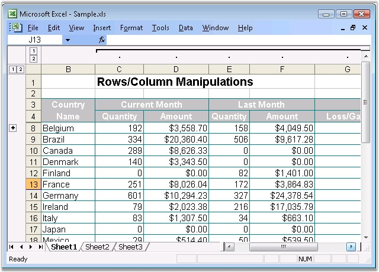
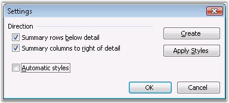
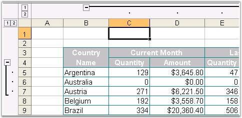

::: {style="DISPLAY: none"}
{#d2h_url_template}{#d2h_package_url style="WIDTH: 0px; DISPLAY: none; HEIGHT: 0px"}
:::

::::: {#nsbanner .d2h_main_nsbanner style="BORDER-BOTTOM: #999999 1px solid; POSITION: relative; PADDING-BOTTOM: 0px; BACKGROUND-COLOR: transparent; PADDING-LEFT: 0px; PADDING-RIGHT: 0px; DISPLAY: none; BORDER-TOP: #999999 1px solid; PADDING-TOP: 0px; LEFT: 0px"}
:::: {#TitleRow .d2h_main_titlerow style="PADDING-BOTTOM: 4px; BACKGROUND-COLOR: transparent; PADDING-LEFT: 22px; WIDTH: 100%; PADDING-RIGHT: 10px; DISPLAY: none; PADDING-TOP: 4px"}
::: {#ienav .d2h_main_ienav style="DISPLAY: none"}
{#D2HPrevious .D2HPreviousEnabled}  {#D2HNext .D2HNextEnabled}
:::
::::
:::::

:::: {#nstext .d2h_main_nstext style="PADDING-BOTTOM: 10px; BACKGROUND-COLOR: transparent; PADDING-LEFT: 22px; PADDING-RIGHT: 10px; HEIGHT: 100%; OVERFLOW: auto; PADDING-TOP: 5px" hasuserbackground="true" valign="bottom"}
::: {#d2h_breadcrumbs .d2h_breadcrumbs}
[Essential Studio User Guide Documentation](ms-xhelp:///?Id=12457748-09e3-4d74-a240-8e049cedf030){.d2h_breadcrumbsNormal}[ \> ]{.d2h_breadcrumbsLinkSeparator}[Reporting Edition](ms-xhelp:///?Id=027aa5b6-6676-4f93-ad23-c20e8c45792e){.d2h_breadcrumbsNormal}[ \> ]{.d2h_breadcrumbsLinkSeparator}[Essential XlsIO](ms-xhelp:///?Id=b01a1b50-1d7d-40c0-bc83-af67e57c9005){.d2h_breadcrumbsNormal}[ \> ]{.d2h_breadcrumbsLinkSeparator}[Concepts and Features](ms-xhelp:///?Id=21b26556-5905-4ad9-90b4-40320db25faf){.d2h_breadcrumbsNormal}[ \> ]{.d2h_breadcrumbsLinkSeparator}[Data](ms-xhelp:///?Id=09eb021a-c01a-47a5-bf60-fb7c3ed89c78){.d2h_breadcrumbsNormal}
:::

### Outlines {#outlines style="tab-stops: 0pt"}

**[]{style="FONT-FAMILY: 'Segoe UI','sans-serif'; COLOR: black"}** 

Microsoft Excel has grouping and outlining features, which allows you to group large quantities of data. You can group/ungroup a range of rows and columns. To do this, go to the **Data** menu, point to **Group and Outline**, and select **Group/UnGroup** in Excel.

 

{border="0"}

Figure 137: Grouping from Data Menu[]{style="FONT-FAMILY: 'Trebuchet MS','sans-serif'; COLOR: #15428b"}

[]{style="FONT-FAMILY: 'Trebuchet MS','sans-serif'; COLOR: #15428b; FONT-SIZE: 9pt"} 

 

**Grouping and Ungrouping in Essential XlsIO**

 

Essential XlsIO provides support to group and ungroup rows and columns by using the **Group** and **UnGroup** methods of **IRange.** You can also collapse or expand groups through one of its overload.

 

+-------------------------------------------------------------------------------------------------------------------------------------------------------------------------------------------------+
| **[\[C#\]]{style="FONT-FAMILY: 'Courier New'; FONT-SIZE: 11pt"}**                                                                                                                               |
|                                                                                                                                                                                                 |
| [    ]{style="FONT-FAMILY: 'Courier New'; FONT-SIZE: 11pt"}                                                                                                                                     |
|                                                                                                                                                                                                 |
| [// Grouping by Rows.]{style="FONT-FAMILY: 'Courier New'; COLOR: green; FONT-SIZE: 11pt"}                                                                                                       |
|                                                                                                                                                                                                 |
| [sheet.Range\[[\"A1:A3\"]{style="COLOR: #a31515"}\].Group([ExcelGroupBy]{style="COLOR: #2b91af"}.ByRows, [true]{style="COLOR: blue"});]{style="FONT-FAMILY: 'Courier New'; FONT-SIZE: 11pt"}    |
|                                                                                                                                                                                                 |
| [sheet.Range\[[\"A4:A6\"]{style="COLOR: #a31515"}\].Group([ExcelGroupBy]{style="COLOR: #2b91af"}.ByRows);]{style="FONT-FAMILY: 'Courier New'; FONT-SIZE: 11pt"}                                 |
|                                                                                                                                                                                                 |
| []{style="FONT-FAMILY: 'Courier New'; FONT-SIZE: 11pt"}                                                                                                                                         |
|                                                                                                                                                                                                 |
| [// Grouping by Columns.]{style="FONT-FAMILY: 'Courier New'; COLOR: green; FONT-SIZE: 11pt"}                                                                                                    |
|                                                                                                                                                                                                 |
| [sheet.Range\[[\"A1:B1\"]{style="COLOR: #a31515"}\].Group([ExcelGroupBy]{style="COLOR: #2b91af"}.ByColumns, [true]{style="COLOR: blue"});]{style="FONT-FAMILY: 'Courier New'; FONT-SIZE: 11pt"} |
|                                                                                                                                                                                                 |
| [sheet.Range\[[\"C1:F1\"]{style="COLOR: #a31515"}\].Group([ExcelGroupBy]{style="COLOR: #2b91af"}.ByColumns);]{style="FONT-FAMILY: 'Courier New'; FONT-SIZE: 11pt"}                              |
|                                                                                                                                                                                                 |
| []{style="FONT-FAMILY: 'Courier New'; FONT-SIZE: 11pt"}                                                                                                                                         |
|                                                                                                                                                                                                 |
| [//UnGroup by Rows]{style="FONT-FAMILY: 'Courier New'; COLOR: green; FONT-SIZE: 11pt"}                                                                                                          |
|                                                                                                                                                                                                 |
| [sheet.Range\[[\"A1:A3\"]{style="COLOR: #a31515"}\].UnGroup([ExcelGroupBy]{style="COLOR: #2b91af"}.ByRows);]{style="FONT-FAMILY: 'Courier New'; FONT-SIZE: 11pt"}                               |
|                                                                                                                                                                                                 |
| []{style="FONT-FAMILY: 'Courier New'; FONT-SIZE: 11pt"}                                                                                                                                         |
|                                                                                                                                                                                                 |
| [//Ungroup by columns]{style="FONT-FAMILY: 'Courier New'; COLOR: green; FONT-SIZE: 11pt"}                                                                                                       |
|                                                                                                                                                                                                 |
| [sheet.Range\[[\"C1:F1\"]{style="COLOR: #a31515"}\].UnGroup([ExcelGroupBy]{style="COLOR: #2b91af"}.ByColumns);]{style="FONT-FAMILY: 'Courier New'; FONT-SIZE: 11pt"}                            |
+-------------------------------------------------------------------------------------------------------------------------------------------------------------------------------------------------+

[]{style="FONT-FAMILY: 'Trebuchet MS','sans-serif'; COLOR: #15428b; FONT-SIZE: 9pt"} 

+----------------------------------------------------------------------------------------------------------------------------------------------------------------------------+
| **[\[VB.NET\]]{style="FONT-FAMILY: 'Courier New'; FONT-SIZE: 11pt"}**                                                                                                      |
|                                                                                                                                                                            |
| **[]{style="FONT-FAMILY: 'Courier New'; FONT-SIZE: 11pt"}**                                                                                                                |
|                                                                                                                                                                            |
| [\' Grouping by Rows.]{style="FONT-FAMILY: 'Courier New'; COLOR: green; FONT-SIZE: 11pt"}                                                                                  |
|                                                                                                                                                                            |
| [sheet.Range( [\"A1:A3\"]{style="COLOR: maroon"} ).Group(ExcelGroupBy.ByRows, [True]{style="COLOR: blue"})        ]{style="FONT-FAMILY: 'Courier New'; FONT-SIZE: 11pt"}   |
|                                                                                                                                                                            |
| [sheet.Range( [\"A4:A6\"]{style="COLOR: maroon"} ).Group(ExcelGroupBy.ByRows)]{style="FONT-FAMILY: 'Courier New'; FONT-SIZE: 11pt"}                                        |
|                                                                                                                                                                            |
| []{style="FONT-FAMILY: 'Courier New'; FONT-SIZE: 11pt"}                                                                                                                    |
|                                                                                                                                                                            |
| [\' Grouping by Columns.]{style="FONT-FAMILY: 'Courier New'; COLOR: green; FONT-SIZE: 11pt"}                                                                               |
|                                                                                                                                                                            |
| [sheet.Range( [\"A1:B1\"]{style="COLOR: maroon"} ).Group(ExcelGroupBy.ByColumns, [True]{style="COLOR: blue"})       ]{style="FONT-FAMILY: 'Courier New'; FONT-SIZE: 11pt"} |
|                                                                                                                                                                            |
| [sheet.Range( [\"C1:F1\"]{style="COLOR: maroon"} ).Group(ExcelGroupBy.ByColumns)]{style="FONT-FAMILY: 'Courier New'; FONT-SIZE: 11pt"}                                     |
|                                                                                                                                                                            |
| []{style="FONT-FAMILY: 'Courier New'; FONT-SIZE: 11pt"}                                                                                                                    |
|                                                                                                                                                                            |
| [\' UnGroup by Rows]{style="FONT-FAMILY: 'Courier New'; COLOR: green; FONT-SIZE: 11pt"}                                                                                    |
|                                                                                                                                                                            |
| [sheet.Range( [\"A1:A3\"]{style="COLOR: maroon"} ).UnGroup(ExcelGroupBy.ByRows)       ]{style="FONT-FAMILY: 'Courier New'; FONT-SIZE: 11pt"}                               |
|                                                                                                                                                                            |
| []{style="FONT-FAMILY: 'Courier New'; FONT-SIZE: 11pt"}                                                                                                                    |
|                                                                                                                                                                            |
| [\' Ungroup by columns]{style="FONT-FAMILY: 'Courier New'; COLOR: green; FONT-SIZE: 11pt"}                                                                                 |
|                                                                                                                                                                            |
| [sheet.Range( [\"C1:F1\"]{style="COLOR: maroon"} ).UnGroup(ExcelGroupBy.ByColumns)]{style="FONT-FAMILY: 'Courier New'; FONT-SIZE: 11pt"}                                   |
+----------------------------------------------------------------------------------------------------------------------------------------------------------------------------+

[]{style="FONT-FAMILY: 'Trebuchet MS','sans-serif'; COLOR: #15428b; FONT-SIZE: 9pt"} 

[]{style="FONT-FAMILY: 'Trebuchet MS','sans-serif'; COLOR: #15428b; FONT-SIZE: 9pt"} 

[]{style="FONT-FAMILY: 'Trebuchet MS','sans-serif'; COLOR: #15428b; FONT-SIZE: 9pt"} 

{border="0"}

Figure 138: Grouping in XlsIO[]{style="FONT-FAMILY: 'Trebuchet MS','sans-serif'; COLOR: #15428b"}

[]{style="FONT-FAMILY: 'Trebuchet MS','sans-serif'; COLOR: #15428b; FONT-SIZE: 9pt"} 

 

Excel has options to customize the Grouping settings through the **Settings** dialog box. You can show the Summary details row below or right of the column, by using the options provided in the Settings dialog box.

 

{border="0"}

Figure 139: Grouping Settings Dialog in MS Excel[]{style="FONT-FAMILY: 'Trebuchet MS','sans-serif'; COLOR: #15428b"}

[]{style="FONT-FAMILY: 'Trebuchet MS','sans-serif'; COLOR: #15428b; FONT-SIZE: 9pt"} 

 

In **XlsIO**, this is set by using the **IsSummaryRowBelow** and **IsSummaryColumnRight** properties of **IPageSetup** class.

 

Following screenshot shows the disabled state of summary settings.

 

{border="0"}

Figure 140: Summary Settings Disabled[]{style="FONT-FAMILY: 'Trebuchet MS','sans-serif'; COLOR: #15428b"}

***[]{style="FONT-FAMILY: 'Trebuchet MS','sans-serif'; COLOR: #15428b; FONT-SIZE: 9pt"}*** 

 

XlsIO also has options to check the existence of a group, and the level at which it exists. This can be done through the **IsGroupedByColumn/IsGroupedByRow** and **RowGroupLevel/ColumnGroupLevel** properties of IRange**.**

 

**Expand/Collapse Groups**

 

Essential XlsIO supports Expand and Collapse features for existing groups. Expand group comes with overloads that will allow to expand the entire parent including child groups. The Expand and Collapse features are available for both Column and Row groups[.]{style="FONT-FAMILY: 'Times New Roman','serif'; FONT-SIZE: 12pt"}

 

+----------------------------------------------------------------------------------------------------------------------------------------------------------------------------------------------------------------------------------+
| **[\[C#\]]{style="FONT-FAMILY: 'Courier New'; FONT-SIZE: 11pt"}**                                                                                                                                                                |
|                                                                                                                                                                                                                                  |
| [    ]{style="FONT-FAMILY: 'Courier New'; FONT-SIZE: 11pt"}                                                                                                                                                                      |
|                                                                                                                                                                                                                                  |
| [// Expand group with flag set to expand parent.]{style="FONT-FAMILY: 'Courier New'; COLOR: green; FONT-SIZE: 11pt"}                                                                                                             |
|                                                                                                                                                                                                                                  |
| [worksheet.Range\[[\"A11:A19\"]{style="COLOR: maroon"}\].ExpandGroup([ExcelGroupBy]{style="COLOR: teal"}.ByRows, [ExpandCollapseFlags]{style="COLOR: teal"}.ExpandParent);]{style="FONT-FAMILY: 'Courier New'; FONT-SIZE: 11pt"} |
|                                                                                                                                                                                                                                  |
| []{style="FONT-FAMILY: 'Courier New'; FONT-SIZE: 11pt"}                                                                                                                                                                          |
|                                                                                                                                                                                                                                  |
| [// Collapse group.]{style="FONT-FAMILY: 'Courier New'; COLOR: green; FONT-SIZE: 11pt"}                                                                                                                                          |
|                                                                                                                                                                                                                                  |
| [worksheet.Range\[[\"A61:A114\"]{style="COLOR: maroon"}\].CollapseGroup([ExcelGroupBy]{style="COLOR: teal"}.ByRows);]{style="FONT-FAMILY: 'Courier New'; FONT-SIZE: 11pt"}                                                       |
+----------------------------------------------------------------------------------------------------------------------------------------------------------------------------------------------------------------------------------+

[]{style="FONT-FAMILY: 'Trebuchet MS','sans-serif'; COLOR: #15428b; FONT-SIZE: 9pt"} 

+---------------------------------------------------------------------------------------------------------------------------------------------------------------------------------+
| **[\[VB.NET\]]{style="FONT-FAMILY: 'Courier New'; FONT-SIZE: 11pt"}**                                                                                                           |
|                                                                                                                                                                                 |
| **[]{style="FONT-FAMILY: 'Courier New'; FONT-SIZE: 11pt"}**                                                                                                                     |
|                                                                                                                                                                                 |
| [\' Expand group with flag set to expand parent.]{style="FONT-FAMILY: 'Courier New'; COLOR: green; FONT-SIZE: 11pt"}                                                            |
|                                                                                                                                                                                 |
| [worksheet.Range([\"A11:A19\"]{style="COLOR: maroon"}).ExpandGroup(ExcelGroupBy.ByRows, ExpandCollapseFlags.ExpandParent)]{style="FONT-FAMILY: 'Courier New'; FONT-SIZE: 11pt"} |
|                                                                                                                                                                                 |
| []{style="FONT-FAMILY: 'Courier New'; COLOR: green; FONT-SIZE: 11pt"}                                                                                                           |
|                                                                                                                                                                                 |
| [\' Collapse group.]{style="FONT-FAMILY: 'Courier New'; COLOR: green; FONT-SIZE: 11pt"}                                                                                         |
|                                                                                                                                                                                 |
| [worksheet.Range([\"A61:A114\"]{style="COLOR: maroon"}).CollapseGroup(ExcelGroupBy.ByRows)]{style="FONT-FAMILY: 'Courier New'; FONT-SIZE: 11pt"}                                |
+---------------------------------------------------------------------------------------------------------------------------------------------------------------------------------+

 

For More Information Refer:

 

[[AutoFilters]{.UGHyperlink}](ms-xhelp:///?Id=6831e662-45f8-4d4f-9fd6-fca02f6cfe2a)[, ]{style="FONT-FAMILY: 'Trebuchet MS','sans-serif'; COLOR: #15428b; FONT-SIZE: 9pt"}[[Validating Data]{.UGHyperlink}](ms-xhelp:///?Id=79a8ea83-f02e-466c-93a2-9733dac5cea0)[, ]{style="FONT-FAMILY: 'Trebuchet MS','sans-serif'; COLOR: #15428b; FONT-SIZE: 9pt"}[[Template Markers]{.UGHyperlink}](ms-xhelp:///?Id=b3c1fed0-82cd-40a6-934e-99766bcef5b9)[, ]{style="FONT-FAMILY: 'Trebuchet MS','sans-serif'; COLOR: #15428b; FONT-SIZE: 9pt"}[[Grouping and Ungrouping]{.UGHyperlink}]()[]{style="FONT-FAMILY: 'Trebuchet MS','sans-serif'; COLOR: black; FONT-SIZE: 9pt"}

**[]{style="FONT-FAMILY: 'Trebuchet MS','sans-serif'; COLOR: #15428b"}** 

[]{#p112} 

[]{#related-topics}
::::
