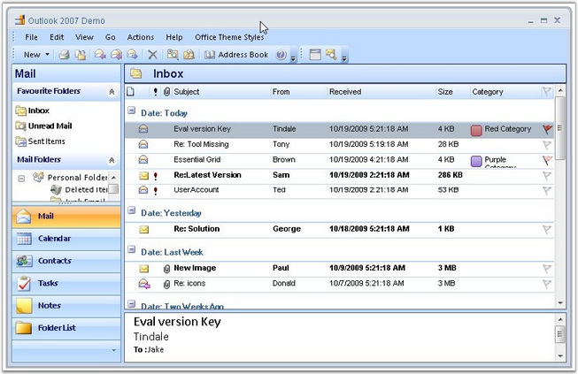

::: {style="DISPLAY: none"}
{#d2h_url_template}{#d2h_package_url style="WIDTH: 0px; DISPLAY: none; HEIGHT: 0px"}
:::

::: {.d2h_secondary_topic style="PADDING-BOTTOM: 10pt; MARGIN: 0pt; PADDING-LEFT: 0pt; PADDING-RIGHT: 0pt; PADDING-TOP: 0pt"}
##### Outlook 2007 Demo {#outlook-2007-demo style="tab-stops: 0pt"}

[]{style="FONT-FAMILY: 'Trebuchet MS','sans-serif'; COLOR: #15428b; FONT-SIZE: 9pt"} 

You can implement Microsoft Outlook 2007-like interface by using Essential Grid Grouping control and other components from Essential Studio. Essential Grid has been extended to support all the Office 2007 themes (Blue, Black, and Silver) with the look and feel of Outlook 2007.

[]{style="FONT-FAMILY: 'Trebuchet MS','sans-serif'; COLOR: #15428b; FONT-SIZE: 9pt"} 

{border="0"}

[]{style="FONT-FAMILY: 'Trebuchet MS','sans-serif'; COLOR: #15428b; FONT-SIZE: 9pt"} 

*[Figure ]{style="FONT-SIZE: 9pt"}[385]{style="FONT-SIZE: 9pt"}[: Microsoft Outlook 2007-like Interface implemented by using Grid Grouping Control]{style="FONT-SIZE: 9pt"}*

[]{style="FONT-FAMILY: 'Trebuchet MS','sans-serif'; COLOR: #15428b; FONT-SIZE: 9pt"} 

Refer the following browser sample for more details:

 

***\<Install Location\>\\Syncfusion\\EssentialStudio\\\[Version Number\]\\Windows\\Grid.Grouping.Windows\\Samples\\2.0\\Product Showcase\\Outlook 2007 Demo***

 

**Example**: Following are the major features of the sample.

 

**Features**

**[]{style="FONT-FAMILY: 'Trebuchet MS','sans-serif'; COLOR: #15428b"}** 

[·      ]{style="FONT-FAMILY: Symbol"}Office 2007 themes - Blue, Black, and Silver to see the effects of the application.

[·      ]{style="FONT-FAMILY: Symbol"}The grouping of columns in the mails display area. Right click on the column headers and select ArrangeBy in the column.

[·      ]{style="FONT-FAMILY: Symbol"}Custom selection navigation with all arrow keys.

[·      ]{style="FONT-FAMILY: Symbol"}Custom grouping for dates, size, priority, and flag fields.

[·      ]{style="FONT-FAMILY: Symbol"}Dynamic formatting when narrowly switching between column-set view and normal view.

[·      ]{style="FONT-FAMILY: Symbol"}Events when deleting records.

[·      ]{style="FONT-FAMILY: Symbol"}Customized current view.

[·      ]{style="FONT-FAMILY: Symbol"}Outlook appearance and functionalities.

 

[]{#p475} 

 

[]{#related-topics}
:::
