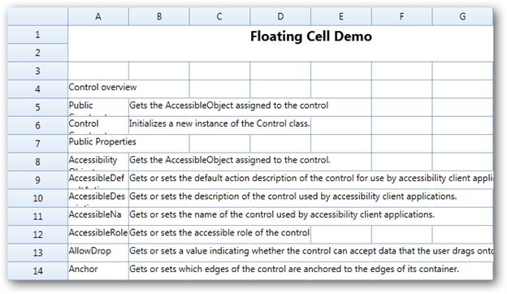

::: {style="DISPLAY: none"}
{#d2h_url_template}{#d2h_package_url style="WIDTH: 0px; DISPLAY: none; HEIGHT: 0px"}
:::

::: {.d2h_secondary_topic style="PADDING-BOTTOM: 10pt; MARGIN: 0pt; PADDING-LEFT: 0pt; PADDING-RIGHT: 0pt; PADDING-TOP: 0pt"}
#### Overlapping Cells {#overlapping-cells style="tab-stops: 0pt"}

    

Overlapping Cells behavior occurs when the text exceeds the length of the cell and will float to the adjacent cell in non-editing mode. Flooding behavior specifies whether a previous cell can be allowed to float over the corresponding cell even if it is empty. Floating cell is to enable the cell to float over the next cell while editing despite of the flooding or overlapping behavior.

 

To assign the floatingCell behavior to one particular cell or a certain range of cells

The FloatingCell behavior can be assigned to one particular cell or a certain range of cells as follows:

[]{style="FONT-FAMILY: Consolas; FONT-SIZE: 9.5pt"} 

+----------------------------------------------------------------------------------------------------------------------------------------------------------------+
| []{style="FONT-FAMILY: Consolas; FONT-SIZE: 9.5pt"}                                                                                                            |
|                                                                                                                                                                |
| [C#]{style="FONT-FAMILY: Consolas; FONT-SIZE: 9.5pt"}                                                                                                          |
|                                                                                                                                                                |
| []{style="FONT-FAMILY: Consolas; FONT-SIZE: 9.5pt"}                                                                                                            |
|                                                                                                                                                                |
| [//Provided as CellStyle]{style="FONT-FAMILY: Consolas; COLOR: green; FONT-SIZE: 9.5pt"}[]{style="FONT-FAMILY: Consolas; FONT-SIZE: 9.5pt"}                    |
|                                                                                                                                                                |
| [grid.Model\[4, 1\].EnableFloatCell = [true]{style="COLOR: blue"};]{style="FONT-FAMILY: Consolas; FONT-SIZE: 9.5pt"}                                           |
|                                                                                                                                                                |
| [grid.Model\[4, 1\].FloatCellMode = [GridFloatCellsMode]{style="COLOR: #2b91af"}.OnDemandCalculation;]{style="FONT-FAMILY: Consolas; FONT-SIZE: 9.5pt"}        |
|                                                                                                                                                                |
| [grid.Model\[1, 1\].FloodCell = [false]{style="COLOR: blue"};]{style="FONT-FAMILY: Consolas; FONT-SIZE: 9.5pt"}                                                |
|                                                                                                                                                                |
| []{style="FONT-FAMILY: Consolas; FONT-SIZE: 9.5pt"}                                                                                                            |
|                                                                                                                                                                |
| [//Provided as ColumnStyle]{style="FONT-FAMILY: Consolas; COLOR: green; FONT-SIZE: 9.5pt"}[]{style="FONT-FAMILY: Consolas; FONT-SIZE: 9.5pt"}                  |
|                                                                                                                                                                |
| [grid.Model.ColStyles\[2\].EnableFloatCell = [true]{style="COLOR: blue"};]{style="FONT-FAMILY: Consolas; FONT-SIZE: 9.5pt"}                                    |
|                                                                                                                                                                |
| [grid.Model.ColStyles\[2\].FloatCellMode = [GridFloatCellsMode]{style="COLOR: #2b91af"}.OnDemandCalculation;]{style="FONT-FAMILY: Consolas; FONT-SIZE: 9.5pt"} |
|                                                                                                                                                                |
| [grid.Model.ColStyles\[2\].FloodCell = [false]{style="COLOR: blue"};]{style="FONT-FAMILY: Consolas; FONT-SIZE: 9.5pt"}                                         |
|                                                                                                                                                                |
| []{style="FONT-FAMILY: Consolas; FONT-SIZE: 9.5pt"}                                                                                                            |
|                                                                                                                                                                |
| [//Provided as TableStyle]{style="FONT-FAMILY: Consolas; COLOR: green; FONT-SIZE: 9.5pt"}[]{style="FONT-FAMILY: Consolas; FONT-SIZE: 9.5pt"}                   |
|                                                                                                                                                                |
| [grid.Model.Options.EnableFloatCell = [true]{style="COLOR: blue"};]{style="FONT-FAMILY: Consolas; FONT-SIZE: 9.5pt"}                                           |
|                                                                                                                                                                |
| [grid.Model.Options.FloatCellMode = [GridFloatCellsMode]{style="COLOR: #2b91af"}.OnDemandCalculation;]{style="FONT-FAMILY: Consolas; FONT-SIZE: 9.5pt"}        |
|                                                                                                                                                                |
| [grid.Model.Options.FloodCell = [false]{style="COLOR: blue"};]{style="FONT-FAMILY: Consolas; FONT-SIZE: 9.5pt"}                                                |
|                                                                                                                                                                |
| []{style="FONT-FAMILY: Consolas; FONT-SIZE: 9.5pt"}                                                                                                            |
+----------------------------------------------------------------------------------------------------------------------------------------------------------------+

 

{border="0"}

Figure 47: Floating Cell

Properties, Methods and Events tables

Properties

+---------------------+-----------------------------------------------------------------------------------------------------+-----------------+--------------------------------+-----------------------------+
| Property            | Description                                                                                         | Type            | Data Type                      | Reference links             |
+---------------------+-----------------------------------------------------------------------------------------------------+-----------------+--------------------------------+-----------------------------+
| **EnableFloatCell** | This allows the user to float the cell while typing.                                                | Static Property | Boolean                        | []{style="COLOR: #c00000"}  |
|                     |                                                                                                     |                 |                                |                             |
|                     | This floats the cell in non-editing mode.                                                           |                 |                                |                             |
|                     |                                                                                                     |                 |                                |                             |
| **FloatCellMode**   | When the user specifies the property as false it will not allow the previous cell to float over it. | Static Property | GridFloatCellsMode (enum type) |                             |
|                     |                                                                                                     |                 |                                |                             |
|                     |                                                                                                     |                 |                                |                             |
|                     |                                                                                                     |                 |                                |                             |
| **FloodCell**       |                                                                                                     | Static Property | Boolean                        |                             |
|                     |                                                                                                     |                 |                                |                             |
|                     |                                                                                                     |                 |                                |                             |
|                     |                                                                                                     |                 |                                |                             |
|                     |                                                                                                     |                 |                                |                             |
|                     |                                                                                                     |                 |                                |                             |
|                     |                                                                                                     |                 |                                |                             |
+---------------------+-----------------------------------------------------------------------------------------------------+-----------------+--------------------------------+-----------------------------+

More:

[ ]{#related-topics}

[{border="0" align="absMiddle"}Features of Overlapping Cells](ms-xhelp:///?Id=943ea8ba-1d4b-4009-aa7a-de057c6aa7c9){style="TEXT-DECORATION: none"}
:::
