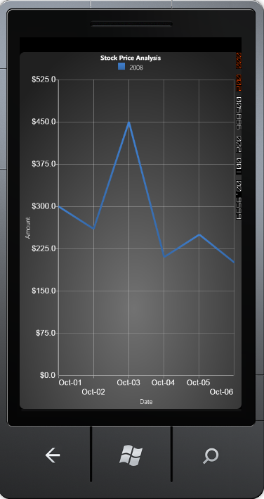
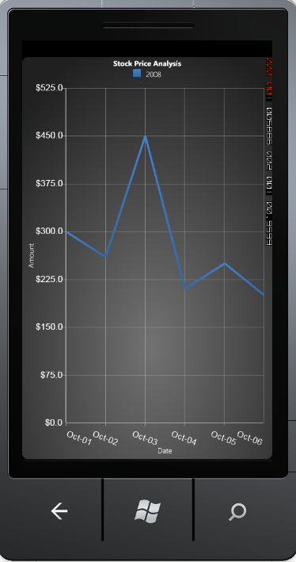
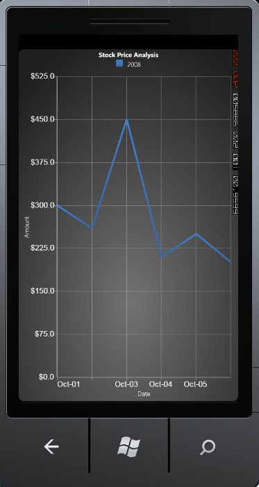
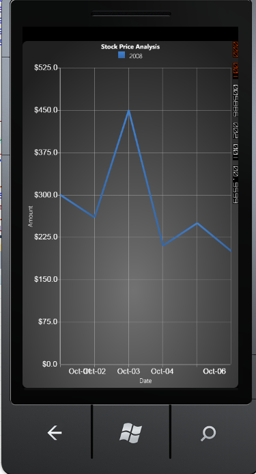

::: {style="DISPLAY: none"}
{#d2h_url_template}{#d2h_package_url style="WIDTH: 0px; DISPLAY: none; HEIGHT: 0px"}
:::

:::: {.d2h_secondary_topic style="PADDING-BOTTOM: 10pt; MARGIN: 0pt; PADDING-LEFT: 0pt; PADDING-RIGHT: 0pt; PADDING-TOP: 0pt"}
#### []{#p92}Overlapping Labels {#overlapping-labels style="tab-stops: 0pt"}

 

This section elaborates on the various features available in Chart, which can avoid overlapping of axis labels. It has the following sections:

**[]{style="COLOR: #15428b"}** 

[[·      ]{style="FONT-FAMILY: Symbol; TEXT-DECORATION: none; text-underline: none"}[Intersecting Labels]{style="COLOR: blue"}]{.UGHyperlink}

[[[·      ]{style="COLOR: blue; TEXT-DECORATION: none; text-underline: none"}[Edge Labels Drawing Modes]{style="FONT-FAMILY: 'Arial','sans-serif'; COLOR: blue"}]{style="FONT-FAMILY: Symbol; TEXT-DECORATION: none; text-underline: none"}]{.UGHyperlink}

[[[·      ]{style="COLOR: blue; TEXT-DECORATION: none; text-underline: none"}[Hide Partial Labels]{style="FONT-FAMILY: 'Arial','sans-serif'; COLOR: blue"}]{style="FONT-FAMILY: Symbol; TEXT-DECORATION: none; text-underline: none"}]{.UGHyperlink}

[[[·      ]{style="COLOR: blue; TEXT-DECORATION: none; text-underline: none"}[Label Rotate Angle]{style="FONT-FAMILY: 'Arial','sans-serif'; COLOR: blue"}]{style="FONT-FAMILY: Symbol; TEXT-DECORATION: none; text-underline: none"}]{.UGHyperlink}

[]{#_Intersecting_Labels}[[[·      ]{style="COLOR: blue; TEXT-DECORATION: none; text-underline: none"}]{style="FONT-FAMILY: Symbol; TEXT-DECORATION: none; text-underline: none"}Intersecting Labels]{.UGHyperlink}

[]{#p93}[]{style="COLOR: #15428b"} 

Chart Axis labels may intersect with one another due to chart dimensions. The chart will, by default, render those texts one over the other. The IntersectAction property has some set of actions in order to avoid this overlapping between axis labels. This also helps to improve the readability. 

The ChartLabelIntersectAction type has the five intersect actions such as MultipleRows, Rotate, Hide, Wrap and None. The following table describes the usage of those actions to avoid the overlapping between labels.

[]{style="COLOR: #15428b"} 

::: {align="center"}
  ----------------- ---------------------------------------------------------------------
  IntersectAction   Usage
  MultipleRows      Wrap the chart label content to multiple rows to avoid the overlap.
  Rotate            Rotate the axis label on the specific angle to avoid intersection.
  Hide              Hide the axis label to avoid intersection.
  Wrap              Wrap the contents into small portions to avoid intersection.
  None              No action. Axis labels will intersect if this option is set.
  ----------------- ---------------------------------------------------------------------
:::

[]{style="COLOR: #15428b"} 

The following are the part of XAML and CS code to set the IntersectAction property.

[]{style="COLOR: #15428b"} 

+-----------------------------------------------------------------------------------------------------------------------------------------------------------------------------------------------------------------------------------------------------------------------------------------------------------------------------------------------------------------------------------------------------------------------------------------------------------------------------------------------------------------------------------------+
| [\[XAML\]]{style="FONT-FAMILY: 'Courier New'"}                                                                                                                                                                                                                                                                                                                                                                                                                                                                                          |
|                                                                                                                                                                                                                                                                                                                                                                                                                                                                                                                                         |
| **[]{style="FONT-FAMILY: 'Courier New'"}**                                                                                                                                                                                                                                                                                                                                                                                                                                                                                              |
|                                                                                                                                                                                                                                                                                                                                                                                                                                                                                                                                         |
| [\<]{style="FONT-FAMILY: 'Courier New'; COLOR: blue"}[syncfusion:ChartArea.PrimaryAxis]{style="FONT-FAMILY: 'Courier New'; COLOR: #a31515"}[\>]{style="FONT-FAMILY: 'Courier New'; COLOR: blue"}                                                                                                                                                                                                                                                                                                                                        |
|                                                                                                                                                                                                                                                                                                                                                                                                                                                                                                                                         |
| [     \<]{style="FONT-FAMILY: 'Courier New'; COLOR: blue"}[syncfusion:ChartAxis]{style="FONT-FAMILY: 'Courier New'; COLOR: #a31515"}[ ]{style="FONT-FAMILY: 'Courier New'; COLOR: blue"}[IntersectAction]{style="FONT-FAMILY: 'Courier New'; COLOR: red"}[=]{style="FONT-FAMILY: 'Courier New'; COLOR: blue"}[\"[MultipleRows]{style="COLOR: blue"}\"[ ]{style="COLOR: blue"}[Header]{style="COLOR: red"}[=]{style="COLOR: blue"}\"[Country Name]{style="COLOR: blue"}\"[/\>]{style="COLOR: blue"}]{style="FONT-FAMILY: 'Courier New'"} |
|                                                                                                                                                                                                                                                                                                                                                                                                                                                                                                                                         |
| [ \</]{style="FONT-FAMILY: 'Courier New'; COLOR: blue"}[syncfusion:ChartArea.PrimaryAxis]{style="FONT-FAMILY: 'Courier New'; COLOR: #a31515"}[\>]{style="FONT-FAMILY: 'Courier New'; COLOR: blue"}                                                                                                                                                                                                                                                                                                                                      |
+-----------------------------------------------------------------------------------------------------------------------------------------------------------------------------------------------------------------------------------------------------------------------------------------------------------------------------------------------------------------------------------------------------------------------------------------------------------------------------------------------------------------------------------------+

[]{style="COLOR: #15428b"} 

+--------------------------------------------------------------------------------------------------------------------------------------------------------------------------+
| [\[C#\]]{style="FONT-FAMILY: 'Courier New'"}                                                                                                                             |
|                                                                                                                                                                          |
| []{style="FONT-FAMILY: 'Courier New'"}                                                                                                                                   |
|                                                                                                                                                                          |
| [ChartArea]{style="FONT-FAMILY: 'Courier New'; COLOR: teal"}[ area = [new]{style="COLOR: blue"} [ChartArea]{style="COLOR: teal"}();]{style="FONT-FAMILY: 'Courier New'"} |
|                                                                                                                                                                          |
| [ChartAxis]{style="FONT-FAMILY: 'Courier New'; COLOR: teal"}[ axis = [new]{style="COLOR: blue"} [ChartAxis]{style="COLOR: teal"}();]{style="FONT-FAMILY: 'Courier New'"} |
|                                                                                                                                                                          |
| [axis.Header = [\"Country Name\"]{style="COLOR: #a31515"};]{style="FONT-FAMILY: 'Courier New'"}                                                                          |
|                                                                                                                                                                          |
| [axis.IntersectAction = ChartLabelIntersectAction.MultipleRows;]{style="FONT-FAMILY: 'Courier New'"}                                                                     |
|                                                                                                                                                                          |
| [area.PrimaryAxis = axis]{style="FONT-FAMILY: 'Courier New'"}[;]{style="FONT-FAMILY: 'Courier New'"}                                                                     |
+--------------------------------------------------------------------------------------------------------------------------------------------------------------------------+

[]{style="COLOR: #15428b"} 

The following images are the result of various options in IntersectAction property.

[]{style="COLOR: #15428b"} 

{border="0"}

 

Figure 87 : IntersectAction = \"MultipleRows\"[]{style="COLOR: #15428b"}

[]{style="COLOR: #15428b"} 

**[]{style="COLOR: #15428b"}** 

{border="0"}

 

Figure 88 : IntersectAction = \"Rotate\"**[]{style="COLOR: #15428b"}**

**[]{style="COLOR: #15428b"}** 

**[]{style="COLOR: #15428b"}** 

{border="0"}

 

Figure 89 : IntersectAction = \"Hide\"**[]{style="COLOR: #15428b"}**

**[]{style="COLOR: #15428b"}** 

**[]{style="COLOR: #15428b"}** 

{border="0"}

 

Figure 90 : IntersectAction = \"Wrap\"**[]{style="COLOR: #15428b"}**

[]{#p94} 

More:

[ ]{#related-topics}

[{border="0" align="absMiddle"}Edge Labels Drawing Modes](ms-xhelp:///?Id=e4e7a967-0280-43fd-8ad7-9e25e5fd5a68){style="TEXT-DECORATION: none"}

[{border="0" align="absMiddle"}Hide Partial Labels](ms-xhelp:///?Id=adf97d39-2832-41ad-b96f-7e106dd9123e){style="TEXT-DECORATION: none"}

[{border="0" align="absMiddle"}Label Rotate Angle](ms-xhelp:///?Id=1176a3b2-f550-422c-920c-3b9f6d9d72cf){style="TEXT-DECORATION: none"}
::::
