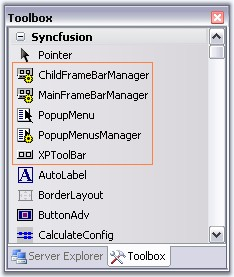
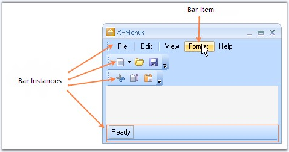
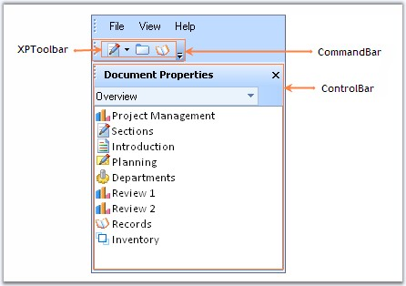

::: {style="DISPLAY: none"}
{#d2h_url_template}{#d2h_package_url style="WIDTH: 0px; DISPLAY: none; HEIGHT: 0px"}
:::

::::: {#nsbanner .d2h_main_nsbanner style="BORDER-BOTTOM: #999999 1px solid; POSITION: relative; PADDING-BOTTOM: 0px; BACKGROUND-COLOR: transparent; PADDING-LEFT: 0px; PADDING-RIGHT: 0px; DISPLAY: none; BORDER-TOP: #999999 1px solid; PADDING-TOP: 0px; LEFT: 0px"}
:::: {#TitleRow .d2h_main_titlerow style="PADDING-BOTTOM: 4px; BACKGROUND-COLOR: transparent; PADDING-LEFT: 22px; WIDTH: 100%; PADDING-RIGHT: 10px; DISPLAY: none; PADDING-TOP: 4px"}
::: {#ienav .d2h_main_ienav style="DISPLAY: none"}
{#D2HPrevious .D2HPreviousEnabled}  {#D2HNext .D2HNextEnabled}
:::
::::
:::::

:::: {#nstext .d2h_main_nstext style="PADDING-BOTTOM: 10px; BACKGROUND-COLOR: transparent; PADDING-LEFT: 22px; PADDING-RIGHT: 10px; HEIGHT: 100%; OVERFLOW: auto; PADDING-TOP: 5px" hasuserbackground="true" valign="bottom"}
::: {#d2h_breadcrumbs .d2h_breadcrumbs}
[Essential Studio User Guide Documentation](ms-xhelp:///?Id=12457748-09e3-4d74-a240-8e049cedf030){.d2h_breadcrumbsNormal}[ \> ]{.d2h_breadcrumbsLinkSeparator}[User Interface Edition](ms-xhelp:///?Id=c29296b7-531c-413b-a0ec-488ca1f7f669){.d2h_breadcrumbsNormal}[ \> ]{.d2h_breadcrumbsLinkSeparator}[Essential Windows](ms-xhelp:///?Id=e60759d8-47a4-4570-9d7a-16a68d63f2ea){.d2h_breadcrumbsNormal}[ \> ]{.d2h_breadcrumbsLinkSeparator}[Essential Tools]{.d2h_breadcrumbsContentsOnly}[ \> ]{.d2h_breadcrumbsLinkSeparator}[Tools Controls](ms-xhelp:///?Id=13c3c4f4-9d16-4b69-93f2-7e98eec67452){.d2h_breadcrumbsNormal}[ \> ]{.d2h_breadcrumbsLinkSeparator}[Menus Package](ms-xhelp:///?Id=f2acb534-5655-4dbb-a168-f0dfaf1cb8c7){.d2h_breadcrumbsNormal}
:::

### Overview {#overview style="tab-stops: 0pt"}

[]{style="COLOR: #15428b"} 

The section gives you an overview of the XPMenus Framework.

 

The following screen shot displays the menus controls in toolbox.

[]{style="COLOR: #15428b"} 

{border="0"}

[]{style="COLOR: #15428b"} 

Figure 711: XPMenus Controls in Toolbox

**[]{style="COLOR: #15428b"}** 

{border="0"}

[]{style="COLOR: #15428b"} 

Figure 712: Toolbars and bar items in XPMenus Framework

**[]{style="COLOR: #15428b"}** 

BarManager

[]{style="COLOR: #15428b"} 

The XP Menus framework is controlled by the **BarManagers**. The BarManagers takes care of displaying the menus and toolbars and controls their visibility.

[]{style="COLOR: #15428b"} 

Bar

[]{style="COLOR: #15428b"} 

A **Bar** is a data structure that represents a toolbar in the XP Menus framework. A **BarManager** lets users to **add or remove** bars to their forms during design-time. These bars get logically contained within the BarManager. See Bar Types topic to know about the types of toolbars available.

[]{style="COLOR: #15428b"} 

BarItem

[]{style="COLOR: #15428b"} 

A **BarItem**[ ]{style="COLOR: black"}is a data structure that represents a clickable item that can be used in toolbars, drop-down menus and context menus. This is analogous to a MenuItem in the[ ]{style="COLOR: black"}**.NET framework**. To learn more about BarItems, click [here]{style="COLOR: black"}.

[]{style="COLOR: #15428b"} 

{border="0"}

**[]{style="COLOR: #15428b"}** 

Figure 713: CommandBar, ControlBar and XPToolbar Added to CommandBar

[]{style="COLOR: #15428b"} 

CommandBar

[]{style="COLOR: #15428b"} 

CommandBar represents a detached toolbar which can host any .NET controls.

[]{style="COLOR: #15428b"} 

ControlBar

[]{style="COLOR: #15428b"} 

A ControlBar is a full-featured docking container that can host any control and be docked along the border of the host form or floated as a top-level window.

[]{style="COLOR: #15428b"} 

XPToolbar

[]{style="COLOR: #15428b"} 

An **XP Toolbar** is a toolbar-like control with look-and-feel of the XP Menus toolbar. This toolbar can be dropped inside a commandbar. To know how to use XPToolbar in Menus, see [XPToolbar]{style="COLOR: black"} topic.

[]{style="COLOR: #15428b"} 

See Also

[]{style="COLOR: #15428b"} 

[Concepts and Features]{.UGHyperlink}[]{.UGHyperlink}

[]{#related-topics}
::::
