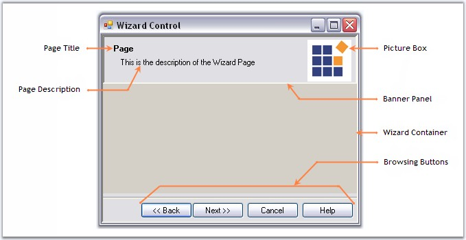

::: {style="DISPLAY: none"}
{#d2h_url_template}{#d2h_package_url style="WIDTH: 0px; DISPLAY: none; HEIGHT: 0px"}
:::

::: {.d2h_secondary_topic style="PADDING-BOTTOM: 10pt; MARGIN: 0pt; PADDING-LEFT: 0pt; PADDING-RIGHT: 0pt; PADDING-TOP: 0pt"}
#### Overview {#overview style="MARGIN-LEFT: 18pt; tab-stops: 18.0pt"}

[]{style="COLOR: #15428b"} 

Components of a Wizard Control

[]{style="COLOR: #15428b"} 

{border="0"}

 

Figure 1206: Wizard Components

**[]{style="COLOR: navy; FONT-SIZE: 8pt"}** 

[·      ]{style="FONT-FAMILY: Symbol"}**The Banner Panel** is a GradientPanel control that is docked on top of the WizardControl and hosts the title, description and banner picture box. This control is selectable during design-time, where you can change its properties. This control will be hidden when a wizard control page\'s FullPage property is set to True.

 

[·      ]{style="FONT-FAMILY: Symbol"}**The Page Title** is a label control that displays the title of the current wizard page. This control is selectable in the designer. In code, you can access the label control directly or through the WizardControl.Title property.

 

[·      ]{style="FONT-FAMILY: Symbol"}**The Description label**, another child of the Banner Panel, is a label control that shows the title of the current wizard page. This control is selectable in the designer. In code, you can access the label control directly or through the WizardControl.Description property.

 

[·      ]{style="FONT-FAMILY: Symbol"}The Banner control, a child of the Banner Panel, is a picture box control that lets you show a picture on the top-right corner. This picture remains the same on all the different pages of the Wizard control. This control is selectable in the designer. In code, you can access it directly or through the WizardControl.Banner property.

 

[·      ]{style="FONT-FAMILY: Symbol"}**The WizardContainer** is the control within which the selected WizardControl Page will be shown. This control is selectable in the designer. In code, you can access it directly or through the WizardControl.WizardPages property.

 

[·      ]{style="FONT-FAMILY: Symbol"}**The Browsing Buttons** lets you browse through the different wizard pages.

[]{style="COLOR: #15428b"} 

See Also

[]{style="COLOR: #15428b"} 

[[Creating a Basic Wizard]{.UGHyperlink}](../../../../../../../../Documents%20and%20Settings/sylviap/Desktop/Tools%20-%20Part%202.docx#_Creating_a_Basic)[, ]{.UGHyperlink}[[Concepts and Features]{.UGHyperlink}](../../../../../../../../Documents%20and%20Settings/sylviap/Desktop/Tools%20-%20Part%202.docx#_Concepts_and_Features_1)[]{.UGHyperlink}

 

[]{#related-topics}
:::
