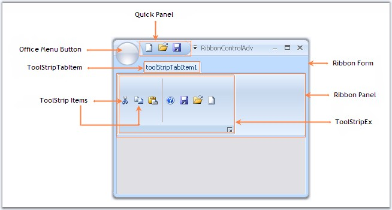

::: {style="DISPLAY: none"}
{#d2h_url_template}{#d2h_package_url style="WIDTH: 0px; DISPLAY: none; HEIGHT: 0px"}
:::

::: {.d2h_secondary_topic style="PADDING-BOTTOM: 10pt; MARGIN: 0pt; PADDING-LEFT: 0pt; PADDING-RIGHT: 0pt; PADDING-TOP: 0pt"}
##### Overview {#overview style="tab-stops: 0pt"}

[]{style="COLOR: #15428b"} 

This section gives you an overview of the components of a RibbonControlAdv.

[]{style="COLOR: #15428b"} 

{border="0"}

[]{style="COLOR: black"} 

Figure 1299: RibbonControlAdv Components

[]{style="COLOR: #15428b"} 

Components

[]{style="COLOR: #15428b"} 

[·      ]{style="FONT-FAMILY: Symbol; COLOR: black"}[[Ribbon Form]{style="COLOR: windowtext; TEXT-DECORATION: none; text-underline: none"}](../../../../../../../../Documents%20and%20Settings/sylviap/Desktop/Tools%20-%20Part%202.docx#_Ribbon_Form)[]{style="COLOR: black"}

[·      ]{style="FONT-FAMILY: Symbol; COLOR: black"}[[Office Menu Button]{style="COLOR: windowtext; TEXT-DECORATION: none; text-underline: none"}](../../../../../../../../Documents%20and%20Settings/sylviap/Desktop/Tools%20-%20Part%202.docx#_Office_Menu_Button)[]{style="COLOR: black"}

[·      ]{style="FONT-FAMILY: Symbol; COLOR: black"}[[Quick Panel]{style="COLOR: windowtext; TEXT-DECORATION: none; text-underline: none"}](../../../../../../../../Documents%20and%20Settings/sylviap/Desktop/Tools%20-%20Part%202.docx#_Quick_Access_Toolbar)[]{style="COLOR: black"}

[·      ]{style="FONT-FAMILY: Symbol; COLOR: black"}[[RibbonPanel]{style="COLOR: windowtext; TEXT-DECORATION: none; text-underline: none"}](../../../../../../../../Documents%20and%20Settings/sylviap/Desktop/Tools%20-%20Part%202.docx#_Ribbon_Panel)[]{style="COLOR: black"}

[·      ]{style="FONT-FAMILY: Symbol; COLOR: black"}[[ToolStripTabItem]{style="COLOR: windowtext; TEXT-DECORATION: none; text-underline: none"}](../../../../../../../../Documents%20and%20Settings/sylviap/Desktop/Tools%20-%20Part%202.docx#_ToolStripTabItem)[]{style="COLOR: black"}

[·      ]{style="FONT-FAMILY: Symbol; COLOR: black"}[[ToolStripItems]{style="COLOR: windowtext; TEXT-DECORATION: none; text-underline: none"}](../../../../../../../../Documents%20and%20Settings/sylviap/Desktop/Tools%20-%20Part%202.docx#_ToolStripItems)[]{style="COLOR: black"}

[·      ]{style="FONT-FAMILY: Symbol; COLOR: black"}[[ToolStripEx]{style="COLOR: windowtext; TEXT-DECORATION: none; text-underline: none"}](../../../../../../../../Documents%20and%20Settings/sylviap/Desktop/Tools%20-%20Part%202.docx#_ToolStripEx)[]{style="COLOR: black"}

[]{style="COLOR: #15428b"} 

See Also

[]{style="COLOR: #15428b"} 

[[Ribbon Control Items]{.UGHyperlink}](../../../../../../../../Documents%20and%20Settings/sylviap/Desktop/Tools%20-%20Part%202.docx#_Ribbon_Control_Items)[]{.UGHyperlink}

 

 

 

 

[]{#related-topics}
:::
