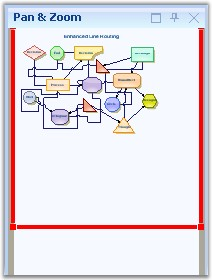

::: {style="DISPLAY: none"}
{#d2h_url_template}{#d2h_package_url style="WIDTH: 0px; DISPLAY: none; HEIGHT: 0px"}
:::

::::: {#nsbanner .d2h_main_nsbanner style="BORDER-BOTTOM: #999999 1px solid; POSITION: relative; PADDING-BOTTOM: 0px; BACKGROUND-COLOR: transparent; PADDING-LEFT: 0px; PADDING-RIGHT: 0px; DISPLAY: none; BORDER-TOP: #999999 1px solid; PADDING-TOP: 0px; LEFT: 0px"}
:::: {#TitleRow .d2h_main_titlerow style="PADDING-BOTTOM: 4px; BACKGROUND-COLOR: transparent; PADDING-LEFT: 22px; WIDTH: 100%; PADDING-RIGHT: 10px; DISPLAY: none; PADDING-TOP: 4px"}
::: {#ienav .d2h_main_ienav style="DISPLAY: none"}
{#D2HPrevious .D2HPreviousEnabled}  {#D2HNext .D2HNextEnabled}
:::
::::
:::::

:::::: {#nstext .d2h_main_nstext style="PADDING-BOTTOM: 10px; BACKGROUND-COLOR: transparent; PADDING-LEFT: 22px; PADDING-RIGHT: 10px; HEIGHT: 100%; OVERFLOW: auto; PADDING-TOP: 5px" hasuserbackground="true" valign="bottom"}
::: {#d2h_breadcrumbs .d2h_breadcrumbs}
[Essential Studio User Guide Documentation](ms-xhelp:///?Id=12457748-09e3-4d74-a240-8e049cedf030){.d2h_breadcrumbsNormal}[ \> ]{.d2h_breadcrumbsLinkSeparator}[User Interface Edition](ms-xhelp:///?Id=c29296b7-531c-413b-a0ec-488ca1f7f669){.d2h_breadcrumbsNormal}[ \> ]{.d2h_breadcrumbsLinkSeparator}[Essential Windows](ms-xhelp:///?Id=e60759d8-47a4-4570-9d7a-16a68d63f2ea){.d2h_breadcrumbsNormal}[ \> ]{.d2h_breadcrumbsLinkSeparator}[Essential Diagram]{.d2h_breadcrumbsContentsOnly}[ \> ]{.d2h_breadcrumbsLinkSeparator}[Concepts And Features](ms-xhelp:///?Id=008cec4b-5177-4859-8616-c062751d8fb6){.d2h_breadcrumbsNormal}[ \> ]{.d2h_breadcrumbsLinkSeparator}[Supported Controls](ms-xhelp:///?Id=aa17622e-7642-4f9d-b086-6c705e48f9fa){.d2h_breadcrumbsNormal}
:::

### Overview Control {#overview-control style="tab-stops: 0pt"}

[]{style="FONT-FAMILY: 'Trebuchet MS','sans-serif'; COLOR: #15428b; FONT-SIZE: 9pt"} 

Overview Control provides a perspective view of a diagram model, and allows users to dynamically pan and zoom the diagrams. The control features a view port window that can be moved and / or resized using the mouse to modify the diagrams\' origin and magnification properties at run-time.

[]{style="FONT-FAMILY: 'Trebuchet MS','sans-serif'; COLOR: #15428b; FONT-SIZE: 9pt"} 

The important property of the Overview Control is the **Diagram** property. The following are the list of properties of the Overview control.

[]{style="FONT-FAMILY: 'Trebuchet MS','sans-serif'; COLOR: #15428b; FONT-SIZE: 9pt"} 

::: {align="center"}
  ----------------- ----------------------------------------------------------------------------------------------------------------------------
  Property          Description
  BackColor         Background color of the component.
  AllowDrop         Gets or sets a value indicating whether the control can accept the data that the user can drops on it.
  BackgroundImage   Background image of the component.
  BorderStyle       Sets the border style for the component. It can be FixedSingle, Fixed3D or None.
  Controls          Indicates the collection of control within the component.
  Enabled           Indicates if the control is enabled.
  Dock              Indicates which control borders are docked to its parent control and determine how the control is resized with its parent.
  Diagram           Sets the corresponding diagram to the Overview Control.
  Visible           Sets the visibility of the control.
  ----------------- ----------------------------------------------------------------------------------------------------------------------------
:::

[]{style="FONT-FAMILY: 'Trebuchet MS','sans-serif'; COLOR: #15428b; FONT-SIZE: 9pt"} 

The important events of Overview Control are listed below with their corresponding descriptions.

[]{style="FONT-FAMILY: 'Trebuchet MS','sans-serif'; COLOR: #15428b; FONT-SIZE: 9pt"} 

::: {align="center"}
  ------------------------------ -------------------------------------------------------
  Event                          Description
  Click                          Occurs when the component is clicked.
  DoubleClick                    Occurs when the component is double-clicked.
  ViewPortBoundsChanged          Occurs when the controls viewport bounds is changed.
  ViewPortBoundsChanging Event   Occurs when the controls viewport bounds is changing.
  ------------------------------ -------------------------------------------------------
:::

[]{style="FONT-FAMILY: 'Trebuchet MS','sans-serif'; COLOR: #15428b; FONT-SIZE: 9pt"} 

Programmatically, the properties can be set as follows.

[]{style="FONT-FAMILY: 'Trebuchet MS','sans-serif'; COLOR: #15428b; FONT-SIZE: 9pt"} 

+---------------------------------------------------------------------------------------------------------------------------------------------------+
| **[\[C#\]]{style="FONT-FAMILY: 'Courier New'; COLOR: black"}**                                                                                    |
|                                                                                                                                                   |
| []{style="FONT-FAMILY: 'Courier New'"}                                                                                                            |
|                                                                                                                                                   |
| [overviewControl1.BackColor = System.Drawing.[SystemColors]{style="COLOR: teal"}.AppWorkspace;]{style="FONT-FAMILY: 'Courier New'"}               |
|                                                                                                                                                   |
| [overviewControl1.Diagram = diagram1;]{style="FONT-FAMILY: 'Courier New'"}                                                                        |
|                                                                                                                                                   |
| [overviewControl1.Dock = System.Windows.Forms.[DockStyle]{style="COLOR: teal"}.Bottom;]{style="FONT-FAMILY: 'Courier New'"}                       |
|                                                                                                                                                   |
| [overviewControl1.ForeColor = System.Drawing.[Color]{style="COLOR: teal"}.Red;]{style="FONT-FAMILY: 'Courier New'"}                               |
|                                                                                                                                                   |
| [overviewControl1.Location = [new]{style="COLOR: blue"} System.Drawing.[Point]{style="COLOR: teal"}(0, 377);]{style="FONT-FAMILY: 'Courier New'"} |
|                                                                                                                                                   |
| [overviewControl1.Name = [\"overviewControl\"]{style="COLOR: maroon"};]{style="FONT-FAMILY: 'Courier New'"}                                       |
|                                                                                                                                                   |
| [overviewControl1.Size = [new]{style="COLOR: blue"} System.Drawing.[Size]{style="COLOR: teal"}(200, 100);]{style="FONT-FAMILY: 'Courier New'"}    |
|                                                                                                                                                   |
| [overviewControl1.TabIndex = 1;]{style="FONT-FAMILY: 'Courier New'"}                                                                              |
+---------------------------------------------------------------------------------------------------------------------------------------------------+

[]{style="FONT-FAMILY: 'Courier New'"} 

+---------------------------------------------------------------------------------------------------------------------------+
| **[\[VB\]]{style="FONT-FAMILY: 'Courier New'; COLOR: black"}**                                                            |
|                                                                                                                           |
| []{style="FONT-FAMILY: 'Courier New'; COLOR: blue"}                                                                       |
|                                                                                                                           |
| [overviewControl1.BackColor = System.Drawing.SystemColors.AppWorkspace]{style="FONT-FAMILY: 'Courier New'"}               |
|                                                                                                                           |
| [overviewControl1.Diagram = diagram1]{style="FONT-FAMILY: 'Courier New'"}                                                 |
|                                                                                                                           |
| [overviewControl1.Dock = System.Windows.Forms.DockStyle.Bottom]{style="FONT-FAMILY: 'Courier New'"}                       |
|                                                                                                                           |
| [overviewControl1.ForeColor = System.Drawing.Color.Red]{style="FONT-FAMILY: 'Courier New'"}                               |
|                                                                                                                           |
| [overviewControl1.Location = [New]{style="COLOR: blue"} System.Drawing.Point(0, 377)]{style="FONT-FAMILY: 'Courier New'"} |
|                                                                                                                           |
| [overviewControl1.Name = [\"overviewControl\"]{style="COLOR: maroon"}]{style="FONT-FAMILY: 'Courier New'"}                |
|                                                                                                                           |
| [overviewControl1.Size = [New]{style="COLOR: blue"} System.Drawing.Size(200, 100)]{style="FONT-FAMILY: 'Courier New'"}    |
|                                                                                                                           |
| [overviewControl1.TabIndex = 1]{style="FONT-FAMILY: 'Courier New'"}                                                       |
+---------------------------------------------------------------------------------------------------------------------------+

**[]{style="FONT-FAMILY: 'Trebuchet MS','sans-serif'; COLOR: #15428b; FONT-SIZE: 9pt"}** 

{border="0"}

**[]{style="FONT-FAMILY: 'Trebuchet MS','sans-serif'; COLOR: #15428b; FONT-SIZE: 9pt"}** 

Figure 39: Overview Control

 

[]{#p22} 

 

[]{#related-topics}
::::::
