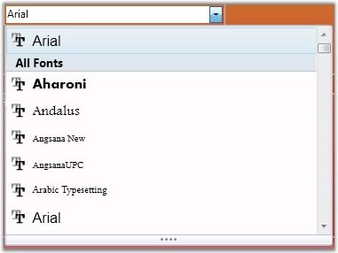

::: {style="DISPLAY: none"}
{#d2h_url_template}{#d2h_package_url style="WIDTH: 0px; DISPLAY: none; HEIGHT: 0px"}
:::

::: {.d2h_secondary_topic style="PADDING-BOTTOM: 10pt; MARGIN: 0pt; PADDING-LEFT: 0pt; PADDING-RIGHT: 0pt; PADDING-TOP: 0pt"}
#### Overview of FontListComboBox control {#overview-of-fontlistcombobox-control style="tab-stops: 0pt"}

 

A FontListComboBox is used to display a combo box with a choice list of system fonts or a custom list of fonts, which provides easy accessibility to the fonts and supports adding groups like Recently Used Fonts etc. Read through this guide to know about the detailed set of concepts.

 

{border="0"}

Figure 485: **[FontListComboBox Control]{style="FONT-FAMILY: 'Trebuchet MS','sans-serif'; COLOR: #15428b"}**

 

[]{#p269} 

[]{#related-topics}
:::
