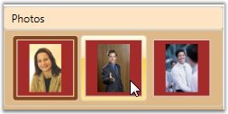

::: {style="DISPLAY: none"}
{#d2h_url_template}{#d2h_package_url style="WIDTH: 0px; DISPLAY: none; HEIGHT: 0px"}
:::

::: {.d2h_secondary_topic style="PADDING-BOTTOM: 10pt; MARGIN: 0pt; PADDING-LEFT: 0pt; PADDING-RIGHT: 0pt; PADDING-TOP: 0pt"}
#### Overview of Gallery control {#overview-of-gallery-control style="tab-stops: 0pt"}

 

Gallery is a repository of categorized collection of objects in their thumbnail views with contents. It also includes built-in animation during layout of the child items. Each item inside the Gallery, exhibits special features that are beneficial to the end-user while creating applications.

 

{border="0"}

Figure 494: Gallery Control

 

[]{#p286} 

[]{#related-topics}
:::
