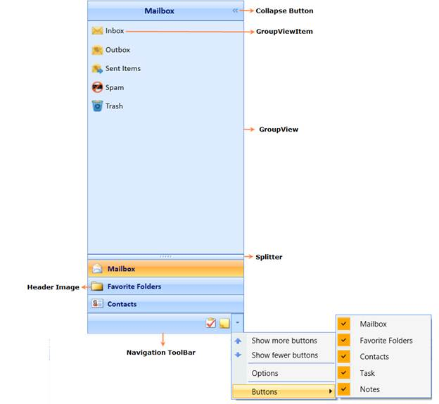

::: {style="DISPLAY: none"}
{#d2h_url_template}{#d2h_package_url style="WIDTH: 0px; DISPLAY: none; HEIGHT: 0px"}
:::

::: {.d2h_secondary_topic style="PADDING-BOTTOM: 10pt; MARGIN: 0pt; PADDING-LEFT: 0pt; PADDING-RIGHT: 0pt; PADDING-TOP: 0pt"}
#### Overview of Groupbar control {#overview-of-groupbar-control style="tab-stops: 0pt"}

 

[The GroupBar control implements list-type controls in the ]{style="FONT-FAMILY: 'Segoe UI','sans-serif'; BACKGROUND: white"}[user interface]{style="FONT-FAMILY: 'Segoe UI','sans-serif'; BACKGROUND: white"}[, similar to the Microsoft Outlook Bar. It has a container to host controls within it]{style="FONT-FAMILY: 'Segoe UI','sans-serif'; BACKGROUND: white"}[, and]{style="FONT-FAMILY: 'Segoe UI','sans-serif'; BACKGROUND: white"}[ it]{style="FONT-FAMILY: 'Segoe UI','sans-serif'; BACKGROUND: white"}[ can be used]{style="FONT-FAMILY: 'Segoe UI','sans-serif'; BACKGROUND: white"}[ to host a categorized collection of command items and custom controls]{style="FONT-FAMILY: 'Segoe UI','sans-serif'; BACKGROUND: white"}[ that are]{style="FONT-FAMILY: 'Segoe UI','sans-serif'; BACKGROUND: white"}[ wired to execute custom commands. It includes several customizable features, which can be easily implemented in WPF applications.]{style="FONT-FAMILY: 'Segoe UI','sans-serif'; BACKGROUND: white"}[]{style="BACKGROUND: white"}

 

{border="0"}

Figure 507: GroupBar Control

 

[]{#p303} 

[]{#related-topics}
:::
