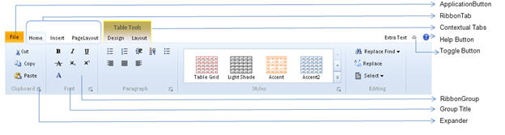

::: {style="DISPLAY: none"}
{#d2h_url_template}{#d2h_package_url style="WIDTH: 0px; DISPLAY: none; HEIGHT: 0px"}
:::

:::::: {.d2h_secondary_topic style="PADDING-BOTTOM: 10pt; MARGIN: 0pt; PADDING-LEFT: 0pt; PADDING-RIGHT: 0pt; PADDING-TOP: 0pt"}
#### Overview of Ribbon Control {#overview-of-ribbon-control style="tab-stops: 0pt"}

Ribbon Control is a server control that provides ribbons with rich customizable user interfaces like Office 2010, SharePoint 2010 and Office Web Apps 2010. The top-level elements in the ribbon are Ribbon Tab, Application Button, Toggle Button, Help Button and Contextual Tab.

The Application Button contains two different display types:

[·      ]{style="FONT-FAMILY: Symbol"}Application Menu:  The menu items in the application button are displayed as normal drop down items. 

[·      ]{style="FONT-FAMILY: Symbol"}Backstage Page: It allows you to add user-control to each menu item in the application button. When you click on the menu items in the left pane of the page, the user-control is shown in the right pane of the page.

The Ribbon Tab appears across the top of the page. Each tab organizes a set of groups, which have labels to identify them, and also contain a set of controls. The controls inside the group include Button Advanced control, Expander drop-down menus, combo boxes, and galleries.

The Toggle, Help and Expander buttons are optional components.

The Contextual tabs are shown when you click on the items on the web page.

 

Features\
\

[·      ]{style="FONT-FAMILY: Symbol"}Supports server-side and client-side events.

[·      ]{style="FONT-FAMILY: Symbol"}Styles: the look and feel of the ribbon can be customized using custom or default styles.

[·      ]{style="FONT-FAMILY: Symbol"}Contextual Tab: Supports the display of the contextual tab.

[·      ]{style="FONT-FAMILY: Symbol"}Client-Side Functionalities: You can handle the client-side function, which allows you to control the behavior of the ribbon.

[·      ]{style="FONT-FAMILY: Symbol"}Server-Side Functionalities: You can handle the server-side function, which allows you to control the behavior of the ribbon.

[·      ]{style="FONT-FAMILY: Symbol"}Screen-Tip: Supports HTML tool tips.

 

Use Case Scenarios

 

Different control elements in a large toolbar are grouped by their functionality. The Ribbon control provides the user interface of an application, with a large tool bar, that is filled with the graphical representations of the control elements.

{border="0"}

Figure 316: Appearance and Structure of the control

**** 

Properties

::: {align="center"}
+-----------------------+-----------------------------------------------------------------------------------------------------------------------------------------------------+-----------------+-----------------+
| Property              | Description                                                                                                                                         | Type            | Data Type       |
+-----------------------+-----------------------------------------------------------------------------------------------------------------------------------------------------+-----------------+-----------------+
|  ApplicationMenuColor | Specifies the background color for the application button.                                                                                          | Server-Side     | String          |
+-----------------------+-----------------------------------------------------------------------------------------------------------------------------------------------------+-----------------+-----------------+
| ApplicationText       | Specifies the text of the application button                                                                                                        | Server-Side     | String          |
+-----------------------+-----------------------------------------------------------------------------------------------------------------------------------------------------+-----------------+-----------------+
| ApplicationType       | Specifies the type of the application menu. The default value in none.                                                                              | Server-Side     | Enum            |
|                       |                                                                                                                                                     |                 |                 |
|                       | The option provided are                                                                                                                             |                 |                 |
|                       |                                                                                                                                                     |                 |                 |
|                       | [·      ]{style="FONT-FAMILY: Symbol"}None                                                                                                          |                 |                 |
|                       |                                                                                                                                                     |                 |                 |
|                       | [·      ]{style="FONT-FAMILY: Symbol"}BackStagePage                                                                                                 |                 |                 |
|                       |                                                                                                                                                     |                 |                 |
|                       | [·      ]{style="FONT-FAMILY: Symbol"}ApplicationMenu                                                                                               |                 |                 |
+-----------------------+-----------------------------------------------------------------------------------------------------------------------------------------------------+-----------------+-----------------+
| AutoFormat            | Specifies the skins for the Ribbon. The default value is Office2010blue.                                                                            | Server-Side     | Enum            |
|                       |                                                                                                                                                     |                 |                 |
|                       | The options provided are                                                                                                                            |                 |                 |
|                       |                                                                                                                                                     |                 |                 |
|                       | [·      ]{style="FONT-FAMILY: Symbol"}Office2010Blue                                                                                                |                 |                 |
|                       |                                                                                                                                                     |                 |                 |
|                       | [·      ]{style="FONT-FAMILY: Symbol"}Office2010Silver                                                                                              |                 |                 |
|                       |                                                                                                                                                     |                 |                 |
|                       | [·      ]{style="FONT-FAMILY: Symbol"}Office2010Black                                                                                               |                 |                 |
+-----------------------+-----------------------------------------------------------------------------------------------------------------------------------------------------+-----------------+-----------------+
| ClientObjectId        | Specifies the user-defined  id for accessing the object on the client-side                                                                          | Server-Side     | String          |
+-----------------------+-----------------------------------------------------------------------------------------------------------------------------------------------------+-----------------+-----------------+
| ShowHelpButton        | Gets and sets the Boolean value, to allow the button to be visible or hidden. Default Value is True.                                                | Server-Side     | Boolean         |
+-----------------------+-----------------------------------------------------------------------------------------------------------------------------------------------------+-----------------+-----------------+
| ShowToggleButton      | Gets and sets the Boolean value, to allow the toggle button (which is used to hide or show the ribbon) to visible or hidden. Default Value is True. | Server-Side     | String          |
+-----------------------+-----------------------------------------------------------------------------------------------------------------------------------------------------+-----------------+-----------------+
| Name                  | Specifies the name of the Ribbon. It is  unique and can be used as an identity                                                                      | Server-Side     | String          |
+-----------------------+-----------------------------------------------------------------------------------------------------------------------------------------------------+-----------------+-----------------+
:::

 

Methods\
\

::: {align="center"}
  Method                      Description                                                                                Parameters                            Type          Return Type
  --------------------------- ------------------------------------------------------------------------------------------ ------------------------------------- ------------- -------------
  GetRibbonTabContext(name)   The title of the ribbon contextual tabs can be changed at the server-side.                 Name of the contextual tab            Server-Side   NA
  GetRibbonTab(name)          The name or image of the ribbon tabs can be changed at the server-side.                    Name of the ribbon tab                Server-Side   NA
  GetRibbonGroup(name)        The name of the ribbon group can be changed at the server-side.                            Name of the ribbon group              Server-Side   NA
  GetRibbonDivision(name)     The properties of the ribbon division contextual tabs can be changed at the server-side.   Name of the ribbon division           Server-Side   NA
  GetRibbonItem\<T\>(id)      The properties of the ribbon items can be changed at the Server-Side.                      Id of the items in the ribbon group   Server-Side   NA
  ShowContextTab(name)        Sets the contextual tab to be visible.                                                     Name of the contextual tab            Client-Side   NA
  ShowTab(name)               Sets the tabs to be visible.                                                               Name of the ribbon tab                Client-Side   NA
  HideContext(name)           Sets the contextual tab to be hidden.                                                      Name of the contextual tab            Client-Side   NA
  HideTab(name)               Sets the ribbon tab to be hidden.                                                          Name of the ribbon tab                Client-Side   NA
:::

 

 

Events

 

::: {align="center"}
  [Event ]{style="COLOR: black"}[]{style="COLOR: black"}   [Description ]{style="COLOR: black"}[]{style="COLOR: black"}                        [Arguments ]{style="COLOR: black"}[]{style="COLOR: black"}    [Type ]{style="COLOR: black"}[]{style="COLOR: black"}
  -------------------------------------------------------- ----------------------------------------------------------------------------------- ------------------------------------------------------------- -------------------------------------------------------
  OnMenuItemClick                                          This event is triggered when you click on the Application sub menu items.           The selected items are passed as arguments.                   Server-Side
  OnHelpButtonClick                                        This event is triggered when you click on the help button.                          NA                                                            Server-Side
  HelpButtonClientClick                                    The Client -Side click event is triggered when you click on the help button.        NA                                                            Client-Side
  ExpanderClientClick                                      The Client -Side click event is triggered when you click on the expander button.    The selected expander group title is passed as an argument.   Client-Side
:::

 

[]{#related-topics}
::::::
