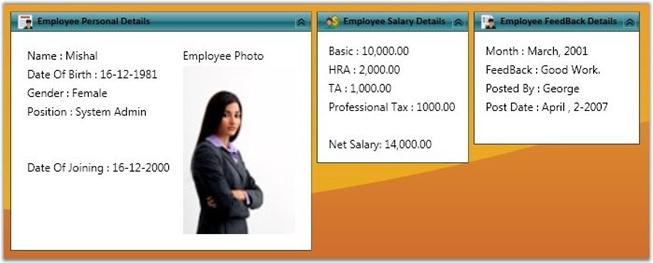

::: {style="DISPLAY: none"}
{#d2h_url_template}{#d2h_package_url style="WIDTH: 0px; DISPLAY: none; HEIGHT: 0px"}
:::

::: {.d2h_secondary_topic style="PADDING-BOTTOM: 10pt; MARGIN: 0pt; PADDING-LEFT: 0pt; PADDING-RIGHT: 0pt; PADDING-TOP: 0pt"}
#### Overview of Taskbar control {#overview-of-taskbar-control style="tab-stops: 0pt"}

TaskBar control has the capability to provide a UI that is similar to the Windows Explorer TaskBar. It provides a consistent UI for placing commonly used functionalities as grouped items. You can place any Container Panel control inside the TaskBar. For example, when the customized Grid Panel with other controls are placed inside the TaskBar Item, it will be automatically arranged inside the TaskBar Items collection. TaskBar supports the Office2007Black, Office2007Blue, Office2007Silver, Office2003 and Blend themes.

[]{style="FONT-FAMILY: 'Trebuchet MS','sans-serif'; COLOR: #15428b; FONT-SIZE: 9pt"} 

{border="0"}

*[]{style="FONT-FAMILY: 'Trebuchet MS','sans-serif'; COLOR: #15428b; FONT-SIZE: 9pt"}* 

Figure 1039:TaskBar Control

 

[]{#related-topics}
:::
